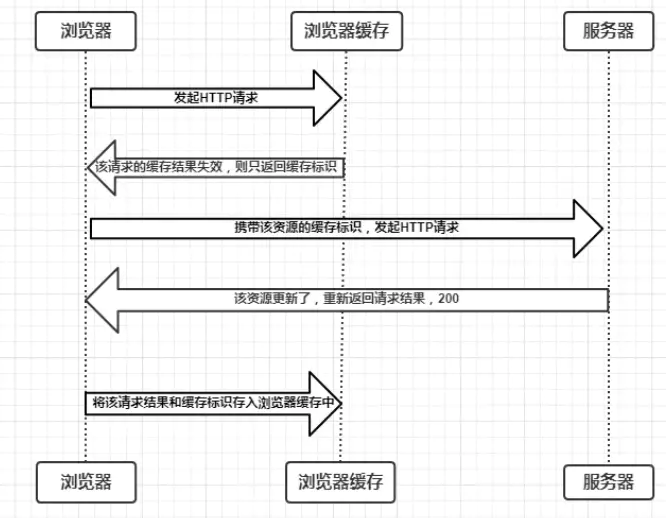
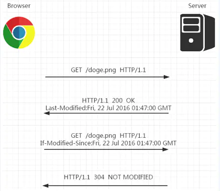

# 网络与互联网

互联网，连接所有实体计算机，使得彼此之间可以互相发送数据.

通过互联网，计算机之间可以发送二进制位. 为了传输能产生有效通信，计算机之间必须知道这些位应该代表什么. 赋予比特序列的含义取决于想表达的事物的类型以及使用的编码机制.

*网络协议* 描述了网络上的通信方式，有各种各样的协议，用来做不同的事情.

*超文本传输协议* (HTTP)是用于检索命名资源(例如网页或者图片之类的信息块)的协议.

发出请求的一方应该采用这样的格式描述请求方式，想获取的资源以及使用的协议版本.

```http
GET /index.html HTTP/1.1
```

大多数协议都是基于其他协议构建的. HTTP 将网络视为一种类似于流的设备，可以在其中放置二进制位并以正确的顺序到达目的地.

*传输控制协议* (TCP) ，互联网中的所有设备均使用这个协议，大多数通信都基于它.
TCP 的工作方式: 一台计算机等待并监听，以便其他计算机与它建立连接. 一台机器为了同时监听不同类型的通信，每个监听器占用的端口都不同. 大多数协议都指定了它默认使用的端口. TCP 连接在服务器与客户端之间建立的双向管道，两端的机器都可以将数据放入其中，TCP 提供了网络的抽象.

# Web

万维网 (World Wide Web) 是一组协议与格式(与互联网概念不同)，允许我们在浏览器中访问网页. `Web` 指的是这样的页面可以相互链接，形成巨大网格. 换句话说，Web 就是浏览器上能访问的网页的集合.

成为 `Web` 的一部分，需要其他机器能够到你这里请求文档，则需要将计算机连接互联网并且使用`HTTP`协议监听80端口.

Web 上的每个文档都由统一资源定位符(URL)命名:

```html
http://qicai.fengniao.com/list_1437.html
|协议 |       服务器       |    路径      |
```

连接到互联网的机器会获得一个 `IP` 地址，但是IP地址比较难记，因此可以为 `IP` 地址注册域名，域名就指向该 `IP` 地址，对外则可以使用域名来提供服务.

在浏览器中键入该URL，首先找到域名对应的IP，然后使用 HTTP 协议与该 IP 对应的服务器建立连接，然后请求相应的资源，请求成功，服务器会发回文档，浏览器显示即可.

# HTML

HTML : 超文本标记语言(Hypertext Markup Language)，是用于网页的文档格式. 包含文本以及为文本提供结构的标签.

文档以 <!doctype html> 开头，告诉浏览器将页面解释为现代 html ，而不是过去使用的各种方言.

HTML 中的 \<script\> 标签包含 js 代码，或者使用`src`属性从`url`获取脚本文件(包含 JavaScript 程序的文本文件)。 `button`标签的 `onclick` 属性也可以包含 JS 程序. 只要单击按钮，就会运行属性的值.

```html
<button onclick="alert('Boom!');">DO NOT PRESS</button>
```

将 JS代码严格限制在浏览器中运行，不能查看或者修改计算机的文件，是为了防止浏览某些网站时可能出现的恶意脚本攻击. 以这种方式隔离编程环境称为**沙盒化**(sandboxing)，思想是让程序在沙盒中无害运行. 沙盒的难点在于，既要允许程序有足够的空间运行，也要限制它做有害的事情.

## 文档对象模型

浏览器从服务器获得 HTML 页面并对其进行解析，首先构建文档结构的模型，并使用此模型在屏幕上绘制页面. 这种数据结构可以被读取或者修改，实时性体现在对其的修改可以立即显示在屏幕上.

将 HTML 想象成嵌套的框，浏览器表示文档的数据结构就是对这种嵌套的框的模拟，在这种数据结构中，每个框都被表示成一个对象，浏览器可以对其中任何一个对象进行交互，查看该对象代表什么HTML标签以及包含哪些其他对象以及文本.  这种数据结构被称之为文档对象模型(DOM)，documnet.documentElement 是根.

```javascript
// 寻找元素
document.body.getElementsByTagName(arg) // 获取对应标签的所有元素节点列表
document.body.getElementsByClassName(arg) // 获取所有元素节点列表, 其类属性中具有给定字符串
document.getElementsById(arg) // 获取单个元素节点, 该节点的id属性是给定字符串

// 更改文档
appendChild(新节点)
document.body.insertBefore(新节点, 节点) // 将新节点从当前位置移除
replaceChild(新子节点, 旧子节点)

// 创建节点
document.createTextNode(文本内容) // 创建文本节点
document.createElement(标签名称) // 创建元素节点
```

## 属性

getAttribute setAttribute

## 布局

块元素: 占据文档的整个宽度

行内元素: 与周围文本在一行上呈现

offsetWidth offsetHeight 属性表示元素占用的空间(以像素为单位)

## 层叠样式表

使用选择器语法

## 查询选择器

querySelectorAll querySelector

# HTTP 和表单

在浏览器输入 http://qicai.fengniao.com/list_1437.html 之后，浏览器首先会查询域名对应的IP地址，然后与其建立TCP连接，然后在80端口向服务器发送如下信息(请求).

```http
GET /list_1437.html HTTP/1.1
Host: qicai.fengniao.com
User-Agent: 浏览器名称
```

## 请求

请求方法 资源路径 浏览器使用的协议版本

```http
 GET /list_1437.html HTTP/1.1
```

请求方法有:

```javascript
GET: 获取指定资源
DELETE: 删除资源
PUT: 创建或替换资源
POST: 发送信息
...
```

浏览器在与给定服务器通信时，会自动切换到适当的协议版本.

指定主机名

服务器可能有多个主机名，指定是必须的.

```
Host: qicai.fengniao.com
```

## 响应

服务器回复如下信息(响应):

```http
HTTP/1.1 200 OK
Content-Length: 65585
Content-Type: text/html
Last-Modified: Mon, 07 Jan 2020 22:29:54 GMT

<!doctype html>  // 正文
...
```

浏览器收到后，将正文取出并显示为 `HTML` 文档.

协议版本号 状态码 可读字符串

状态码以 2 开头，表示请求成功，以 4 开头说明请求有问题，以 5 开头表示服务器有错误.

用来指定请求或者响应的额外信息，下述表示响应文档的大小和类型以及该文档最后一次被修改的时间.

```
Content-Length: 65585
Content-Type: text/html
Last-Modified: Mon, 07 Jan 2020 22:29:54 GMT
```

请求与响应报文，都可能包含空行，后面是正文.

## 表单

`HTML` 可能包含表单(允许用户填写信息)并将相关信息打包进 `HTTP` 请求中，浏览器随后会显示请求结果.

当 form 元素的 `method` 属性为 `GET` 或者省略时，表单中的信息将作为查询字符串添加到 `URL` 的结尾:

```http
GET /list_1437.html?name=Mary&message=Yes%3F HTTP/1.1
```

? 表示资源路径的结束以及查询的开始，%3F 是对查询字符串中的?进行转义的结果.

JS 中 `encodeURIComponent`/`decodeURIComponent` 进行编码和解码.

`method` 属性为 `POST` 时，提交表单的 `HTTP` 请求会使用 `POST` 方法并将查询字符串放在请求正文.

```http
POST /list_1437.html HTTP/1.1
Content-Length: 24
Content-Type: application/x-www-form-urlencoded

name=Mary&message=Yes%3F
```

`GET` 请求应该用于没有副作用仅仅是要求信息的请求，更改服务器内容的请求应使用例如 `POST` 请求或者其他。

# 浏览器

## 输入 URL 到展示的过程

1. DNS 解析
2. TCP 三次握手
3. 发送请求，分析 url，设置请求报文(头，主体)
4. 服务器返回请求的文件 (html)
5. 浏览器渲染

   - HTML parser --> DOM Tree

     - 标记化算法，进行元素状态的标记
     - dom 树构建
   - CSS parser --> Style Tree

     - 解析 css 代码，生成样式树
   - attachment --> Render Tree

     - 结合 dom树 与 style树，生成渲染树
   - layout: 布局
   - GPU painting: 像素绘制页面

## 事件循环

执行一个宏任务，然后执行清空微任务列表，循环再执行宏任务，再清微任务列表

- 微任务 `microtask(jobs)`: `promise / ajax / Object.observe(该方法已废弃)`
- 宏任务 `macrotask(task)`: `setTimout / script / IO / UI Rendering`


## 架构

- 用户界面
- 主进程
- 内核
  - 渲染引擎
  - JS 引擎
    - 执行栈
  - 事件触发线程
    - 消息队列
      - 微任务
      - 宏任务
  - 网络异步线程
  - 定时器线程

### 单进程浏览器

浏览器所有功能模块（JS运行环境+页面渲染+页面展示+插件+网络）都在一个进程中。


### 多进程优点

- 进程之间隔离，一个页面崩溃不会影响其他页面
- JS 运行在渲染进程中，阻塞也仅会阻塞渲染进程，只会影响本页面
- Chrome 渲染进程和插件进程运行在安全沙箱里，保证安全性。

### 当前 Chrome 多进程架构浏览器

1. 浏览器进程

   主要负责界面显示、用户交互、子进程管理，同时提供存储等功能。
2. GPU 加速进程

   加速 UI 渲染
3. 渲染进程

   主要是将 html/css/js 转换成用户可以交互的网页，默认情况下 Chrome 会为每个 Tab 页创建一个渲染进程，渲染进程都运行在沙箱模式下。
4. 网络进程

   加载网络资源。
5. 插件进程

   负责插件的运行/隔离。因为插件容易崩溃，利用插件进程来保证插件进程崩溃不影响到浏览器的其他进程。


## script 引入方式

- html 静态`<script>`引入
- js 动态插入`<script>`
- `<script defer>`: 延迟加载,元素解析完成后执行
- `<script async>`: 异步加载,但执行时会阻塞元素渲染

### defer async 区别

在 HTML 中会遇到以下三类 script：

```js
<script src='xxx'></script>
<script src='xxx' async></script>
<script src='xxx' defer></script>
```

#### script

浏览器在解析 HTML 的时候，如果遇到一个没有任何属性的 script 标签，就会暂停解析，先发送网络请求获取该 JS 脚本的代码内容，然后让 JS 引擎执行该代码，当代码执行完毕后恢复解析。整个过程如下图所示：


可以看到，script 阻塞了浏览器对 HTML 的解析，如果获取 JS 脚本的网络请求迟迟得不到响应，或者 JS 脚本执行时间过长，都会导致白屏，用户看不到页面内容。

#### async script

async 表示异步。


当浏览器遇到带有 async 属性的 script 时，请求该脚本的网络请求是异步的，不会阻塞浏览器解析 HTML，一旦网络请求回来之后，如果此时 HTML 还没有解析完，浏览器会暂停解析，先让 JS 引擎执行代码，执行完毕后再进行解析，图示如下：


当然，如果在 JS 脚本请求回来之前，HTML 已经解析完毕了，那就啥事没有，立即执行 JS 代码，如下图所示：


所以 async 是不可控的，因为执行时间不确定，你如果在异步 JS 脚本中获取某个 DOM 元素，有可能获取到也有可能获取不到。而且如果存在多个 async 的时候，它们之间的执行顺序也不确定，完全依赖于网络传输结果，谁先到执行谁。

#### defer script

defer 表示延迟，例如掘金的源码中就有大量的 defer 出现：


当浏览器遇到带有 defer 属性的 script 时，获取该脚本的网络请求也是异步的，不会阻塞浏览器解析 HTML，一旦网络请求回来之后，如果此时 HTML 还没有解析完，浏览器不会暂停解析并执行 JS 代码，而是等待 HTML 解析完毕再执行 JS 代码，图示如下：


如果存在多个 defer script 标签，浏览器（IE9及以下除外）会保证它们按照在 HTML 中出现的顺序执行，不会破坏 JS 脚本之间的依赖关系。

#### 总结

| script 标签      | JS 执行顺序      | 是否阻塞解析 HTML                                            |
| ---------------- | ---------------- | ------------------------------------------------------------ |
| `<script>`       | 在 HTML 中的顺序 | 是                                                           |
| `<script async>` | 网络请求返回顺序 | 在 HTML 解析完成前请求返回，是；在 HTML 解析完成后请求返回，否 |
| `<script defer>` | 在 HTML 中的顺序 | 否                                                           |

`defer`与`async`的区别是：`defer`要等到整个页面在内存中正常渲染结束（DOM 结构完全生成，以及其他脚本执行完成），才会执行；`async`一旦下载完，渲染引擎就会中断渲染，执行这个脚本以后，再继续渲染。

一句话，`defer`是“渲染完再执行”，`async`是“下载完就执行”。另外，如果有多个`defer`脚本，会按照它们在页面出现的顺序加载，而多个`async`脚本是不能保证加载顺序的。

### 动态引入

通过操作 dom 动态创建 script 标签并添加到 DOM 中, 即可加载指定脚本. 默认 async 属性打开, 但是由于浏览器对该属性的支持程度不一致, 将其设置关闭, 脚本则为同步加载 .

```js
let script = document.createElement('script');
script.src = 'hello.js';
script.async = false;
document.head.appendChild(script);
```

动态引入资源对预加载器不可见 -> 影响它们在资源获取队列中的优先级 -> 影响应用, 可能严重性能 -> 需要让预加载器知道这些动态请求文件的存在

可以在文档头部显式声明脚本的存在:

```html
<link rel="preload" href="hello.js">
```

## 预加载

 [`link`](https://developer.mozilla.org/zh-CN/docs/Web/HTML/Element/link) 元素的 `rel` 属性的属性值`preload`能够让你在你的HTML页面中 [`head`](https://developer.mozilla.org/zh-CN/docs/Web/HTML/Element/head)元素内部书写一些声明式的资源获取请求，可以指明哪些资源是在页面加载完成后即刻需要的。对于这种即刻需要的资源，你可能**希望在页面加载的生命周期的早期阶段就开始获取，在浏览器的主渲染机制介入前就进行预加载**。这一机制使得资源可以更早的得到加载并可用，且更不易阻塞页面的初步渲染，进而提升性能。

***想实现: 需要的资源在页面渲染前就获取, 不影响页面初步渲染, 提升性能***.

本文提供了一个如何有效使用`preload`机制的基本说明。

### preload

Preload 是一个新的控制特定资源如何被加载的新的 Web 标准，这是已经在 2016 年 1 月废弃的 subresource prefetch 的升级版。这个指令可以在 `<link>` 中使用，比如 `<link rel="preload">`。

一般来说，最好使用 `preload` 来加载你最重要的资源，比如图像，CSS，JavaScript 和字体文件。

这不要与浏览器预加载混淆，**浏览器预加载只预先加载在HTML中声明的资源**。preload 指令事实上克服了这个限制并且允许预加载在 CSS 和JavaScript 中定义的资源，并允许决定何时应用每个资源。

即: 

preload 可加载在 js 和 css 中声明的资源, 而浏览器预加载只能预加载html中声明的资源.

preload 不会阻塞 `window` 的 `onload` 事件.

> 将使用`preload`作为`rel`属性的属性值。这种做法将把`<link>` 元素塞入一个预加载器中，这个预加载器也将用于其他我们所需要的，各种各样的，任意类型的资源。
>
> 为了完成基本的配置，你还需要通过 `href`和`as` 属性指定需要被预加载资源的资源路径及其类型。

#### 可加载的文件类型

许多不同类型的内容都可以被预加载，一些主要可用的`as` 属性值列举如下：

- `audio`: 音频文件。
- `document`: 一个将要被嵌入到[``](https://developer.mozilla.org/zh-CN/docs/Web/HTML/Element/frame)或[``](https://developer.mozilla.org/zh-CN/docs/Web/HTML/Element/iframe)内部的HTML文档。
- `embed`: 一个将要被嵌入到[``](https://developer.mozilla.org/zh-CN/docs/Web/HTML/Element/embed)元素内部的资源。
- `fetch`: 那些将要通过fetch和XHR请求来获取的资源，比如一个ArrayBuffer或JSON文件。
- `font`: 字体文件。
- `image`: 图片文件。
- `object`: 一个将会被嵌入到[``](https://developer.mozilla.org/zh-CN/docs/Web/HTML/Element/embed)元素内的文件。
- `script`: JavaScript文件。
- `style`: 样式表。
- `track`: WebVTT文件。
- `worker`: 一个JavaScript的web worker或shared worker。
- `video`: 视频文件。

#### 与 prefetch 的不同

`preload` 专注于当前页面, 以高优先级同步加载资源, `prefetch` 专注于下一个页面将要加载的资源并以低优先级加载.

#### 使用 preload 的好处

使用 `as` 来指定将要预加载的内容的类型，将使得浏览器能够：

- 允许浏览器来设定资源加载的优先级

  允许前端开发者来优化指定资源的加载。

- 匹配未来的加载需求，在适当的情况下，重复利用同一资源。

- 浏览器可以通过指定 `as` 属性来决定这个请求是否符合 content security policy。

- 浏览器可以基于资源的类型（比如 image/webp）来发送适当的 `accept` 头。

**举例**

预加载图像

```javascript
<link rel="preload" href="image.png">
```

预加载字体，记住：预加载需要 CORS 的跨域请求，要加上 `crossorigin` 属性。

```javascript
<link rel="preload" href="https://example.com/fonts/font.woff" as="font" crossorigin>
```

通过 HTML 和 JavaScript 预加载样式表：

```javascript
<!-- Via markup -->
<link rel="preload" href="/css/mystyles.css" as="style">
  
<!-- Via JavaScript -->
<script>
  var res = document.createElement("link");
  res.rel = "preload";
  res.as = "style";
  res.href = "css/mystyles.css";
  document.head.appendChild(res);
</script>
```

来自 filament group 的 Scott Jehl 也有了一些相关研究并写了 async loaded styles using markup 说明了 **preload 是不阻塞页面渲染**的！

#### 包含 type 属性

声明即将预加载的资源类型, 浏览器支持即去下载, 不支持跳过.

> `<link>` 元素可以接受一个`type`属性。这一属性可以包含该元素所指向资源的MIME类型。在浏览器进行预加载的时候，这个属性值将会非常有用——浏览器将使用`type`属性来判断它是否支持这一资源，如果浏览器支持这一类型资源的预加载，下载将会开始，否则便对其加以忽略。

```html
<head>
  <meta charset="utf-8">
  <title>Video preload example</title>

  <link rel="preload" href="sintel-short.mp4" as="video" type="video/mp4">
</head>
<body>
  <video controls>
    <source src="sintel-short.mp4" type="video/mp4">
    <source src="sintel-short.webm" type="video/webm">
    <p>Your browser doesn't support HTML5 video. Here is a <a href="sintel-short.mp4">link to the video</a> instead.</p>
  </video>
</body>
```

上述示例, 体现预加载的优势, 页面加载不卡顿带来良好体验.

在这个实例中，**支持MP4格式的浏览器将仅预加载并使用MP4资源**，以使得视频播放器的表现尽可能的流畅，或者说，为用户提供更好的响应。而不支持MP4格式的浏览器仍然能够加载视频的WebM版本，但无法体验到预加载带来的良好体验。这个例子展示了预加载机制如何与渐进式增强的哲学进行有机的结合。

#### 跨域请求资源

预加载那些跨域资源，只需要你在`<link>`元素中设置好`crossorigin`属性即可。

注: 字体文件非跨域的情况下，也需要应用这一属性, 且必须使用以匿名模式使用CORS.

```html
<link rel="preload" href="fonts/cicle_fina-webfont.eot" as="font" type="application/vnd.ms-fontobject" crossorigin="anonymous">
<link rel="preload" href="fonts/cicle_fina-webfont.woff2" as="font" type="font/woff2" crossorigin="anonymous">
```

#### 包含媒体

`<link>`元素有一个很棒的特性是它们能够接受一个`media`属性。它们可以接受[媒体类型](https://developer.mozilla.org/en-US/docs/Web/CSS/@media#Media_types)或有效的[媒体查询](https://developer.mozilla.org/en-US/docs/Web/CSS/Media_Queries/Using_media_queries)作为属性值，这将令你能够使用响应式的预加载！

即: 根据设备情况, 针对性的加载对应资源.

```html
<head>
  <meta charset="utf-8">
  <title>Responsive preload example</title>

  <link rel="preload" href="bg-image-narrow.png" as="image" media="(max-width: 600px)">
  <link rel="preload" href="bg-image-wide.png" as="image" media="(min-width: 601px)">

  <link rel="stylesheet" href="main.css">
</head>
<body>
  <header>
    <h1>My site</h1>
  </header>

  <script>
    var mediaQueryList = window.matchMedia("(max-width: 600px)");
    var header = document.querySelector('header');

    if(mediaQueryList.matches) {
      header.style.backgroundImage = 'url(bg-image-narrow.png)';
    } else {
      header.style.backgroundImage = 'url(bg-image-wide.png)';
    }
  </script>
</body>
```

在`<link>`元素中包含了一个`media`属性，因此，当用户在使用较窄屏幕的设备时，较窄的图片将会被预加载，而在较宽的设备上，较宽的图片将被预加载。然后我们仍需要在header元素上附加合适的图片——通过[`Window.matchMedia`](https://developer.mozilla.org/zh-CN/docs/Web/API/Window/matchMedia) / [`MediaQueryList`](https://developer.mozilla.org/zh-CN/docs/Web/API/MediaQueryList) 来加以实现.

这一特性将使另一种情况成为可能——字体在随着页面渲染完成的时候即可使用，减少了FOUT (无样式字体闪烁，flash of unstyled text)问题。

值得注意的是，这一特特性并不仅限于图片，或其他有着同样类型的文件，还有更多想象空间。比如，你可以在用户仅有较窄的屏幕，CPU和带宽资源较为有限的情况下预加载并展示一个简单的SVG图表，而在用户资源较为充裕的时候再去加载一系列复杂的JavaScript文件以显示一个有交互功能的3D模型。

#### 脚本化预加载

> 先预加载脚本 但不执行

以脚本化的方式来执行这些预加载操作。例如，我们在这里创建一个[`HTMLLinkElement`](https://developer.mozilla.org/zh-CN/docs/Web/API/HTMLLinkElement)实例，然后将他们附加到DOM上：

```javascript
var preloadLink = document.createElement("link");
preloadLink.href = "myscript.js";
preloadLink.rel = "preload";
preloadLink.as = "script";
document.head.appendChild(preloadLink);
```

这意味着浏览器将预加载这个JavaScript文件，但并不实际执行它。

> 预加载后, 在需要的时候将脚本添加进 `body` 元素中执行

如果要对其加以执行，在需要的时候，你可以执行：

```javascript
var preloadedScript = document.createElement("script");
preloadedScript.src = "myscript.js";
document.body.appendChild(preloadedScript);
```

当你需要预加载一个脚本，但需要推迟到需要的时候才令其执行时，这种方式会特别有用。


### prefetch

当前页面加载完毕后, 在浏览器空闲时提前加载下一个页面可能需要的资源. 当前页面有许多 prefetch hint,  空闲时加载这些 hint 需要的资源并存在浏览器缓存中. 当用户点击某一个 prefetched document 时, 直接返回资源.

一个低优先级的资源提示，允许浏览器在后台（空闲时）获取将来可能用得到的资源，并且将他们存储在浏览器的缓存中。一旦一个页面加载完毕就会开始下载其他的资源，然后当用户点击了一个带有 prefetched 的连接，它将可以立刻从缓存中加载内容。有三种不同的 prefetch 的类型，link，DNS 和 prerendering，下面来详细分析。


## 渲染过程

https://juejin.cn/post/6844904021308735502

构建 DOM 树→样式计算→生成布局树→分层→分块→光栅化→合成


### 构建 DOM 树

1. html 词法分析为 token
2. token 解析为 dom 节点，并添加至 dom 树

### 样式计算

和 html 类似，CSS Parser 会手机所有的 CSS 规则，解析为 CSSOM。

1. 找到所有的 CSS 样式
2. 将其标准化


给 DOM 树节点添加 CSS 样式，生成带样式的 DOM 树


### 生成布局树

给 DOM 树节点添加标识其几何位置的信息。

以 flex 布局为例，模拟在 flex 布局中如何计算元素的具体位置。

### 分层 layer

渲染进程将一些复杂的动画等生成专门的图层，并生成图层树，给 GPU 加速渲染。节点需要满足一些条件，渲染进程才会为其创建新的图层。

### 分块渲染

网页缓存是一小块一小块的，通常为 256\*256 或者 512\*512，称之为分块渲染。

原因：

- GPU 加速对缓存大小有要求，不能太大
- 方便浏览器使用统一的缓存池来管理分配的缓存，缓存池一般分配成成百上千个缓存块供所有 WebView 共用。不可见或者关闭的网页的缓存块被回收，需要时再以缓存块为单位向缓存池申请。

### 光栅化/栅格化

将图块转换为位图的过程，图块是栅格化的最小单位。

### 合成

图块被栅格化完成，合成线程生成绘制图块的指令，合成器渲染，输出像素点到屏幕。

### 相关概念

#### 渲染对象

渲染树中的每个节点被称为渲染对象（render object）或者渲染器（renderer）。

每个渲染对象都代表一个矩形区域，通常对应相关节点的 CSS 框（宽度、高度、几何位置等）。`display` 样式属性影响渲染对象的类型（`RenderInline`、`RenderBlock`、`RenderListItem` 等对象）。

WebKits `RenderObject` 是所有渲染对象的基类，定义如下：

```c
class RenderObject{
  virtual void layout(); // 重排涉及方法
  virtual void paint(PaintInfo); // 重绘涉及方法
  virtual void rect repaintRect();
  Node* node;  //the DOM node
  RenderStyle* style;  // the computed style
  RenderLayer* containgLayer; //the containing z-index layer}
}
```

#### 布局

全局布局：触发整个渲染树的布局

增量布局：对标记为“dirty”的渲染对象进行布局

#### 重排/回流

**定义**：在 Gecko 浏览器引擎中，视觉格式化组成的树称之为 “框架树”（`Frame Tree`），每个元素都是一个框架，更新元素的放置称之为“回流”（`reflow`）；

在 WebKit 浏览器引擎中，视觉格式化组成的树称之为 “渲染树”（`render Tree`），每个元素都是一个 `Render Object`，更新元素的放置称之为“重排”（`relayout`）；

**特点**：更新元素几何属性，更新整个渲染流程，开销最大。

**触发回流**：改变渲染对象的位置信息。

下述操作会触发回流：

- 页面初次渲染
- 浏览器窗口大小改变
- 元素尺寸、位置、内容发生改变
- 元素字体大小变化
- 添加或者删除可见的 dom 元素
- 激活 CSS 伪类（例如：:hover）
- 查询某些属性或调用某些方法

  - clientWidth、clientHeight、clientTop、clientLeft
  - offsetWidth、offsetHeight、offsetTop、offsetLeft
  - scrollWidth、scrollHeight、scrollTop、scrollLeft
  - getComputedStyle()
  - getBoundingClientRect()
  - scrollTo()


#### 绘制

全局绘制

增量绘制

#### 重绘

**定义**：填充像素的过程，涉及绘出文本、颜色、图像等元素的每个可视部分。重绘时系统会遍历渲染对象的 paint 方法，将渲染对象的内容显示在屏幕上。

**特点**：更新元素的绘制属性，省去了布局与分层阶段，处理过程更少，**损耗较少**。

**触发重绘**：改变渲染对象的外观样式。


##### 重绘/回流最佳实践

- css
  - 避免使用`table`布局
  - 将动画效果应用到`position`属性为`absolute`或`fixed`的元素上
  - 尽可能在 DOM 树的最末端改变 class
  - 避免使用多层内联样式
  - 避免使用 CSS 表达式（如：calc()）
  - CSS3 硬件加速（GPU 加速）
- javascript
  - 避免频繁操作样式，可汇总后统一 **一次修改**
  - 尽量使用`class`进行样式修改
  - 减少`dom`的增删次数，可使用 **字符串** 或者 `documentFragment` 一次性插入
  - 极限优化时，修改样式可将其`display: none`后修改
  - 避免多次触发上面提到的那些会触发回流的方法，可以的话尽量用 **变量存住**
  - 对具有复杂动画的元素使用绝对定位，使其脱离文档流，否则会引起父元素及后续元素频繁回流


#### 合成

相较于重排与重绘，合成大大提升绘制效率。

触发 GPU 加速的属性（属性计算繁重）：

- transform:translate3d() 或 translateZ()
- opacity
- filter
- will-change


### 性能指标

[LCP](https://web.dev/optimize-lcp/)：衡量视口内渲染的最大内容元素渲染时间的指标。
[FID](https://web.dev/fid/)：从用户第一次与页面进行交互,到浏览器实际上能够开始处理程序的时间。
[CLS](https://web.dev/cls/)：测量页面发生布局偏移的总和

## 浏览器存储

### 短暂性存储

将数据存储在内存中，只在运行时可用

### 持久性存储

#### 服务器端

##### 分布式缓存 redis

##### 数据库

#### 浏览器端

##### Cookie

定义：服务器发送到浏览器的一小段数据，会在浏览器下次向同一服务器发送请求时带上一起发送给服务器。

基于 `HTTP` 规范，用于**识别用户、进行 session 跟踪**，诞生之初是为了解决 `HTTP` 的无状态请求，用来记录用户的一些状态。

- 会话状态管理（用户登录状态、购物车、游戏分数等）
- 个性化设置（用户自定义设置、主题等）
- 浏览器行为跟踪（如跟踪分析用户行为等）

后来由于前端交互的需要，`Cookie` 也存储一些客户端数据。

**优缺点**

优点：

1. 高扩展、高可用
2. 通过编程可以控制保存在 Cookie 中 Session 的大小
3. 通过加密和安全传输（SSL），减少 Cookie 被破解的可能性
4. Cookie 不放置敏感数据，被盗也没关系
5. 控制 Cookie 生命周期，设置可过期，被盗也可能是过期的。

缺点：

1. 数量与大小有限制。每个 Domain 最多只能有 20 条 Cookie，每个长度不能超过 4 KB，否则会被截掉。
2. 安全性问题。被盗的话，攻击者可以取得所有的 Session 信息，同时攻击者只要转发即可，不需要知道意义。
3. 有些状态不能保存在客户端。比如防止重复提交表单，需要在服务端保存计时器。

##### webStorage

`HTML5` 提供了两种在客户端存储数据的方法：`localStorage`、`sessionStorage`，挂载在 `window` 对象下。

本地存储，不依赖于服务器，克服 `Cookie` 带来的一些限制。

###### localStorage

生命周期永久性。关闭浏览器，数据也不会消失，除非主动删除。

```javascript
// 保存数据到 localStorage
localStorage.setItem('key', 'value');

// 从 localStorage 获取数据
let data = localStorage.getItem('key');

// 从 localStorage 删除保存的数据
localStorage.removeItem('key');

// 从 localStorage 删除所有保存的数据
localStorage.clear();
```

###### sessionStorage

- 在浏览器关闭前有效
- 刷新页面数据不会消失
- 只有在当前页面打开的链接，才可以访问 `sessionStorage` 中的数据

```javascript
// 保存数据到 sessionStorage
sessionStorage.setItem('key', 'value');

// 从 sessionStorage 获取数据
let data = sessionStorage.getItem('key');

// 从 sessionStorage 删除保存的数据
sessionStorage.removeItem('key');

// 从 sessionStorage 删除所有保存的数据
sessionStorage.clear();
```

##### 三者比较


| 存储方式 | 作用与特性 | 存储数量及大小 |
| - | - | - |
| Cookie | 1. 存储用户信息，依赖服务器 2. 可存储的数据有限，过大影响页面性能 3. 可设置过期时间 | 1. 最好控制在 4095 B，超出的数据会被忽略 2.  IE6 或更低版本最多存 20 个 cookie； IE7 及以上版本最多可以有 50 个；Firefox最多 50个；chrome 和 Safari没有做硬性限制。 |
| localStorage | 1. 存储客户端信息，不依赖于服务器 2. 数据永久保存，除非用户手动删除 3. 开发者可以自行封装方法，设置失效时间 | 5M左右 |
| sessionStorage | 1. 存储客户端信息，不依赖于服务器 2. 数据保存在当前会话，结束会话（关闭页面、跳转页面、退出浏览器）数据失效。 | 5M左右 |

## 跨标签通信

本质是使用可以 **共享的中间介质**，主要利用两种方式：

1. 浏览器存储：本地存储
2. 服务器方式：主要使用 websocket 技术使**多页签都监听服务器推送事件**来获取其他页面发送的数据。

### 方式 1：浏览器存储

#### open/postMessage

通过父页面`window.open()`和子页面`postMessage`

- 异步下，通过 `window.open('about: blank')` 和 `tab.location.href = '*'`

#### localStorage

在 A 标签页中使用 `localStorage.setItem(key, value)`添加（修改、删除）内容（原有内容不变也不会触发），在 B 标签页（注意：非当前页面）中监听 `storage` 事件，即可得到 `localStorage` 存储的值，实现不同标签页之间的通信。

```javascript
// 添加
localStorage.setItem(key,value) 
// 删除
localStorage.removeItem(key,value) 
// 添加监听 storage 的变化
window.onload = function () {
  window.addEventListener('storage', function (event) {
    // event 事件对象包含 domain newValue oldValue key      
    console.log(event.key + '=' + event.newValue);
  })
}
```

#### Cookie + setInterval

将要传递的信息存储在 `Cookie` 中，每隔一定时间读取 `Cookie` 信息，即可随时获取要传递的信息。

A 标签页将要传递的信息存在 `Cookie` 中，B 标签页设置 `setInterval` 定时循环读取 `Cookie`。

```javascript
// 设置 
cookiedocument.cookie = "name=" + name;

// 获取 
cookiefunction getCookie(key) {  
  const _string = '{"';  
  _string += document.cookie.replace(/;\s+/gim, '","').replace(/=/gim, '":"');  
  _string += '"}'[key];  
  return JSON.parse(_string);
}
```

### 方式 2：监听服务器事件

#### WebSocket 通信

监听服务器事件，两个页面均新建同一个 WebSocket 连接，一个页面上传数据，一个页面监听并接受数据，实现跨标签页的通信。

```javascript
var ws = new WebSocket("ws://echo.websocket.org");

ws.onopen = function (evt) {
  console.log("成功连接时的状态：" + ws.readyState);
  ws.send("hello server，this is client");
}

ws.onmessage = function (evt) {
  console.log("收到服务器返回的数据：" + evt.data);
}
```

#### HTML5 浏览器新特性 SharedWorker

WebWorker：浏览器提供的额外线程，执行一些 JS 代码，不会影响到浏览器用户界面。直接使用 `new worker()` 创建，只能当前页面使用。

SharedWorker：可以多个标签页、iframe 共同使用。`SharedWorker` 被多个 `window` 共同使用，但必须保证这些标签页都是同源的（相同协议、域名、端口号）。

示例服务器端代码：

WebWorker 无法在本地使用，需要置于服务器上。

新建一个 JS 文件 worker.js

```javascript
// shareWorker 所要用到的js文件，不必打包到项目中，直接放到服务器即可
let data = " ";
let onconnect = function (event) {  
  let port = event.ports[0];  
  // WebWorker 端只需注册一个 onmessage 监听信息的事件
  // 客户端（使用 SharedWorker 的标签页）发送 message 时就会触发
  port.onmessage = function (e) {    
    if (e.data === "get") {      
      port.postMessage(data);    
    } else {      
      data = e.data;    
    }  
  };
};
```

示例客户端代码：

```javascript
try {  
  var worker = new SharedWorker("worker.js");  
  var getBtn = document.getElementById("get");  
  var setBtn = document.getElementById("set");  
  var txt = document.getElementById("txt");  
  var log = document.getElementById("log");  
  // 接受到 WebWorker 端的数据
  worker.port.addEventListener("message", function (e) {    
    log.innerHTML = e.data;    
    console.log(" --- 获取到数据 e.data --- ", e.data);  
  });  
  worker.port.start();  
  setBtn.addEventListener(    
    "click",
    function (e) {   
      // 发送数据
      worker.port.postMessage(txt.value);    
    },    
    false  
  );  
  getBtn.addEventListener(    
    "click",    
    function (e) {    
      // 获取数据
      worker.port.postMessage("get");    
    },    
    false  
  );
} catch (error) {  
  console.log(" --- error --- ", error);
}
```

## 浏览器缓存

性能优化中简单高效的方式，可以缩短网页请求的时间、加快资源的加载、减少延迟。

### 缓存位置

四个位置，优先级不同，请求之前会依次查找，都没有命中的时候，才会发出请求。

1. Service Worker
2. Memory Cache
3. Disk Cache
4. Push Cache

#### Service Worker

特点：

1. 运行在浏览器背后的独立线程，实现缓存功能
2. 传输协议必须为 HTTPS，涉及请求拦截
3. 与浏览器其他内建的缓存机制不同的是，可以由用户控制：
   1. 缓存哪些文件
   2. 如何匹配缓存
   3. 如何读取缓存
   4. 缓存持续性

步骤：

1. 注册 Service Worker
2. 监听 `install` 事件后，缓存文件
3. 用户发送请求之后，拦截请求，查询缓存是否存在目标资源，有的话直接读取缓存文件，否则请求数据

#### Memory Cache

内存中的缓存，主要是当前页面已经有的资源，比如页面上已经下载的样式、脚本、图片等。

高效但持续性短，当 Tab 页被关闭时，内存中的缓存同时释放。

#### Disk Cache

硬盘缓存，读取速度慢点但是容量大时效长。

根据 HTTP Header 中字段判断

- 哪些资源需要缓存
- 哪些资源不请求直接使用
- 哪些资源过期需要重新请求

#### Push Cache

推送缓存，是 HTTP2 中的内容，以上三种都没有命中时，才会被使用。只在会话（session）中存在，一旦会话结束就被释放，缓存时间短。

### 缓存过程

第一次发起 HTTP 请求，浏览器对于缓存的处理是根据第一次请求资源时返回的响应头来确定的。


浏览器缓存机制的关键，确保每个请求的缓存的存入与读取：

- 浏览器每次请求前都会去浏览器缓存中，查找是否有请求的结果以及缓存标识
- 浏览器每次拿到请求的返回结果后，都会将该结果和缓存标识存入浏览器缓存中。

### 缓存策略

根据是否需要向服务器重新发送请求，将缓存过程分为两个部分，强缓存与协商缓存。

#### 强缓存

不会向服务器发送请求，直接从缓存中读取资源。

通过设置两种 HTTP Header 实现：`Expires` 和 `Cache-Control`。

判断是否缓存资源：判断**资源是否超出某个时间或者时间段**，但是无法判断服务端的资源是否更新（协商缓存功能）。

##### Expires（HTTP 1.0）

资源过期时间，服务器时间点。在服务器返回报文中消息头中指定，告诉浏览器在过期时间以前都可以从浏览器缓存中读取而无需再次请求。

##### Cache-Control（HTTP 1.1 优先级高于前者）

控制网页缓存。

例如当 `Cache-Control:max-age=300` 时，代表请求返回成功后的 5 min 内再次请求该资源，就会命中强缓存。`Cache-Control` 可以在请求头或者响应头中设置，可以组合使用多种指令，默认取值是 `private`。


#### 协商缓存

**强缓存失效**后，浏览器携带缓存标识向服务器发送请求，由服务器根据缓存标识决定是否使用缓存的过程。

情况1：协商缓存生效，返回 `304` 和 `Not Modified`


情况2：协商缓存失效，返回 `200` 和请求结果



通过设置两种 HTTP Header 实现：`Last-Modified` 和 `ETag`。

##### Last-Modified(最后一次修改时间)

第一次请求后缓存数据，后面再请求时，先发请求校验资源是否更新。服务器将请求 `header` 中的 `If-Modified-Since` 字段的时间与服务器中这个资源的最后修改时间对比，相同则未更新，返回 `304`，不同则已更新，返回 `200` 和新的资源文件。



缺陷：

- 本地打开缓存文件会导致 Last-Modified 被修改，服务器比对时间不一致，不能命中缓存，会重新发送资源。
- Last-Modified 以秒计时，服务器端资源在小于秒的时间范围内文件被修改，最后修改时间仍未改变，则仍会认为命中缓存，不能返回最新文件。

##### ETag(唯一标识方案，优先级高于前者)

由于前者的一些缺陷，于是设计直接根据资源内容是否被修改来确定缓存策略。

ETag ：服务器响应请求时，返回资源文件的唯一标识（服务器生成），一旦资源有修改，`ETag` 就会重新生成。

再次请求的 `header` 中的 `If-None-Match` 字段携带上一次该资源的 `ETag`。


##### 两者比较

精确度：ETag > Last-Modified

优先级：ETag > Last-Modified，服务器校验优先考虑 ETag。

性能：ETag < Last-Modified，ETag 需要算法生成。

### 缓存机制

强缓存优于协商缓存进行，强缓存生效则直接使用缓存，失效则进行协商缓存。

### 实际应用场景

频繁变动的资源

```
Cache-Control: no-cache
```

不常变动的资源

```html
Cache-Control: max-age=31536000
```

### 用户行为影响

用户在浏览器的操作，触发的缓存策略：

- 打开网页输入地址：查找 disk cache，无则发送请求
- 普通刷新：tab 未关闭，memory cache，其次 disk cache
- 强制刷新：浏览器不使用缓存，因此发送的请求头中均带有  `Cache-control: no-cache`(为了兼容，还带了 `Pragma: no-cache`)，服务器直接返回 `200` 和最新内容。

参考：https://www.jianshu.com/p/54cc04190252

## Web Worker

现代浏览器为`JavaScript`创造的 **多线程环境**。可以新建并将部分任务分配到`worker`线程并行运行，两个线程可 **独立运行，互不干扰**，可通过自带的 **消息机制** 相互通信。

### 基本用法

```javascript
// 创建 worker
const worker = new Worker('work.js');

// 向 worker 线程推送消息
worker.postMessage('Hello World');

// 监听 worker 线程发送过来的消息
worker.onmessage = function (event) {
  console.log('Received message ' + event.data);
}
```

### 限制

- 同源限制
- 无法使用 `document` / `window` / `alert` / `confirm`
- 无法加载本地资源

参考: http://www.ruanyifeng.com/blog/2018/07/web-worker.html

## 浏览器事件

### 事件流

JS 与 HTML 的交互通过事件实现，事件流描述了从页面中接受事件的顺序，IE（事件冒泡流）、NetScape（事件捕获流） 提出的事件流完全相反。

#### IE（事件冒泡流）

从最具体元素开始，逐渐向上传播至文档节点。


点击下述页面的按钮，依次弹出 1、2、3。

```html
<!DOCTYPE html>
<html>
  <body>
    <button id="myButton">点击按钮</button>
  </body>
  <script>
    document.getElementById('myButton').addEventListener(
      'click',
      function(ev) {
        alert(1);
      },
      false
    );
    document.body.addEventListener(
      'click',
      function(ev) {
        alert(2);
      },
      false
    );
    document.addEventListener(
      'click',
      function(ev) {
        alert(3);
      },
      false
    );
  </script>
</html>

```

#### NetScape（事件捕获流）

从文档节点开始，逐渐向下传播至最具体元素。事件捕获实际上是为了在事件到达最终目标之前拦截事件。

s

点击下述页面的按钮，依次弹出 3、2、1。

```html
<!DOCTYPE html>
<html>
  <body>
    <button id="myButton">点击按钮</button>
  </body>
  <script>
    document.getElementById('myButton').addEventListener(
      'click',
      function(ev) {
        alert(1);
      },
      true
    );
    document.body.addEventListener(
      'click',
      function(ev) {
        alert(2);
      },
      true
    );
    document.addEventListener(
      'click',
      function(ev) {
        alert(3);
      },
      true
    );
  </script>
</html>

```

#### DOM 事件流

“DOM2 级事件”标准中规定，事件流包括三个阶段：事件捕获阶段、处于目标阶段和事件冒泡阶段。

现在 IE9、Opera、Firefox、Chrome 和 Safari 都支持 DOM 事件流。


点击下述页面的按钮，依次弹出 2、1、3。

事件处理顺序是先处理捕获阶段的事件，再处理冒泡阶段的事件。

下述代码，`button` 元素的点击事件与 `document` 元素的点击事件都放在了冒泡阶段，`body` 元素的点击事件放在了捕获阶段。

```html
<!DOCTYPE html>
<html>
  <body>
    <button id="myButton">点击按钮</button>
  </body>
  <script>
    // 冒泡阶段处理
    document.getElementById('myButton').addEventListener(
      'click',
      function(ev) {
        alert(1);
      },
      false
    );
    // 捕获阶段处理
    document.body.addEventListener(
      'click',
      function(ev) {
        alert(2);
      },
      true
    );
    // 冒泡阶段处理
    document.addEventListener(
      'click',
      function(ev) {
        alert(3);
      },
      false
    );
  </script>
</html>
```

### 事件处理程序

也叫事件监听器，是响应用户或者浏览器事件而调用的以 on 开头的函数。

#### HTML 事件处理程序

特定元素支持的事件可以用 `HTML` 属性的形式进行处理。

```html
<input type="button" value="click me" onclick="console.log("click event")" />
```

#### DOM0 事件处理程序

在 js 中创建监听器的传统方式是：把一个函数赋值给 `DOM` 元素，兼容性最好。

每个元素（包括 `window` 和 `document`）都有事件处理程序属性，这个属性值是一个函数。

`DOM0` 事件处理注册在**事件流冒泡阶段**的事件。

```javascript
const btn = document.getElementById("myBtn");
btn.onclick = function(){
  // this 指向 btn 元素
  console.log('Clicked')
}
// onclick 被赋予多个值，只以最后一个值为准
btn.onclick = null; // 移除该 DOM0 事件监听器
```

#### DOM2 事件处理程序

也可以通过在所有 `DOM` 节点上使用 `addEventListener()` 和 `removeEventListener()` 来添加和移除事件监听器。后者使用时需要与前者的三个参数值均相同才能移除前者，所以如果前者事件处理函数是匿名函数的话，后者是不能移除的。

以 `addEventListener` 为例：

`addEventListener(EventName, Callback, BoolVal)`接受三个参数：要处理的事件名、作为事件处理程序的函数和一个布尔值。

最后的布尔值参数是 `true`，表示在捕获阶段调用事件处理程序，是 `false`（默认值，跨浏览器兼容性好），表示在冒泡阶段调用事件处理程序。

```javascript
const btn = document.getElementById("myBtn");

// 为元素添加会在冒泡阶段触发的 onclick 事件处理程序
btn.addEventListener("click", () => {
  console.log("clicked");
}, false);

btn.addEventListener("click", () => {
  console.log("this.id")
});

// 在事件到达目标之前触发事件监听器，事件被拦截到
btn.addEventListener("click", () => {
  console.log("this.id")
}, true);

```

使用 DOM2 事件处理程序的优点是可以给一个元素添加多个事件处理程序，并按添加的顺序触发。

#### IE 事件处理程序

`attachEvent()` 和 `detachEvent()`，添加在**冒泡阶段**。

`attachEvent(EventFunc, Callback)`接受两个参数：事件处理程序名和作为事件处理程序的函数。

```javascript
const btn = document.getElementById("myBtn");

btn.attachEvent("onclick", function(){
  console.log("Clicked");
})

```

与 DOM2 事件处理程序不同点：

* 作用域：attachEvent() 在全局运行，其 this 是 window；
* 执行顺序：IE 事件处理程序的执行顺序和添加顺序是相反的；

### 事件对象

在 DOM 中发生事件时，事件的相关信息都会被记录到一个叫做 event 对象中，包含事件的基本信息：触发事件的元素、事件类型和其他数据，所有浏览器均支持 event 对象。

```javascript
btn.onclick = function(event){
  console.log(event.type)
}

btn.addEventListener("click", () => {
  console.log(event.type);
}, false);

```

#### DOM 事件对象

在 `DOM` 事件处理程序内部，`preventDefault()` 方法阻止特定事件的默认行为（比如点击链接跳转至相应页面），`stopPropagation()` 方法阻止事件流在 DOM 结构中的继续传播，取消后续的事件捕获或冒泡。

```javascript
// 阻止事件的默认行为
const link = document.getElementById("myLink");

link.onclick = function(event){
  event.preventDefault();
}

// 阻止事件的继续传播
const btn = document.getElementById("myBtn");

btn.addEventListener("click", () => {
  console.log("clicked");
  event.stopPropagation();
}, false);

// body 元素监听的事件不会触发
document.body.addEventListener("click", () => {
  console.log("body clicked");
}, false);

```

#### IE 事件对象

在 IE 浏览器中，事件对象根据使用的事件处理程序不同而不同。

* 使用 `DOM0` 事件处理程序，`event` 对象是全局对象 `window` 的一个属性。
* 使用 `attachEvent()`/HTML 属性方法设置事件处理程序，event 会作为唯一参数传递给事件处理函数（`event` 仍然是 `window` 的属性，为了方便将其作参数传入）

### 阻止事件穿透

在弹出层弹出之后，滚动页面，底层元素会跟着一起滚动。

解决方法：

* 阻止事件穿透。设置 **`addEventListener`** 的第三个参数 **`passive: true`**，在捕获阶段调用事件处理程序而不是冒泡阶段，这样就能在监听到底层元素滚动事件时，阻止其滚动。
* 设置 `body` 的 `overflow:hidden`。在弹窗出现时，修改底部元素的样式为不滑动，等到弹窗消失时再将底层元素样式修改回去。

## 点击穿透

上层元素监听 `touchend` 事件，导致元素消失，300 ms 后会触发 `click` 事件，触发下层元素的 `click` 事件。之所以有 300 ms 是因为为了检测用户是否要双击进行方法缩小操作。

解决：

1. 使用 `fastclick` 库

   从此所有的点击事件都使用 `click`，没有 300ms 的延迟，也没有穿透问题

   ```javascript
   //引入fastclick
   <script src="js/fastclick.min.js"></script>

   // 原生js初始化
   if ('addEventListener' in document) {
       document.addEventListener('DOMContentLoaded', function() {
         // 传递 body 元素，对其以及其子元素均有效果
           FastClick.attach(document.body);
       }, false);
   }
   ```
2. 上层元素触发 `touchend` 后延迟 300 ms 后再消失
3. 让下层元素短时间内无法触发 `click` 事件

   CSS3 属性：`pointer-events`，先设置为 `none` 再设置为 `auto`。

   ```javascript
   // 当蒙层被点击的时候，下层元素就暂时使 click 失效
   $('.mask').on('touchstart',
   function() {
       console.log('mask-touchstart');
       $(this).css('display', 'none');
       //让被覆盖元素无法响应click
       $('.box').css('pointer-events', 'none');
       //恢复被覆盖元素
       setTimeout(function() {
           $('.box').css('pointer-events', 'auto');
       },
       300);
   })
   ```

## 白屏首屏时间计算

### 白屏时间

输入地址点击访问→屏幕出现第一个元素或字符（开始显示内容）

> 计算

白屏结束时间点：浏览器开始渲染 `<body>` 或者解析完 `<head>` 的时刻

### 首屏时间

输入地址点击访问→浏览器第一屏渲染完成，影响用户体验的重要元素。

> 计算

1. 首屏模块标签标记法
2. 统计首屏内加载最慢的图片的时间
3. 自定义首屏内容计算法

## 内存泄露

系统进程不再用到的内存，没有及时释放，就叫做内存泄漏（memory leak）。

当内存占用越来越高，轻则影响系统性能，重则导致进程崩溃。Chrome 限制了浏览器所能使用的内存极限（64 位为 1.4GB，32 位为 1.0GB）

前端常见的内存泄露以及解决方案

https://mp.weixin.qq.com/s/OvLQZZP3B-R-eEs8fOStfA

- 意外的**全局变量**: 无法被回收
- **定时器**: 未被正确关闭，导致所引用的外部变量无法被释放
- **事件监听**: 没有正确销毁 (低版本浏览器可能出现)
- **闭包**: 会导致父级中的变量无法被释放
- **dom 引用**: dom 元素被删除时，内存中的引用未被正确清空

可用 chrome 中的 timeline 进行内存标记，可视化查看内存的变化情况，找出异常点。

## 垃圾回收 GC

将内存中不再使用的数据进行清理，释放出内存空间。V8 将内存分成 **新生代空间** 和 **老生代空间**。

### 新生代空间

用于存活较短的对象

- 又分成两个空间: from 空间 与 to 空间
- Scavenge GC算法: 当 from 空间被占满时，启动 GC 算法
  - 存活的对象从 from space 转移到 to space
  - 清空 from space
  - from space 与 to space 互换
  - 完成一次新生代GC

### 老生代空间

用于存活时间较长的对象

- 从 新生代空间 转移到 老生代空间 的条件

  - 经历过一次以上 Scavenge GC 的对象
  - 当 to space 体积超过25%
- 标记清除算法

  : 标记存活的对象，未被标记的则被释放

  - 增量标记: 小模块标记，在代码执行间隙执，GC 会影响性能
  - 并发标记(最新技术): 不阻塞 js 执行
- **压缩算法**: 将内存中清除后导致的碎片化对象往内存堆的一端移动，解决 **内存的碎片化**
