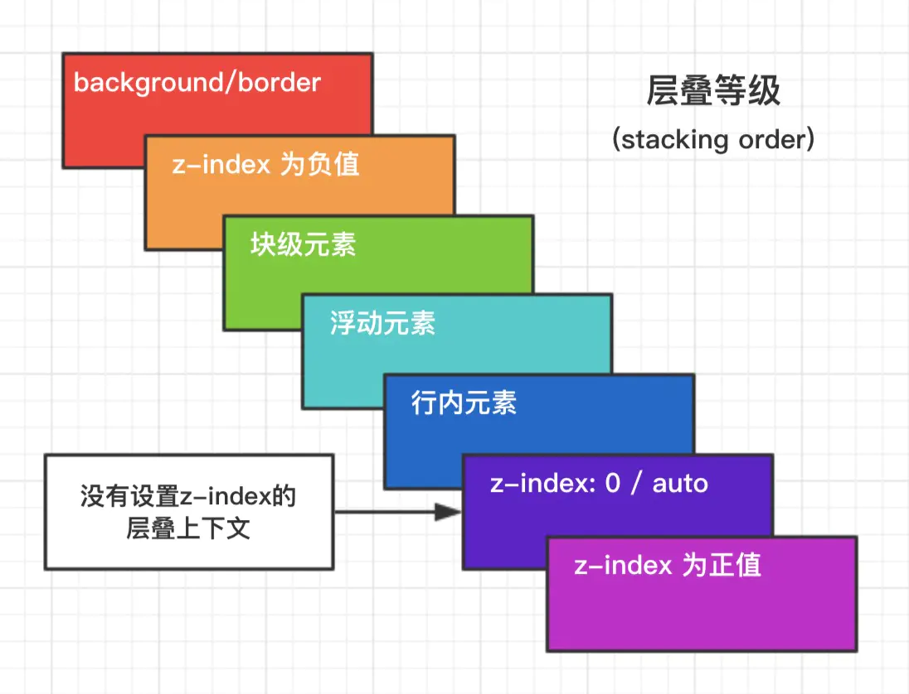
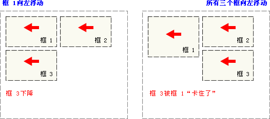
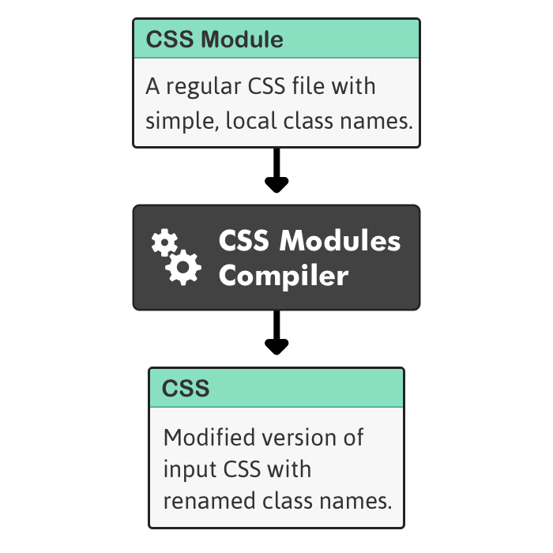
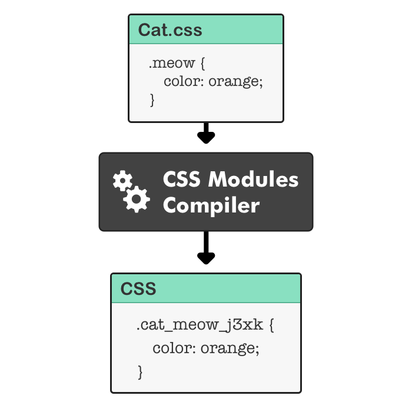
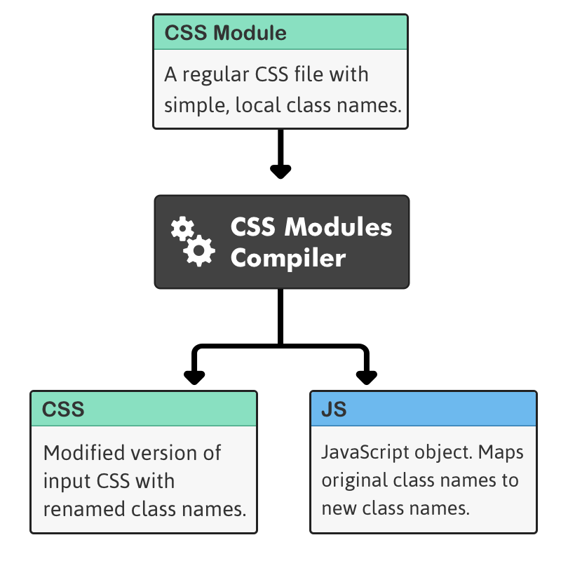
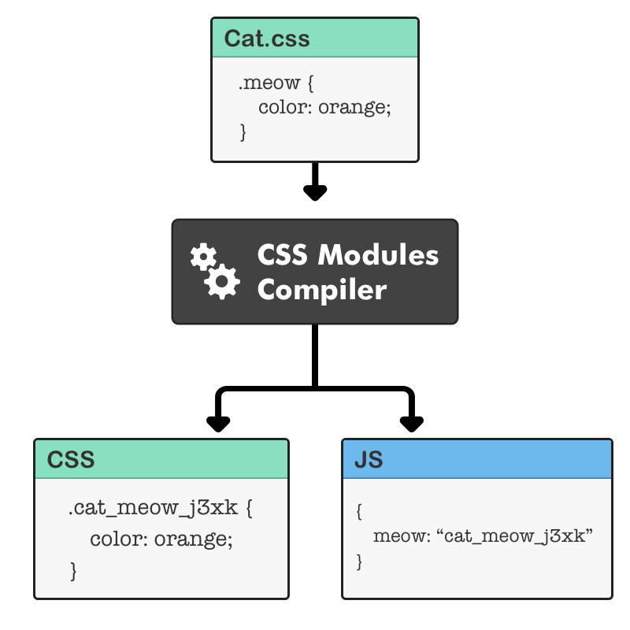
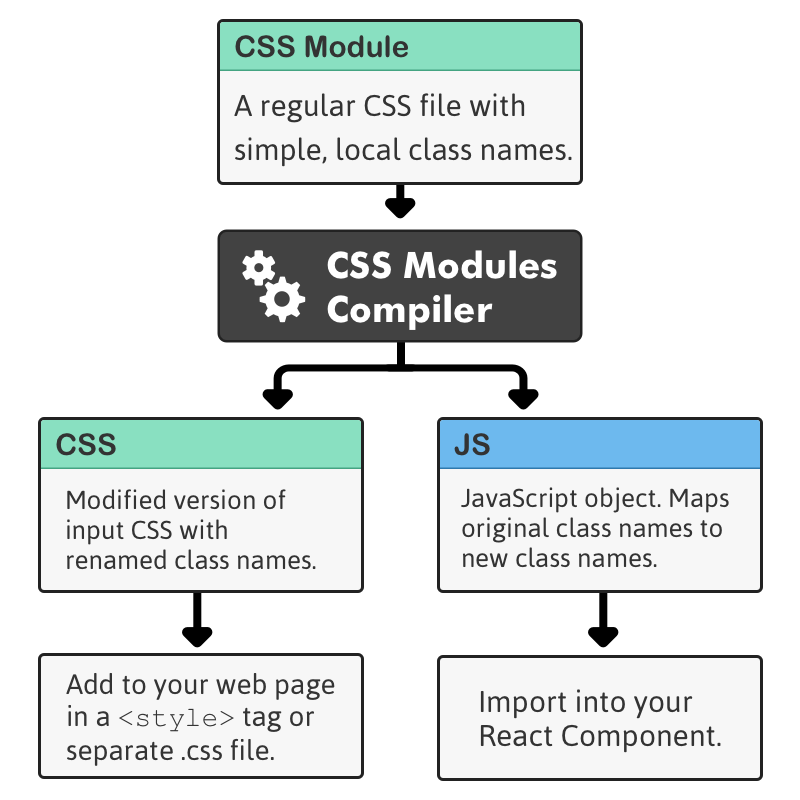
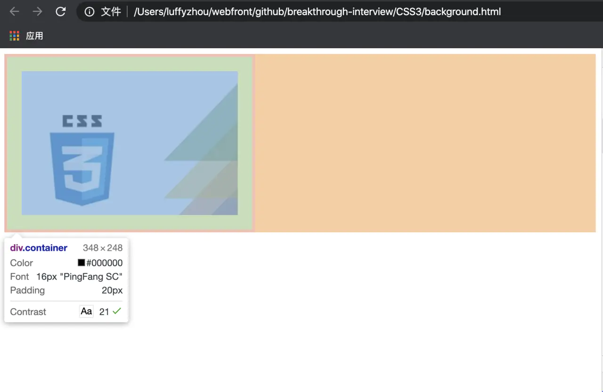

> CSS：层叠样式表（Cascading Style Sheets）的简称，是一种标记语言

# 盒模型

页面渲染时，DOM 元素采用的布局模型。可通过 `box-sizing` 进行设置。

根据计算宽高的区域可分为：

- `content-box` (W3C 标准盒模型，元素宽高值仅包含 content)
- `border-box` (IE 盒模型，元素宽高包含 border 和 padding)
- `padding-box` (FireFox 曾经支持)
- `margin-box` (浏览器未实现)

> Tips: 理论上是有上面 4 种盒子，但现在 w3c 与 mdn 规范中均只支持 `content-box` 与 `border-box`；


# BFC

**块级格式化上下文**，是一个独立的渲染区域，让处于 BFC 内部的元素与外部的元素相互隔离，使内外元素的定位不会相互影响。

> IE下为 Layout，可通过 zoom:1 触发

## 触发条件

- 根元素（或其他包含它的元素）
- 浮动元素（元素的 `float != none`）
- 绝对定位元素（元素具有 `position = absolute/fixed`）
- 内联块（元素具有 `display: inline-block`）
- 表格单元格（元素具有 `display: table-cell`，HTML 表格单元格默认属性）
- 表格标题（元素具有 `display: table-caption`，HTML 表格标题默认属性）
- 具有 `overflow` 且值不是 `visible` 的块元素
- 弹性盒子（`flex` 或 `inline-flex`）
- `display: flow-root`
- `column-span: all`

## 规则

- 属于同一个 BFC 的两个相邻 Box 垂直排列
- 属于同一个 BFC 的两个相邻 Box 的 margin 会发生重叠
- BFC 中子元素的 margin box 的左边， 与包含块 (BFC) border box的左边相接触 (子元素 absolute 除外)
- BFC 的区域不会与 float 的元素区域重叠
- 计算 BFC 的高度时，浮动子元素也参与计算
- 文字层不会被浮动层覆盖，环绕于周围

## 应用

- 阻止`margin`重叠
- 可以包含浮动元素 —— 清除内部浮动(清除浮动的原理是两个`div`都位于同一个 BFC 区域之中)
- 自适应两栏布局
- 可以阻止元素被浮动元素覆盖

# 层叠上下文

元素提升为一个比较特殊的图层，在三维空间中 **(z轴)** 高出普通元素一等。

## 触发条件

- 根层叠上下文(`html`)
- `position`不等于 `static`,并且设置了 z-index
- CSS3 属性
  - `flex`
  - `transform` 不是 `none`
  - `opacity` 不是 1
  - `filter` 不是 `none`
  - `isolation` 不是 `isolate`
  - `will-change` 指定的属性值为上面任何一个
  - `-webkit-overflow-scrolling`

## 层叠等级

层叠上下文在 z 轴上的排序

- 在同一层叠上下文中，层叠等级才有意义
- `z-index`的优先级最高




# 居中布局

## 水平居中

- 行内元素: `text-align: center`
- 块级元素: `margin: 0 auto`
- `absolute + transform`
- `flex + justify-content: center`

## 垂直居中

- `line-height: height`
- `absolute + transform`
- `flex + align-items: center`
- `table`

## 水平垂直居中

- `absolute + transform`
- `flex + justify-content + align-items`

# 选择器优先级

- `!important` > 行内样式 > `#id` > `.class` > `tag` > * > 继承 > 默认
- 选择器 **从右往左** 解析

## 伪类和伪元素

# 浮动

## 浮动概念

> 浮动的框可以向左或向右移动，直到它的外边缘碰到**包含框**或**另一个浮动框的边框**为止。
>
> 由于浮动框不在文档的普通流中，所以文档的普通流中的块框表现得就像浮动框不存在一样。

特点：

* 浮动元素会从普通文档流中脱离，但浮动元素影响的不仅是自己，它会影响周围的元素对其进行环绕；
* 不管一个元素是行内元素还是块级元素，只要被设置了浮动，那浮动元素就会形成一个块级框，可以设置它的宽度和高度，因此浮动元素常常用于制作横向配列的菜单，可以设置大小并且横向排列。

1. 当把框 1 向右浮动时，它脱离文档流并且向右移动，直到它的右边缘碰到包含框的右边缘：


2. 当框 1 向左浮动时，它脱离文档流并且向左移动，直到它的左边缘碰到包含框的左边缘。因为它不再处于文档流中，所以它不占据空间，实际上覆盖住了框 2，使框 2 从视图中消失。

   如果把所有三个框都向左移动，那么框 1 向左浮动直到碰到包含框，另外两个框向左浮动直到碰到**前一个浮动框**。


3. 如果包含框太窄，无法容纳水平排列的三个浮动元素，那么其它浮动块向下移动，直到有足够的空间。如果浮动元素的高度不同，那么当它们向下移动时可能被其它浮动元素“卡住”：



### float 属性

| 值      | 描述                                                 |
| :------ | :--------------------------------------------------- |
| left    | 元素向左浮动。                                       |
| right   | 元素向右浮动。                                       |
| none    | 默认值。元素不浮动，并会显示在其在文本中出现的位置。 |
| inherit | 规定应该从父元素继承 float 属性的值。                |

```css
/* 把图像向右浮动 */
img {
  /* 定义元素在哪个方向浮动 */
  float:right;
}
```

在 CSS 中，任何元素都可以浮动。浮动元素会生成一个块级框，而不论它本身是何种元素。

### 重叠问题

* 行内元素与浮动元素发生重叠，其边框、背景和内容都会显示在浮动元素之上
* 块级元素与浮动元素发生重叠时，边框和背景会显示在浮动元素之下，内容会显示在浮动元素之下

### clear 属性

浮动框旁边的行框被缩短，从而给浮动框留出空间，行框围绕浮动框。

因此，创建浮动框可以使文本围绕图像：


clear 属性的值可以是 left、right、both 或 none，确保当前元素的哪些边不应该挨着浮动框。clear 只对元素本身的布局起作用。

```css
/* 图像的左右两侧均不允许出现浮动元素*/
img {
  float:left;
  clear:both;
}

/* 下述 h3 标题行的左右两侧均不允许出现浮动元素*/
.text_line {
	clear:both;
	margin-bottom:2px;
}

<h3 class="text_line">第二行</h3>
```


## 清除浮动

### 高度塌陷问题

一个块级元素如果没有设置高度，其高度是由子元素撑开的。如果对子元素设置了浮动，那么子元素就会脱离文档流，也就是说父元素没有内容可以撑开其高度，这样父级元素的高度就会被忽略，这就是所谓的高度塌陷。

为了防止高度塌陷，因此需要清除浮动。

1. 给父元素定义高度
   * 优点：操作简单
   * 缺点：高度定死
   
2. 添加一个空元素 `<div class="clear"></div> (.clear { clear: both })`
   * 优点：浏览器支持好
   * 缺点：凭空多出很多无用空节点
   
3. 让父元素也一起浮动
   
   * 缺点：无法解决实际问题
   
4. 父元素设置为 `display: table`
   
   * 缺点：会产生新的问题
   
5. 父元素设置 `overflow: hidden auto`
   
   * 缺点：无法显示溢出的元素
   
6. 父元素伪元素设置清除浮动

   ```css
   .father {
     ...
   }
   
   .father:: after {
     content: ' ';
     display: block;
     height: 0;
     clear: both;
     visibility: hidden;
   }
   ```

   

- 通过增加尾元素清除浮动
  - `:after / <br> : clear: both`
- 创建父级 BFC

# 等比宽高

# 单位

## 相对长度

相对长度单位指定了一个长度相对于另一个长度的属性。对于不同的设备相对长度更适用。

| 单位    | 描述                                                         |
| ------- | :----------------------------------------------------------- |
| **em**  | 它是描述相对于应用在当前元素的字体尺寸，所以它也是相对长度单位。一般浏览器字体大小默认为16px，则2em == 32px； |
| ex      | 依赖于英文字母小 x 的高度                                    |
| ch      | 数字 0 的宽度                                                |
| **rem** | rem 是根 em（root em）的缩写，rem作用于非根元素时，相对于根元素字体大小(默认的 16 px)；rem作用于根元素字体大小时，相对于其出初始字体大小。 |
| **vw**  | viewpoint width，视窗宽度，1vw=视窗宽度的1%                  |
| vh      | viewpoint height，视窗高度，1vh=视窗高度的1%                 |
| vmin    | vw和vh中较小的那个。                                         |
| vmax    | vw和vh中较大的那个。                                         |
| **%**   |                                                              |

## 绝对长度

| 单位 | 描述                       |
| ---- | -------------------------- |
| px * | 像素 (1px = 1/96th of 1in) |
| in   | 英寸 (1in = 96px = 2.54cm) |

像素或许被认为是最好的"设备像素"，而这种像素长度和你在显示器上看到的文字屏幕像素无关。px实际上是一个按角度度量的单位。

# rem 适配方案

# position 取值

通过使用 [position 属性](https://www.w3school.com.cn/cssref/pr_class_position.asp)，我们可以选择 4 种不同类型的定位，这会影响元素框生成的方式。

position 属性值的含义：

- static

  元素框正常生成。块级元素生成一个矩形框，作为文档流的一部分，行内元素则会创建一个或多个行框，置于其父元素中。

- relative

  元素框偏移某个距离，相对于它原来应该在的位置。元素仍保持其未定位前的形状，它原本所占的空间仍保留。

- absolute

  元素框从文档流完全删除，并相对于**其包含块**定位（相对于其父元素定位）。包含块可能是文档中的另一个元素或者是初始包含块。元素原先在正常文档流中所占的空间会关闭，就好像元素原来不存在一样。元素定位后生成一个块级框，而不论原来它在正常流中生成何种类型的框。

- fixed

  元素框的表现类似于将 position 设置为 absolute，不过其包含块是**视窗**本身。

**提示：**相对定位实际上被看作普通流定位模型的一部分，因为元素的位置相对于它在普通流中的位置。

# 行内元素、块元素

# 媒体查询

用于响应式布局监听屏幕大小变化。

多媒体查询由多种媒体组成，可以包含一个或多个表达式，表达式根据条件是否成立返回 true 或 false。

如果指定的多媒体类型匹配设备类型则查询结果返回 true，文档会在匹配的设备上显示指定样式效果。

除非你使用了 not 或 only 操作符，否则所有的样式会适应在所有设备上显示效果。

- **not:** not是用来排除掉某些特定的设备的，比如 @media not print（非打印设备）。
- **only:** 用来定某种特别的媒体类型。对于支持Media Queries的移动设备来说，如果存在only关键字，移动设备的Web浏览器会忽略only关键字并直接根据后面的表达式应用样式文件。对于不支持Media Queries的设备但能够读取Media Type类型的Web浏览器，遇到only关键字时会忽略这个样式文件。
- **all:** 所有设备，这个应该经常看到。

## CSS3 多媒体类型

| 值     | 描述                             |
| :----- | :------------------------------- |
| all    | 用于所有多媒体类型设备           |
| print  | 用于打印机                       |
| screen | 用于电脑屏幕，平板，智能手机等。 |
| speech | 用于屏幕阅读器                   |

示例：

在屏幕可视窗口尺寸大于 480 像素时将菜单浮动到页面左侧：

```html
<!DOCTYPE html>
<html>
<head>
<meta name="viewport" content="width=device-width, initial-scale=1.0">
<meta charset="utf-8"> 
<title>菜鸟教程(runoob.com)</title> 
<style>
.wrapper {overflow:auto;}

#main {margin-left: 4px;}
#leftsidebar {float: none;width: auto;}
#menulist {margin:0;padding:0;}

.menuitem {
    background:#CDF0F6;
    border:1px solid #d4d4d4;
    border-radius:4px;
    list-style-type:none;
    margin:4px;
    padding:2px;
}

@media screen and (min-width: 480px) {
    #leftsidebar {width:200px;float:left;}
    #main {margin-left:216px;}
}
</style>
</head>
<body>

<div class="wrapper">
  <div id="leftsidebar">
    <ul id="menulist">
      <li class="menuitem">Menu-item 1</li>
      <li class="menuitem">Menu-item 2</li>
      <li class="menuitem">Menu-item 3</li>
      <li class="menuitem">Menu-item 4</li>
      <li class="menuitem">Menu-item 5</li>
   </ul>
  </div>
  <div id="main">
    <h1>重置浏览器窗口查看效果！</h1>
    <p>在屏幕可视窗口尺寸大于 480 像素时将菜单浮动到页面左侧。</p>
  </div>
</div>

</body>
</html>
```


# CSS Modules

出现背景：解决全局样式覆盖以及想要不被覆盖时的选择器过深问题

定义：CSS Module是一个CSS文件，所有类名和动画名称默认都在本地范围内。

功能很单纯，只加入了局部作用域和模块依赖，这恰恰是网页组件最急需的功能。



具体表现



注意`meow`类如何重命名为`cat_meow_j3xk`（全局唯一，不会覆盖）。让我们中断一下：

- `cat`：文件名
- `meow`：本地类名
- `j3xk`：随机的hash值




具体示例：



要使用CSS Module，你可以将CSS添加到Web页面，并将JavaScript对象导入到组件中。让我们把它加到图中：



## 1. 局部作用域

CSS的规则都是全局的，任何一个组件的样式规则，都对整个页面有效。

产生局部作用域的唯一方法，就是使用一个独一无二的`class`的名字，不会与其他选择器重名。这就是 CSS Modules 的做法。

调用`import styles from './Cat.css'`，将样式文件输出到 styles 对象，然后引用`styles.meow`代表一个 `class`。

React组件在一个`div`中设置了`styles.meow`，你可以看到示例中的文本变成了`orange`颜色。

```react
// Cat.css 
.meow { 
  color: orange; 
} 

// 编译后生成的CSS 
.Cat_meow_j3xk { 
  color: orange; 
} 

// Cat.js 
import React from 'react'; 
import styles from './Cat.css'; 
class Cat extends React.Component { 
  render() { 
    return ( 
      <div className={styles.meow}>Orange Cat</div> 
    ) 
  } 
} 
export default Cat; 

// 编译出来的JavaScript 
{ 
  meow: 'Cat_meow_j3xk' 
}

// 构建工具将类名 style.memo 编译成一个哈希字符串
<div class="Cat_meow_j3xk">Orange Cat</div>
```

这样一来，这个类名就变成独一无二了，只对`Cat`组件有效`。

## 2. 全局作用域

CSS Modules 允许使用`:global(.className)`的语法，声明一个全局规则。凡是这样声明的`class`，都不会被编译成哈希字符串。

[`App.css`](https://github.com/ruanyf/css-modules-demos/blob/master/demo02/components/App.css)加入一个全局`class`。

```css
.title {
  color: red;
}

:global(.title) {
  color: green;
}
```

[`App.js`](https://github.com/ruanyf/css-modules-demos/blob/master/demo02/components/App.css)使用普通的`class`的写法，就会引用全局`class`。

```javascript
import React from 'react';
import styles from './App.css';

export default () => {
  return (
    <h1 className="title">
      Hello World
    </h1>
  );
};
```

CSS Modules 还提供一种显式的局部作用域语法`:local(.className)`，等同于`.className`，所以上面的`App.css`也可以写成下面这样。

```css
:local(.title) {
  color: red;
}

:global(.title) {
  color: green;
}
```

## 3. 定制哈希类名

`css-loader`默认的哈希算法是`[hash:base64]`，这会将`.title`编译成`._3zyde4l1yATCOkgn-DBWEL`这样的字符串。

[`webpack.config.js`](https://github.com/ruanyf/css-modules-demos/blob/master/demo03/webpack.config.js)里面可以定制哈希字符串的格式。

```javascript
module: {
  loaders: [
    // ...
    {
      test: /\.css$/,
      loader: "style-loader!css-loader?modules&localIdentName=[path][name]---[local]---[hash:base64:5]"
    },
  ]
}
```

会[发现](http://ruanyf.github.io/css-modules-demos/demo03/)`.title`被编译成了`demo03-components-App---title---GpMto`。

## 4. Class 的组合

在 CSS Modules 中，一个选择器可以继承另一个选择器的规则，这称为"组合"（["composition"](https://github.com/css-modules/css-modules#composition)）。

在[`App.css`](https://github.com/ruanyf/css-modules-demos/blob/master/demo04/components/App.css)中，让`.title`继承`.className` 。

```css
.className {
  background-color: blue;
}

.title {
  composes: className;
  color: red;
}
```

[`App.js`](https://github.com/ruanyf/css-modules-demos/blob/master/demo04/components/App.js)不用修改。

```javascript
import React from 'react';
import style from './App.css';

export default () => {
  return (
    // 由于 title 继承了 className 的规则
    // className 也会被编译为 hash 串
    <h1 className={style.title}>
      Hello World
    </h1>
  );
};
```

`App.css`编译成下面的代码。

```css
._2DHwuiHWMnKTOYG45T0x34 {
  color: red;
}

._10B-buq6_BEOTOl9urIjf8 {
  background-color: blue;
}
```

相应地， `h1`的`class`也会编译成`<h1 class="_2DHwuiHWMnKTOYG45T0x34 _10B-buq6_BEOTOl9urIjf8">`。

## 5. 输入其他模块

选择器也可以继承其他CSS文件里面的规则。

[`another.css`](https://github.com/ruanyf/css-modules-demos/blob/master/demo05/components/another.css)

```css
.className {
  background-color: blue;
}
```

[`App.css`](https://github.com/ruanyf/css-modules-demos/blob/master/demo05/components/App.css)可以继承`another.css`里面的规则。

```css
.title {
  composes: className from './another.css';
  color: red;
}
```

## 6. 输入变量

CSS Modules 支持使用变量，不过需要安装 PostCSS 和 [postcss-modules-values](https://github.com/css-modules/postcss-modules-values)。

```bash
$ npm install --save postcss-loader postcss-modules-values
```

把`postcss-loader`加入[`webpack.config.js`](https://github.com/ruanyf/css-modules-demos/blob/master/demo06/webpack.config.js)。

```javascript
var values = require('postcss-modules-values');

module.exports = {
  entry: __dirname + '/index.js',
  output: {
    publicPath: '/',
    filename: './bundle.js'
  },
  module: {
    loaders: [
      {
        test: /\.jsx?$/,
        exclude: /node_modules/,
        loader: 'babel',
        query: {
          presets: ['es2015', 'stage-0', 'react']
        }
      },
      {
        test: /\.css$/,
        loader: "style-loader!css-loader?modules!postcss-loader"
      },
    ]
  },
  postcss: [
    values
  ]
};
```

接着，在[`colors.css`](https://github.com/ruanyf/css-modules-demos/blob/master/demo06/components/colors.css)里面定义变量。

```css
@value blue: #0c77f8;
@value red: #ff0000;
@value green: #aaf200;
```

[`App.css`](https://github.com/ruanyf/css-modules-demos/tree/master/demo06/components)可以引用这些变量。

```css
@value colors: "./colors.css";
@value blue, red, green from colors;

.title {
  color: red;
  background-color: blue;
}
```


参考： http://www.ruanyifeng.com/blog/2016/06/css_modules.html

# Grid 网格布局

Grid 布局与 [Flex 布局](http://www.ruanyifeng.com/blog/2015/07/flex-grammar.html)有一定的相似性，都可以指定容器内部多个项目的位置。但是，它们也存在重大区别。

Flex 布局是轴线布局，只能指定"项目"针对轴线的位置，可以看作是**一维布局**。Grid 布局则是将容器划分成"行"和"列"，产生单元格，然后指定"项目所在"的单元格，可以看作是**二维布局**。Grid 布局远比 Flex 布局强大。

## 基本概念

### 容器和项目

采用网格布局的区域，称为"容器"（container）。容器内部采用网格定位的子元素，称为"项目"（item）。

```html
<div>
  <div><p>1</p></div>
  <div><p>2</p></div>
  <div><p>3</p></div>
</div>
```

上面代码中，最外层的`<div>`元素就是容器，内层的三个`<div>`元素就是项目。

注意：**项目只能是容器的顶层子元素**，不包含项目的子元素，比如上面代码的`<p>`元素就不是项目。Grid 布局只对项目生效。

### 行和列

容器里面的水平区域称为"行"（row），垂直区域称为"列"（column）。


上图中，水平的深色区域就是"行"，垂直的深色区域就是"列"。

### 单元格

行和列的交叉区域，称为"单元格"（cell）。

正常情况下，`n`行和`m`列会产生`n x m`个单元格。比如，3行3列会产生9个单元格。

### 网格线

划分网格的线，称为"网格线"（grid line）。水平网格线划分出行，垂直网格线划分出列。

正常情况下，`n`行有`n + 1`根水平网格线，`m`列有`m + 1`根垂直网格线，比如三行就有四根水平网格线。


上图是一个 4 x 4 的网格，共有5根水平网格线和5根垂直网格线。

> Grid 布局的属性分成两类。一类定义在容器上面，称为容器属性；另一类定义在项目上面，称为项目属性。这部分先介绍容器属性。

## 容器属性

> display 属性

`display: grid`指定一个容器采用网格布局。

```css
div {
  display: grid;
}
```


上图是`display: grid`的[效果](https://jsbin.com/guvivum/edit?html,css,output)。

示例代码：

```html
<!DOCTYPE html>
<html>

<head>
    <meta charset="utf-8">
    <meta name="viewport" content="width=device-width">
    <title>JS Bin</title>
    <style>
        span {
            font-size: 2em;
        }
        #container {
            display: grid;
            /* grid-template-columns属性定义每一列的列宽，grid-template-rows属性定义每一行的行高。 */
            grid-template-columns: 50px 50px 50px;
            grid-template-rows: 50px 50px 50px;
            /* 或者使用百分比 */
            /* grid-template-columns: 33.33% 33.33% 33.33%;
            grid-template-rows: 33.33% 33.33% 33.33%; */
        }
        .item {
            font-size: 2em;
            text-align: center;
            border: 1px solid #e5e4e9;
        }
        .item-1 {
            background-color: #ef342a;
        }
        .item-2 {
            background-color: #f68f26;
        }
        .item-3 {
            background-color: #4ba946;
        }
        .item-4 {
            background-color: #0376c2;
        }
        .item-5 {
            background-color: #c077af;
        }
        .item-6 {
            background-color: #f8d29d;
        }
        .item-7 {
            background-color: #b5a87f;
        }
        .item-8 {
            background-color: #d0e4a9;
        }
        .item-9 {
            background-color: #4dc7ec;
        }
    </style>
</head>

<body>
    <span>foo</span>
    <div id="container">
        <div class="item item-1">1</div>
        <div class="item item-2">2</div>
        <div class="item item-3">3</div>
        <div class="item item-4">4</div>
        <div class="item item-5">5</div>
        <div class="item item-6">6</div>
        <div class="item item-7">7</div>
        <div class="item item-8">8</div>
        <div class="item item-9">9</div>
    </div>
    <span>bar</span>
</body>

</html>
```

默认情况下，容器元素都是块级元素，但也可以设成行内元素。

```css
div {
  display: inline-grid;
}
```

上面代码指定`div`是一个行内元素，该元素内部采用网格布局。


上图是`display: inline-grid`的[效果](https://jsbin.com/qatitav/edit?html,css,output)。

**注意**：设为网格布局以后，容器子元素（项目）的`float`、`display: inline-block`、`display: table-cell`、`vertical-align`和`column-*`等设置都将失效。

> grid-template-columns 属性， grid-template-rows 属性

`grid-template-columns`属性定义每一列的列宽，`grid-template-rows`属性定义每一行的行高。

```css
.container {
  display: grid;
  grid-template-columns: 100px 100px 100px;
  grid-template-rows: 100px 100px 100px;
}
```

上面代码指定了一个三行三列的网格，列宽和行高都是`100px`。

除了使用绝对单位，也可以使用百分比。

```css
.container {
  display: grid;
  grid-template-columns: 33.33% 33.33% 33.33%;
  grid-template-rows: 33.33% 33.33% 33.33%;
}
```

**repeat() 函数**

接受两个参数，第一个参数是重复的次数（上例是3），第二个参数是所要重复的值。

```css
.container {
  display: grid;
  grid-template-columns: repeat(3, 33.33%);
  grid-template-rows: repeat(3, 33.33%);
}
```

重复某种模式

定义了6列，第一列和第四列的宽度为`100px`，第二列和第五列为`20px`，第三列和第六列为`80px`

```css
grid-template-columns: repeat(2, 100px 20px 80px);
```

auto-fill 关键字

有时，单元格的大小是固定的，但是容器的大小不确定。如果希望每一行（或每一列）容纳尽可能多的单元格，这时可以使用`auto-fill`关键字表示自动填充。

```css
.container {
  display: grid;
  grid-template-columns: repeat(auto-fill, 100px);
}
```

表示每列宽度`100px`，然后自动填充，直到容器不能放置更多的列。


**fr 关键字**

为了方便表示比例关系，网格布局提供了`fr`关键字（fraction 的缩写，意为"片段"）。如果两列的宽度分别为`1fr`和`2fr`，就表示后者是前者的两倍。

```css
.container {
  display: grid;
  grid-template-columns: 1fr 1fr;
}
```

[上面代码](https://jsbin.com/hadexek/edit?html,css,output)表示两个相同宽度的列。

`fr`可以与绝对长度的单位结合使用，这时会非常方便。

```css
.container {
  display: grid;
  grid-template-columns: 150px 1fr 2fr;
}
```

[上面代码](https://jsbin.com/remowec/edit?html,css,output)表示，第一列的宽度为150像素，第二列的宽度是第三列的一半。

**minmax()**

`minmax()`函数产生一个长度范围，表示长度就在这个范围之中。它接受两个参数，分别为最小值和最大值。

```css
grid-template-columns: 1fr 1fr minmax(100px, 1fr);
```

上面代码中，`minmax(100px, 1fr)`表示列宽不小于`100px`，不大于`1fr`。

**auto 关键字**

`auto`关键字表示由浏览器自己决定长度。

```css
grid-template-columns: 100px auto 100px;
```

上面代码中，第二列的宽度，基本上等于该列单元格的最大宽度，除非单元格内容设置了`min-width`，且这个值大于最大宽度。

**网格线的名称**

`grid-template-columns`属性和`grid-template-rows`属性里面，还可以使用方括号，指定每一根网格线的名字，方便以后的引用。

```css
.container {
  display: grid;
  grid-template-columns: [c1] 100px [c2] 100px [c3] auto [c4];
  grid-template-rows: [r1] 100px [r2] 100px [r3] auto [r4];
}
```

上面代码指定网格布局为3行 x 3列，因此有4根垂直网格线和4根水平网格线。方括号里面依次是这八根线的名字。

网格布局允许同一根线有多个名字，比如`[fifth-line row-5]`。

**布局实例**

`grid-template-columns`属性对于网页布局非常有用。两栏式布局只需要一行代码。

```css
.wrapper {
  display: grid;
  grid-template-columns: 70% 30%;
}
```

上面代码将左边栏设为70%，右边栏设为30%。

传统的十二网格布局，写起来也很容易。

```css
grid-template-columns: repeat(12, 1fr);
```

> row-gap 属性， column-gap 属性， gap 属性

`row-gap`属性设置行与行的间隔（行间距）

`column-gap`属性设置列与列的间隔（列间距）。

```css
.container {
  row-gap: 20px;
  column-gap: 20px;
}
```

`gap`属性是`column-gap`和`row-gap`的合并简写形式，语法如下。

```css
gap: <row-gap> <column-gap>;
```

因此，上面一段 CSS 代码等同于下面的代码。

```css
.container {
  gap: 20px 20px;
}
```

如果`gap`省略了第二个值，浏览器认为第二个值等于第一个值。

> grid-template-areas 属性

网格布局允许指定"区域"（area），一个区域由单个或多个单元格组成。`grid-template-areas`属性用于定义区域。

```css
.container {
  display: grid;
  grid-template-columns: 100px 100px 100px;
  grid-template-rows: 100px 100px 100px;
  grid-template-areas: 'a b c'
                       'd e f'
                       'g h i';
}
```

上面代码先划分出9个单元格，然后将其定名为`a`到`i`的九个区域，分别对应这九个单元格。

多个单元格合并成一个区域的写法如下。

```css
grid-template-areas: 'a a a'
                     'b b b'
                     'c c c';
```

上面代码将9个单元格分成`a`、`b`、`c`三个区域。

下面是一个布局实例。

```css
grid-template-areas: "header header header"
                     "main main sidebar"
                     "footer footer footer";
```

上面代码中，顶部是页眉区域`header`，底部是页脚区域`footer`，中间部分则为`main`和`sidebar`。

如果某些区域不需要利用，则使用"点"（`.`）表示。

```css
grid-template-areas: 'a . c'
                     'd . f'
                     'g . i';
```

上面代码中，中间一列为点，表示没有用到该单元格，或者该单元格不属于任何区域。

**注意**：区域的命名会影响到网格线。每个区域的起始网格线，会自动命名为`区域名-start`，终止网格线自动命名为`区域名-end`。比如，区域名为`header`，则起始位置的水平网格线和垂直网格线叫做`header-start`，终止位置的水平网格线和垂直网格线叫做`header-end`。

> grid-auto-flow 属性

划分网格以后，容器的子元素会按照顺序，自动放置在每一个网格。默认的放置顺序是"先行后列"，即先填满第一行，再开始放入第二行。

这个顺序由`grid-auto-flow`属性决定，默认值是`row`，即"先行后列"。也可以将它设成`column`，变成"先列后行"。

```css
grid-auto-flow: column;
```

`grid-auto-flow`属性除了设置成`row`和`column`，还可以设成`row dense`（表示"先行后列"，并且尽可能紧密填满，尽量不出现空格。）和`column dense`（表示"先列后行"，并且尽可能紧密填满，尽量不出现空格）。这两个值主要用于，某些项目指定位置以后，剩下的项目怎么自动放置。

> justify-items 属性， align-items 属性， place-items 属性

> justify-content 属性， align-content 属性， place-content 属性

> grid-auto-columns 属性， grid-auto-rows 属性

> grid-template 属性， grid 属性

## 项目属性

> grid-column-start 属性， grid-column-end 属性， grid-row-start 属性， grid-row-end 属性


> grid-column 属性， grid-row 属性


> grid-area 属性


> justify-self 属性， align-self 属性， place-self 属性


参考： http://www.ruanyifeng.com/blog/2019/03/grid-layout-tutorial.html

# Flex 布局

阮一峰 http://www.ruanyifeng.com/blog/2015/07/flex-grammar.html

2009年，W3C 提出了一种新的方案----Flex 布局，可以简便、完整、响应式地实现各种页面布局。

Flex 是 Flexible Box 的缩写，意为"弹性布局"，用来为盒状模型提供最大的灵活性。

任何一个容器都可以指定为 Flex 布局。

```css
.box{
  display: flex;
}
```

行内元素也可以使用 Flex 布局。

```css
.box{
  display: inline-flex;
}
```

Webkit 内核的浏览器，必须加上`-webkit`前缀。

```css
.box{
  display: -webkit-flex; /* Safari */
  display: flex;
}
```

注意，设为 Flex 布局以后，子元素的`float`、`clear`和`vertical-align`属性将失效。

## 基本概念

采用 Flex 布局的元素，称为 Flex 容器（flex container），简称"容器"。它的所有子元素自动成为容器成员，称为 Flex 项目（flex item），简称"项目"。


容器默认存在两根轴：水平的主轴（main axis）和垂直的交叉轴（cross axis）。主轴的开始位置（与边框的交叉点）叫做`main start`，结束位置叫做`main end`；交叉轴的开始位置叫做`cross start`，结束位置叫做`cross end`。

项目默认沿主轴排列。单个项目占据的主轴空间叫做`main size`，占据的交叉轴空间叫做`cross size`。

## 容器属性

以下6个属性设置在容器上。

1. flex-direction
   - 主轴方向
   - row（默认） | row-reverse | column | column-reverse
2. flex-wrap
   - 如果一条轴线排不下，如何换行。
   - nowrap（默认） | wrap | wrap-reverse
3. flex-flow
4. justify-content
5. align-items
6. align-content

## 项目属性

## 应用

### 实现九宫格

## flex-shrink 计算规则

## flex-grow 规则

# 使用 CSS 画一个三角形

先编写一个空元素

```html
<div class="triangle"></div>
```

然后，将它四个边框中的三个边框设为透明，剩下一个设为可见，就可以生成三角形效果：

```css
.triangle {
　　　　border-color: transparent transparent green transparent;
　　　　border-style: solid;
       /* 第一个为 0 是为了除去上面的边框，防止占据空间 */
　　　　border-width: 0px 300px 300px 300px;
　　　　height: 0px;
　　　　width: 0px;
　　}
```

元素的边框是三角形组成的，将内容宽高均设置为 0，则元素仅剩边框。再将上、右、左的边框均设置为透明色，仅留下最下面的边框即为三角形。

# CSS 选择器

1. `!important`
2. 内联样式（1000）
3. ID 选择器（0100）
4. 类选择器 / 属性选择器 / 伪类选择器（0010）
5. 元素选择器 / 关系选择器 / 伪元素选择器（0001）
6. 通配选择器（0000）

## CSS

### 基本选择器

| 序号 | 选择器      | 含义                                           |
| ---- | ----------- | ---------------------------------------------- |
| 1.   | *****       | 通用元素选择器，匹配任何元素                   |
| 2.   | **E**       | 标签选择器，匹配所有使用E标签的元素            |
| 3.   | **.info**   | class选择器，匹配所有class属性中包含info的元素 |
| 4.   | **#footer** | id选择器，匹配所有id属性等于footer的元素       |

### 多元素的组合选择器

| 序号 | 选择器 | 含义                                                         |
| ---- | ------ | ------------------------------------------------------------ |
| 5.   | E,F    | 多元素选择器，同时匹配所有E元素或F元素，E和F之间用逗号分隔   |
| 6.   | E F    | **后代元素**选择器，匹配所有属于E元素后代的F元素，E和F之间用空格分隔 |
| 7.   | E > F  | **子元素**选择器，匹配所有E元素的子元素F                     |
| 8.   | E + F  | 毗邻元素选择器，匹配所有**紧随**E元素之后的同级元素F         |

## CSS 2.1

### 属性选择器

| 序号 | 选择器       | 含义                                                         |
| ---- | ------------ | ------------------------------------------------------------ |
| 9.   | E[att]       | 匹配所有具有att属性的E元素，不考虑它的值。（注意：E在此处可以省略，比如"[cheacked]"。以下同。） |
| 10.  | E[att=val]   | 匹配所有att属性等于"val"的E元素                              |
| 11.  | E[att~=val]  | 匹配所有att属性具有多个空格分隔的值、其中一个值等于"val"的E元素 |
| 12.  | E[att\|=val] | 匹配所有att属性具有多个连字号分隔（hyphen-separated）的值、其中一个值以"val"开头的E元素，主要用于lang属性，比如"en"、"en-us"、"en-gb"等等 |

### 伪类

主要是设置元素不同状态时的效果。

伪类用于当已有元素处于某种状态时，为其添加对应的样式，这个状态是根据用户行为而动态变化的。

| 序号 | 选择器        | 含义                                    |
| ---- | ------------- | --------------------------------------- |
| 13.  | E:first-child | 匹配父元素的第一个子元素                |
| 14.  | E:link        | 匹配所有未被点击的链接                  |
| 15.  | E:visited     | 匹配所有已被点击的链接                  |
| 16.  | E:active      | 匹配鼠标已经其上按下、还没有释放的E元素 |
| 17.  | E:hover       | 匹配鼠标悬停其上的E元素                 |
| 18.  | E:focus       | 匹配获得当前焦点的E元素                 |
| 19.  | E:lang(c)     | 匹配lang属性等于c的E元素                |

> link的四种状态，需要按照下面的前后顺序进行设置：
>
> ```css
> a:link
> a:visited
> a:hover
> a:active
> ```

**伪类**选择元素基于的是当前元素处于的状态，或者说元素当前所具有的特性，而不是元素的id、class、属性等静态的标志。由于状态是动态变化的，所以一个元素达到一个特定状态时，它可能得到一个伪类的样式；当状态改变时，它又会失去这个样式。由此可以看出，它的功能和class有些类似，但它是基于文档之外的抽象，所以叫伪类。

### 伪元素

主要是设置元素包含内容以及前后位置的效果。

伪元素用于创建一些不在文档树中的元素，并为其添加样式。

比如：`:before ` 来为一个元素前增加一些文本，并为这些文本增加样式。用户虽然可以看到这些文本，但是这些文本实际并不在文档树中。

| 序号 | 选择器         | 含义                      |
| ---- | -------------- | ------------------------- |
| 20.  | E:first-line   | 匹配E元素的第一行         |
| 21.  | E:first-letter | 匹配E元素的第一个字母     |
| 22.  | E:before       | 在E元素之前插入生成的内容 |
| 23.  | E:after        | 在E元素之后插入生成的内容 |

**伪元素**是对元素中的特定内容进行操作，它所操作的层次比伪类更深了一层，也因此它的动态性比伪类要低得多。实际上，设计伪元素的目的就是去选取诸如元素内容第一个字（母）、第一行，选取某些内容前面或后面这种普通的选择器无法完成的工作。它控制的内容实际上和元素是相同的，但是它本身只是基于元素的抽象，并不存在于文档中，所以叫伪元素。

> **伪类和伪元素区别：**
>
> 伪类的操作对象时文档树中已有的元素，而伪元素则创建一个文档树以外的元素。因此他们之间的区别在于：**有没有创建一个文档树之外的元素**。
>
> CSS3 规范中要求使用双冒号(::) 表示伪元素，单冒号(:) 表示伪类

## CSS3 

### 同级元素通用选择器

| 序号 | 选择器 | 含义                                         |
| ---- | ------ | -------------------------------------------- |
| 24.  | E ~ F  | 匹配任何在E元素之后的同级F元素（不要求紧随） |

### 属性选择器

| 序号 | 选择器        | 含义                                                         |
| ---- | ------------- | ------------------------------------------------------------ |
| 25.  | E[att^="val"] | 属性att的值以"val"开头的元素                                 |
| 26.  | E[att$="val"] | 属性att的值以"val"结尾的元素                                 |
| 27.  | E[att*="val"] | 属性att的值包含"val"字符串的元素（只要包含，不要求完全相等） |

### 与用户界面有关的伪类

| 序号 | 选择器       | 含义                                                      |
| ---- | ------------ | --------------------------------------------------------- |
| 28.  | E:enabled    | 匹配表单中激活的元素                                      |
| 29.  | E:disabled   | 匹配表单中禁用的元素                                      |
| 30.  | E:checked    | 匹配表单中被选中的radio（单选框）或checkbox（复选框）元素 |
| 31.  | E::selection | 匹配用户当前选中的元素                                    |

### 结构性伪类

| 序号 | 选择器                | 含义                                                         |
| ---- | --------------------- | ------------------------------------------------------------ |
| 32.  | E:root                | 匹配文档的根元素，对于HTML文档，就是HTML元素                 |
| 33.  | E:nth-child(n)        | 匹配其父元素的第n个子元素，第一个编号为1                     |
| 34.  | E:nth-last-child(n)   | 匹配其父元素的倒数第n个子元素，第一个编号为1                 |
| 35.  | E:nth-of-type(n)      | 与:nth-child()作用类似，但是仅匹配使用同种标签的元素         |
| 36.  | E:nth-last-of-type(n) | 与:nth-last-child() 作用类似，但是仅匹配使用同种标签的元素   |
| 37.  | E:last-child          | 匹配父元素的最后一个子元素，等同于:nth-last-child(1)         |
| 38.  | E:first-of-type       | 匹配父元素下使用同种标签的第一个子元素，等同于:nth-of-type(1) |
| 39.  | E:last-of-type        | 匹配父元素下使用同种标签的最后一个子元素，等同于:nth-last-of-type(1) |
| 40.  | E:only-child          | 匹配父元素下仅有的一个子元素，等同于:first-child:last-child或 :nth-child(1):nth-last-child(1) |
| 41.  | E:only-of-type        | 匹配父元素下使用同种标签的唯一一个子元素，等同于:first-of-type:last-of-type或 :nth-of-type(1):nth-last-of-type(1) |
| 42.  | E:empty               | 匹配一个不包含任何子元素的元素，注意，文本节点也被看作子元素 |

### 反选伪类

| 序号 | 选择器   | 含义                           |
| ---- | -------- | ------------------------------ |
| 43.  | E:not(s) | 匹配不符合当前选择器的任何元素 |

### :target 伪类

| 序号 | 选择器   | 含义                           |
| ---- | -------- | ------------------------------ |
| 44.  | E:target | 匹配文档中特定"id"点击后的效果 |

参考：https://ruanyifeng.com/blog/2009/03/css_selectors.html

# CSS3 特性

参考：https://juejin.cn/post/6844904066926002190

CSS3 是 CSS 的最新标准，CSS3 是向后兼容的。

> CSS3 向后兼容，所以支持 CSS1/2 的写法，在 CSS3 里也可以被使用。而 CSS3 如果是向前兼容，则表示 CSS1/2 可以接受 CSS3 的写法，实际上并不是这样的。所以 CSS3 是向后兼容的。

## 选择器

实现变色表格

```css
/*奇数行蓝色*/
tbody tr:nth-child(odd) {
  background-color: aqua;
  opacity: 0.7;
}
/*偶数行橘色*/
tbody tr:nth-child(even) {
  background-color: orange;
  opacity: 0.7;
}
```

更多属性见 CSS3 选择器。

## 盒模型

盒模型有三种：`box-sizing:content-box|border-box|inherit`，默认的是`content-box`。

容器内包含两张图片，宽度都是 50%，但是图片有 border，而元素盒模型默认是 content-box，所以图片会折行，因为溢出了。

```html
<style>
    .container img {
      width: 50%;
      border: 1px solid #111;
    }
</style>
<div class="container">
    
</div>
```

如果让两张图片不折行，在一行里显示，设置`box-sizing:border-box`，如下面所示：

```css
.container img {
  box-sizing: border-box;
  width: 50%;
  border: 1px solid #111;
}
```

因为 border-box 的计算方式是将 border 计算在 width 内部的。

## 布局

### flex 布局

阮一峰 http://www.ruanyifeng.com/blog/2015/07/flex-grammar.html

### 多列布局

`column-count`：设置布局的列数

```html
<style>
    .column-2 {
      column-count: 2;
    }
    .column-3 {
      column-count: 3;
    }
</style>
```

column-gap：规定列之间的间隔

```css
.column-2 {
  column-count: 2;
  column-gap: 80px;
}
```

column-rule: 属性设置列之间的宽度、样式和颜色规则

```css
.column-3 {
  column-count: 3;
  column-rule:3px outset #ff0000;
}
```

> 多列布局非常适合实现类似报纸、论文以及书本文章类型的布局。

- background-clip: 规定背景的绘制区域

```css
.container {
  border: 4px solid orchid;
  padding: 20px;
  width: 300px;
  height: 200px;
  background-image: url('./css3.jpg');
  background-clip: border-box; // 默认的，从border开始
}

<div class="container" />
```


```css
.container {
  border: 4px solid orchid;
  padding: 20px;
  width: 300px;
  height: 200px;
  background-image: url('./css3.jpg');
  background-clip: content-box;
}
```

如下图可以看到，绘制的区域不包含 padding。





## 背景和边框

### 背景

### 边框

## 文本效果

## 2D/3D转换

### 2D转换

### 3D 转换

## 动画


# link（html） 与 @import（CSS） 的区别

|              | link                                    | @import                                          |
| ------------ | --------------------------------------- | ------------------------------------------------ |
| 语法类型     | html                                    | CSS                                              |
| 兼容问题     | 无                                      | @import 是 css2.1 加入的语法，只有 IE5+ 才可识别 |
| 加载方式     | 浏览器**加载页面时**同步加载 CSS        | 浏览器**页面加载完成后**再加载@import的CSS       |
| 优先级       | 高                                      | 低                                               |
| 功能         | 功能较多，可以定义 RSS，定义 Rel 等作用 | 只能用于加载 CSS                                 |
| 使用 JS 引入 | 可以                                    | 不可以                                           |

# CSS 预处理器(Sass/Less/Postcss)

原理: 

将类 CSS 语言通过 **Webpack 编译** 转成浏览器可读的真正 CSS。在这层编译之上，便可以赋予 CSS 更多更强大的功能，常用功能:

- 嵌套
- 变量
- 循环语句
- 条件语句
- 自动前缀
- 单位转换
- mixin复用

面试中一般不会重点考察该点，一般介绍下自己在实战项目中的经验即可~

# CSS 动画

> 区别：过渡效果需要事件触发（例如鼠标悬停），但是动画是页面加载之后，立即执行的。

## `transition`

过渡动画：CSS3中，我们为了添加某种效果可以从一种样式转变到另一个的时候，无需使用Flash动画或JavaScript。

CSS3 过渡是元素从一种样式逐渐改变为另一种的效果。

要实现这一点，必须规定两项内容：

- 指定要添加效果的CSS属性
- 指定效果的持续时间。

示例：

```css
/* 单项改变 */
div
{
	width:100px;
	height:100px;
	background:red;
	transition:width 2s;
	-webkit-transition:width 2s; /* Safari */
}

div:hover
{
	width:300px;
}

/* 多项改变 */
div {
    width: 100px;
    height: 100px;
    background: red;
    -webkit-transition: width 2s, height 2s, -webkit-transform 2s; /* For Safari 3.1 to 6.0 */
    transition: width 2s, height 2s, transform 2s;
}

div:hover {
    width: 200px;
    height: 200px;
    -webkit-transform: rotate(180deg); /* Chrome, Safari, Opera */
    transform: rotate(180deg);
}
```

### transition 属性

- `transition-property`: 属性（规定应用过渡的 CSS 属性的名称）
- `transition-duration`: 间隔（定义过渡效果花费的时间。默认是 0。）
- `transition-timing-function`: 曲线（规定过渡效果的时间曲线。默认是 "ease"。）
- `transition-delay`: 延迟（规定过渡效果何时开始。默认是 0。）
- 常用钩子: `transitionend`

## `animation / keyframes`

CSS3 动画：动画是使元素从一种样式逐渐变化为另一种样式的效果。您可以改变任意多的样式任意多的次数。

1. @keyframes 规则

   创建动画。@keyframes 规则内指定一个 CSS 样式和动画将逐步从目前的样式更改为新的样式。

2. 绑定到选择器上才有效果。

   CSS 文件

   ```css
   div
   {
   	width:100px;
   	height:100px;
   	background:red;
   	animation:myfirst 5s;
   	-webkit-animation:myfirst 5s; /* Safari and Chrome */
   }
   
   @keyframes myfirst
   {
   	from {background:red;}
   	to {background:yellow;}
   }
   
   @-webkit-keyframes myfirst /* Safari and Chrome */
   {
   	from {background:red;}
   	to {background:yellow;}
   }
   ```

   元素

   ```html
   <p><b>注意:</b> 该实例在 Internet Explorer 9 及更早 IE 版本是无效的。</p>
   ```

   > 注意: 必须定义动画的名称和动画的持续时间。如果省略的持续时间，动画将无法运行，因为默认值是0。

### animation 属性

- `animation-name`: 动画名称，对应`@keyframes`

- `animation-duration`: 间隔（规定动画完成一个周期所花费的秒或毫秒。默认是 0。）

- `animation-timing-function`: 曲线（规定动画的速度曲线。默认是 "ease"。）

- `animation-delay`: 延迟（动画何时开始。默认是 0。）

- `animation-iteration-count`: 次数（默认 1）
  - `infinite`: 循环动画
  
- `animation-direction`: 方向（默认是 "normal"）
  - `alternate`: 反向播放
  - `normal`：默认（正向）

- `animation-fill-mode`: 静止模式
  - `forwards`: 停止时，保留最后一帧
  - `backwards`: 停止时，回到第一帧
- `both`: 同时运用 `forwards / backwards`
  
- 常用钩子: `animationend`

## 动画属性

尽量使用动画属性进行动画，能拥有较好的性能表现

- `translate`
- `scale`
- `rotate`
- `skew`
- `opacity`
- `color`

# 经验

通常，CSS 并不是重点的考察领域，但这其实是由于现在国内业界对 CSS 的专注不够导致的，真正精通并专注于 CSS 的团队和人才并不多。因此如果能在 CSS 领域有自己的见解和经验，反而会为相当的加分和脱颖而出。


