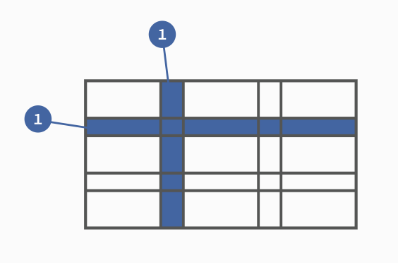

# 盒模型

页面渲染时，DOM 元素采用的布局模型。可通过 `box-sizing` 进行设置。

根据计算宽高的区域可分为：

- `content-box` (W3C 标准盒模型)
- `border-box` (IE 盒模型)
- `padding-box` (FireFox 曾经支持)
- `margin-box` (浏览器未实现)

> Tips: 理论上是有上面 4 种盒子，但现在 w3c 与 mdn 规范中均只支持 `content-box` 与 `border-box`；


# BFC

**块级格式化上下文**，是一个独立的渲染区域，让处于 BFC 内部的元素与外部的元素相互隔离，使内外元素的定位不会相互影响。

> IE下为 Layout，可通过 zoom:1 触发

## 触发条件

- 根元素（或其他包含它的元素）
- 浮动元素（元素的 `float != none`）
- 绝对定位元素（元素具有 `position = absolute/fixed`）
- 内联块（元素具有 `display: inline-block`）
- 表格单元格（元素具有 `display: table-cell`，HTML 表格单元格默认属性）
- 表格标题（元素具有 `display: table-caption`，HTML 表格标题默认属性）
- 具有 `overflow` 且值不是 `visible` 的块元素
- 弹性盒子（`flex` 或 `inline-flex`）
- `display: flow-root`
- `column-span: all`

## 规则

- 属于同一个 BFC 的两个相邻 Box 垂直排列
- 属于同一个 BFC 的两个相邻 Box 的 margin 会发生重叠
- BFC 中子元素的 margin box 的左边， 与包含块 (BFC) border box的左边相接触 (子元素 absolute 除外)
- BFC 的区域不会与 float 的元素区域重叠
- 计算 BFC 的高度时，浮动子元素也参与计算
- 文字层不会被浮动层覆盖，环绕于周围

## 应用

- 阻止`margin`重叠
- 可以包含浮动元素 —— 清除内部浮动(清除浮动的原理是两个`div`都位于同一个 BFC 区域之中)
- 自适应两栏布局
- 可以阻止元素被浮动元素覆盖

# 层叠上下文

元素提升为一个比较特殊的图层，在三维空间中 **(z轴)** 高出普通元素一等。

## 触发条件

- 根层叠上下文(`html`)
- `position`不等于 `static`,并且设置了 z-index
- CSS3 属性
  - `flex`
  - `transform` 不是 `none`
  - `opacity` 不是 1
  - `filter` 不是 `none`
  - `isolation` 不是 `isolate`
  - `will-change` 指定的属性值为上面任何一个
  - `-webkit-overflow-scrolling`

## 层叠等级

层叠上下文在 z 轴上的排序

- 在同一层叠上下文中，层叠等级才有意义
- `z-index`的优先级最高


# 居中布局

## 水平居中

- 行内元素: `text-align: center`
- 块级元素: `margin: 0 auto`
- `absolute + transform`
- `flex + justify-content: center`

## 垂直居中

- `line-height: height`
- `absolute + transform`
- `flex + align-items: center`
- `table`

## 水平垂直居中

- `absolute + transform`
- `flex + justify-content + align-items`

# 选择器优先级

- `!important` > 行内样式 > `#id` > `.class` > `tag` > * > 继承 > 默认
- 选择器 **从右往左** 解析

## 伪类和伪元素


# 清除浮动

> 去除浮动影响，防止父级高度塌陷

- 通过增加尾元素清除浮动
  - `:after / <br> : clear: both`
- 创建父级 BFC
- 父级设置高度

# flex

## 实现九宫格

## flex-shrink 计算规则

## flex-grow 规则

# 等比宽高

# 单位

px

rem

em

vm

%

# rem 适配方案

# position 取值

# 行内元素、块元素

# 媒体查询

# CSS Modules

出现背景：解决全局样式覆盖以及想要不被覆盖时的选择器过深问题

定义：CSS Module是一个CSS文件，所有类名和动画名称默认都在本地范围内。

功能很单纯，只加入了局部作用域和模块依赖，这恰恰是网页组件最急需的功能。


具体表现


注意`meow`类如何重命名为`cat_meow_j3xk`（全局唯一，不会覆盖）。让我们中断一下：

- `cat`：文件名
- `meow`：本地类名
- `j3xk`：随机的hash值


具体示例：


要使用CSS Module，你可以将CSS添加到Web页面，并将JavaScript对象导入到组件中。让我们把它加到图中：


## 1. 局部作用域

CSS的规则都是全局的，任何一个组件的样式规则，都对整个页面有效。

产生局部作用域的唯一方法，就是使用一个独一无二的`class`的名字，不会与其他选择器重名。这就是 CSS Modules 的做法。

调用`import styles from './Cat.css'`，将样式文件输出到 styles 对象，然后引用`styles.meow`代表一个 `class`。

React组件在一个`div`中设置了`styles.meow`，你可以看到示例中的文本变成了`orange`颜色。

```react
// Cat.css 
.meow { 
  color: orange; 
} 

// 编译后生成的CSS 
.Cat_meow_j3xk { 
  color: orange; 
} 

// Cat.js 
import React from 'react'; 
import styles from './Cat.css'; 
class Cat extends React.Component { 
  render() { 
    return ( 
      <div className={styles.meow}>Orange Cat</div> 
    ) 
  } 
} 
export default Cat; 

// 编译出来的JavaScript 
{ 
  meow: 'Cat_meow_j3xk' 
}

// 构建工具将类名 style.memo 编译成一个哈希字符串
<div class="Cat_meow_j3xk">Orange Cat</div>
```

这样一来，这个类名就变成独一无二了，只对`Cat`组件有效`。

## 2. 全局作用域

CSS Modules 允许使用`:global(.className)`的语法，声明一个全局规则。凡是这样声明的`class`，都不会被编译成哈希字符串。

[`App.css`](https://github.com/ruanyf/css-modules-demos/blob/master/demo02/components/App.css)加入一个全局`class`。

```css
.title {
  color: red;
}

:global(.title) {
  color: green;
}
```

[`App.js`](https://github.com/ruanyf/css-modules-demos/blob/master/demo02/components/App.css)使用普通的`class`的写法，就会引用全局`class`。

```javascript
import React from 'react';
import styles from './App.css';

export default () => {
  return (
    <h1 className="title">
      Hello World
    </h1>
  );
};
```

CSS Modules 还提供一种显式的局部作用域语法`:local(.className)`，等同于`.className`，所以上面的`App.css`也可以写成下面这样。

```css
:local(.title) {
  color: red;
}

:global(.title) {
  color: green;
}
```

## 3. 定制哈希类名

`css-loader`默认的哈希算法是`[hash:base64]`，这会将`.title`编译成`._3zyde4l1yATCOkgn-DBWEL`这样的字符串。

[`webpack.config.js`](https://github.com/ruanyf/css-modules-demos/blob/master/demo03/webpack.config.js)里面可以定制哈希字符串的格式。

```javascript
module: {
  loaders: [
    // ...
    {
      test: /\.css$/,
      loader: "style-loader!css-loader?modules&localIdentName=[path][name]---[local]---[hash:base64:5]"
    },
  ]
}
```

会[发现](http://ruanyf.github.io/css-modules-demos/demo03/)`.title`被编译成了`demo03-components-App---title---GpMto`。

## 4. Class 的组合

在 CSS Modules 中，一个选择器可以继承另一个选择器的规则，这称为"组合"（["composition"](https://github.com/css-modules/css-modules#composition)）。

在[`App.css`](https://github.com/ruanyf/css-modules-demos/blob/master/demo04/components/App.css)中，让`.title`继承`.className` 。

```css
.className {
  background-color: blue;
}

.title {
  composes: className;
  color: red;
}
```

[`App.js`](https://github.com/ruanyf/css-modules-demos/blob/master/demo04/components/App.js)不用修改。

```javascript
import React from 'react';
import style from './App.css';

export default () => {
  return (
    // 由于 title 继承了 className 的规则
    // className 也会被编译为 hash 串
    <h1 className={style.title}>
      Hello World
    </h1>
  );
};
```

`App.css`编译成下面的代码。

```css
._2DHwuiHWMnKTOYG45T0x34 {
  color: red;
}

._10B-buq6_BEOTOl9urIjf8 {
  background-color: blue;
}
```

相应地， `h1`的`class`也会编译成`<h1 class="_2DHwuiHWMnKTOYG45T0x34 _10B-buq6_BEOTOl9urIjf8">`。

## 5. 输入其他模块

选择器也可以继承其他CSS文件里面的规则。

[`another.css`](https://github.com/ruanyf/css-modules-demos/blob/master/demo05/components/another.css)

```css
.className {
  background-color: blue;
}
```

[`App.css`](https://github.com/ruanyf/css-modules-demos/blob/master/demo05/components/App.css)可以继承`another.css`里面的规则。

```css
.title {
  composes: className from './another.css';
  color: red;
}
```

## 6. 输入变量

CSS Modules 支持使用变量，不过需要安装 PostCSS 和 [postcss-modules-values](https://github.com/css-modules/postcss-modules-values)。

```bash
$ npm install --save postcss-loader postcss-modules-values
```

把`postcss-loader`加入[`webpack.config.js`](https://github.com/ruanyf/css-modules-demos/blob/master/demo06/webpack.config.js)。

```javascript
var values = require('postcss-modules-values');

module.exports = {
  entry: __dirname + '/index.js',
  output: {
    publicPath: '/',
    filename: './bundle.js'
  },
  module: {
    loaders: [
      {
        test: /\.jsx?$/,
        exclude: /node_modules/,
        loader: 'babel',
        query: {
          presets: ['es2015', 'stage-0', 'react']
        }
      },
      {
        test: /\.css$/,
        loader: "style-loader!css-loader?modules!postcss-loader"
      },
    ]
  },
  postcss: [
    values
  ]
};
```

接着，在[`colors.css`](https://github.com/ruanyf/css-modules-demos/blob/master/demo06/components/colors.css)里面定义变量。

```css
@value blue: #0c77f8;
@value red: #ff0000;
@value green: #aaf200;
```

[`App.css`](https://github.com/ruanyf/css-modules-demos/tree/master/demo06/components)可以引用这些变量。

```css
@value colors: "./colors.css";
@value blue, red, green from colors;

.title {
  color: red;
  background-color: blue;
}
```


参考： http://www.ruanyifeng.com/blog/2016/06/css_modules.html

# Grid 网格布局

Grid 布局与 [Flex 布局](http://www.ruanyifeng.com/blog/2015/07/flex-grammar.html)有一定的相似性，都可以指定容器内部多个项目的位置。但是，它们也存在重大区别。

Flex 布局是轴线布局，只能指定"项目"针对轴线的位置，可以看作是**一维布局**。Grid 布局则是将容器划分成"行"和"列"，产生单元格，然后指定"项目所在"的单元格，可以看作是**二维布局**。Grid 布局远比 Flex 布局强大。

## 基本概念

### 容器和项目

采用网格布局的区域，称为"容器"（container）。容器内部采用网格定位的子元素，称为"项目"（item）。

```html
<div>
  <div><p>1</p></div>
  <div><p>2</p></div>
  <div><p>3</p></div>
</div>
```

上面代码中，最外层的`<div>`元素就是容器，内层的三个`<div>`元素就是项目。

注意：**项目只能是容器的顶层子元素**，不包含项目的子元素，比如上面代码的`<p>`元素就不是项目。Grid 布局只对项目生效。

### 行和列

容器里面的水平区域称为"行"（row），垂直区域称为"列"（column）。



上图中，水平的深色区域就是"行"，垂直的深色区域就是"列"。

### 单元格

行和列的交叉区域，称为"单元格"（cell）。

正常情况下，`n`行和`m`列会产生`n x m`个单元格。比如，3行3列会产生9个单元格。

### 网格线

划分网格的线，称为"网格线"（grid line）。水平网格线划分出行，垂直网格线划分出列。

正常情况下，`n`行有`n + 1`根水平网格线，`m`列有`m + 1`根垂直网格线，比如三行就有四根水平网格线。


上图是一个 4 x 4 的网格，共有5根水平网格线和5根垂直网格线。

> Grid 布局的属性分成两类。一类定义在容器上面，称为容器属性；另一类定义在项目上面，称为项目属性。这部分先介绍容器属性。

## 容器属性

### display 属性

`display: grid`指定一个容器采用网格布局。

```css
div {
  display: grid;
}
```


上图是`display: grid`的[效果](https://jsbin.com/guvivum/edit?html,css,output)。

示例代码：

```html
<!DOCTYPE html>
<html>

<head>
    <meta charset="utf-8">
    <meta name="viewport" content="width=device-width">
    <title>JS Bin</title>
    <style>
        span {
            font-size: 2em;
        }
        #container {
            display: grid;
            /* grid-template-columns属性定义每一列的列宽，grid-template-rows属性定义每一行的行高。 */
            grid-template-columns: 50px 50px 50px;
            grid-template-rows: 50px 50px 50px;
            /* 或者使用百分比 */
            /* grid-template-columns: 33.33% 33.33% 33.33%;
            grid-template-rows: 33.33% 33.33% 33.33%; */
        }
        .item {
            font-size: 2em;
            text-align: center;
            border: 1px solid #e5e4e9;
        }
        .item-1 {
            background-color: #ef342a;
        }
        .item-2 {
            background-color: #f68f26;
        }
        .item-3 {
            background-color: #4ba946;
        }
        .item-4 {
            background-color: #0376c2;
        }
        .item-5 {
            background-color: #c077af;
        }
        .item-6 {
            background-color: #f8d29d;
        }
        .item-7 {
            background-color: #b5a87f;
        }
        .item-8 {
            background-color: #d0e4a9;
        }
        .item-9 {
            background-color: #4dc7ec;
        }
    </style>
</head>

<body>
    <span>foo</span>
    <div id="container">
        <div class="item item-1">1</div>
        <div class="item item-2">2</div>
        <div class="item item-3">3</div>
        <div class="item item-4">4</div>
        <div class="item item-5">5</div>
        <div class="item item-6">6</div>
        <div class="item item-7">7</div>
        <div class="item item-8">8</div>
        <div class="item item-9">9</div>
    </div>
    <span>bar</span>
</body>

</html>
```

默认情况下，容器元素都是块级元素，但也可以设成行内元素。

```css
div {
  display: inline-grid;
}
```

上面代码指定`div`是一个行内元素，该元素内部采用网格布局。


上图是`display: inline-grid`的[效果](https://jsbin.com/qatitav/edit?html,css,output)。

> 注意，设为网格布局以后，容器子元素（项目）的`float`、`display: inline-block`、`display: table-cell`、`vertical-align`和`column-*`等设置都将失效。

### grid-template-columns 属性， grid-template-rows 属性

### grid-row-gap 属性， grid-column-gap 属性， grid-gap 属性

### grid-template-areas 属性

### grid-auto-flow 属性

### justify-items 属性， align-items 属性， place-items 属性

### justify-content 属性， align-content 属性， place-content 属性

### grid-auto-columns 属性， grid-auto-rows 属性

### grid-template 属性， grid 属性

## 项目属性


参考： http://www.ruanyifeng.com/blog/2019/03/grid-layout-tutorial.html

# 使用 CSS 画一个三角形

先编写一个空元素

```html
<div class="triangle"></div>
```

然后，将它四个边框中的三个边框设为透明，剩下一个设为可见，就可以生成三角形效果：

```css
.triangle {
　　　　border-color: transparent transparent green transparent;
　　　　border-style: solid;
       /* 第一个为 0 是为了除去上面的边框，防止占据空间 */
　　　　border-width: 0px 300px 300px 300px;
　　　　height: 0px;
　　　　width: 0px;
　　}
```

元素的边框是三角形组成的，将内容宽高均设置为 0，则元素仅剩边框。再将上、右、左的边框均设置为透明色，仅留下最下面的边框即为三角形。

# CSS 选择器

1. `!important`
2. 内联样式（1000）
3. ID 选择器（0100）
4. 类选择器 / 属性选择器 / 伪类选择器（0010）
5. 元素选择器 / 关系选择器 / 伪元素选择器（0001）
6. 通配选择器（0000）

## CSS

### 基本选择器

| 序号 | 选择器      | 含义                                           |
| ---- | ----------- | ---------------------------------------------- |
| 1.   | *****       | 通用元素选择器，匹配任何元素                   |
| 2.   | **E**       | 标签选择器，匹配所有使用E标签的元素            |
| 3.   | **.info**   | class选择器，匹配所有class属性中包含info的元素 |
| 4.   | **#footer** | id选择器，匹配所有id属性等于footer的元素       |

### 多元素的组合选择器

| 序号 | 选择器 | 含义                                                         |
| ---- | ------ | ------------------------------------------------------------ |
| 5.   | E,F    | 多元素选择器，同时匹配所有E元素或F元素，E和F之间用逗号分隔   |
| 6.   | E F    | **后代元素**选择器，匹配所有属于E元素后代的F元素，E和F之间用空格分隔 |
| 7.   | E > F  | **子元素**选择器，匹配所有E元素的子元素F                     |
| 8.   | E + F  | 毗邻元素选择器，匹配所有**紧随**E元素之后的同级元素F         |

## CSS 2.1

### 属性选择器

| 序号 | 选择器       | 含义                                                         |
| ---- | ------------ | ------------------------------------------------------------ |
| 9.   | E[att]       | 匹配所有具有att属性的E元素，不考虑它的值。（注意：E在此处可以省略，比如"[cheacked]"。以下同。） |
| 10.  | E[att=val]   | 匹配所有att属性等于"val"的E元素                              |
| 11.  | E[att~=val]  | 匹配所有att属性具有多个空格分隔的值、其中一个值等于"val"的E元素 |
| 12.  | E[att\|=val] | 匹配所有att属性具有多个连字号分隔（hyphen-separated）的值、其中一个值以"val"开头的E元素，主要用于lang属性，比如"en"、"en-us"、"en-gb"等等 |

### 伪类

主要是设置元素不同状态时的效果

| 序号 | 选择器        | 含义                                    |
| ---- | ------------- | --------------------------------------- |
| 13.  | E:first-child | 匹配父元素的第一个子元素                |
| 14.  | E:link        | 匹配所有未被点击的链接                  |
| 15.  | E:visited     | 匹配所有已被点击的链接                  |
| 16.  | E:active      | 匹配鼠标已经其上按下、还没有释放的E元素 |
| 17.  | E:hover       | 匹配鼠标悬停其上的E元素                 |
| 18.  | E:focus       | 匹配获得当前焦点的E元素                 |
| 19.  | E:lang(c)     | 匹配lang属性等于c的E元素                |

> link的四种状态，需要按照下面的前后顺序进行设置：
>
> ```css
> a:link
> a:visited
> a:hover
> a:active
> ```

### 伪元素

主要是设置元素包含内容以及前后位置的效果

| 序号 | 选择器         | 含义                      |
| ---- | -------------- | ------------------------- |
| 20.  | E:first-line   | 匹配E元素的第一行         |
| 21.  | E:first-letter | 匹配E元素的第一个字母     |
| 22.  | E:before       | 在E元素之前插入生成的内容 |
| 23.  | E:after        | 在E元素之后插入生成的内容 |

## CSS3 

### 同级元素通用选择器

| 序号 | 选择器 | 含义                                         |
| ---- | ------ | -------------------------------------------- |
| 24.  | E ~ F  | 匹配任何在E元素之后的同级F元素（不要求紧随） |

### 属性选择器

| 序号 | 选择器        | 含义                                                         |
| ---- | ------------- | ------------------------------------------------------------ |
| 25.  | E[att^="val"] | 属性att的值以"val"开头的元素                                 |
| 26.  | E[att$="val"] | 属性att的值以"val"结尾的元素                                 |
| 27.  | E[att*="val"] | 属性att的值包含"val"字符串的元素（只要包含，不要求完全相等） |

### 与用户界面有关的伪类

| 序号 | 选择器       | 含义                                                      |
| ---- | ------------ | --------------------------------------------------------- |
| 28.  | E:enabled    | 匹配表单中激活的元素                                      |
| 29.  | E:disabled   | 匹配表单中禁用的元素                                      |
| 30.  | E:checked    | 匹配表单中被选中的radio（单选框）或checkbox（复选框）元素 |
| 31.  | E::selection | 匹配用户当前选中的元素                                    |

### 结构性伪类

| 序号 | 选择器                | 含义                                                         |
| ---- | --------------------- | ------------------------------------------------------------ |
| 32.  | E:root                | 匹配文档的根元素，对于HTML文档，就是HTML元素                 |
| 33.  | E:nth-child(n)        | 匹配其父元素的第n个子元素，第一个编号为1                     |
| 34.  | E:nth-last-child(n)   | 匹配其父元素的倒数第n个子元素，第一个编号为1                 |
| 35.  | E:nth-of-type(n)      | 与:nth-child()作用类似，但是仅匹配使用同种标签的元素         |
| 36.  | E:nth-last-of-type(n) | 与:nth-last-child() 作用类似，但是仅匹配使用同种标签的元素   |
| 37.  | E:last-child          | 匹配父元素的最后一个子元素，等同于:nth-last-child(1)         |
| 38.  | E:first-of-type       | 匹配父元素下使用同种标签的第一个子元素，等同于:nth-of-type(1) |
| 39.  | E:last-of-type        | 匹配父元素下使用同种标签的最后一个子元素，等同于:nth-last-of-type(1) |
| 40.  | E:only-child          | 匹配父元素下仅有的一个子元素，等同于:first-child:last-child或 :nth-child(1):nth-last-child(1) |
| 41.  | E:only-of-type        | 匹配父元素下使用同种标签的唯一一个子元素，等同于:first-of-type:last-of-type或 :nth-of-type(1):nth-last-of-type(1) |
| 42.  | E:empty               | 匹配一个不包含任何子元素的元素，注意，文本节点也被看作子元素 |

### 反选伪类

| 序号 | 选择器   | 含义                           |
| ---- | -------- | ------------------------------ |
| 43.  | E:not(s) | 匹配不符合当前选择器的任何元素 |

### :target 伪类

| 序号 | 选择器   | 含义                           |
| ---- | -------- | ------------------------------ |
| 44.  | E:target | 匹配文档中特定"id"点击后的效果 |

参考：https://ruanyifeng.com/blog/2009/03/css_selectors.html

# CSS3 特性

# link 与 @import 的区别

|              | link                                    | @import                                          |
| ------------ | --------------------------------------- | ------------------------------------------------ |
| 语法类型     | html                                    | CSS                                              |
| 兼容问题     | 无                                      | @import 是 css2.1 加入的语法，只有 IE5+ 才可识别 |
| 加载方式     | 浏览器**加载页面时**同步加载 CSS        | 浏览器**页面加载完成后**再加载@import的CSS       |
| 优先级       | 高                                      | 低                                               |
| 功能         | 功能较多，可以定义 RSS，定义 Rel 等作用 | 只能用于加载 CSS                                 |
| 使用 JS 引入 | 可以                                    | 不可以                                           |

# CSS 预处理器(Sass/Less/Postcss)

原理: 

将类 CSS 语言通过 **Webpack 编译** 转成浏览器可读的真正 CSS。在这层编译之上，便可以赋予 CSS 更多更强大的功能，常用功能:

- 嵌套
- 变量
- 循环语句
- 条件语句
- 自动前缀
- 单位转换
- mixin复用

面试中一般不会重点考察该点，一般介绍下自己在实战项目中的经验即可~

# CSS 动画

## `transition`: 过渡动画

- `transition-property`: 属性
- `transition-duration`: 间隔
- `transition-timing-function`: 曲线
- `transition-delay`: 延迟
- 常用钩子: `transitionend`

## `animation / keyframes`

- `animation-name`: 动画名称，对应`@keyframes`

- `animation-duration`: 间隔

- `animation-timing-function`: 曲线

- `animation-delay`: 延迟

- ```
  animation-iteration-count
  ```

  : 次数

  - `infinite`: 循环动画

- ```
  animation-direction
  ```

  : 方向

  - `alternate`: 反向播放

- ```
  animation-fill-mode
  ```

  : 静止模式

  - `forwards`: 停止时，保留最后一帧
  - `backwards`: 停止时，回到第一帧
  - `both`: 同时运用 `forwards / backwards`

- 常用钩子: `animationend`

## 动画属性

尽量使用动画属性进行动画，能拥有较好的性能表现

- `translate`
- `scale`
- `rotate`
- `skew`
- `opacity`
- `color`

# 经验

通常，CSS 并不是重点的考察领域，但这其实是由于现在国内业界对 CSS 的专注不够导致的，真正精通并专注于 CSS 的团队和人才并不多。因此如果能在 CSS 领域有自己的见解和经验，反而会为相当的加分和脱颖而出。


