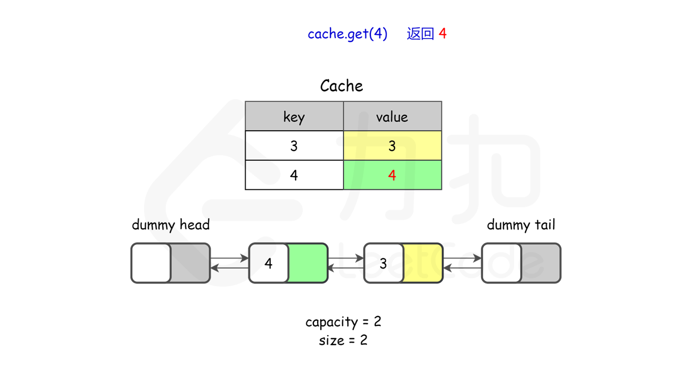

# 手写代码

## 算法

### 二分查找

有序数组查找第一个大于等于目标值的元素下标(位置从1开始)

```javascript
/**
 * 二分查找
 * @param n int整型 数组长度
 * @param v int整型 查找值
 * @param a int整型一维数组 有序数组
 * @return int整型
 */
function upper_bound_( n ,  v ,  a ) {
    // 不存在目标元素
    if(v>a[n-1]) return n+1;
    let left = 0, right = n -1, mid;
    // 最后只有一个值符合条件
    // 注意修改二分查找的细微判断条件
    while(left < right){
        mid = left + Math.floor((right - left)/2);
        if(a[mid] < v){
            left = mid+ 1;
        }else if(a[mid] >= v){
            right = mid;
        }
    }
    return left+1;
}
module.exports = {
    upper_bound_ : upper_bound_
};
```

最长无重复子串

```javascript
// 找到左右长度， 然后取最长
function maxLength( arr ) {
    // write code here
    let n = arr.length;
    let set = new Set() // 存储左右指针之间的不同元素集合
    let right = 0;
    let maxL = 0;
    for(let i = 0;i<n;i++){
        while(!set.has(arr[right])){
            set.add(arr[right])
            right++;
        }
        maxL = Math.max(maxL, set.size)
        set.delete(arr[i])
    }
    return maxL
}
```


### 两数之和

```javascript
// 答案唯一, 返回元素下标
function anwser (arr, target) {
  let map = {}
  for (let i = 0; i < arr.length; i++) {
    map[arr[i]] = i
  }
  for (let i = 0; i < arr.length; i++) {
    var d = target - arr[i]
    if (map[d]) return [i, map[d]];
  }
  return false;
}
```

数组扁平化/去重/排序

```javascript
Array.from(new Set(arr.flat(Infinity))).sort((a,b)=> a-b )
```


### 移动零

```javascript
function zeroMove (arr) {
  let n = arr.length;
  let j = 0;
  for (let i = 0; i < n - j; i++) {
    if (arr[i] == 0) {
      arr.push(0);
      arr.splice(i, 1);
      i--;
      j++;
    }
  }
  return arr;
}
```


### 二叉树

### LRU



### 排序及时间复杂度

深度广度优先遍历

```javascript
//1.深度优先遍历的递归写法 
function deepTraversal (node) {
  let nodes = []
  if (node != null) {
    nodes.push[node]
    let childrens = node.children
    for (let i = 0; i < childrens.length; i++)
      deepTraversal(childrens[i])
  }
  return nodes
}
//2.深度优先遍历的非递归写法 
function deepTraversal (node) {
  let nodes = []
  if (node != null) {
    let stack = [] //同来存放将来要访问的节点 
    stack.push(node)
    while (stack.length != 0) {
      let item = stack.pop()
      //正在访问的节点 nodes.push(item) 
      let childrens = item.children
      for (let i = childrens.length - 1; i >= 0; i--)
        //将现在访问点的节点的子节点存入 stack，供将来访问 
        stack.push(childrens[i])
    }
  }
  return nodes
}
//3.广度优先遍历的递归写法 
function wideTraversal (node) {
  let nodes = [], i = 0
  if (node != null) {
    nodes.push(node)
    wideTraversal(node.nextElementSibling)
    node = nodes[i++]
    wideTraversal(node.firstElementChild)
  }
  return nodes
}
//4.广度优先遍历的非递归写法 
function wideTraversal (node) {
  let nodes = [], i = 0
  while (node != null) {
    nodes.push(node)
    node = nodes[i++]
    let childrens = node.children
    for (let i = 0; i < childrens.length; i++) {
      nodes.push(childrens[i])
    }
  }
  return nodes
}
```

## 继承相关（es5/es6）

### new

` new Fn(...arguments)`

1. 创建一个空对象
2. 让空对象的 `__proto__` （IE 没有该属性）成员指向构造函数的 prototype 成员对象
3. 使用 apply 调用构造函数，属性和方法被添加到 this 引用的对象中
4. 如果构造函数中没有返回其他对象，那么返回 this，即创建的这个新对象；否则返回构造函数返回的对象

```javascript
function New(fn, ...args) {
  const obj = Object.create(fn.prototype);
  const result = fn.apply(obj, args);
  if (result && (typeof result === "object" || typeof result === "function"))
    return result;
  return obj;
}
```

### instanceof

```javascript
function _instanceof(left, right) {
  var prototype = right.prototype;
  var proto = left.__proto__;

  while (true) {
    if (proto === null) return false;
    if (proto === prototype) return true;
    proto = proto.__proto__;
  }
}
```

### extends

js 的完美继承是寄生组合继承

```javascript
function Parent(name) {
  this.name = name;
  this.sayName = function () {
    console.log(this.name);
  };
}

Parent.prototype.age = 50;
Parent.prototype.sayAge = function () {
  console.log(this.age);
};

function Child(name, parentName) {
  // 这里仅仅具有 Parent 中的属性
  Parent.call(this, parentName);
  this.currentName = name;
  this.sayCurrentName = function () {
    console.log(this.currentName);
  };
}

// 在 Parent 具有 prototype 时, 还需要具有 Parent.prototype 中的属性
// 这里继承 Parent.prototype 中的属性
Child.prototype = Object.create(Parent.prototype); // 通过这一步砍掉了实例属性
Child.prototype.constructor = Child;
```

## 防抖节流

## promise

```javascript
class Promise {
  /**
   * 终值
   * @type {*}
   */
  value = null;
  /**
   * 据因
   * @type {string}
   */
  reason;
  /**
   * 状态
   * @type {"pending"|"fulfilled"|"rejected"}
   */
  state = "pending";
  /**
   * 异步成功回调
   * @type {Function[]}
   */
  onFulfilledCallback = [];
  /**
   * 异步失败回调
   * @type {Function[]}
   */
  onRejectedCallback = [];

  constructor(executor) {
    this.init();
    try {
      executor(this.resolve, this.reject);
    } catch (e) {
      this.reject(e);
    }
  }

  static resolve(value) {
    if (value instanceof Promise) return value;
    return new Promise(function (resolve, reject) {
      if (value && value.then && typeof value.then === "function") {
        setTimeout(function () {
          value.then(resolve, reject);
        });
      } else {
        resolve(value);
      }
    });
  }

  static reject(reason) {
    return new Promise(function (resolve, reject) {
      if (reason && reason.then && typeof reason.then === "function") {
        setTimeout(function () {
          reason.then(resolve, reject);
        });
      } else {
        reject(reason);
      }
    });
  }

  static all(promises) {
    if (!promises || typeof promises[Symbol.iterator] !== "function")
      throw TypeError(
        `${typeof promises} is not iterable (cannot read property Symbol(Symbol.iterator))`
      );
    let index = 0;
    const result = [];
    return new Promise(function (resolve, reject) {
      if (!promises.length) resolve(promises);
      else {
        function processValue(value, i) {
          result[i] = value;
          if (++index === promises.length) {
            resolve(result);
          }
        }

        for (let i = 0; i < promises.length; i++) {
          Promise.resolve(promises[i]).then(
            function (value) {
              processValue(value, i);
            },
            function (reason) {
              reject(reason);
            }
          );
        }
      }
    });
  }

  static race(promises) {
    if (!promises || typeof promises[Symbol.iterator] !== "function")
      throw TypeError(
        `${typeof promises} is not iterable (cannot read property Symbol(Symbol.iterator))`
      );
    return new Promise(function (resolve, reject) {
      if (!promises.length) {
        resolve();
        return;
      }
      for (const promise of promises) {
        Promise.resolve(promise).then(
          function (value) {
            resolve(value);
          },
          function (reason) {
            reject(reason);
          }
        );
      }
    });
  }

  init() {
    this.resolve = this.resolve.bind(this);
    this.reject = this.reject.bind(this);
  }

  /**
   * 成功函数
   * @param value {*}
   */
  resolve(value) {
    if (this.state === "pending") {
      this.state = "fulfilled";
      this.value = value;

      this.onFulfilledCallback.forEach((fn) => {
        fn(this.value);
      });
    }
  }

  /**
   * 失败函数
   * @param reason {string}
   */
  reject(reason) {
    if (this.state === "pending") {
      this.state = "rejected";
      this.reason = reason;

      this.onRejectedCallback.forEach((fn) => {
        fn(this.reason);
      });
    }
  }

  then(onFulfilled, onRejected) {
    onFulfilled =
      typeof onFulfilled === "function"
        ? onFulfilled
        : function (value) {
          return value;
        };
    onRejected =
      typeof onRejected === "function"
        ? onRejected
        : function (reason) {
          throw reason;
        };

    return new Promise((resolve, reject) => {
      if (this.state === "fulfilled") {
        try {
          const result = onFulfilled(this.value);
          resolvePromise(result, resolve, reject);
        } catch (e) {
          reject(e);
        }
      }

      if (this.state === "rejected") {
        try {
          const result = onRejected(this.reason);
          resolvePromise(result, resolve, reject);
        } catch (e) {
          reject(e);
        }
      }

      if (this.state === "pending") {
        this.onFulfilledCallback.push((value) => {
          try {
            const result = onFulfilled(value);
            resolvePromise(result, resolve, reject);
          } catch (e) {
            reject(e);
          }
        });

        this.onRejectedCallback.push((reason) => {
          try {
            const result = onRejected(reason);
            resolvePromise(result, resolve, reject);
          } catch (e) {
            reject(e);
          }
        });
      }
    });
  }

  finally(callback) {
    return this.then(
      () => Promise.resolve(callback()),
      () => Promise.reject(callback())
    );
  }
}

function resolvePromise(promise, resolve, reject) {
  if (promise instanceof Promise) {
    promise.then(resolve, reject);
  } else {
    resolve(promise);
  }
}
```


## 事件绑定/观察者(EventEmitter)

```javascript
class EventEmiter {
    constructor() {
        this.events = {}
    }
    emit(event, ...args) {
        this.events[event].forEach(fn => {
            fn.apply(this, args)
        })
    }
    //  某个事件有很多个监听函数
    on(event, fn) {
        if (this.events[event]) {
            this.events[event].push(fn)
        } else {
            this.events[event] = [fn]
        }
    }
    remove(event) {
        delete this.events[event]
    }
}

const eventHub = new EventEmiter()
eventHub.on('test', data => {
    console.log(data)
})

eventHub.emit('test', 1)
console.log(2)
```

## 深拷贝

乞丐版

```javascript
var someObj = {};
var newObj = JSON.parse(JSON.stringify(someObj));
```

白领版

```javascript
function deepClone(data) {
  if (typeof data === 'object') {
    const result = Array.isArray(data) ? [] : {};
    for (let key in data) {
      if (typeof data[key] === 'object') {
        result[key] = deepClone(data[key]);
      } else {
        result[key] = data[key];
      }
    }
    return result;
  } else {
    return data;
  }
}
```

精英版

```typescript
function deepClone<T>(data: T): T {
  const isObj = (v: any): boolean => Object.prototype.toString.call(v).slice(8, -1) === 'Object'
  
  function _deepClone(val: any) {
    if(Array.isArray(val)) {
      const source = val as any[]
      return source.reduce((res, item) => {
        res.push(_deepClone(item))
        return res
      }, [])
    }
  
    if(isObj(val)) {
      const source = val as object
      return Object.keys(val).reduce((res, key) => {
        res[key] = _deepClone(source[key])
        return res
      }, {})
    }
  
    return val
  }
  
  return _deepClone(data) as T
}
```

## 函数柯里化

```javascript
function curry(fn, args) {
  var length = fn.length;
  args = args || [];
  return function () {
    var newArgs = args.concat(Array.prototype.slice.call(arguments));
    if (newArgs.length < length) {
      return curry.call(this, fn, newArgs);
    } else {
      return fn.apply(this, newArgs);
    }
  };
}
```

## call/apply/bind

call

```javascript
Function.prototype.call2 = function(newObj = window){
  newObj.fn = this;
  let args = [...arguments].slice(1);
  let res = newObj.fn(...args);
  delete newObj.fn;
  return res;
}
```

apply

```javascript
Function.prototype.apply2 = function (newObj = window) {
  newObj.fn = this;
  let res;
  if (arguments[1]) res = newObj.fn(...arguments[1])
  else res = newObj.fn()
  delete newObj.fn;
  return res;
}
```

bind

https://blog.csdn.net/jiaojsun/article/details/93411428

```javascript
// bind 返回的函数可以作为构造函数
// 需要找到目标函数的原型对象
Function.prototype.bind2 = function (newObj = window, ...args1) {
  if (typeof this !== 'function') throw new Error('error')
  let that = this;
  let newFunc = function(...args2){
    that.apply(newObj, [...args1, ...args2])
  }
  newFunc.prototype = Object.create(that.prototype);
  newFunc.prototype.constructor = that;
  
  return newFunc;
  // ----------------
  let args = [...arguments].slice(1);
  return function newFn () {
    if (this instanceof newFn) return new that(...args, ...arguments)
    return that.apply(newObj, args.concat(...arguments))
  }
}
```

