前端技术发展快速,使用很多新语言/新框架可以提高开发效率,但是需要转换成浏览器能够识别的js/html/css,该过程称之为构建.

构建其实是工程化在前端开发的体现,手动处理很繁琐,将一系列流程交给代码完成,自动化执行,解放生产力.

构建主要做的事情有:

- 代码转换：TypeScript 编译成 JavaScript、SCSS 编译成 CSS 等。
- 文件优化：压缩 JavaScript、CSS、HTML 代码，压缩合并图片等。
- 代码分割：提取多个页面的公共代码、提取首屏不需要执行部分的代码让其异步加载。
- 模块合并：在采用模块化的项目里会有很多个模块和文件，需要构建功能把模块分类合并成一个文件。
- 自动刷新：监听本地源代码的变化，自动重新构建、刷新浏览器。
- 代码校验：在代码被提交到仓库前需要校验代码是否符合规范，以及单元测试是否通过。
- 自动发布：更新完代码后，自动构建出线上发布代码并传输给发布系统。

经过多年的发展， Webpack 已经成为构建工具中的首选：

- 大多数团队在开发新项目时会采用紧跟时代的技术，这些技术几乎都会采用“**模块化+新语言+新框架**”，Webpack 可以为这些新项目提供一站式的解决方案；
- Webpack 有良好的生态链和维护团队，能提供良好的开发体验和保证质量；
- Webpack 被全世界的大量 Web 开发者使用和验证，能找到各个层面所需的教程和经验分享。

# webpack

项目内安装webpack

```shell
# npm i -D 是 npm install --save-dev 的简写，是指安装模块并保存到 package.json 的 devDependencies

# 安装最新稳定版
npm i -D webpack

# 安装指定版本
npm i -D webpack@<version>

# 安装最新体验版本
npm i -D webpack@beta
```


执行 webpack 构建命令

```shell
node_modules/.bin/webpack --config webpack.config.js

# 全局安装(建议) webpack-cli 后可以直接使用 webpack 命令
```


Loader 可以看作具有文件转换功能的翻译员，配置里的 `module.rules` 数组配置了一组规则，告诉 Webpack 在遇到哪些文件时使用哪些 Loader 去加载和转换。 如上配置告诉 Webpack 在遇到以 `.css` 结尾的文件时先使用 `css-loader` 读取 CSS 文件，再交给 `style-loader` 把 CSS 内容注入到 JavaScript 里。 在配置 Loader 时需要注意的是：

- `use` 属性的值需要是一个由 Loader 名称组成的数组，Loader 的执行顺序是由后到前的；
- 每一个 Loader 都可以通过 URL querystring 的方式传入参数，例如 `css-loader?minimize` 中的 `minimize` 告诉 `css-loader` 要开启 CSS 压缩。

重新执行 Webpack 构建前要先安装新引入的 Loader.

style-loader

工作原理大概是把 CSS 内容用 JavaScript 里的字符串存储起来， 在网页执行 JavaScript 时通过 DOM 操作动态地往 HTML head 标签里插入 HTML style 标签。


## 	常用的loader

## 	常用的plugin

## 	webpack构建流程

## 	提高webpack效率工具

## 	source map

## 	模块打包原理

## 	文件监听原理

## 	热更新原理

## 	对bundle体积进行监控和分析

## 	文件指纹

## 	如何优化 Webpack 的构建速度

## 	loader如何写

## 	plugin如何写

## 	打包优化

## 	编译优化

## 	webpa如何实现动态导入

## 	webpack的编译阶段

# babel

[Babel](https://babeljs.io/)是一个广泛使用的转码器，可以将ES6代码转为ES5代码，从而在现有环境执行。

​	AST
​	babylon
​	babel-traverse
​	babel-generator
​	babel打包后生成了什么

# 前端性能优化

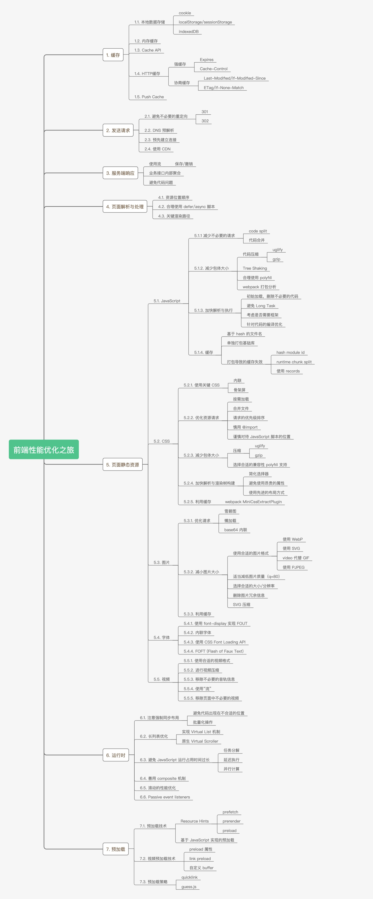


## 前端性能优化指标 RAIL

[参考文章](https://juejin.cn/post/6850037273312886797)

RAIL是一个以用户为中心的性能模型，它把用户的体验拆分成几个关键点（例如，tap，scroll，load），并且帮你定义好了每一个的性能指标。

有以下四个方面：

- Response
- Animation
- Idle
- Load

### Response

目标: 事件处理最好在50ms内完成.

用户的输入到响应的时间不超过100ms，给用户的感受是瞬间就完成了。

**优化方案**

- 事件处理函数在50ms内完成，考虑到idle task的情况，事件会排队，等待时间大概在50ms。适用于click，toggle，starting animations等，不适用于drag和scroll。
- 复杂的js计算尽可能放在后台，如web worker，避免对用户输入造成阻塞
- 超过50ms的响应，一定要提供反馈，比如倒计时，进度百分比等。

> **idle task**：除了要处理输入事件，浏览器还有其它任务要做，这些任务会占用部分时间，一般情况会花费50ms的时间，输入事件的响应则排在其后。

图是idle task对input response的影响：

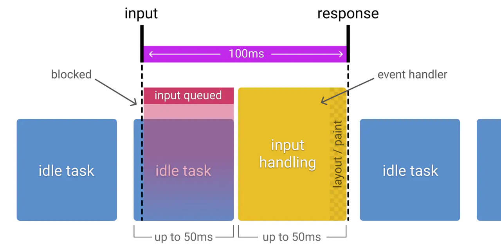

### Animation

**目标**

- 产生每一帧的时间不要超过10ms，为了保证浏览器60帧，每一帧的时间在16ms左右，但浏览器需要用6ms来渲染每一帧。
- 旨在视觉上的平滑。用户对帧率变化感知很敏感。

**优化方案**

- 在一些高压点上，比如动画，不要去挑战cpu，尽可能地少做事，如：取offset，设置style等操作。尽可能地保证60帧的体验。
- 在渲染性能上，针对不同的动画做一些特定优化

> 动画不只是 UI 的视觉效果，以下行为都属于
>
> - 视觉动画，如渐隐渐显，tweens，loading等
> - 滚动，包含弹性滚动，松开手指后，滚动会持续一段距离
> - 拖拽，缩放，经常伴随着用户行为

### Idle

**目标**

- 最大化空闲时间，以增大50ms内响应用户输入的几率

**优化方案**

- 用空闲时间来完成一些延后的工作，如先加载页面可见的部分，然后利用空闲时间加载剩余部分，此处可以使用 [requestIdleCallback API](https://developer.mozilla.org/en-US/docs/Web/API/Window/requestIdleCallback)
- 在空闲时间内执行的任务尽量控制在50ms以内，如果更长的话，会影响input handle的pending时间
- 如果用户在空闲时间任务进行时进行交互，必须以此为最高优先级，并暂停空闲时间的任务

### Load

如果页面加载比较慢，用户的交点可能会离开。加载很快的页面，用户平均停留时间会变长，跳出率会更低，也就有更高的广告查看率

### 目标

- 优化加载速度，可以根据设备、网络等条件。目前，比较好的一个方式是，让你的页面在一个中配的3G网络手机上打开时间不超过5秒
- 对于第二次打开，尽量不超过2秒

### 优化方案

- 在手机设备上测试加载性能，选用中配的3G网络（400kb/s，400ms RTT），可以使用 [WebPageTest](https://www.webpagetest.org/easy) 来测试
- 要注意的是，即使用户的网络是4G，但因为丢包或者网络波动，可能会比预期的更慢
- [禁用渲染阻塞的资源，延后加载](https://web.dev/render-blocking-resources/)
- 可以采用 [lazy load](https://web.dev/native-lazy-loading/)，[code-splitting](https://web.dev/reduce-javascript-payloads-with-code-splitting/) 等 [其他优化](https://web.dev/fast/) 手段，让第一次加载的资源更少

## 前端性能优化手段


## 重排和重绘

## 白屏

[参考文章](https://cloud.tencent.com/developer/article/1508941)

loading 人性化体验

骨架屏 : 客户端骨架屏 + 服务端骨架屏

图片延迟加载

> 根据输入 url 到展示页面的每一步做针对性优化

**DNS 解析优化**

- DNS缓存优化
- DNS预加载策略
- 稳定可靠的DNS服务器

**TCP 网络链路优化**

- 花钱

**服务端处理优化**

- 会涉及到如[Redis](https://cloud.tencent.com/product/crs?from=10680)缓存、数据库存储优化或是系统内的各种中间件以及Gzip压缩等...

**浏览器下载/解析/渲染页面优化**

- 尽可能的精简HTML的代码和结构
- 尽可能的优化CSS文件和结构
- 一定要合理的放置JS代码，尽量不要使用内联的JS代码

## 大量图片加载优化

## 输入url到页面展现

### 1. 过程

4. 客户端下载、解析、渲染显示页面

在服务器返回数据后，客户端浏览器接收数据，进行HTML下载、解析、渲染显示。

- a. 如果是Gzip包，则先解压为HTML
- b. 解析HTML的头部代码，下载头部代码中的样式资源文件或脚本资源文件
- c. 解析HTML代码和样式文件代码，构建HTML的DOM树以及与CSS相关的CSSOM树
- d. 通过遍历DOM树和CSSOM树，浏览器依次计算每个节点的大小、坐标、颜色等样式，构造渲染树
- e. 根据渲染树完成绘制过程

浏览器下载HTML后，首先解析头部代码，进行样式表下载，然后继续向下解析HTML代码，构建DOM树，同时进行样式下载。当DOM树构建完成后，立即开始构造CSSOM树。理想情况下，样式表下载速度够快，DOM树和CSSOM树进入一个并行的过程，当两棵树构建完毕，构建渲染树，然后进行绘制。

Tips:浏览器安全解析策略对解析HTML造成的影响：

- 当解析HTML时遇到内联JS代码，会阻塞DOM树的构建
- 特别悲惨的情况： 当CSS样式文件没有下载完成时，浏览器解析HTML遇到了内联JS代码，此时！！！根据浏览器的安全解析策略，浏览器暂停JS脚本执行，暂停HTML解析。直到CSS文件下载完成，完成CSSOM树构建，重新恢复原来的解析。 一定要合理放置JS代码！！！

### 2. 相关优化

#### 利用缓存

1. 对于静态资源文件实现强缓存和协商缓存（扩展：文件有更新，如何保证及时刷新？）  
2. 对于不经常更新的接口数据采用本地存储做数据缓存（扩展：cookie / localStorage / vuex|redux 区别？）

#### DNS 优化

1. 减少DNS 请求次数

2. 分服务器部署, 提高 HTTP 并发(导致 DNS 解析变慢)

3. DNS 预获取(DNS Prefetch)

   ```html
   <meta http-equiv="x-dns-prefetch-control" content="on">
   <link rel="dns-prefetch" href="//static.360buyimg.com"/>
   <link rel="dns-prefetch" href="//misc.360buyimg.com"/>
   <link rel="dns-prefetch" href="//img10.360buyimg.com"/>
   <link rel="dns-prefetch" href="//d.3.cn"/>
   <link rel="dns-prefetch" href="//d.jd.com"/>
   ```

> 服务器拆分
>
> 1. 资源的合理利用
> 2. 抗压能力加强
> 3. 提高 HTTP 并发

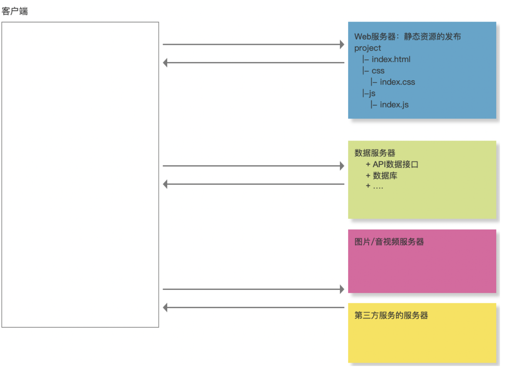

#### TCP 三次握手/四次挥手

使用 Connection:keep-alive

#### 数据传输

1. 减少数据传输大小
   - 内容或者数据压缩(webpack)
   - 服务器端开启 gzip 压缩(60%)
   - 大批量数据分批次请求(例如: 下拉刷新或者分页, 保证首次加载请求数据少)
2. 减少 HTTP 请求的次数
   - 资源文件合并处理
   - 字体图标
   - 雪碧图 CSS-Sprit
   - 图片的 BASE64

#### 采用 CDN

地域分布式

#### 采用 HTTP2.0

#### 网络优化(*)

白屏

#### 页面渲染

1. 标签语义化和避免深层次嵌套

2. CSS 选择器渲染是从右到左

3. 尽早把CSS下载到客户端(HTTP并发机制)

   - style
   - link
   - @import
   - 放到顶部

4. 避免js阻塞加载

   - async
   - defer
   - 放到底部

5. ##### 减少 DOM 回流/重绘

   - 基于 vue/react 改变视图, 避免传统操作 dom

   - 分离读写操作(现代浏览器的渲染队列机制)

     offset/client/scroll ... 等操作会刷新渲染队列

   - 样式集中改变

   - 缓存布局信息

   - 元素批量修改

   - 动画属性应用到 position 属性为 absolute 或 fixed 的元素上(脱离文档流)

   - CSS3 硬件加速(GPU加速)

   - 牺牲平滑度换取速度

   - 避免 table 布局和使用 CSS 的 js 表达式

## 动画性能

## 渲染合成层

# Hybrid

Hybrid App: 原生 APP 嵌入H5页面

js 代码给原生代码发消息

1. 弹窗拦截

   js 发出弹窗, 弹窗会被原生代码所拦截, 不仅可以获得弹窗中的消息, 还可以阻止弹窗弹出

   因此可以借用弹窗让原生获得传递的消息

   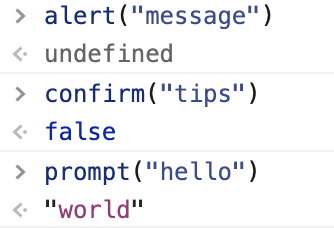 

   - alert

   - confirm: 返回 true/false

   - prompt: 返回字符串结果

     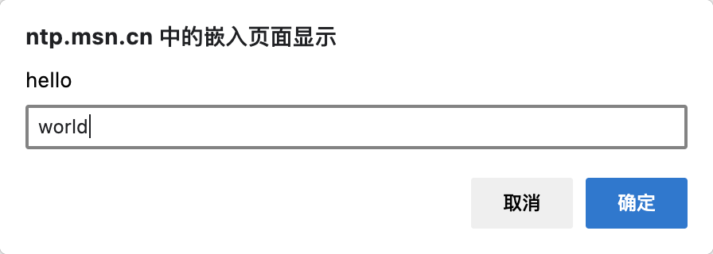

     示例使用:

     在播放视频前查看当前网络情况.

     web 写入消息并发送弹窗, 原生拦截到并输入对应的数据, 之后 web 通过返回值拿到对应的数据.

     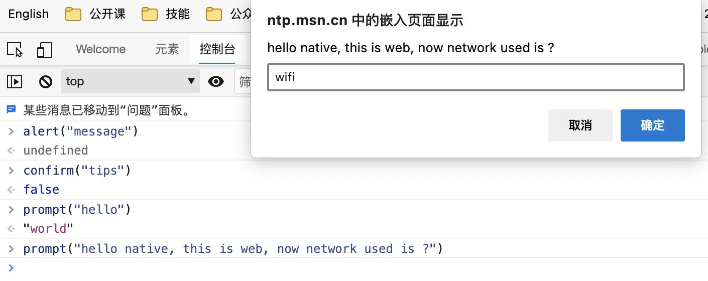

     但是不好的地方是, 这种方式是同步的, 如果原生不写入信息, 页面就会一直是阻塞状态, 如果原生需要做比较多的计算的话, 就会比较耗时.

     改变弹窗写法: `alert("hello native, this is web, now network used is ? please tell me by networkState callback")`

     问题:

     原生如何执行 js 并调用回调函数

     原生代码可以在 web 页面注入 js 语句, 从而调用 js 声明好的回调函数.

     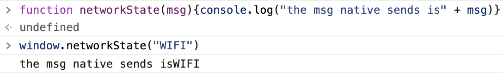

     

2. url 拦截

   使用 `location.href = "https://www.baidu.com"`实现网站的跳转

   url 的请求也可以被原生代码截获

   ```javascript
   location.href="jssdk://getNetworkState?callback=networkState"
   ```

   通过自定义协议以及内容, 让原生读取对应的信息, 协议后是需要做的事情, 即 js 需要获取网络状态, 原生获取网络状态后调用指定的回调 networkState 进行状态的回传.

   现在已经有现成的轮子: jsBridge dsBridge 不用关心实现细节, 只需要注意使用.

​	混合方案
​	交互原理
​	接入方案
​	优化

# 工程化的理解

# 实现一个组件库

# cli

​	cli插件机制

# 模板引擎

# 发布平台

# nginx

# docker

# 微服务

# 项目监控

# PWA

## 定义

PWA（Progressive web apps，渐进式 Web 应用）运用现代的 Web API 以及传统的渐进式增强策略来创建跨平台 Web 应用程序。这些应用无处不在、功能丰富，使其具有与原生应用相同的用户体验优势。 这组文档和指南告诉您有关 PWA 的所有信息。

> 自我总结: 即将网站包装在一个拥有浏览器内核的应用中, 使之拥有与app接近的用户体验优势.

网站的打开次数是 APP 的数倍.

优势: PWA 是可被发现、易安装、可链接、独立于网络、渐进式、可重用、响应性和安全的

打开 web app 方式:

- 浏览器书签/网址收藏
- 浏览器地址栏输入地址
- 搜索引擎
- ...

没有 native 快速, 想要做到点击 icon 就能打开网站. 

M3C 提出了 Web App Manifest 的技术标准. 

使用这个技术可以有以下特性:

- 唯一图标与名称与其他站点区分
- 控制从主屏幕启动时的内容, 避免生硬的过渡
- 隐藏浏览器相关的 UI

达到与 Native App 类似的体验.

Web App Manifest

json 文件, 设置网站的相关信息.

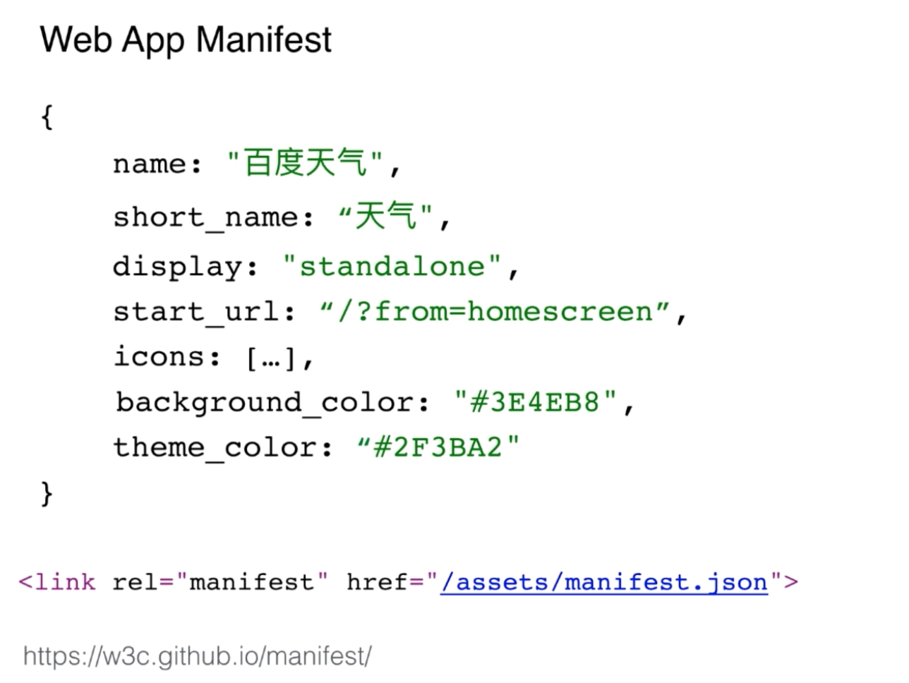

需要一个属性为 minifest 的 link 标签,  引入到网站 html 头部, 就完成 manifest 的部署, 浏览器就可以实现类似 native 的打开效果.


调试 web app manifest

- 在 Chrome 的开发者工具中查看 web app menifest 设置

  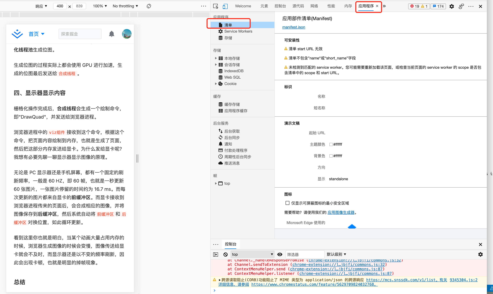

- 某些 ROM 下, 需要到系统中查看浏览器是不是打开添加到桌面快捷方式的权限

- 手机通过 Charles / Fiddler等设置代理, 则可以在手机上查看本地站点

 

实际例子:

将某个网站添加到桌面的效果(没有使用 menifest)

没有使用 menifest 的站点, 添加到主屏后 , 浏览器显示默认图标和名称, 也没有隐藏浏览相关的 UI.

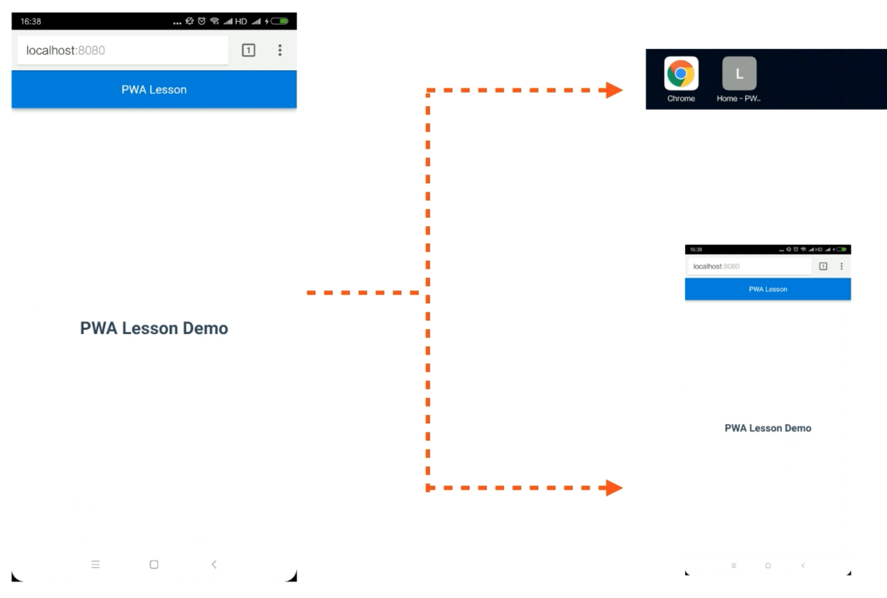

新建 menifest 的 json 文件, 通过 link 标签部署到示例站点的 head 头部中.

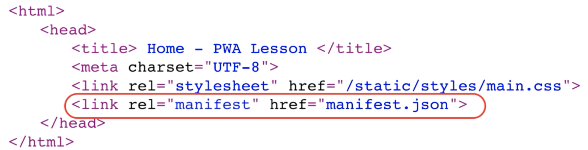

刷新浏览器, 发现部署成功.


添加名称

```json
{
  "name": "PWA Demo Name", // 应用名称, 用于安装横幅提示的名称, 和启动画面中的文字
  "short_name": "PWA Demo", // 应用短名称, 用于主屏幕显示
  "display": "standalone", // 显示类型, 用于启动画面的类型
  // 主要有四种类型(推荐前两种):
  // fullscreen: 网站 应用占满整个屏幕
  // standalone: 浏览器相关 UI (导航栏/工具栏等) 将会被隐藏
  // minimal-ui: 显示形式与 standalone 类似, 不同浏览器在显示效果上略有不同.
  // browser: 与普通网页在浏览器中打开的显示一致
  "start_url": "/", // 用于指定应用打开时的网址
  // 注意:
  // 可以在后面添加参数用于来源统计, 比如: "/?from=homescreen"
  // 如果设置为空, 则默认使用用户打开的当前页面为首屏, 即: ""
  // icons 可以设置一组, 浏览器根据 icon 的 sizes 进行选择
  // 对于桌面图标, 会找到密度匹配并且调整到 48 dp
  // 启动画面, 128 dp
  // 修改该icons,会在用户重新添加到桌面时, 才会更新
  "icons": [{
      "src": "/assets/i/icon-96*96.png",
      "sizes":"96*96",
      "type": "image/png"
    },{
      "src": "/assets/i/icon-144*144.png",
      "sizes":"144*144",
      "type": "image/png"
    },{
      "src": "/assets/i/icon-192*192.png",
      "sizes":"144*144",
      "type": "image/png"
    }
  ],
  "background_color": "#1976d2", // 启动背景色
  "theme_color": "#2F3BA2" // 启动时顶部状态栏颜色
}
```

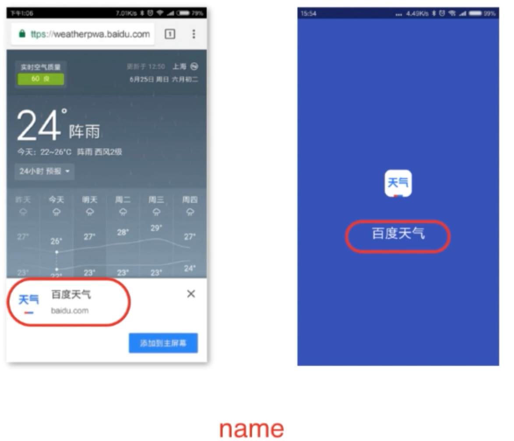


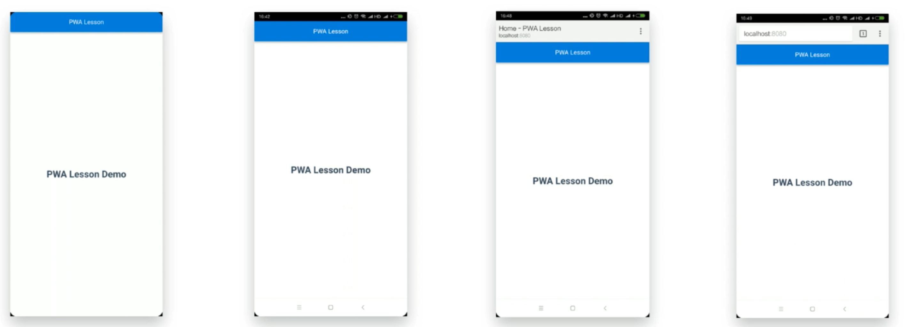

设置 menifist 之后, 有名称和启动画面

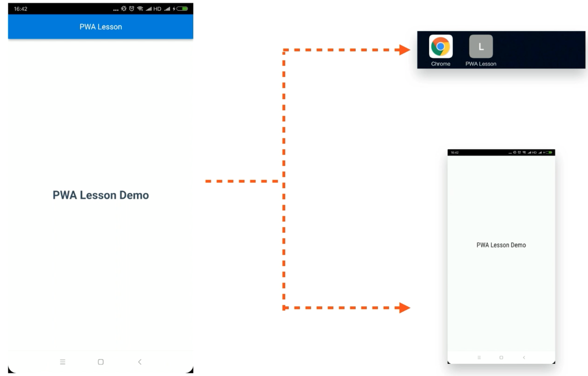

浏览器对于 manifest 的支持度有待提高

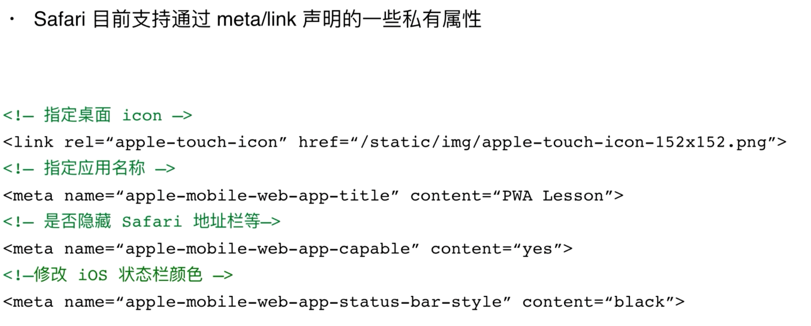

弹出横幅

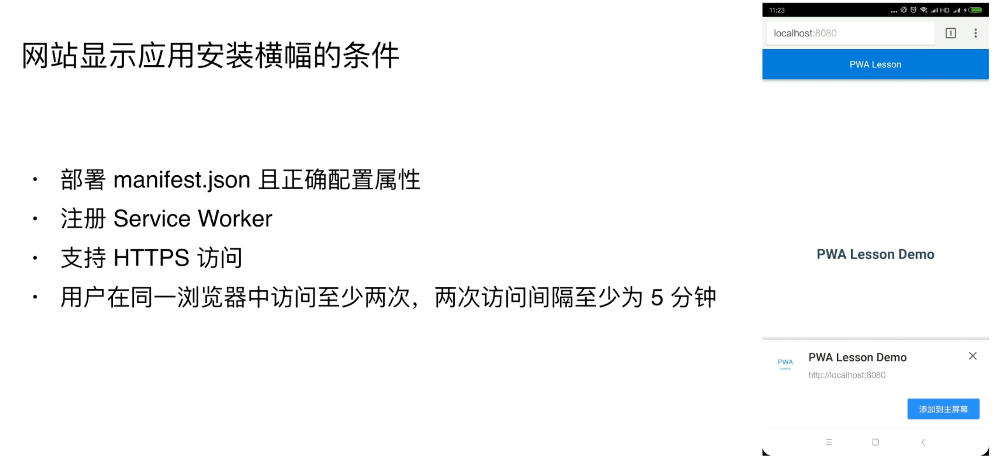

