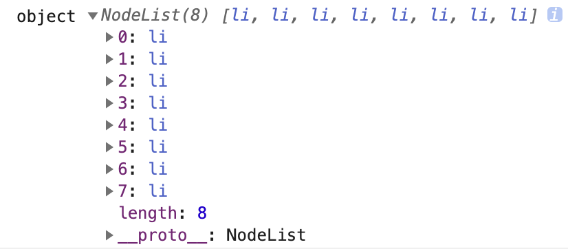

# 0227 面试课

## JS 三类循环对比以及性能分析

### for 循环及 ForEach 底层原理

稀疏数组

有很多方法比如 ForEach 等使用起来有问题

```javascript
new Array(10)
[10,,,40]
```

密集数组

```javascript
[10, 20, 30]
```

使用 var 声明, for 和 while 差不多, 类似于 let 的 while.

使用 let 声明, for 比 while 快, 因为 let 声明不是全局, 是块级, 每一次循环都会释放 i. 而 var/let 声明是全局的, 消耗更大, 但是本质没有区别.

for 循环

明确知道循环多少次.

while 循环

不知道循环多少次, 条件达到即可.

ForEach(fn, thisVal)

比 for 性能差一些, 推荐的原因是看中其函数式编程(更多看中结果, 对过程进行封装, 使用方便, 但是无法管控过程, 性能有所消耗, 多做很多操作). 与之对应的是命令式编程, 看中过程, 对过程掌控更好.

实现 ForEach

```

```

for in 性能最差

迭代当前对象的所有可迭代对象, 私有属性基本上是可迭代, 某些公有属性{出现在原型链上的属性}也可迭代. 因此查找时一定会遍历原型链的所有属性(可或者不可迭代属性).

问题:

- 遍历顺序以数字优先
- 无法遍历 Symbol 属性
  - 查看浏览器是否兼容 Symbol. If(typeof Symbol !== 'undefined') 浏览器支持 Symbol
- 可以遍历到公有中可枚举的
  - 过程是先找私有属性, 再找公有属性. 因此可以当 hasOwnProperty 不满足时, break 循环

Object.keys() 拿到当前对象的非Synbol 私有属性

Object.getOwnPropertySynbols() 拿到当前对象的 Synbol 私有属性

console.dir()/ dir 详细输出一个对象

for of 循环

比 for in 好一点. 按照迭代器规范进行规范.

迭代器: 一种规范, 想迭代当前结构该怎么迭代. 部分数据结构实现了迭代器规范, 所有有 [Symbol.iterator] 属性的数据结构都实现了迭代器规范.

实现的数据结构: 数组/部分类数组(arguments)/Set/Map...[对象没有实现]

#### this

函数执行的主体, 即是谁执行函数的, 谁与函数不一定有关系.

与函数在哪创建的和在哪执行的无关. 不一定方法要在 this 指向的对象上.

```

```

构造函数中的 this 是创建的实例

给当前元素的添加事件, 触发事件后, 调用函数.

```javascript
document.body.addEventListener('click', function(){
  console.log(this);
  // document.body
})
```

箭头函数中 this 是所处上下文的 this

call/apply/bind 显示指定 this

鸭子类型

Array.prototype.slice() 浅拷贝

扫码登录/单点登录

### for in 循环的 BUG 及解决方案

## this 以及应用场景

## 输入 url 到页面呈现发生了什么

## 项目难点以及亮点

# 0228 面试直播课

> 说一下工作中解决过的比较困难的问题(说一下自己项目中比较有两点的地方)

平时学习或者工作中, 最好有记笔记的习惯, 遇到了什么问题, 自己一步一步怎么解决的? 到时候无论是写简历准备面试, 还是碰到类似的问题, 都可以快速查找。学习一定要包含输入和输出.

> 你了解浏览器的事件循环吗？事件循环是什么? 为什么要有事件循环?

**js 单线程原因:**

JavaScript的主要用途是与用户互动以及操作DOM。如果它是多线程的会有很多复杂的问题要处理，比如有两个线程同时操作DOM，一个线程删除了当前的DOM节点，一个线程是要操作当前的DOM阶段，最后以哪个线程的操作为准？为了避免这种，所以JS是单线程的。即使 H5提出了web worker标准，它有很多限制，受主线程控制，是主线程的子线程。

实现非阻塞: 事件循环

**事件循环定义:**

js 是单线程, 采用非阻塞机制, 一些延迟执行的任务被放在任务队列中, 执行完主线程再去执行任务队列整个的循环机制called 事件循环.

### 浏览器事件循环

> 浏览器事件循环的任务? 分别是做什么的? 有哪些?

宏任务 微任务

宏任务(task): setTimeout、setInterval、script（整体代码）、 I/O 操作、UI 渲染等。

微任务(micro-task): Process.nextTick() 、new Promise().then(**回调**)、MutationObserver(html5新特性)等。

> 为什么一定要区分出两种, 只有一种任务不行吗?

⻚面渲染事件，各种IO的完成事件等随时被添加到任务队列中，一直会保持先进先出的原则执行，我们不能准确地控制这些事件被添加到任务队列中的位置。但是这个时候突然有**高优先级的任务需要尽快执行**，那么一种类型的任务就不合适了，所以引入了微任务队列。

> 浏览器中事件循环的具体机制

执行一只task（宏任务）

执行完 micro-task 队列 （微任务）

再执行宏任务队列中的下一个宏任务

如此循环往复下去

### Node 事件循环

> Node中的事件循环阶段

宏任务(task): setTimeout、setInterval、script（整体代码）、 I/O 操作等。

微任务(micro-task): new Promise().then(**回调**)、Process.nextTick()等。

**宏任务 task 的执行顺序**

1. timers 定时器: 本阶段执行已经安排的 setTimeout() 和 setInterval() 的回调函数。
2. pending callback 待定回调: 执行延迟到下一个循环迭代的I/O回调
3. idle, prepare: 仅系统内部使用.
4. poll: 检索新的 I/O 事件;执行与 I/O 相关的回调（几乎所有情况下，除了关闭的回调函数，它们由计时器和 setImmediate() 排定的之外），其余情况 node 将在此处阻塞。
5. check: 执行 setImmediate()回调函数
6. close callback:一些准备关闭的回调函数, 如：socket.on('close', ()=>{})。

> 微任务与宏任务在 node 中的执行顺序(node10及以前, node10 后)

Node 10以前：

1. 执行完一个阶段的所有任务
2. 执行完 nextTick 队列里面的内容
3. 执行完微任务队列的内容

Node 11以后：

和浏览器的行为统一了，都是每执行一个宏任务就执行完微任务队列。

### 看题写答案

```javascript
async function async1 () {
  console.log('async1 start');
  await async2();
  // await 是将描述的函数放进了 promise 里面, 其后面的所有代码都放进了 .then 里面
  console.log('async1 end');
  // 因此上述代码可以理解为:
  /*
  new Promise(()=>{
    async2()
  }).then(()=>{
    console.log('async1 end');
  })
  */
}

async function async2 () {
  console.log('async2');
}

console.log('script start');

setTimeout(() => {
  console.log('setTimeout');
}, 0)

async1();

new Promise((resolve) => {
  console.log('promise1');
  resolve();
}).then(() => {
  console.log('promise2');
})

console.log('script end');
```

输出结果是:

第一个宏任务(脚本): script start/async1 start/async2/promise1/script end

(尝试清空)微任务队列: async1 end/promise2

第二个宏任务(setTimeout):setTimeout

```javascript
console.log('start');

setTimeout(() => {
  console.log('children2');
  // 这个 Promise 状态直接立即是完成
  Promise.resolve().then(() => {
    console.log('children3');
  })
}, 0)

new Promise(function (resolve, reject) {
  console.log('children4');
  // resolve 被 setTimeout 延迟执行
  setTimeout(() => {
    console.log('children5');
    resolve('children6')
  }, 0)
}).then((res ) => {
  console.log('children7');
  setTimeout(() => {
    console.log(res);
  }, 0)
})
```

注意: 只有 resolve 之后, then 中的回调才能放入微任务队列.

第一个宏任务: start/children4

对应产生的微任务队列: 无

第二个宏任务: children2

对应产生的微任务队列: children3

第三个宏任务: children5

对应产生的微任务队列: children7

第四个宏任务: children6

```javascript
const p = function () {
  return new Promise((resolve, reject) => {
    const p1 = new Promise((resolve, reject) => {
      setTimeout(() => {
        resolve(1)
      }, 0)
      resolve(2)
    })
    p1.then((res) => {
      console.log(res);
    })
    console.log(3);
    resolve(4);
  })
}

p().then((res) => {
  console.log(res);
})

console.log('end');
```

p() 执行时, 宏任务可以直接看这里:


第一个宏任务: 将 setTimeout 放进宏任务队列/p1状态改变, p1.then 放进微任务队列/return的promise 状态被改变, 值是4, 对应的 then 放进微任务队列

3/end

微任务队列: 2/4

第二个宏任务: 由于 resolve 已经执行过, 因此再 resolve 不起作用.

没有输出

**变题**

将 resolve(2) 注释后, 输出的结果为: 3/end/4/1

## 事件的捕获和冒泡机制了解

### 概念

捕获: 事件触发传递的方向是, 自顶向下, 从 window 到目标元素

冒泡: 事件触发传递的方向是, 自底向上, 从目标元素到 window

> window.addEventListener 监听的是什么阶段的事件?

根据第三个参数的值确定, 默认 false 冒泡, true 捕获.

```javascript
window.addEventListener('click', ()=>{
  
}, false)
// false 默认冒泡阶段
// true 捕获阶段
```

### 使用场景

#### 需求一

实现一个需求, 点击每个 li 元素时, 弹框显示该元素中的内容.

```html
<body>
  <ul>
    <li>1</li>
    <li>2</li>
    <li>3</li>
    <li>4</li>
    <li>5</li>
    <li>6</li>
    <li>7</li>
    <li>8</li>
  </ul>
</body>
<script text="text/javascript">
  // TO DO
</script>
```

方法一:

获取 li 元素列表, 给每个元素添加监听事件.

```javascript
const lilist = document.getElementsByTagName('li');
console.log(typeof lilist, lilist);
for (let i = 0; i < lilist.length; i++) {
  lilist[i].addEventListener('click', function (e) {
    alert(`内容为 ${e.target.innerHTML}, 索引为${i}`)
  }, false)
}
```

注意: `lilist` 不是数组, 是类数组(对象)


方法二: 使用事件委托

```javascript
// querySelector 方法返回文档中匹配指定 css 选择器的一个元素
// 若要返回所有元素, 使用 querySelectorAll 方法
const ul = document.querySelector('ul');
ul.addEventListener('click', function (e) {
  const target = e.target;
  // 确保点击的是 li 元素, 可能还有其他元素存在
  if (target.tagName.toLowerCase() === 'li') {
    // 这里 this 默认指向绑定事件的元素
    const lilist = this.querySelectorAll('li');
    console.log(typeof lilist, lilist);
    // 获取目标元素的下标
    const index = Array.prototype.indexOf.call(lilist, target);
    alert(`内容为 ${target.innerHTML}, 索引为${index}`)
  }
}, false)
```

注意: lilist 类型是 NodeList



#### 需求二

一个历史⻚面, 上面有若干按钮的点击逻辑, 每个按钮都有自己的click事件。

现在新需求来了, 给每一个访问用户添加了banned这个属性, 如果为true, 则代表此用户被封禁了。被封禁用户不可操作⻚面上的任何内容, 点击⻚面内的任何一处都不可响应原来的函数, 而是 alert 提示您已被封禁 .

思路:

- 事件捕获

  最上层元素监听捕获阶段事件, 捕获事件上拦截, 是 true 的话就拦截

  `banner === true` 或者 `banner === 0`, 业务代码保证可读性, 其他人能知道类型, 或者用 ts 就可以不用

  第三方库可以直接写, 因为注意性能.
- 整个页面添加透明遮罩
- 在每个元素的 click 事件中判断(太繁琐, 元素太多)

```javascript
window.addEventListener('click', function(e){
  if(banned === true){
    e.stopPropagation();
  }
}, true)
```

### 事件捕获冒泡的执行顺序


## 防抖节流

### 基本概念

函数防抖: 当持续触发事件时，一定时间段内没有再触发事件，事件处理函数才会执行一次，如果设定的时间到来之前，又一次触发了事件，就重新开始延时。如下图，持续触发scroll事件时，并不执行handle函数，当1000毫秒内没有触发scroll事件时，才会延时触发scroll事件。 debounce.webp


函数节流: 当持续触发事件时，保证一定时间段内只调用一次事件处理函数。节流通俗解释就比如我们水⻰头放水，阀⻔一打开，水哗哗的往下流，秉着勤俭节约的优良传统美德，我们要把水⻰头关小点，最好是如我们心意按照一定规律在某个时间间隔内一滴一滴的往下滴。如下图，持续触发scroll事件时，并不立即执行handle函数，每隔1000毫秒才会执行 一次handle函数。


### 使用场景

节流: resize scroll

防抖: 例如 input 停止输入后, 1s 内再去检索/调接口之类

### 手写防抖

### 手写节流

#### 时间戳版

第一次立即执行

```javascript
// 因为第一次触发事件时, last = 0, 肯定会 > wait
// 因此是 立即执行
function throttle (fn, wait) {
  let last = 0;
  return function () {
    let now = Date.now();
    if (now - last >= wait) {
      // 需要修改 fn 的 this 指向为 全局对象
      // 而普通函数中, 此时 this 就是全局对象
      fn.call(this, ...arguments)
      last = now;
    }
  }
}

// 使用
function handle () {
  console.log('1');
}

let throttleHandle = throttle(handle, 300);
throttleHandle(1, 2);
throttleHandle();
throttleHandle();
throttleHandle();
throttleHandle();
```

#### 计时器版

第一次不立即执行, 但是最后一次也会延迟执行.

> 注意:
>
> setTimeout 中的函数与 setTimeout 所在的函数中的 this 并不共通, 因此需要通过 let context = this` 传递.

```javascript
function throttle (fn, wait) {
  let timer = null;
  return function () {
    // 要用到 setTimeout, 涉及 this 不共通
    let that = this;
    let args = arguments;
    if (!timer) {
      timer = setTimeout(function () {
        fn.call(that, ...args);
        timer = null;
      }, wait);
    }
  }
}

// 使用箭头函数 可以直接用 this
function throttle (fn, wait) {
  let timer = null;
  return function () {
    let args = arguments;
    if (!timer) {
      timer = setTimeout(() => {
        fn.call(this, ...args);
        timer = null;
      }, wait);
    }
  }
}
```

#### 合体版

当前触发事件距离上一次触发事件实际间隔超过 wait, 则当前立即执行, 若小于 wait, 则在剩余时间之后执行.

最后一次事件距离上一次事件太远, 会立即执行, 如果比较近, 还是会延迟执行, 但是延迟时间会比较少.

```javascript
function throttle (fn, wait) {
  let timer = null;
  let startTime = Date.now();
  return function () {
    let currTime = Date.now();
    // 计算剩余时间 即还剩下多少时间执行 fn
    let remainning = wait - (currTime - startTime);
    let that = this;
    let args = arguments;
    clearTimeout(timer);
    if (remainning <= 0) {
      fn.call(that, ...args);
      startTime = Date.now();
    } else {
      timer = setTimeout(fn, remainning);
    }
  }
}
```

## Promise + 手写 all

> Promise.all 你知道有什么特性吗?

接受一个数组, 元素都是 Promise 或者不是, 全部执行完才会返回结果, 报错会catch 住, 并返回第一个出现的错误

> Promise.all 有一个报错其他的还会执行吗?

会的, Promise 创建/实例化时就执行完了

> 手写 Promise.all

是否通过示例?


### 考点

1. 注意判断类型, 出入口把握住.
2. 转换非 Promise 类型
3. 明确返回类型
4. 结果返回的顺序

### 反例

1. 判断 promise 类型太麻烦

   
2. 同步执行, 可能永远都不会 resolve. 该种写法不行.

   
3. 如果最后一个异步操作最先返回结果, res.length 会立即满足要求. 该种写法不行.

   

   理由:

   ```javascript
   const array = [];
   array[6] = '1';
   arr.length === 7; // true
   // 前面会出现 6 个空元素
   ```

### 正确版本

```javascript
function PromiseAll (promiseArray) {
  return new Promise((resolve, reject) => {
    if (!Array.isArray(promiseArray)) return reject(new Error('入参类型错误'));
    let res = [];
    let counter = 0;
    let n = promiseArray.length;
    for (let i = 0; i < n; i++) {
      Promise.resolve(promiseArray[i]).then((val) => {
        counter++;
        res[i] = val;
        if (counter === n) resolve(res);
      }).catch((error) => {
        reject(error)
      })
    }
  })
}
```

### 应用-promise缓存

每次调接口得到的常量是一样的, 每个页面都要请求一遍, 浪费客户端和服务端的资源.在没有状态管理的情况下.

promsie 实例化时已经执行了 -> 可以做 Promise 的缓存

装饰器写法


需要配置 babel, 第一次执行需要请求

后面的执行都不用重新请求, 直接将缓存的 Promise 拿出来用

PromiseClass.getInfo().then().catch()

刷新还是会重新请求的

缓存就要考虑失效 事物伴随着自己的特性

# 算法-接雨水

接雨水(字节频繁出)

分解

仅仅对于位置i能装多少水, 计算该位置 再求和

与左边最高的柱子与右边最高的柱子相关.

## 暴力法

```javascript
var trap = function (height) {
    let res = 0, n = height.length;
    if (n === 0) return 0;
    // 第一个位置和最后一个位置都接不到雨水
    // 所以 i 的范围是 (0, n-1)
    for (let i = 1; i < n - 1; i++) {
        let left_max = 0, right_max = 0;
        // 但计算 left_max 和 right_max 时，需要考虑首尾位置的高度
        for (let j = i; j >= 0; j--) left_max = Math.max(height[j], left_max)
        for (let j = i; j < n; j++) right_max = Math.max(height[j], right_max);
        // 将每个位置能接的雨水加在一起
        res += Math.min(left_max, right_max) - height[i];
    }
    return res;
};
```

时间复杂度 n^2

空间复杂度 O(1)

## 优化一

```javascript
var trap = function (height) {
    let res = 0, n = height.length;
    if (n === 0) return 0;

    let left_max = new Array(n);
    let right_max = new Array(n);
    left_max[0] = height[0];
    right_max[n - 1] = height[n - 1];
  
    // 注意这里计算最大值的不同之处在于
    // 位置 i 的左边最大值是前一个位置的左边最大值与 height[i] 比较
    // 右边最大值同理
    for (let i = 1; i < n - 1; i++) left_max[i] = Math.max(left_max[i - 1], height[i]);
    for (let i = n - 2; i >= 0; i--) right_max[i] = Math.max(right_max[i + 1], height[i]);
    // 每个位置接的雨水求和
    for (let i = 1; i < n - 1; i++) res += Math.min(left_max[i], right_max[i]) - height[i];
  
    return res;
};
```

时间复杂度：O(N)，虽然是遍历了三次，但是分开的，不是嵌套的。

空间复杂度：O(N)，使用了两个数组。

## 双指针


```javascript
var trap = function (height) {
    let res = 0, n = height.length;
    if (n === 0) return 0;

    // 两个指针
    let left = 0, right = n - 1;

    // 左右最大值
    let left_max = height[0];
    let right_max = height[n - 1];

    while (left <= right) {
        left_max = Math.max(left_max, height[left]);
        right_max = Math.max(right_max, height[right]);
        if (left_max < right_max) {
            res += left_max - height[left];
            left++;
        } else {
            res += right_max - height[right];
            right--;
        }
    }
    return res;
};
```

时间复杂度：O(N)

空间复杂度：O(1)

# 0314 面试直播课

一. 有做过性能加载优化相关的工作吗? 都做过哪些努力?

性能优化目的?

1. 首屏时间
2. 首次可交互时间
3. 首次有意义内容渲染时间


1. 只请求当前需要的资源

   异步加载/懒加载/polyfill(对高级语法进行转译, 包比较大)

   [实现对polyfill的按需加载](https://polyfill.io/v3/url-builder/)

2. 缩减资源体积

   打包压缩 (webpack4 内置)

   gzip 压缩算法(node/nginx gzip on)减少静态资源体积, 压缩效率高

   图片格式的优化(是否需要那么高分辨率)/[压缩](http://tinypng.com)/根据屏幕分辨率展示不同分辨率的图片/webp

   尽量控制 cookie 大小, request header, 同域请求都会带上 cookie, 每个请求额外耗费很多体积, 尽量减少

3. 时序优化

   js promise.all 并行执行 promise, 没有依赖/关联的请求

   SSR 通过在服务端直接做好渲染输出到客户端, 利于 seo

   prefetch, prerender, preload

   ```html
   <link rel="dns-prefetch" href="xxx1.com"></link>
   <link rel="preconnect" href="xxx1.com"></link>
   /* 需要声明文件类型 */
   <link rel="preload" as="image" href="https://aaa.com/p.png"></link>
   ```

   

4. 合理利用缓存

   cdn cdn预热(源站分发内容到节点上) cdn刷新(节点去源站拉取新内容)

   cdn 域名与业务域名不同 douyin.com cdn-douyin.com(避免无用cookie携带)

   

> js 执行时间非常长, 怎么分析?

使用装饰器实现函数运行时间的计算


示例使用:


webp

场景设计/优化

> 阿里云oss支持通过链接后面拼参数来做图片的格式转换, 尝试写一下, 把任意图片格式转换为 webp, 需要注意什么?

webp 是高级特性, 注意浏览器适配.

浏览器是否支持 webp


```javascript
const supportWebp = checkWebp();
// 判断图片是否在 oss 上
export function getWebpImageUrl (url) {
  if (!url) {
    throw Error('url null')
  }

  if (url.startsWith('data:')) {
    return url
  }

  if (!supportWebp) {
    return url;
  }

  return url + '?x-oss-processxxxxxxxx'
}
```


> 有巨量图片需要展示, 除了懒加载方式, 有没有其他方法限制一下同时加载的图片数量?

代码题: 实现 promise 并发控制


二.前端内存处理

1. 内存的生命周期

   内存分配: js里如何分配内存(声明变量/函数/对象时, js会自动分配内存)

   内存使用: 读写内存(声明的变量/函数再去使用/调用的时候)

   内存回收: 垃圾回收机制

2. js 垃圾回收机制

   用过的变量被垃圾回收判断用不到, 则这块内存会被回收

   - 引用计数

     对象a对对象b有访问权限, 那么称为a引用对象b, 不再被使用的对象

     缺点: 循环引用 a<->b, 两个并没有被其他对象引用, 造成内存泄露

   - 标记清除

     无法达到的对象

     1. 运行的时候, 给存储在内存的所有变量加上标记
     2. 从根部出发, 能触及的对象, 把标记清除
     3. 哪些有标记的就被视为即将要删除的变量

3. js 中常见的内存泄漏

   - 全局变量(不会被回收)

     window.a = 'aaa'

     window.a = null

   - 未被清除的定时器和回调

     ```javascript
     const timer = setTimeout(()=>{
       
     }, 1000);
     clearTimeout(timer);
     // interval 同理
     ```

     

   - 闭包

     一个内部函数能够访问外部函数的内部变量

   - DOM的引用

     ```javascript
     // 只要 elements 的属性 image 没有被回收, 对元素的引用就一直在
     const elements = {
       image: document.getElementById('image');
     }
     
     document.body.removeChild(document.getElementById('image'));
     elements.image = null;
     ```

> 减少内存泄露的方法

- 减少不必要的全局变量
- 使用完数据后, 及时解除引用

> 实现 sizeOf 函数, 传入一个参数 object, 计算这个 Object 占用多少 bytes?

每种类型占用的空间不一样.


三.前端HTTP请求相关

1. 跨域问题

   - jsonp
   - cors
   - img
   - node 正向代理, / api -> 同域 node 服务 -> /api -> 前端
   - nginx 反向代理, proxy_pass

2. 做过全局请求处理吗? 比如统一处理登录态? 统一处理全局错误?

   axios

   adaptar

   interceptor request response

3. 代码题, 你能给 xhr 添加 hooks, 实现在各个阶段打日志吗?

   new XMLHTTPRequest()

   onload

   onerror

   open

   onreadystatechange

4. ll

四.发布订阅模式


五.算法题 01背包