#  HTTP

> HTTP 协议入门——阮一峰
>
> http://www.ruanyifeng.com/blog/2016/08/http.html

## TLS/SSL

TLS 是 SSL 标准化后的名称，两者是同一个东西的不同阶段。

SSL 主要用途：

1. 认证客户端与服务器，确保数据发到正确的客户端与服务器。
2. 加密数据防止传输中被窃取
3. 保证传输中数据的完整性

特性：

1. 机密性：SSL 使用密钥加密数据
2. 可靠性：服务器与客户端都会被认证，客户的认证可选
3. 完整性：SSL 协议会对数据进行完整性检查

## CA 签发证书

确保访问的是正确网站且访问到正确数据，除了保证传输安全，还要保证目标网站正确。建设 PKI 基础设施，通过第三方认证网站。

PKI = CA(认证中心)+RA(注册中心)+DS(目录服务)服务器

申请证书流程：RA 负责用户的证书申请 → CA  处理并发出证书且公示在 DS 中

检验证书合法性：

- 证书的信任关系
- 证书本身正确性
- 证书状态，通过 Certificate Revocation List(CRL) 查看证书是否被废弃

通过 OpenSSL 可以生成 TLS/SSL 传输时需要认证的公私钥，权威的还需要到 PKI 申请。


## HTTP/HTTPS 协议

### HTTP

1.0 协议缺陷

- 无法复用链接，完成即断开，**重新慢启动和 TCP 3次握手**
- head of line blocking: **线头阻塞**，导致请求之间互相影响

1.1 改进

- **长连接**(默认 keep-alive)，复用
- host 字段指定对应的虚拟站点
- 新增功能:
  - 断点续传
  - 身份认证
  - 状态管理
  - cache 缓存
    - Cache-Control
    - Expires
    - Last-Modified
    - Etag

2.0

- 多路复用
- 二进制分帧层: 应用层和传输层之间
- 首部压缩
- 服务端推送


#### 1. HTTP 基本概念

> HTTP 是什么？描述一下

HTTP 是超文本传输协议，也就是**H**yperText **T**ransfer **P**rotocol。

##### 详细解释「超文本传输协议」

HTTP的名字「超文本协议传输」，它可以拆成三个部分：

- 超文本
- 传输
- 协议


*1. 「协议」*

在生活中，我们也能随处可见「协议」，例如：

- 刚毕业时会签一个「三方协议」；

- 找房子时会签一个「租房协议」；

  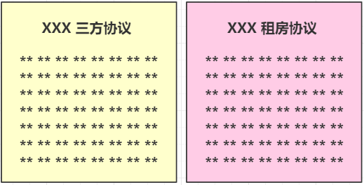

生活中的协议，本质上与计算机中的协议是相同的，协议的特点:

- 「**协**」字，代表的意思是必须有**两个以上的参与者**。例如三方协议里的参与者有三个：你、公司、学校三个；租房协议里的参与者有两个：你和房东。
- 「**仪**」字，代表的意思是对参与者的一种**行为约定和规范**。例如三方协议里规定试用期期限、毁约金等；租房协议里规定租期期限、每月租金金额、违约如何处理等。

针对 HTTP **协议**，我们可以这么理解。

HTTP 是一个用在计算机世界里的**协议**。它使用计算机能够理解的语言确立了一种计算机之间交流通信的规范（**两个以上的参与者**），以及相关的各种控制和错误处理方式（**行为约定和规范**）。

*2. 「传输」*

所谓的「传输」，很好理解，就是把一堆东西从 A 点搬到 B 点，或者从 B 点 搬到 A 点。

别轻视了这个简单的动作，它至少包含两项重要的信息。

HTTP 协议是一个**双向协议**。

我们在上网冲浪时，浏览器是请求方 A ，百度网站就是应答方 B。双方约定用 HTTP 协议来通信，于是浏览器把请求数据发送给网站，网站再把一些数据返回给浏览器，最后由浏览器渲染在屏幕，就可以看到图片、视频了。


数据虽然是在 A 和 B 之间传输，但允许中间有**中转或接力**。

就好像第一排的同学想穿递纸条给最后一排的同学，那么传递的过程中就需要经过好多个同学（中间人），这样的传输方式就从「A < --- > B」，变成了「A <-> N <-> M <-> B」。

而在 HTTP 里，需要中间人遵从 HTTP 协议，只要不打扰基本的数据传输，就可以添加任意额外的东西。

针对**传输**，我们可以进一步理解了 HTTP。

HTTP 是一个在计算机世界里专门用来在**两点之间传输数据**的约定和规范。

*3. 「超文本」*

HTTP 传输的内容是「超文本」。

我们先来理解「文本」，在互联网早期的时候只是简单的字符文字，但现在「文本」。的涵义已经可以扩展为图片、视频、压缩包等，在 HTTP 眼里这些都算做「文本」。

再来理解「超文本」，它就是**超越了普通文本的文本**，它是文字、图片、视频等的混合体最关键有超链接，能从一个超文本跳转到另外一个超文本。

HTML 就是最常见的超文本了，它本身只是纯文字文件，但内部用很多标签定义了图片、视频等的链接，在经过浏览器的解释，呈现给我们的就是一个文字、有画面的网页了。

OK，经过了对 HTTP 里这三个名词的详细解释，就可以给出比「超文本传输协议」这七个字更准确更有技术含量的答案：

**HTTP 是一个在计算机世界里专门在「两点」之间「传输」文字、图片、音频、视频等「超文本」数据的「约定和规范」。**

> 那「HTTP 是用于从互联网服务器传输超文本到本地浏览器的协议HTTP」 ，这种说法正确吗？

这种说法是**不正确**的。因为也可以是「服务器< -- >服务器」，所以采用**两点之间**的描述会更准确。

##### HTTP 常见的状态码


*1xx*

`1xx` 类状态码属于**提示信息**，是协议处理中的一种中间状态，实际用到的比较少。

*2xx*

`2xx` 类状态码表示服务器**成功**处理了客户端的请求，也是我们最愿意看到的状态。

「**200 OK**」是最常见的成功状态码，表示一切正常。如果是非 `HEAD` 请求，服务器返回的响应头都会有 body 数据。

「**204 No Content**」也是常见的成功状态码，与 200 OK 基本相同，但响应头没有 body 数据。

「**206 Partial Content**」是应用于 HTTP 分块下载或断点续传，表示响应返回的 body 数据并不是资源的全部，而是其中的一部分，也是服务器处理成功的状态。

*3xx*

`3xx` 类状态码表示客户端请求的资源发送了变动，需要客户端用新的 URL 重新发送请求获取资源，也就是**重定向**。

「**301 Moved Permanently**」表示永久重定向，说明请求的资源已经不存在了，需改用新的 URL 再次访问。

「**302 Found**」表示临时重定向，说明请求的资源还在，但暂时需要用另一个 URL 来访问。

301 和 302 都会在响应头里使用字段 `Location`，指明后续要跳转的 URL，浏览器会自动重定向新的 URL。

「**304 Not Modified**」不具有跳转的含义，表示资源未修改，重定向已存在的缓冲文件，也称缓存重定向，用于缓存控制。

*4xx*

`4xx` 类状态码表示客户端发送的**报文有误**，服务器无法处理，也就是错误码的含义。

「**400 Bad Request**」表示客户端请求的报文有错误，但只是个笼统的错误。

「**403 Forbidden**」表示服务器禁止访问资源，并不是客户端的请求出错。

「**404 Not Found**」表示请求的资源在服务器上不存在或未找到，所以无法提供给客户端。

「**405 Method Not Allowed**」: 请求方法不被服务器端允许。

「**406 Not Acceptable**」: 资源无法满足客户端的条件。

**「408 Request Timeout**」: 服务器等待了太长时间。

「**409 Conflict**」: 多个请求发生了冲突。

**「413 Request Entity Too Large**」: 请求体的数据过大。

**414 Request-URI Too Long**: 请求行里的 URI 太大。

**416 Requested range not satisfiable**: 客户端请求的范围无效

**429 Too Many Request**: 客户端发送的请求过多。

**431 Request Header Fields Too Large**: 请求头的字段内容太大。

*5xx*

`5xx` 类状态码表示客户端请求报文正确，但是**服务器处理时内部发生了错误**，属于服务器端的错误码。

「**500 Internal Server Error**」与 400 类型，是个笼统通用的错误码，服务器发生了什么错误，我们并不知道。

「**501 Not Implemented**」表示客户端请求的功能还不支持，类似“即将开业，敬请期待”的意思。

「**502 Bad Gateway**」通常是服务器作为网关或代理时返回的错误码，表示服务器自身工作正常，访问后端服务器发生了错误。

「**503 Service Unavailable**」表示服务器当前很忙，暂时无法响应服务器，类似“网络服务正忙，请稍后重试”的意思。

##### Accept 系列字段

对于`Accept`系列字段的介绍分为四个部分: **数据格式**、**压缩方式**、**支持语言**和**字符集**。

###### 数据格式

上一节谈到 HTTP 灵活的特性，它支持非常多的数据格式，那么这么多格式的数据一起到达客户端，客户端怎么知道它的格式呢？

当然，最低效的方式是直接猜，有没有更好的方式呢？直接指定可以吗？

答案是肯定的。不过首先需要介绍一个标准——**MIME**(Multipurpose Internet Mail Extensions, **多用途互联网邮件扩展**)。它首先用在电子邮件系统中，让邮件可以发任意类型的数据，这对于 HTTP 来说也是通用的。

因此，HTTP 从**MIME type**取了一部分来标记报文 body 部分的数据类型，这些类型体现在`Content-Type`这个字段，当然这是针对于发送端而言，接收端想要收到特定类型的数据，也可以用`Accept`字段。

具体而言，这两个字段的取值可以分为下面几类:

- text： text/html, text/plain, text/css 等
- image: image/gif, image/jpeg, image/png 等
- audio/video: audio/mpeg, video/mp4 等
- application: application/json, application/javascript, application/pdf, application/octet-stream

###### 压缩方式

当然一般这些数据都是会进行编码压缩的，采取什么样的压缩方式就体现在了发送方的`Content-Encoding`字段上， 同样的，接收什么样的压缩方式体现在了接受方的`Accept-Encoding`字段上。这个字段的取值有下面几种：

- gzip: 当今最流行的压缩格式
- deflate: 另外一种著名的压缩格式
- br: 一种专门为 HTTP 发明的压缩算法

```
// 发送端
Content-Encoding: gzip
// 接收端
Accept-Encoding: gzip
复制代码
```

###### 支持语言

对于发送方而言，还有一个`Content-Language`字段，在需要实现国际化的方案当中，可以用来指定支持的语言，在接受方对应的字段为`Accept-Language`。如:

```
// 发送端
Content-Language: zh-CN, zh, en
// 接收端
Accept-Language: zh-CN, zh, en
复制代码
```

###### 字符集

最后是一个比较特殊的字段, 在接收端对应为`Accept-Charset`，指定可以接受的字符集，而在发送端并没有对应的`Content-Charset`, 而是直接放在了`Content-Type`中，以**charset**属性指定。如:

```
// 发送端
Content-Type: text/html; charset=utf-8
// 接收端
Accept-Charset: charset=utf-8
复制代码
```

最后以一张图来总结一下吧:


##### HTTP 常见字段

*Host*

客户端发送请求时，用来指定服务器的域名。

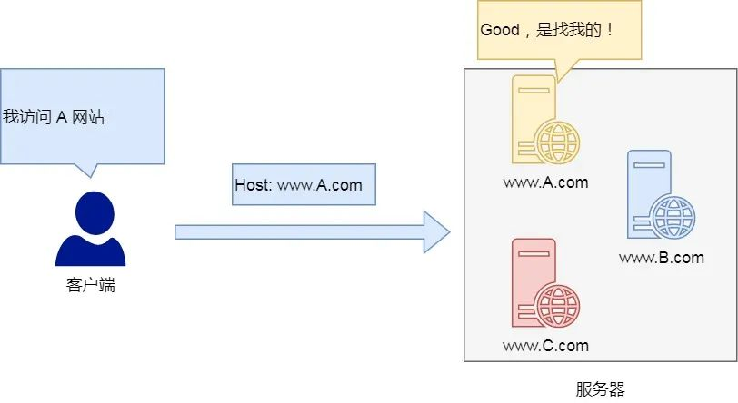


```
Host: www.A.com
```

有了 `Host` 字段，就可以将请求发往「同一台」服务器上的不同网站，为虚拟主机的兴起打下了基础。

*Content-Length 字段*

HTTP/1.1 新增，因为增加了管道传输。服务器在返回数据时，会有 `Content-Length` 字段，表明本次回应的数据长度。

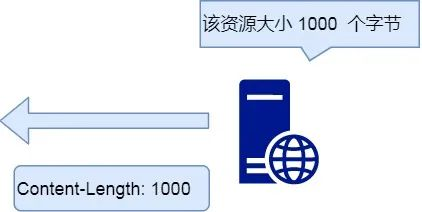


```
Content-Length: 1000
```

如上面则是告诉浏览器，本次服务器回应的数据长度是 1000 个字节，后面的字节就属于下一个回应了。

*Connection 字段*

`Connection` 字段最常用于客户端要求服务器使用 TCP 持久连接，以便其他请求复用。


HTTP/1.1 版本的默认连接都是持久连接，但为了兼容老版本的 HTTP，需要指定 `Connection` 首部字段的值为 `Keep-Alive`。

```
Connection: keep-alive
```

一个可以复用的 TCP 连接就建立了，直到客户端或服务器主动关闭连接。但是，这不是标准字段，不是根本的解决办法。

*Content-Type 字段*

`Content-Type` 字段用于服务器回应时，告诉客户端，本次数据是什么格式。关于字符的编码，1.0版规定，头信息必须是 ASCII 码，后面的数据可以是任何格式。

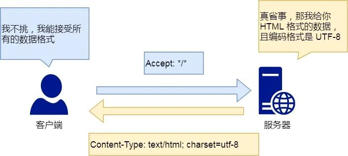

```
Content-Type: text/html; charset=utf-8
```

上面的类型表明，发送的是网页，而且编码是UTF-8。

客户端请求的时候，可以使用 `Accept` 字段声明自己可以接受哪些数据格式。

```
Accept: */*
```

上面代码中，客户端声明自己可以接受任何格式的数据。

常见的`Content-Type`字段的值，这些数据类型总称为`MIME type`，每个值包括一级类型和二级类型，之间用斜杠分隔。

```
- text/plain
- text/html
- text/css
- image/jpeg
- image/png
- image/svg+xml
- audio/mp4
- video/mp4
- application/javascript
- application/pdf
- application/zip
- application/atom+xml
```

*Content-Encoding 字段*

由于发送的数据可以是任何格式，因此可以把数据压缩后再发送。`Content-Encoding` 字段说明数据的压缩方法，表示服务器返回的数据使用了什么压缩格式。


```
Content-Encoding: gzip
```

上面表示服务器返回的数据采用了 gzip 方式压缩，告知客户端需要用此方式解压。

客户端在请求时，用 `Accept-Encoding` 字段说明自己可以接受哪些压缩方法。

```
Accept-Encoding: gzip, deflate
```

#### 2. GET 与 POST

> 说一下 GET 和 POST 的区别？

`Get` 方法的含义是请求**从服务器获取资源**，这个资源可以是静态的文本、页面、图片视频等。

比如，你打开我的文章，浏览器就会发送 GET 请求给服务器，服务器就会返回文章的所有文字及资源。

GET 请求

而`POST` 方法则是相反操作，它向 `URI` 指定的资源提交数据，数据就放在报文的 body 里。

比如，你在我文章底部，敲入了留言后点击「提交」，浏览器就会执行一次 POST 请求，把你的留言文字放进了报文 body 里，然后拼接好 POST 请求头，通过 TCP 协议发送给服务器。

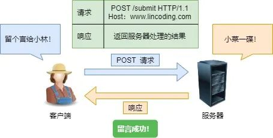POST 请求

> GET 和 POST 方法都是安全和幂等的吗？

先说明下安全和幂等的概念：

- 在 HTTP 协议里，所谓的「安全」是指请求方法不会「破坏」服务器上的资源。
- 所谓的「幂等」，意思是多次执行相同的操作，结果都是「相同」的。

那么很明显 **GET 方法就是安全且幂等的**，因为它是「只读」操作，无论操作多少次，服务器上的数据都是安全的，且每次的结果都是相同的。

**POST** 因为是「新增或提交数据」的操作，会修改服务器上的资源，所以是**不安全**的，且多次提交数据就会创建多个资源，所以**不是幂等**的。

------

#### 3. HTTP 特性（默认1.1版本）

##### 优点及体现

HTTP 最凸出的优点是「简单、灵活和易于扩展、应用广泛和跨平台」。

*1. 简单*

HTTP 基本的报文格式就是 `header + body`，头部信息也是 `key-value` 简单文本的形式，**易于理解**，降低了学习和使用的门槛。

*2. 灵活和易于扩展*

HTTP协议里的各类请求方法、URI/URL、状态码、头字段等每个组成要求都没有被固定死，都允许开发人员**自定义和扩充**。

同时 HTTP 由于是工作在应用层（ `OSI` 第七层），则它**下层可以随意变化**。

HTTPS 也就是在 HTTP 与 TCP 层之间增加了 SSL/TLS 安全传输层，HTTP/3 甚至把 TCP 层换成了基于 UDP 的 QUIC。

*3. 应用广泛和跨平台*

互联网发展至今，HTTP 的应用范围非常的广泛，从台式机的浏览器到手机上的各种 APP，从看新闻、刷贴吧到购物、理财、吃鸡，HTTP 的应用**片地开花**，同时天然具有**跨平台**的优越性。

##### 缺点及体现

HTTP 协议里有优缺点一体的**双刃剑**，分别是「无状态、明文传输」，同时还有一大缺点「不安全」。

*1. 无状态双刃剑*

无状态的**好处**，因为服务器不会去记忆 HTTP 的状态，所以不需要额外的资源来记录状态信息，这能减轻服务器的负担，能够把更多的 CPU 和内存用来对外提供服务。

无状态的**坏处**，既然服务器没有记忆能力，它在完成有关联性的操作时会非常麻烦。

例如登录->添加购物车->下单->结算->支付，这系列操作都要知道用户的身份才行。但服务器不知道这些请求是有关联的，每次都要问一遍身份信息。

对于无状态的问题，解法方案有很多种，其中比较简单的方式用 **Cookie** 技术。

`Cookie` 通过在请求和响应报文中写入 Cookie 信息来控制客户端的状态。

相当于，**在客户端第一次请求后，服务器会下发一个装有客户信息的「小贴纸」，后续客户端请求服务器的时候，带上「小贴纸」，服务器就能认得了了**。


*2. 明文传输双刃剑*

即协议里的报文(主要指的是头部)不使用二进制数据，而是文本形式。

明文意味着在传输过程中的信息，是可方便阅读的，通过浏览器的 F12 控制台或 Wireshark 抓包都可以直接肉眼查看，为我们调试工作带了极大的便利性。

但同时也让 HTTP 的报文信息暴露给了外界，给攻击者也提供了便利。`WIFI陷阱`就是利用 HTTP 明文传输的缺点，诱导你连上热点，然后疯狂抓你所有的流量，从而拿到你的敏感信息。

*3. 不安全*

HTTP 比较严重的缺点就是不安全：

- 通信使用明文（不加密），内容可能会被窃听。比如，**账号信息容易泄漏，那你号没了。**
- 不验证通信方的身份，因此有可能遭遇伪装。比如，**访问假的淘宝、拼多多，那你钱没了。**
- 无法证明报文的完整性，所以有可能已遭篡改。比如，**网页上植入垃圾广告，视觉污染，眼没了。**

HTTP 的安全问题，可以用 HTTPS 的方式解决，也就是通过引入 SSL/TLS 层，使得在安全上达到了极致。

##### 性能

HTTP 协议是基于 **TCP/IP**，并且使用了「**请求 - 应答**」的通信模式，所以性能的关键就在这**两点**里。

*1. 长连接*

早期 HTTP/1.0 性能上的一个很大的问题，那就是每发起一个请求，都要新建一次 TCP 连接（三次握手），而且是串行请求，做了无谓的 TCP 连接建立和断开，增加了通信开销。

为了解决上述 TCP 连接问题，HTTP/1.1 提出了**长连接**的通信方式，也叫持久连接。这种方式的好处在于减少了 TCP 连接的重复建立和断开所造成的额外开销，减轻了服务器端的负载。

持久连接的特点是，只要任意一端没有明确提出断开连接，则保持 TCP 连接状态。


*2. 管道网络传输*

HTTP/1.1 采用了长连接的方式，这使得管道（pipeline）网络传输成为了可能。

即可在同一个 TCP 连接里面，客户端可以发起多个请求，只要第一个请求发出去了，不必等其回来，就可以发第二个请求出去，可以**减少整体的响应时间。**

举例来说，客户端需要请求两个资源。以前的做法是，在同一个TCP连接里面，先发送 A 请求，然后等待服务器做出回应，收到后再发出 B 请求。管道机制则是允许浏览器同时发出 A 请求和 B 请求。

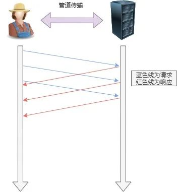

但服务器还是按照**顺序**，先回应 A 请求，完成后再回应 B 请求。要是 前面的回应特别慢，后面就会有许多请求排队等着，称为「队头堵塞」。

*3. 队头阻塞*

「请求 - 应答」的模式加剧了 HTTP 的性能问题。

因为当顺序发送的请求序列中的一个请求因为某种原因被阻塞时，在后面排队的所有请求也一同被阻塞了，会招致客户端一直请求不到数据，这也就是「**队头阻塞**」。**好比上班的路上塞车**。

为了避免这个问题，只有两种方法：一是减少请求数，二是同时多开持久连接。这导致了很多的网页优化技巧，比如合并脚本和样式表、将图片嵌入CSS代码、域名分片（domain sharding）等等。如果HTTP协议设计得更好一些，这些额外的工作是可以避免的。

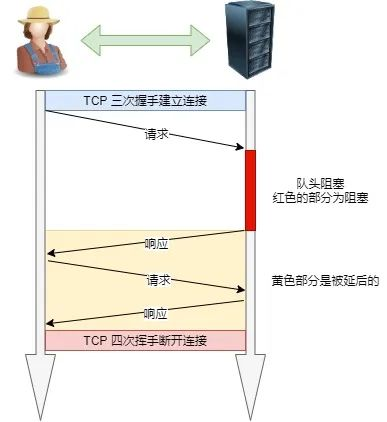

总之 HTTP/1.1 的性能一般般，后续的 HTTP/2 和 HTTP/3 就是在优化 HTTP 的性能。

##### 新增特点

*1. 持久连接*

*2. 管道机制*

*3. Content*-Length 字段

*4. 分块传输编码*

使用`Content-Length`字段的前提条件是，服务器发送回应之前，必须知道回应的数据长度。

对于一些很耗时的动态操作来说，这意味着服务器要等到所有操作完成，才能发送数据，显然这样的效率不高。更好的处理方法是，产生一块数据，就发送一块，采用"流模式"（stream）取代"缓存模式"（buffer）。

因此，1.1版规定可以不使用`Content-Length`字段，而使用["分块传输编码"](https://zh.wikipedia.org/wiki/分块传输编码)（chunked transfer encoding）。只要请求或回应的头信息有`Transfer-Encoding`字段，就表明回应将由数量未定的数据块组成。

设置这个字段后会自动产生两个效果:

- Content-Length 字段会被忽略
- 基于长连接持续推送动态内容

```html
Transfer-Encoding: chunked
```

每个非空的数据块之前，会有一个16进制的数值，表示这个块的长度。最后是一个大小为0的块，就表示本次回应的数据发送完了。下面是一个例子。

```http
HTTP/1.1 200 OK
Content-Type: text/plain
Transfer-Encoding: chunked

25
This is the data in the first chunk

1C
and this is the second one

3
con

8
sequence

0

```

注意，`Transfer-Encoding: chunked` 及之前的为响应行和响应头，后面的内容为响应体，这两部分用换行符隔开(最后留有一个`空行`)。

*5. 新增方法与 Host 字段*

1.1版还新增了许多动词方法：`PUT`、`PATCH`、`HEAD`、 `OPTIONS`、`DELETE`。

 另外，客户端请求的头信息新增了`Host`字段，用来指定服务器的域名。

#### 4. HTTP 与 HTTPS

> HTTP 与 HTTPS 有哪些区别？

1. HTTP 是超文本传输协议，信息是明文传输，存在安全风险的问题。HTTPS 则解决 HTTP 不安全的缺陷，在 TCP 和 HTTP 网络层之间加入了 SSL/TLS 安全协议，使得报文能够加密传输。
2. HTTP 连接建立相对简单， TCP 三次握手之后便可进行 HTTP 的报文传输。而 HTTPS 在 TCP 三次握手之后，还需进行 SSL/TLS 的握手过程，才可进入加密报文传输。
3. HTTP 的端口号是 80，HTTPS 的端口号是 443。
4. HTTPS 协议需要向 CA（证书权威机构）申请数字证书，来保证服务器的身份是可信的。


##### HTTP 风险

> HTTPS 解决了 HTTP 的哪些问题？

HTTP 由于是明文传输，所以安全上存在以下三个风险：

- **窃听风险**，比如通信链路上可以获取通信内容，用户号容易没。
- **篡改风险**，比如强制入垃圾广告，视觉污染，用户眼容易瞎。
- **冒充风险**，比如冒充淘宝网站，用户钱容易没。


HTTP**S** 在 HTTP 与 TCP 层之间加入了 `SSL/TLS` 协议。


可以很好的解决了上述的风险：

- **信息加密**：交互信息无法被窃取，但你的号会因为「自身忘记」账号而没。
- **校验机制**：无法篡改通信内容，篡改了就不能正常显示，但百度「竞价排名」依然可以搜索垃圾广告。
- **身份证书**：证明淘宝是真的淘宝网，但你的钱还是会因为「剁手」而没。

可见，只要自身不做「恶」，SSL/TLS 协议是能保证通信是安全的。


##### HTTPS 解决方案

> HTTPS 是如何解决上面的三个风险的？

- **混合加密**的方式实现信息的**机密性**，解决了窃听的风险。
- **摘要算法**的方式来实现**完整性**，它能够为数据生成独一无二的「指纹」，指纹用于校验数据的完整性，解决了篡改的风险。
- 将服务器公钥放入到**数字证书**中，解决了冒充的风险（中间人攻击）。

*1. 混合加密*

通过**混合加密**的方式可以保证信息的**机密性**，解决了窃听的风险。

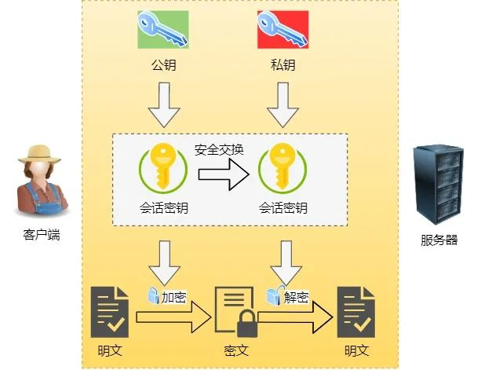混合加密

HTTPS 采用的是**对称加密**和**非对称加密**结合的「混合加密」方式：

- 在通信建立前采用**非对称加密**的方式交换「会话秘钥」，后续就不再使用非对称加密。
- 在通信过程中全部使用**对称加密**的「会话秘钥」的方式加密明文数据。

采用「混合加密」的方式的原因：

- **对称加密**只使用一个密钥，运算速度快，密钥必须保密，无法做到安全的密钥交换。
- **非对称加密**使用两个密钥：公钥和私钥，公钥可以任意分发而私钥保密，解决了密钥交换问题但速度慢。

*2. 摘要算法*

**摘要算法**用来实现**完整性**，能够为数据生成独一无二的「指纹」，用于校验数据的完整性，解决了篡改的风险。

校验完整性

客户端在发送明文之前会通过摘要算法算出明文的「指纹」，发送的时候把「指纹 + 明文」一同
加密成密文后，发送给服务器，服务器解密后，用相同的摘要算法算出发送过来的明文，通过比较客户端携带的「指纹」和当前算出的「指纹」做比较，若「指纹」相同，说明数据是完整的。

*3. 数字证书*

客户端先向服务器端索要公钥，然后用公钥加密信息，服务器收到密文后，用自己的私钥解密。

这就存在些问题，如何保证公钥不被篡改和信任度？

所以这里就需要借助第三方权威机构 `CA` （数字证书认证机构），将**服务器公钥放在数字证书**（由数字证书认证机构颁发）中，只要证书是可信的，公钥就是可信的。

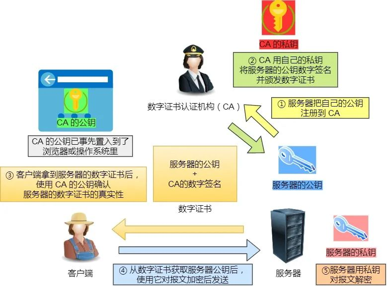

通过数字证书的方式保证服务器公钥的身份，解决冒充的风险。

##### HTTPS 建立连接

> HTTPS  是如何建立连接的？其间交互了什么？

SSL/TLS 协议基本流程：

- 客户端向服务器索要并验证服务器的公钥。
- 双方协商生产「会话秘钥」。
- 双方采用「会话秘钥」进行加密通信。

前两步也就是 SSL/TLS 的建立过程，也就是握手阶段。

SSL/TLS 的「握手阶段」涉及**四次**通信，可见下图：


注：HTTPS 连接建立过程

SSL/TLS 协议建立的详细流程：

###### *1. ClientHello*

首先，由客户端向服务器发起加密通信请求，也就是 `ClientHello` 请求。

在这一步，客户端主要向服务器发送以下信息：

（1）客户端支持的 SSL/TLS 协议版本，如 TLS 1.2 版本。

（2）客户端生产的随机数（`Client Random`），后面用于生产「会话秘钥」。

（3）客户端支持的密码套件列表，如 RSA 加密算法。

###### *2. SeverHello*

服务器收到客户端请求后，向客户端发出响应，也就是 `SeverHello`。服务器回应的内容有如下内容：

（1）确认 SSL/ TLS 协议版本，如果浏览器不支持，则关闭加密通信。

（2）服务器生产的随机数（`Server Random`），后面用于生产「会话秘钥」。

（3）确认的密码套件列表，如 RSA 加密算法。

（4）服务器的数字证书。

###### *3.客户端回应*

客户端收到服务器的回应之后，首先通过浏览器或者操作系统中的 CA 公钥，确认服务器的数字证书的真实性。

如果证书没有问题，客户端会从数字证书中取出服务器的公钥，然后使用它加密报文，向服务器发送如下信息：

（1）一个随机数（`pre-master key`）。该随机数会被服务器公钥加密。

（2）加密通信算法改变通知，表示随后的信息都将用「会话秘钥」加密通信。

（3）客户端握手结束通知，表示客户端的握手阶段已经结束。这一项同时把之前所有内容的发生的数据做个摘要，用来供服务端校验。

上面第一项的随机数是整个握手阶段的第三个随机数，这样服务器和客户端就同时有三个随机数，接着就用双方协商的加密算法，**各自生成**本次通信的「会话秘钥」。

###### *4. 服务器的最后回应*

服务器收到客户端的第三个随机数（`pre-master key`）之后，通过协商的加密算法，计算出本次通信的「会话秘钥」。然后，向客户端发生最后的信息：

（1）加密通信算法改变通知，表示随后的信息都将用「会话秘钥」加密通信。

（2）服务器握手结束通知，表示服务器的握手阶段已经结束。这一项同时把之前所有内容的发生的数据做个摘要，用来供客户端校验。

至此，整个 SSL/TLS 的握手阶段全部结束。接下来，客户端与服务器进入加密通信，就完全是使用普通的 HTTP 协议，只不过用「会话秘钥」加密内容。

#### 5. HTTP/1.1、HTTP/2、HTTP/3 演变

##### HTTP/1.1 优化

> 说说 HTTP/1.1 相比 HTTP/1.0 提高了什么性能？

HTTP/1.1 相比 HTTP/1.0 性能上的改进：

- 使用 TCP 长连接的方式改善了 HTTP/1.0 短连接造成的性能开销。
- 支持 管道（pipeline）网络传输，只要第一个请求发出去了，不必等其回来，就可以发第二个请求出去，可以减少整体的响应时间。

但 HTTP/1.1 还是有性能瓶颈：

- 请求 / 响应头部（Header）未经压缩就发送，首部信息越多延迟越大。只能压缩 `Body` 的部分；
- 发送**冗长首部**。每次互相发送相同的首部造成的浪费较多（HTTP/1.1 头部仍然是ASCII编码）；
- 服务器是按请求的顺序响应的，如果服务器响应慢，会招致客户端一直请求不到数据，也就是**队头阻塞**；
- 没有请求优先级控制；
- 请求只能从客户端开始，服务器只能被动响应（HTTP 本身设计就是请求-应答式）。

##### HTTP/2 优化

> 那上面的 HTTP/1.1 的性能瓶颈，HTTP/2 做了什么优化？

HTTP/2 协议是基于 HTTPS 的，所以 HTTP/2 的安全性也是有保障的。

那 HTTP/2 相比 HTTP/1.1 性能上的改进：

###### *1. 头部压缩*

HTTP 协议不带有状态，每次请求都必须附上所有信息。所以，请求的很多字段都是重复的，比如`Cookie`和`User Agent`，一模一样的内容，每次请求都必须附带，这会浪费很多带宽，也影响速度。

HTTP/2 对这一点做了优化，引入了头信息压缩机制（header compression）。

- 头信息使用`gzip`或`compress`压缩后再发送；
- `HPACK` 算法：客户端和服务器同时维护一张头信息表，所有字段都会存入这个表，生成一个索引号，以后就不发送同样字段了，只发送索引号，这样就**提高速度**了。

HTTP/2 会**压缩头**（Header），如果你同时发出多个请求，他们的头是一样的或是相似的，那么，协议会帮你**消除重复的部分**。

###### *2. 二进制格式*

HTTP/2 不再像 HTTP/1.1 里的纯文本形式的报文，而是全面采用了**二进制格式。**

头信息和数据体都是二进制，并且统称为帧（frame）：**头信息帧和数据帧**。

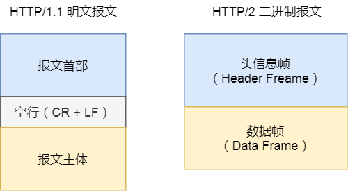

这样虽然对人不友好，但是对计算机非常友好，因为计算机只懂二进制，那么收到报文后，无需再将明文的报文转成二进制，而是直接解析二进制报文，这**增加了数据传输的效率**。

二进制协议的一个好处是，可以定义额外的帧。HTTP/2 定义了近十种帧，为将来的高级应用打好了基础。

###### *3. 多路复用（多工）*

HTTP/2 复用TCP连接，**在一个连接里，客户端和浏览器都可以同时发送多个请求或回应**。

移除了 HTTP/1.1 中的串行请求，不需要排队等待，也就不会再出现「队头阻塞」问题，**降低了延迟，大幅度提高了连接的利用率**。

举例来说，在一个 TCP 连接里，服务器收到了客户端 A 和 B 的两个请求，如果发现 A 处理过程非常耗时，于是就回应 A 请求已经处理好的部分，接着回应 B 请求，完成后，再回应 A 请求剩下的部分。

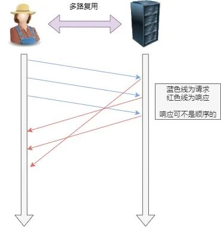

###### *4. 数据流*

HTTP/2 的数据包不是按顺序发送的，同一个连接里面连续的数据包，可能属于不同的回应。因此，必须要对数据包做标记，指出它属于哪个回应。

每个请求或回应的所有数据包，称为一个数据流（`Stream`）。

每个数据流都标记着一个独一无二的编号，其中规定客户端发出的数据流编号为奇数， 服务器发出的数据流编号为偶数。

数据流发送到一半的时候，客户端和服务器都可以发送信号（`RST_STREAM`帧），取消这个数据流。1.1版取消数据流的唯一方法，就是关闭TCP连接。这就是说，HTTP/2 可以取消某一次请求，同时保证TCP连接还打开着，可以被其他请求使用。

客户端还可以**指定数据流的优先级**。优先级高的请求，服务器就先响应该请求。

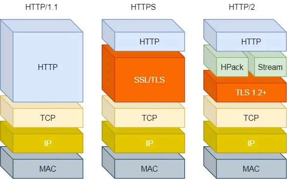

###### *5. 服务器推送*

HTTP/2 还在一定程度上改善了传统的「请求 - 应答」工作模式，服务不再是被动地响应，也可以**主动**向客户端发送消息。

常见场景是客户端请求一个网页，这个网页里面包含很多静态资源。正常情况下，客户端必须收到网页后，解析HTML源码，发现有静态资源，再发出静态资源请求。其实，服务器可以预期到客户端请求网页后，很可能会再请求静态资源，所以就主动把这些静态资源随着网页一起发给客户端了。

举例来说，在浏览器刚请求 HTML 的时候，服务器就提前把可能会用到的 JS、CSS 文件等静态资源主动发给客户端，**减少延时的等待**，也就是服务器推送（Server Push，也叫 Cache Push）。

##### HTTP/3 优化

> HTTP/2 有哪些缺陷？HTTP/3 做了哪些优化？

HTTP/2 主要的问题在于：多个 HTTP 请求在复用一个 TCP 连接，下层的 TCP 协议是不知道有多少个 HTTP 请求的。

所以一旦发生了丢包现象，就会触发 TCP 的重传机制，这样在一个 TCP 连接中的**所有的 HTTP 请求都必须等待这个丢了的包被重传回来**。

- HTTP/1.1 中的管道（ pipeline）传输中如果有一个请求阻塞了，那么队列后请求也统统被阻塞住了
- HTTP/2 多请求复用一个TCP连接，一旦发生丢包，就会阻塞住所有的 HTTP 请求。

这都是基于 TCP 传输层的问题，所以 **HTTP/3 把 HTTP 下层的 TCP 协议改成了 UDP！**


UDP 发生是不管顺序，也不管丢包的，所以不会出现 HTTP/1.1 的队头阻塞 和 HTTP/2 的一个丢包全部重传问题。

大家都知道 UDP 是不可靠传输的，但基于 UDP 的 **QUIC 协议**（快速 UDP Internet 连接） 可以实现类似 TCP 的可靠性传输。

- QUIC 有自己的一套机制可以保证传输的可靠性的。当某个流发生丢包时，只会阻塞这个流，**其他流不会受到影响**。
- TLS 升级成了最新的 `1.3` 版本，头部压缩算法也升级成了 `QPack`。
- HTTPS 要建立一个连接，要花费 6 次交互，先是建立三次握手，然后是 `TLS/1.3` 的三次握手。QUIC 直接把以往的 TCP 和 `TLS/1.3` 的 6 次交互**合并成了 3 次，减少了交互次数**。


所以， QUIC 是一个在 UDP 之上的 **伪** TCP + TLS + HTTP/2 的多路复用的协议。

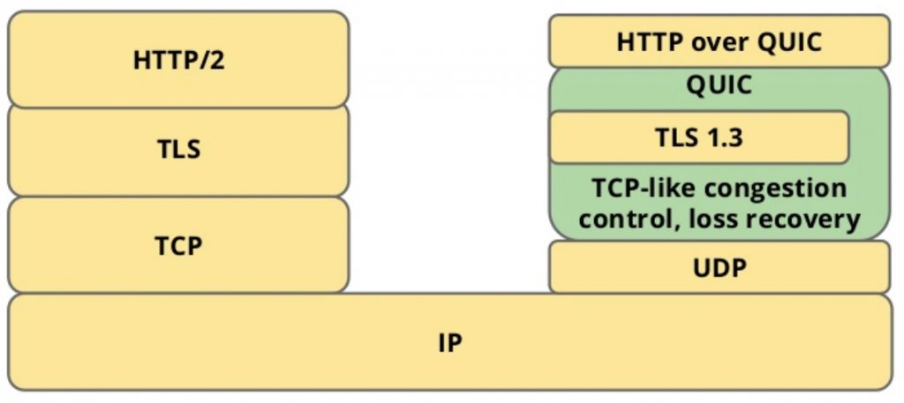

QUIC 是新协议，对于很多网络设备，根本不知道什么是 QUIC，只会当做 UDP，这样会出现新的问题。所以 HTTP/3 现在普及的进度非常的缓慢，不知道未来 UDP 是否能够逆袭 TCP。


### HTTPS

较为安全的网络传输协议

- 证书(公钥)
- SSL 加密
- 端口 443

我很早之前写过一篇关于 HTTP 和 HTTPS 的文章，但对于 HTTPS 介绍还不够详细，只讲了比较基础的部分，所以这次我们再来深入一下 HTTPS，用**实战抓包**的方式，带大家再来窥探一次 HTTPS。


对于还不知道对称加密和非对称加密的同学，你先复习我以前的这篇文章[「硬核！30 张图解 HTTP 常见的面试题」，](https://mp.weixin.qq.com/s?__biz=MzUxODAzNDg4NQ==&mid=2247483971&idx=1&sn=8f2d5dae3d95efc446061b352c8e9961&scene=21#wechat_redirect)本篇文章默认大家已经具备了这些知识。

#### TLS 握手过程

HTTP 由于是明文传输，所谓的明文，就是说客户端与服务端通信的信息都是肉眼可见的，随意使用一个抓包工具都可以截获通信的内容。

所以安全上存在以下三个风险：

- *窃听风险*，比如通信链路上可以获取通信内容，用户号容易没。
- *篡改风险*，比如强制植入垃圾广告，视觉污染，用户眼容易瞎。
- *冒充风险*，比如冒充淘宝网站，用户钱容易没。

HTTP**S** 在 HTTP 与 TCP 层之间加入了 TLS 协议，来解决上述的风险。

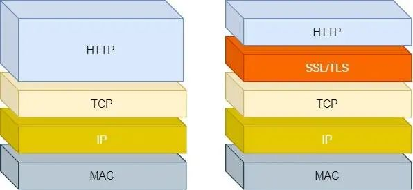

TLS 协议是如何解决 HTTP 的风险的呢？

- *信息加密*：HTTP 交互信息是被加密的，第三方就无法被窃取；
- *校验机制*：校验信息传输过程中是否有被第三方篡改过，如果被篡改过，则会有警告提示；
- *身份证书*：证明淘宝是真的淘宝网；

可见，有了 TLS 协议，能保证 HTTP 通信是安全的了，那么在进行 HTTP 通信前，需要先进行 TLS 握手。TLS 的握手过程，如下图：

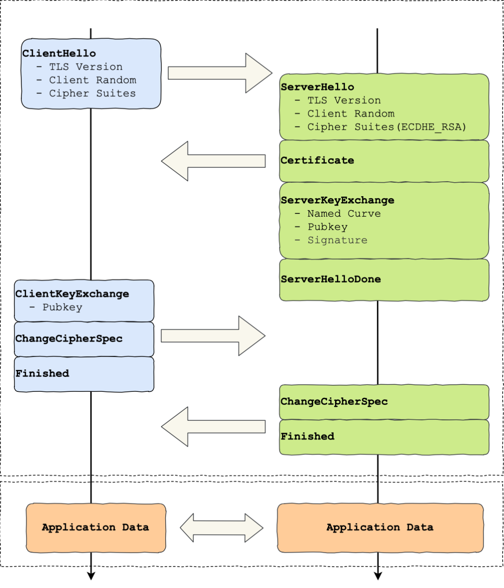

上图简要概述来 TLS 的握手过程，其中每一个「框」都是一个记录（*record*），记录是 TLS 收发数据的基本单位，类似于 TCP 里的 segment。多个记录可以组合成一个 TCP 包发送，所以**通常经过「四个消息」就可以完成 TLS 握手，也就是需要 2个 RTT 的时延**，然后就可以在安全的通信环境里发送 HTTP 报文，实现 HTTPS 协议。

所以可以发现，HTTPS 是应用层协议，需要先完成 TCP 连接建立，然后走 TLS 握手过程后，才能建立通信安全的连接。

事实上，不同的密钥交换算法，TLS 的握手过程可能会有一些区别。

这里先简单介绍下密钥交换算法，因为考虑到性能的问题，所以双方在加密应用信息时使用的是对称加密密钥，而对称加密密钥是不能被泄漏的，为了保证对称加密密钥的安全性，所以使用非对称加密的方式来保护对称加密密钥的协商，这个工作就是密钥交换算法负责的。

接下来，我们就以最简单的 `RSA` 密钥交换算法，来看看它的 TLS 握手过程。

------

#### RSA 握手过程

传统的 TLS 握手基本都是使用 RSA 算法来实现密钥交换的，在将 TLS 证书部署服务端时，证书文件中包含一对公私钥，其中公钥会在 TLS 握手阶段传递给客户端，私钥则一直留在服务端，一定要确保私钥不能被窃取。

在 RSA 密钥协商算法中，客户端会生成随机密钥，并使用服务端的公钥加密后再传给服务端。根据非对称加密算法，公钥加密的消息仅能通过私钥解密，这样服务端解密后，双方就得到了相同的密钥，再用它加密应用消息。

我用 Wireshark 工具抓了用 RSA 密钥交换的 TLS 握手过程，你可以从下面看到，一共经历来四次握手：

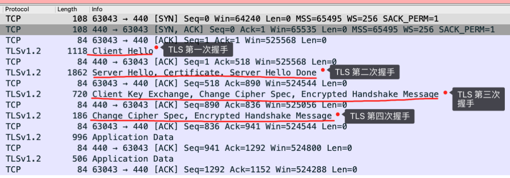

对应 Wireshark 的抓包，我也画了一幅图，你可以从下图很清晰地看到该过程：

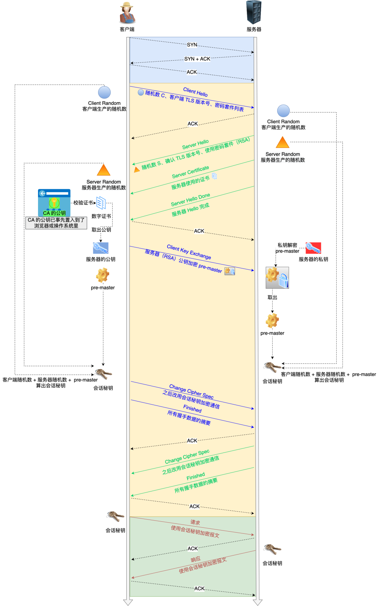

那么，接下来针对每一个 TLS 握手做进一步的介绍。

##### TLS 第一次握手

客户端首先会发一个「**Client Hello**」消息，字面意思我们也能理解到，这是跟服务器「打招呼」。

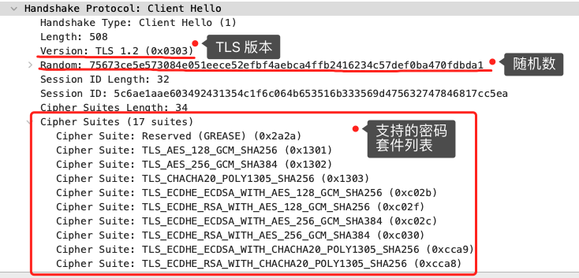

消息里面有客户端使用的 TLS 版本号、支持的密码套件列表，以及生成的**随机数（\*Client Random\*）**，这个随机数会被服务端保留，它是生成对称加密密钥的材料之一。

##### TLS 第二次握手

当服务端收到客户端的「Client Hello」消息后，会确认 TLS 版本号是否支持，和从密码套件列表中选择一个密码套件，以及生成**随机数（\*Server Random\*）**。

接着，返回「**Server Hello**」消息，消息里面有服务器确认的 TLS 版本号，也给出了随机数（Server Random），然后从客户端的密码套件列表选择了一个合适的密码套件。


可以看到，服务端选择的密码套件是 “Cipher Suite: TLS_RSA_WITH_AES_128_GCM_SHA256”。

这个密码套件看起来真让人头晕，好一大串，但是其实它是有固定格式和规范的。基本的形式是「**密钥交换算法 + 签名算法 + 对称加密算法 + 摘要算法**」， 一般 WITH 单词前面有两个单词，第一个单词是约定密钥交换的算法，第二个单词是约定证书的验证算法。比如刚才的密码套件的意思就是：

- 由于 WITH 单词只有一个 RSA，则说明握手时密钥交换算法和签名算法都是使用 RSA；
- 握手后的通信使用 AES 对称算法，密钥长度 128 位，分组模式是 GCM；
- 摘要算法 SHA384 用于消息认证和产生随机数；

就前面这两个客户端和服务端相互「打招呼」的过程，客户端和服务端就已确认了 TLS 版本和使用的密码套件，而且你可能发现客户端和服务端都会各自生成一个随机数，并且还会把随机数传递给对方。

那这个随机数有啥用呢？其实这两个随机数是后续作为生成「会话密钥」的条件，所谓的会话密钥就是数据传输时，所使用的对称加密密钥。

然后，服务端为了证明自己的身份，会发送「**Server Certificate**」给客户端，这个消息里含有数字证书。


随后，服务端发了「**Server Hello Done**」消息，目的是告诉客户端，我已经把该给你的东西都给你了，本次打招呼完毕。


##### 客户端验证证书

在这里刹个车，客户端拿到了服务端的数字证书后，要怎么校验该数字证书是真实有效的呢？

###### 数字证书和 CA 机构

在说校验数字证书是否可信的过程前，我们先来看看数字证书是什么，一个数字证书通常包含了：

- 公钥；
- 持有者信息；
- 证书认证机构（CA）的信息；
- CA 对这份文件的数字签名及使用的算法；
- 证书有效期；
- 还有一些其他额外信息；

那数字证书的作用，是用来认证公钥持有者的身份，以防止第三方进行冒充。说简单些，证书就是用来告诉客户端，该服务端是否是合法的，因为只有证书合法，才代表服务端身份是可信的。

我们用证书来认证公钥持有者的身份（服务端的身份），那证书又是怎么来的？又该怎么认证证书呢？

为了让服务端的公钥被大家信任，服务端的证书都是由 CA （*Certificate Authority*，证书认证机构）签名的，CA 就是网络世界里的公安局、公证中心，具有极高的可信度，所以由它来给各个公钥签名，信任的一方签发的证书，那必然证书也是被信任的。

之所以要签名，是因为签名的作用可以避免中间人在获取证书时对证书内容的篡改。

###### 数字证书签发和验证流程

如下图所示，为数字证书签发和验证流程：


CA 签发证书的过程，如上图左边部分：

- 首先 CA 会把持有者的公钥、用途、颁发者、有效时间等信息打成一个包，然后对这些信息进行 Hash 计算，得到一个 Hash 值；
- 然后 CA 会使用自己的私钥将该 Hash 值加密，生成 Certificate Signature，也就是 CA 对证书做了签名；
- 最后将 Certificate Signature 添加在文件证书上，形成数字证书；

客户端校验服务端的数字证书的过程，如上图右边部分：

- 首先客户端会使用同样的 Hash 算法获取该证书的 Hash 值 H1；
- 通常浏览器和操作系统中集成了 CA 的公钥信息，浏览器收到证书后可以使用 CA 的公钥解密 Certificate Signature 内容，得到一个 Hash 值 H2 ；
- 最后比较 H1 和 H2，如果值相同，则为可信赖的证书，否则则认为证书不可信。

###### 证书链

但事实上，证书的验证过程中还存在一个证书信任链的问题，因为我们向 CA 申请的证书一般不是根证书签发的，而是由中间证书签发的，比如百度的证书，从下图你可以看到，证书的层级有三级：

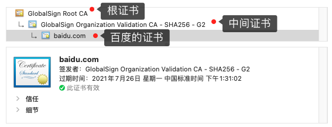

对于这种三级层级关系的证书的验证过程如下：

- 客户端收到 baidu.com 的证书后，发现这个证书的签发者不是根证书，就无法根据本地已有的根证书中的公钥去验证 baidu.com 证书是否可信。于是，客户端根据 baidu.com 证书中的签发者，找到该证书的颁发机构是 “GlobalSign Organization Validation CA - SHA256 - G2”，然后向 CA 请求该中间证书。
- 请求到证书后发现 “GlobalSign Organization Validation CA - SHA256 - G2” 证书是由 “GlobalSign Root CA” 签发的，由于 “GlobalSign Root CA” 没有再上级签发机构，说明它是根证书，也就是自签证书。应用软件会检查此证书有否已预载于根证书清单上，如果有，则可以利用根证书中的公钥去验证 “GlobalSign Organization Validation CA - SHA256 - G2” 证书，如果发现验证通过，就认为该中间证书是可信的。
- “GlobalSign Organization Validation CA - SHA256 - G2” 证书被信任后，可以使用 “GlobalSign Organization Validation CA - SHA256 - G2” 证书中的公钥去验证 baidu.com 证书的可信性，如果验证通过，就可以信任 baidu.com 证书。

在这四个步骤中，最开始客户端只信任根证书 GlobalSign Root CA 证书的，然后 “GlobalSign Root CA” 证书信任 “GlobalSign Organization Validation CA - SHA256 - G2” 证书，而 “GlobalSign Organization Validation CA - SHA256 - G2” 证书又信任 baidu.com 证书，于是客户端也信任 baidu.com 证书。

总括来说，由于用户信任 GlobalSign，所以由 GlobalSign 所担保的 baidu.com 可以被信任，另外由于用户信任操作系统或浏览器的软件商，所以由软件商预载了根证书的 GlobalSign 都可被信任。

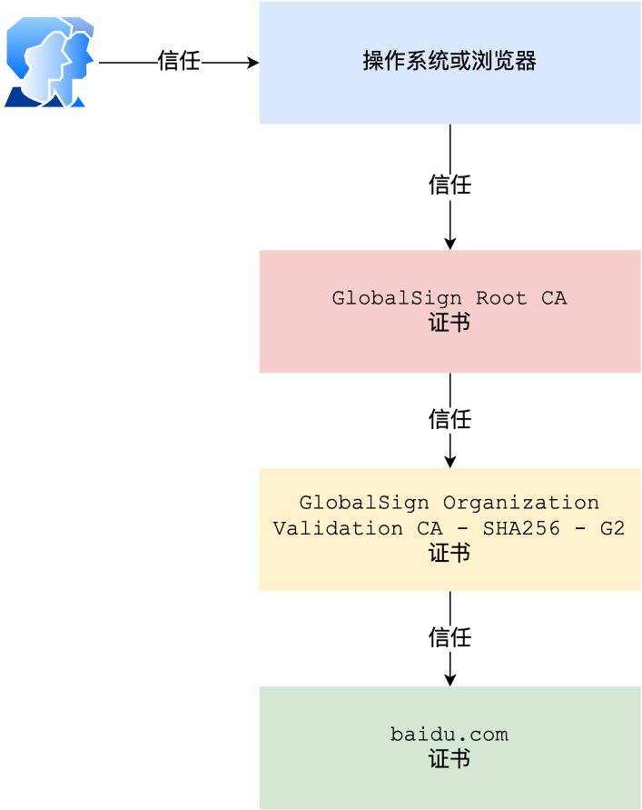

操作系统里一般都会内置一些根证书，比如我的 MAC 电脑里内置的根证书有这么多：


这样的一层层地验证就构成了一条信任链路，整个证书信任链验证流程如下图所示：


最后一个问题，为什么需要证书链这么麻烦的流程？Root CA 为什么不直接颁发证书，而是要搞那么多中间层级呢？

这是为了确保根证书的绝对安全性，将根证书隔离地越严格越好，不然根证书如果失守了，那么整个信任链都会有问题。

##### TLS 第三次握手

客户端验证完证书后，认为可信则继续往下走。接着，客户端就会生成一个新的**随机数 (\*pre-master\*)**，用服务器的 RSA 公钥加密该随机数，通过「**Change Cipher Key Exchange**」消息传给服务端。


服务端收到后，用 RSA 私钥解密，得到客户端发来的随机数 (pre-master)。

至此，**客户端和服务端双方都共享了三个随机数，分别是 Client Random、Server Random、pre-master**。

于是，双方根据已经得到的三个随机数，生成**会话密钥（Master Secret）**，它是对称密钥，用于对后续的 HTTP 请求/响应的数据加解密。

生成完会话密钥后，然后客户端发一个「**Change Cipher Spec**」，告诉服务端开始使用加密方式发送消息。


然后，客户端再发一个「**Encrypted Handshake Message（Finishd）**」消息，把之前所有发送的数据做个摘要，再用会话密钥（master secret）加密一下，让服务器做个验证，验证加密通信是否可用和之前握手信息是否有被中途篡改过。


可以发现，「Change Cipher Spec」之前传输的 TLS 握手数据都是明文，之后都是对称密钥加密的密文。

##### TLS 第四次握手

服务器也是同样的操作，发「**Change Cipher Spec**」和「**Encrypted Handshake Message**」消息，如果双方都验证加密和解密没问题，那么握手正式完成。

最后，就用「会话密钥」加解密 HTTP 请求和响应了。

#### RSA 算法的缺陷

**使用 RSA 密钥协商算法的最大问题是不支持前向保密**。因为客户端传递随机数（用于生成对称加密密钥的条件之一）给服务端时使用的是公钥加密的，服务端收到到后，会用私钥解密得到随机数。所以一旦服务端的私钥泄漏了，过去被第三方截获的所有 TLS 通讯密文都会被破解。

为了解决这一问题，于是就有了 DH 密钥协商算法，这里简单介绍它的工作流程。

#### DH 密钥协商算法

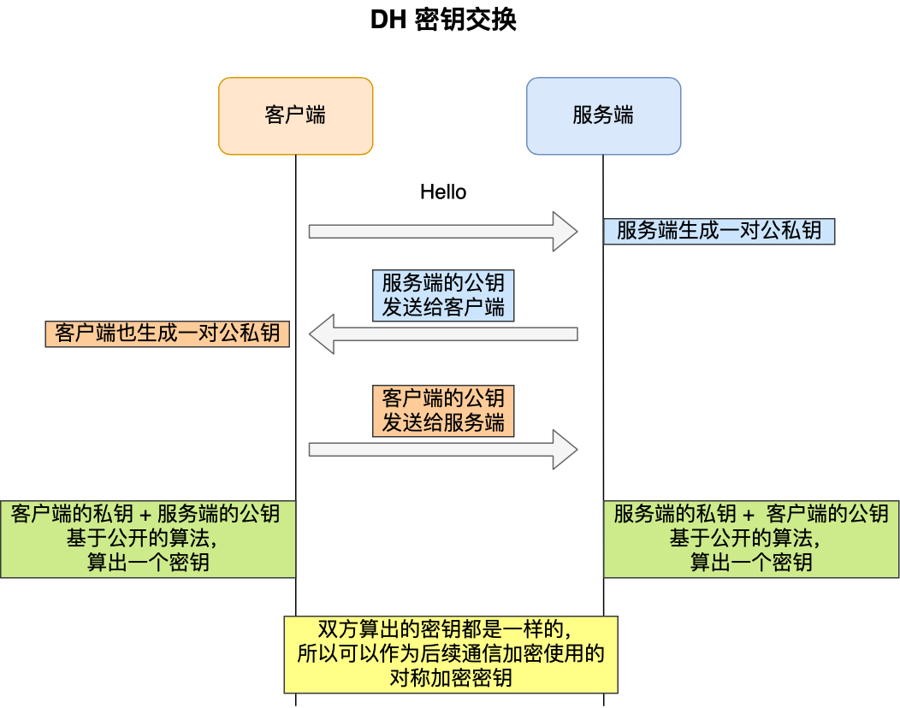

客户端和服务端各自会生成随机数，并以此作为私钥，然后根据公开的 DH 计算公式算出各自的公钥，通过 TLS 握手双方交换各自的公钥，这样双方都有自己的私钥和对方的公钥，然后双方根据各自持有的材料算出一个随机数，这个随机数的值双方都是一样的，这就可以作为后续对称加密时使用的密钥。

DH 密钥交换过程中，**即使第三方截获了 TLS 握手阶段传递的公钥，在不知道的私钥的情况下，也是无法计算出密钥的，而且每一次对称加密密钥都是实时生成的，实现前向保密**。

但因为 DH 算法的计算效率问题，后面出现了 ECDHE 密钥协商算法，我们现在大多数网站使用的正是 ECDHE 密钥协商算法。


## GET/POST

- GET：用于信息获取
  - 无副作用(不修改资源，无害)
  - 幂等(请求次数与资源无关，执行一次与多次的效果一样)
  - 可缓存(方法可被缓存)
  - 请求长度受限
  - 保存历史记录
- POST：可能修改服务器上资源的请求。
  - 安全
  - 大数据
  - 更多编码类型

### 广义区别

下面的表格比较了两种 HTTP 方法：GET 和 POST。

|                  | GET                                                          | POST                                                         |
| ---------------- | ------------------------------------------------------------ | ------------------------------------------------------------ |
| 后退按钮/刷新    | 无害                                                         | 数据会被重新提交（浏览器应该告知用户数据会被重新提交）。     |
| 书签             | 产生的URL地址可收藏为书签                                    | 不可收藏为书签                                               |
| 缓存             | 能被缓存                                                     | 不能缓存(除非手动设置)                                       |
| 编码类型         | 只能进行 url 编码（application/x-www-form-urlencoded）       | 多种编码方式（application/x-www-form-urlencoded 或 multipart/form-data）。<br />为二进制数据使用多重编码。 |
| 历史             | 参数保留在浏览器历史中。                                     | 参数不会保存在浏览器历史中。                                 |
| 对数据长度的限制 | 是的。当发送数据时，GET 方法向 URL 添加数据；URL 的长度是受限制的（URL 的最大长度是 2048 个字符）。 | 无限制。                                                     |
| 对数据类型的限制 | 只允许 ASCII 字符。                                          | 没有限制。也允许二进制数据。                                 |
| 安全性           | 与 POST 相比，GET 的安全性较差，因为所发送的数据是 URL 的一部分。在发送密码或其他敏感信息时绝不要使用 GET ！ | POST 比 GET 更安全，因为参数不会被保存在浏览器历史或 web 服务器日志中。 |
| 可见性           | 数据在 URL 中对所有人都是可见的。                            | 数据不会显示在 URL 中。                                      |

但是二者没有本质区别，只是报文格式不同。GET和POST本质上都是TCP链接，并无差别。由于HTTP的规定和浏览器的限制，导致他们在使用时体现出一些不同。

> GET和POST是什么？HTTP协议中的两种发送请求的方法。
>
> - *GET* - 从指定的资源请求数据。
> - *POST* - 向指定的资源提交要被处理的数据
>
> HTTP是什么？HTTP是基于TCP/IP的关于数据如何在万维网中如何通信的协议。
>
> HTTP   的底层是 TCP / IP , 那就是说 GET和POST的底层也是 TCP / IP， 用的都是同一个传输层协议。 GET 、POST 能做的事情是一样的，只要我们给  GET 加上 Request body，给 POST加上  URL 参数，技术上是完全行得通的。当然，这需要服务端支持。
>
> 在我大万维网世界中，TCP就像汽车，我们用TCP来运输数据，它很可靠，从来不会发生丢件少件的现象。但是如果路上跑的全是看起来一模一样的汽车，那这个世界看起来是一团混乱，送急件的汽车可能被前面满载货物的汽车拦堵在路上，整个交通系统一定会瘫痪。为了避免这种情况发生，交通规则HTTP诞生了。HTTP给汽车运输设定了好几个服务类别，有GET, POST, PUT, DELETE等等，HTTP规定，当执行GET请求的时候，要给汽车贴上GET的标签（设置method为GET），而且要求把传送的数据放在车顶上（url中）以方便记录。如果是POST请求，就要在车上贴上POST的标签，并把货物放在车厢里。当然，你也可以在GET的时候往车厢内偷偷藏点货物，但是这是很不光彩；也可以在POST的时候在车顶上也放一些数据，让人觉得傻乎乎的。HTTP只是个行为准则，而TCP才是GET和POST怎么实现的基本。

### 常见问题

1. GET 方法参数写法是固定的吗？

   在约定中，我们的参数是写在 `?` 后面，用 `&` 分割。

   我们知道，解析报文的过程是通过获取 TCP 数据，用正则等工具从数据中获取 Header 和 Body，从而提取参数。

   也就是说，我们可以自己约定参数的写法，只要服务端能够解释出来就行。

2. POST 方法比 GET 方法安全？

   按照网上大部分文章的解释，POST 比 GET 安全，因为数据在地址栏上不可见。

   然而，从传输的角度来说，他们都是不安全的，因为 HTTP 在网络上是明文传输的，只要在网络节点上捉包，就能完整地获取数据报文。要想安全传输，就只有加密，也就是 HTTPS。

3. GET 方法的长度限制是怎么回事？

   在网上看到很多关于两者区别的文章都有这一条，提到浏览器地址栏输入的参数是有限的。

   首先说明一点，HTTP 协议没有 Body 和 URL 的长度限制，对 URL 限制的大多是浏览器和服务器的原因。

   浏览器原因就不说了，服务器是因为处理长 URL 要消耗比较多的资源，为了性能和安全（防止恶意构造长 URL 来攻击）考虑，会给 URL 长度加限制。

4. POST 方法会产生两个 TCP 数据包？

   有些文章中提到，post 会将 header 和 body 分开发送，先发送 header，服务端返回 100 状态码再发送 body。

   > GET产生一个TCP数据包，POST产生两个数据包。
   >
   > - 对于GET请求来说，浏览器会把HTTP header和data一并发送出去，服务器相应200即返回数据。
   >
   > -  对于POST来说，浏览器会先发送header，服务器响应100 continue，浏览器再发送data，服务器响应200返回数据。

   HTTP 协议中没有明确说明 POST 会产生两个 TCP 数据包，而且实际测试(Chrome)发现，header 和 body 不会分开发送。

   所以，header 和 body 分开发送是部分浏览器或框架的请求方法，不属于 POST 必然行为。

## options 何时发出

## 常见状态码

- 1xx: 接受，继续处理
- 200: 成功，并返回数据
- 201: 已创建
- 202: 已接受
- 203: 成功，但未授权
- 204: 成功，无内容
- 205: 成功，重置内容
- 206: 成功，部分内容
- 301: 永久移动，重定向
- 302: 临时移动，可使用原有URI
- 304: 资源未修改，可使用缓存
- 305: 需代理访问
- 400: 请求语法错误
- 401: 要求身份认证
- 403: 拒绝请求
- 404: 资源不存在
- 500: 服务器错误

# TCP/UDP

> ## TCP 三次握手和四次挥手面试题

https://mp.weixin.qq.com/s/tH8RFmjrveOmgLvk9hmrkw

## TCP

**解释** 

- **同步 SYN** ：synchronous。建立连接，将 SYN = 1。
- **序号 seq**: sequence。第一个字节的编号随机产生。
- **确认位 ACK** ： acknowledgement 。
- **ack** : 表示确认字段的值。（对哪个进行确认）。
- **结束 FIN** ： finish。FIN = 1 表示希望断开连接。

**状态** 

- **SYN-SENT** : 同步已发送。
- **SYN-RCVD**：同步收到。
- **ESTABLISHED**: 已建立连接。
- **FIN-WAIT-1**：终止等待1。
- **FIN-WAIT-2**：终止等待2。
- **CLOSE-WAIT**： 关闭等待。 
- **LAST-ACK** : 最后确认。
- **TIME-WAIT**: 时间等待。 
- **CLOSED** ：关闭状态。


### 三次握手

TCP建立连接的过程叫做握手，握手需要在客户和服务器之间交换三个 TCP 报文段。

建立连接前，客户端和服务端需要通过握手来确认对方:

- 客户端发送 syn(同步序列编号) 请求，进入 syn_send 状态，等待确认
- 服务端接收并确认 syn 包后发送 syn+ack 包，进入 syn_recv 状态
- 客户端接收 syn+ack 包后，发送 ack 包，双方进入 established 状态

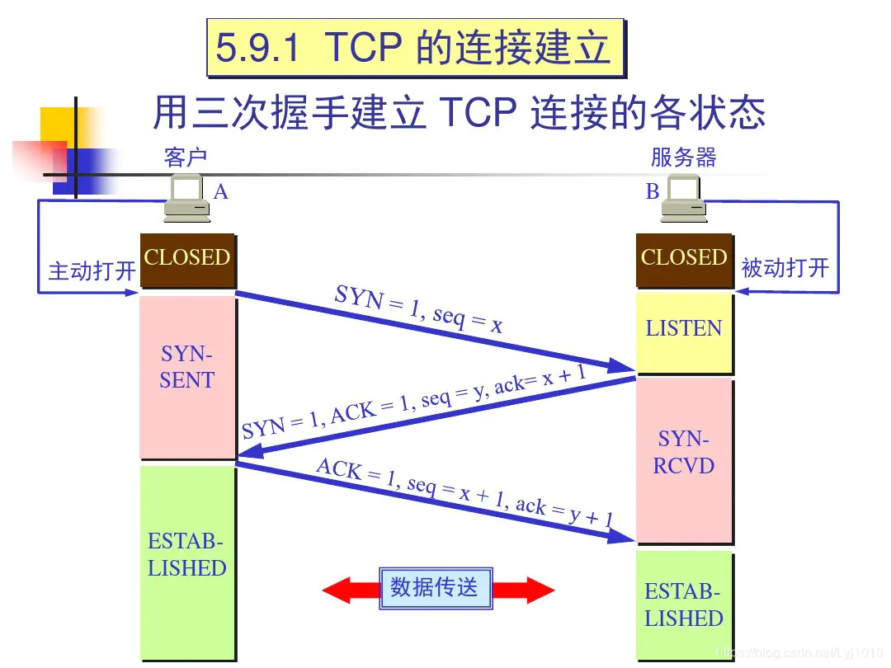

最初，客户端和服务器的 TCP 进程都处于 **CLOSED (关闭)** 状态。B 的 TCP 服务器进程先创建 **传输控制块 TCB** ，准备接受客户进程的连接请求。然后服务器进程处于 **LISTEN (收听)** 状态，等待客户的连接请求。A 的 TCP 客户进程也是首先创建 **传输控制块 TCB** 。

**第一次握手** 

客户端打算建立连接时，向服务器发出连接请求报文段，此时首部中的同步位 SYN = 1 ，同时选择一个初始需要 seq = x 。 TCP 规定，SYN = 1 的报文段 不能携带数据，但要消耗掉一个序号。这时，TCP 客户进程进入 **SYN-SENT （同步已发送）**状态。

**第二次握手**

服务器收到连接请求报文段后，如果同意建立连接，则向客户端发送确认。在确认报文段中应把 SYN 位 和 ACK 位 都置 1 ，确认号是 ack = x + 1，同时也为自己选择一个初始序号 seq = y。（这个报文段也不能携带数据，但同样要消耗掉一个序号。）这时 TCP 服务器进程进入 **SYN-RCVD (同步收到)** 状态。

**第三次握手**

客户端收到服务器的确认后，还要向服务器给出确认。确认报文段的 ACK 置为 1 ，确认号 ack = y + 1，而自己的序号 seq = x + 1 。这时， TCP 连接已经建立，客户端进入 **ESTABLISHED (已建立连接)** 状态。当 服务器 收到 客户端 的确认后，也进入 **ESTABLISHED (已建立连接)** 状态。

通过这样的三次握手，客户端与服务器端建立可靠的双工的连接，开始传送数据。三次握手的主要目的是保证连接是双工的，可靠更多是通过重传机制来保证的。

> **为什么 客户端 最后还要发送一次确认？**
>
> 主要是为了**防止已失效的连接请求报文段突然又传到了 服务器，因而产生错误**。 
>
> 现假定出现一种异常情况，即 客户端 发出的第一个连接请求报文段并没有丢失，而是在某些网络结点长时间滞留了，以致延误到连接释放以后的某个时间才到达 服务器。本来这是一个早已失效的报文段。但 服务器 收到此失效的连接请求报文段后，就误认为是 客户端 又发出一次新的连接请求。于是就向 客户端 发出确认报文段，同意建立连接。假定不采用报文握手，那么只要 服务器发出确认，新的连接就建立了。由于现在 客户端 并没有发出建立连接的请求，因此不会理睬 服务器 的确认，也不会向 服务器 发送数据。但是 服务器 却以为新的运输连接已经建立了，并一直等待 客户端 发来数据。服务器 的许多资源就这样白白浪费了。 采用三次报文握手的办法，可以防止上述现象的发生。假如在刚才的异常情况下，客户端 不会像 服务器 的确认发出确认。服务器 由于收不到确认，就知道 客户端 并没有要求建立连接。


### 四次挥手

数据传输结束后，通信的双方都可以释放资源。此时 客户端 和 服务器 都处于 **ESTABLISHED** 状态。

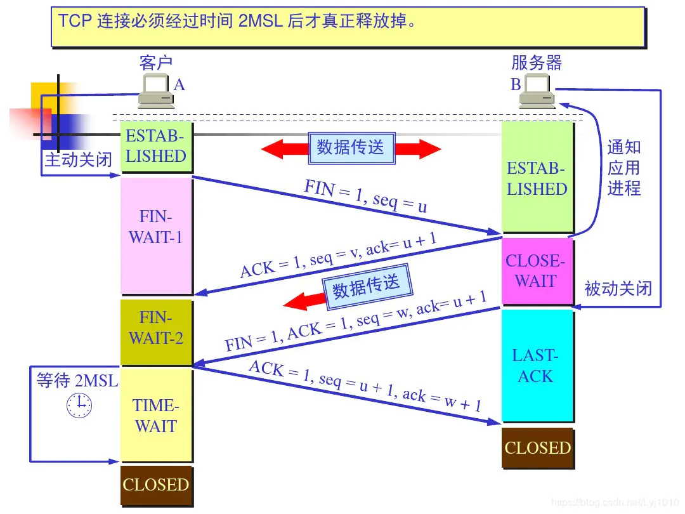

- 客户端 -- FIN --> 服务端， FIN—WAIT
- 服务端 -- ACK --> 客户端， CLOSE-WAIT
- 服务端 -- ACK,FIN --> 客户端， LAST-ACK
- 客户端 -- ACK --> 服务端，CLOSED

**第一次握手** 

客户端 的应用进程先向其 TCP 发出连接释放报文段，并停止在发送数据，主动关闭 TCP 连接。客户端把连接释放报文段首部的终止控制位 FIN 置 1，其序号 seq = u ,它等于前面已传过的数据的最后一个字节的序号加 1 。这时 客户端 进入 **FIN-WAIT-1 (终止等待1)** 状态，等待 服务器 的确认。（ FIN 报文段即使不携带数据，它也消耗掉一个序号。）

**第二次握手**

服务器收到连接释放报文段后即发出确认，确认号 ack = u + 1 ，而这个报文段 自己的序号是 v ,等于 服务器 前面已经传过的数据的最后一个字节的序号加 1 。然后 服务器 就进入 **CLOSEWAIT（关闭等待）**状态。TCP 服务器进程这时应通知高层应用进程（**不确定自己是否还有数据要发送给 客户端（所以是四次不是三次）**），因而从 客户端 到 服务器 这个方向的连接就释放了，这时的 TCP 连接处于 **半关闭（Half-close）**状态，即 客户端 已经没有数据要发送了，但 服务器 若发送数据，客户端仍要接收。也就是说， 服务器 到 客户端 这个方向的连接并未关闭，这个状态可能会持续一段时间。

客户端 收到来自 服务器 的确认后，就进入 **FIN-WAIT-2(终止等待2)** 状态，等待 服务器 发出的连接释放报文段。

**第三次握手**

若 服务器 已经没有要向 客户端 发送的数据，其应用进程就通知 TCP 释放连接。这时 服务器发出的连接使用报文段必须使用 FIN = 1。现假设 服务器 的序号为 w（在半关闭状态 服务器 可能又发送了一些数据）。服务器还必须重复上次已发送过的确认号 ack = u + 1。这时 服务器 就进入 **LAST-ACK (最后确认)** 状态，等待 客户端 的确认。

**第四次握手**

客户端 在收到 服务器 的连接释放报文段后，必须对此发出确认。在确认报文段中把 ACK 置 1，确认号 ack = w + 1，而自己的序号是 seq = u + 1（根据 TCP 标准，前面发送过的 FIN 报文段要消耗一个序号）。然后进入到 **TIME-WAIT(时间等待)** 状态。请注意，TCP 连接现在还没有释放掉。必须经过 **时间等待计时器（TIME-WAIT）**设置的时间 **2MSL** 后，客户端 才进入到 CLOSED 状态。时间 **MSL** 叫做 **最长报文段寿命**，RFC 793 建议设为 2 分钟。

> 注意：

- 为什么 客户端 在 TIME-WAIT 状态必须等待 2MSL 的时间呢？

  1. 为了保证 客户端 发送的最后一个 ACK 报文段能够到达 服务器。这个 ACK 报文段有可能丢失，因而使 服务器 收不到确认。服务器 会超时重传这个 FIN + ACK 报文段，而 客户端 就能在 2MSL 时间内收到这个重传的报文段。接着 客户端 重传一次确认，重新启动 2MSL 计时器。最后，客户端 和 服务器 都能正常进入到 **CLOSED** 状态。如果 客户端 在 TIME-WAIT 状态不等待一段时间，而是在发送完 ACK 报文段后立即释放连接，那么就无法收到 服务器 重传 的 FIN+ACK  报文段，因而也不会再发送一次确认报文段。这样，服务器 就无法按照正常步骤进入 **CLOSED** 状态。
  2. 防止“已失效的连接请求报文段” 出现在本次连接中。客户端 在发送完最后一个 ACK 报文段后，再经过 2MSL，就可以使本次连接持续的时间内所产生的所有报文段都从网络中消失。这样就可以使下一个新的连接中不会出现这种旧的连接请求报文段。

- 如果已经建立了连接，但是客户端突然出现故障了怎么办？

  TCP 设有一个 **保活计时器**。服务器每收到一次客户的数据，就重新设置保活计时器，时间的设置通常是两小时。若两小时没有收到客户的数据，服务器就发送一个 探测报文段 ，以后则每隔 75 秒钟发送一次。若一连发送 10 个探测报文段后仍无客户的响应，服务器就认为客户端出了故障，接着就关闭这个连接。


### 滑动窗口: 流量控制

https://mp.weixin.qq.com/s/Tc09ovdNacOtnMOMeRc_uA

### 拥塞处理

- 慢开始
- 拥塞避免
- 快速重传
- 快速恢复

## TCP UDP 区别


UDP 不提供复杂的控制机制，利用 IP 提供面向「无连接」的通信服务。

UDP 协议真的非常简单，头部只有 `8` 个字节（ 64 位），UDP 的头部格式如下：


- 目标和源端口：主要是告诉 UDP 协议应该把报文发给哪个进程。
- 包长度：该字段保存了 UDP 首部的长度跟数据的长度之和。
- 校验和：校验和是为了提供可靠的 UDP 首部和数据而设计。

**TCP 和 UDP 区别：**

*1. 连接*

- TCP 是面向连接的传输层协议，传输数据前先要建立连接。
- UDP 是不需要连接，即刻传输数据。

*2. 服务对象*

- TCP 是一对一的两点服务，即一条连接只有两个端点。
- UDP 支持一对一、一对多、多对多的交互通信

*3. 可靠性*

- TCP 是可靠交付数据的，数据可以无差错、不丢失、不重复、按需到达。
- UDP 是尽最大努力交付，不保证可靠交付数据。

*4. 拥塞控制、流量控制*

- TCP 有拥塞控制和流量控制机制，保证数据传输的安全性。
- UDP 则没有，即使网络非常拥堵了，也不会影响 UDP 的发送速率。

*5. 首部开销*

- TCP 首部长度较长，会有一定的开销，首部在没有使用「选项」字段时是 `20` 个字节，如果使用了「选项」字段则会变长的。
- UDP 首部只有 8 个字节，并且是固定不变的，开销较小。

**TCP 和 UDP 应用场景：**

由于 TCP 是面向连接，能保证数据的可靠性交付，因此经常用于：

- `FTP` 文件传输
- `HTTP` / `HTTPS`

由于 UDP 面向无连接，它可以随时发送数据，再加上UDP本身的处理既简单又高效，因此经常用于：

- 包总量较少的通信，如 `DNS` 、`SNMP` 等
- 视频、音频等多媒体通信
- 广播通信

# 跨域

本质是浏览器对 Cookie 的一种保护，是一种浏览器行为。

## 同源概念

互联网安全的基础是同源政策，否则网页之间可以共享 `Cookie` 等信息，造成不安全。

两个网页满足下属三个条件称之为同源：

1. 协议相同
2. 域名相同
3. 端口相同

同源网页之间可以共享 Cookie 等信息。

非同源有下述行为受到限制：

1. Cookie、LocalStorage、IndexDB无法获取
2. DOM 无法获得
3. AJAX 请求不能发送

但是现实中部分场景需要规避同源政策带来的限制，实现某些数据的读取以及进行一些操作。

**一级域名相同的网页共享 Cookie**

两个网页一级域名相同，二级域名不同，设置相同的 document.domain，可实现 `Cookie`共享。

A 网页（http://test1.example.com/a.html）设置 `document.domain="example.com"`

B 网页（http://test2.example.com/b.html）设置 `document.domain="example.com"`

A 网页设置 `document.cookie = "hello"`，B 网页可进行读取 `let cookie = document.cookie`。

## CORS

Cross-Origin resource sharing W3C标准，跨域资源共享。

允许浏览器向跨源服务器发出 XMLHttpRequest 请求，克服 AJAX 只能同源使用的限制。

主要是**服务器需要实现 CORS 接口，当前所有浏览器都支持 CORS**。

CORS 请求默认不发送 Cookie 和 HTTP 认证信息.

### 简单请求

历史上表表单一直可以发简单请求，兼容表单。

```http
两种情况需要同时满足

1. 请求方法是以下三种方法之一：
HEAD
GET
POST

2. HTTP的头信息不超出以下几种字段：
Accept
Accept-Language
Content-Language
Last-Event-ID
Content-Type：只限于三个值application/x-www-form-urlencoded、multipart/form-data、text/plain
```

发送时： 浏览器自动在报文头中添加 Origin 字段，标识源。

```http
GET /cors HTTP/1.1
Origin: http://api.bob.com
Host: api.alice.com
Accept-Language: en-US
Connection: keep-alive
User-Agent: Mozilla/5.0...
```

返回时：源被许可，则返回报文中多出以下字段：

```http
// 前三个与 CORS 有关
// 必须，请求中的源或者*
Access-Control-Allow-Origin: http://api.bob.com
// 可选, true, 允许请求包含 Cookie, 否则不包含该字段
Access-Control-Allow-Credentials: true
可选, CORS请求时，XMLHttpRequest对象的getResponseHeader()方法只能拿到6个基本字段：
Cache-Control/Content-Language/Content-Type/Expires/Last-Modified/Pragma。如果想拿到其他字段，就必须在Access-Control-Expose-Headers里面指定
// 下述指定, getResponseHeader('FooBar')可以返回FooBar字段的值。
Access-Control-Expose-Headers: FooBar
Content-Type: text/html; charset=utf-8	
```

请求包含 Cookie , 服务器同意 + 请求添加 `withCredentials`属性。

```javascript
var xhr = new XMLHttpRequest();
xhr.withCredentials = true;
```

注意: 如果要发送Cookie

- `Access-Control-Allow-Origin`就**不能设为星号**，必须指定明确的、与请求网页一致的域名。
- Cookie 依然遵循同源政策，只有用**服务器域名设置的Cookie才会上传**，其他域名的Cookie并不会上传
- （跨源）原网页代码中的`document.cookie`也无法读取服务器域名下的Cookie。

### 非简单请求

不同时满足两种上述两种情况。对服务器有特殊要求的请求, 请求方法是 `PUT`/`DELETE` 或者 Content-Type 是`application/json`。

正式通信之前,增加一次预检请求,服务器会校验下述信息,同意才能发送正式请求,否则报错.

- 请求源是否合法

- 是否支持加下来的请求方法
- 可以使用哪些 HTTP 头信息

示例:

```javascript
// 非简单请求
var url = 'http://api.alice.com/cors';
var xhr = new XMLHttpRequest();
// HTTP 请求的方法是 PUT
xhr.open('PUT', url, true);
// 发送一个自定义头信息 X-Custom-Header
xhr.setRequestHeader('X-Custom-Header', 'value');
xhr.send();
```

#### 预检请求

服务器发送上述请求之前,会发送预检请求.

示例:预检请求的头信息.请求方法是OPTIONS，表示这个请求是用来询问的

```http
OPTIONS /cors HTTP/1.1
Origin: http://api.bob.com
// 列出浏览器的CORS请求会用到哪些HTTP方法
Access-Control-Request-Method: PUT
// 一个逗号分隔的字符串，指定浏览器CORS请求会额外发送的头信息字段
Access-Control-Request-Headers: X-Custom-Header
Host: api.alice.com
Accept-Language: en-US
Connection: keep-alive
User-Agent: Mozilla/5.0...
```

#### 预检请求回应

服务器收到"预检"请求以后，检查了`Origin`、`Access-Control-Request-Method`和`Access-Control-Request-Headers`字段以后，确认允许跨源请求，就可以做出回应。

肯定回应:

```http
HTTP/1.1 200 OK
Date: Mon, 01 Dec 2008 01:15:39 GMT
Server: Apache/2.0.61 (Unix)
Access-Control-Allow-Origin: http://api.bob.com
Access-Control-Allow-Methods: GET, POST, PUT
Access-Control-Allow-Headers: X-Custom-Header
Content-Type: text/html; charset=utf-8
Content-Encoding: gzip
Content-Length: 0
Keep-Alive: timeout=2, max=100
Connection: Keep-Alive
Content-Type: text/plain
```

否定回应:

如果服务器否定了"预检"请求，会返回一个正常的HTTP回应，但是没有任何CORS相关的头信息字段，则触发一个错误，被`XMLHttpRequest`对象的`onerror`回调函数捕获.

```
// error 信息
XMLHttpRequest cannot load http://api.alice.com.
Origin http://api.bob.com is not allowed by Access-Control-Allow-Origin.
```

服务器回应的其他CORS相关字段如下。

```http
// 表明服务器支持的所有跨域请求的方法。
// 注意，返回的是所有支持的方法，而不单是浏览器请求的那个方法。这是为了避免多次"预检"请求。
Access-Control-Allow-Methods: GET, POST, PUT
// 如果浏览器请求包括Access-Control-Request-Headers字段，则Access-Control-Allow-Headers字段是必需的。它也是一个逗号分隔的字符串，表明服务器支持的所有头信息字段，不限于浏览器在"预检"中请求的字段。
Access-Control-Allow-Headers: X-Custom-Header
// 允许请求携带 Cookie
Access-Control-Allow-Credentials: true
// 该字段可选，用来指定本次预检请求的有效期，单位为秒。下面结果中，有效期是20天（1728000秒），即允许缓存该条回应1728000秒（即20天），在此期间，不用发出另一条预检请求。
Access-Control-Max-Age: 1728000
```

#### 正式跨域请求

一旦服务器通过了"预检"请求，以后每次浏览器正常的CORS请求，就都跟简单请求一样，会有一个`Origin`头信息字段。服务器的回应，也都会有一个`Access-Control-Allow-Origin`头信息字段。

下面是"预检"请求之后，浏览器的正常CORS请求。

```http
PUT /cors HTTP/1.1
//  头信息的 Origin 字段为浏览器自动添加
Origin: http://api.bob.com
Host: api.alice.com
X-Custom-Header: value
Accept-Language: en-US
Connection: keep-alive
User-Agent: Mozilla/5.0...
```

下面是服务器正常的回应。

```http
// Access-Control-Allow-Origin 字段是每次回应头信息都必定包含的。
Access-Control-Allow-Origin: http://api.bob.com
Content-Type: text/html; charset=utf-8
```

### 与 JSONP 比较

CORS与JSONP的使用目的相同，但是比JSONP更强大。

JSONP只支持`GET`请求，CORS支持所有类型的HTTP请求。JSONP的优势在于支持老式浏览器，以及可以向不支持CORS的网站请求数据。


https://www.ruanyifeng.com/blog/2016/04/cors.html

## JSONP

JSON with Padding，JSON 的一种“使用模式”，可以让网页从别的域名/网站那里获取数据，即跨域读取数据。

原理: 动态地向 HTML 中插入一个 `<script src="url"></script>` 标签去加载异步资源。

利用`<script>`标签不受跨域限制的特点，缺点是只能支持 GET 请求。

script 标签的 crossorigin 属性可以取以下值：

- `anonymous`(默认) 在加载此脚本资源时不会带上用户的 Cookies；
- `use-credentials` 在加载此脚本资源时会带上用户的 Cookies。

```javascript
function jsonp(url, jsonpCallback, success) {
  const script = document.createElement('script')
  script.src = url
  script.async = true
  script.type = 'text/javascript'
  window[jsonpCallback] = function(data) {
    success && success(data)
  }
  document.body.appendChild(script)
}
```


## JWT

JSON Web Tokens，跨域认证解决方案。

### 用户认证

用户认证的一般流程：

1. 用户发送用户名和密码给服务器
2. 服务器验证通过后，在当前会话（session）中保存相关信息，比如用户角色、登录时间等
3. 服务器向用户返回一个 session_id，写入用户 Cookie
4. 用户随后每次请求都带着 Cookie，服务器通过cookie知道用户的session_id，找到之前保存的用户数据，得知用户身份

考虑到服务器分布式的特性，需要 session 共享：

1. session持久化，但是持久化挂了风险太大，且操作不便
2. 直接将用户信息存在客户端，客户端每次发请求时都带着，JWT是这类方案代表

### 原理

服务器认证之后，返回一个 JSON 对象返回给客户端，以后客户端请求都带着这个对象。服务器只靠这个对象识别用户身份，为了防止对象被篡改，服务器会给对象加签名。

```json
{
  "name":"MM",
  "role":"manager",
  "ddl":"2020/12/30/16:00:00"
}
```

### JWT数据结构

分为三个部分：头部.负载.签名


**头部**

用来描述 `JWT` 的元信息的 `JSON` 对象，服务器使用 `Base64URL` 算法转成字符串。

```json
{
  "alg":"HS256", // 签名算法
  "typ":"JWT" // 表示令牌（token）类型
}
```

**负载**

用来存放实际需要传递的数据的 `JSON` 对象，服务器使用 `Base64URL` 算法转成字符串。`JWT` 规定7个官方字段：

```
iss（issuer）：签发人
exp（expiration time）：过期时间
sub（subject）：主题
aud（audience）：受众
nbf（Not Before）：生效时间
iat（Issued At）：签发时间
jti（JWT ID):编号
```

除了这几个字段，也可以定义私有字段。

**签名**

对前面两个部分的签名，防止数据篡改。

1. 服务器指定一个密钥（secret 只有服务器知道）
2. 使用 header 中指定的签名算法，按照公式产生签名
3. 将 Header Payload Signature 三个部分合成一个字符串，用`.`分隔

上述三步结束后，将  JWT Token 返回给用户。

产生签名公式：

```javascript
HMACSHA256(
  base64UrlEncode(header)+"."+base64UrlEncode(payload),
  secret
)
```

### 客户端处理

客户端收到 JWT Token 后，可存储在 Cookie 或者 LocalStorage 中。后面客户端每次发请求，均需要带上这个 JWT Token 。客户端请求共有如下位置可以放置：

1. Cookie （不能跨域）
2. HTTP 请求头 `Authorization` 字段
3. POST 请求的数据体中 （跨域时）

### 注意

1. JWT Token 默认不加密，生成后可使用密钥加密
2. 不加密时，敏感信息不要置于 Payload 中
3. JWT Token 可用于认证和交换信息，有效使用可降低服务器查询数据库次数
4. 缺点是  JWT Token 一旦生成不能废止，在过期时间之前都有效
5. JWT Token 包含认证信息，为防止泄露，过期时间应设置较短
6. JWT Token 不加密，不应该使用 HTTP 明文 传输，应使用 HTTPS

## WebSocket(通信协议)

### 诞生原因

HTTP 连接是单向的，HTTP 协议是一个请求-响应协议，只能由客户端发起，如果需要感知服务器的变化就需要轮询，效率低且浪费资源。

H5 新增 **持久化协议**，主要特点是：服务器与客户端均可以互相向对方发送消息，是完全的平等对话，全双工通信。


### 特点

1. WebSocket 连接必须由浏览器发起
2. 基于 TCP 协议，服务端实现较容易
3. 与 HTTP 协议有着良好的兼容性。默认端口也是 80 和 443，握手阶段采取 HTTP 协议，因此握手不容易被屏蔽，能通过各种 HTTP 代理服务器。
4. 数据格式比较轻量，性能开销小，通信高效
5. 可以发送文本或者二进制数据
6. 没有同源限制，客户端可以与任意服务器通信
7. 协议标识是 ws（加密 wss），服务器网址就是 URL

### 兼容

- FLASH Socket
- 长轮询： 定时发送 ajax
- long poll： 发送 --> 有消息时再 response

### 客户端 API

#### WebSocket 构造函数

```javascript
var ws =  new WebSocket("ws://leetcode.com");
```

用于新建 WebSocket 实例。执行上面的语句，客户端就会与服务器建立连接。

#### 属性

**webSocket.readyState 属性**

```javascript
console.log("正在连接时的状态：" + ws.readyState)；
// "正在连接时的状态：0"
```

返回实例对象的当前状态，共有四个值。

| 状态       | 值   | 含义                 |
| ---------- | ---- | -------------------- |
| CONNECTING | 0    | 正在连接中           |
| OPEN       | 1    | 已建立连接，可以通信 |
| CLOSING    | 2    | 连接正在关闭         |
| CLOSED     | 3    | 连接已关闭           |

**webSocket.onopen 属性**

实例对象的 `onopen` 属性，用于指定连接成功后的回调函数。

**webSocket.onclose 属性**

实例对象的 `onclose` 属性，用于指定连接关闭后的回调函数。

**webSocket.onmessage 属性**

实例对象的 `onmessage` 属性，用于指定收到服务器数据后的回调函数。

**webSocket.bufferedAmount 属性**

实例对象的 `bufferedAmount` 属性，用于判断客户端还有多少字节的二进制数据没有发出去，用于判断发送是否结束。

**webSocket.onerror 属性**

实例对象的 `onerror` 属性，用于指定报错时的回调函数。

**webSocket.send() 方法**

用于向服务器发送数据。

使用示例：

```javascript
var ws = new WebSocket("ws://echo.websocket.org");

console.log("正在连接时的状态：" + ws.readyState);

// 单个写回调函数

ws.onopen = function (evt) {
  console.log("成功连接时的状态1：" + ws.readyState);
  ws.send("hello server，this is client");
}

ws.onmessage = function (evt) {
  console.log("收到服务器返回的数据1：" + evt.data);
  ws.close(); // 关闭连接
  console.log("正在关闭时的状态1：" + ws.readyState);
}

ws.onclose = function (evt) {
  console.log("连接关闭后的状态1：" + ws.readyState);
}

/*
"正在连接时的状态：0"
"成功连接时的状态1：1"
"收到服务器返回的数据1：hello server，this is client"
"正在关闭时的状态1：2"
"连接关闭后的状态1：3"
*/
```

使用 WebSocket.addEventListener

```javascript
var ws = new WebSocket("ws://echo.websocket.org");

console.log("正在连接时的状态：" + ws.readyState);


// 监听事件

ws.addEventListener("open", function (evt) {
  console.log("成功连接时的状态2：" + ws.readyState);
  ws.send("hello server，this is client");
})

ws.addEventListener("close", function (evt) {
  console.log("连接关闭后的状态2：" + ws.readyState);
})

ws.addEventListener("message", function (evt) {
  console.log("收到服务器返回的数据2：" + evt.data);
  ws.close();
  console.log("正在关闭的状态2：" + ws.readyState);
})

/*
"正在连接时的状态：0"
"成功连接时的状态2：1"
"收到服务器返回的数据2：hello server，this is client"
"正在关闭的状态2：2"
"连接关闭后的状态2：3"
*/
```

### WebSocket 服务器

常用 node 实现有以下三种：

1. [µWebSockets](https://github.com/uWebSockets/uWebSockets)
2. [Socket.IO](http://socket.io/)
3. [WebSocket-Node](https://github.com/theturtle32/WebSocket-Node)

WebSocket 服务器：[Websocketd](http://websocketd.com/)


# CDN(Content Delivery Network) 理解

内容分发网络，侧重点是**分发**。

## 设计基本思路

尽可能避开互联网上有可能影响数据传输速度和稳定性的瓶颈和环节，使内容传输更快更稳定。

## 实现

在**网络各处放置节点服务器**所构成的在现有互联网基础上的一层智能虚拟网络。实际可类比京东的仓储系统。

## 特点

CDN 系统能够实时地根据**网络流量和各节点的连接、负载状况以及到用户的距离和响应时间**等，将用户请求**重新导向**离用户**最近**的服务节点上，使用户**就近**获取资源，提高访问网站的响应速度。

## 相关概念理解

- 负载均衡

  用户与节点之间，可能还会根据实际情况加一层 nginx 做负载均衡，来负责边缘节点的流量分配问题。

- CDN 与对象存储

  CDN 是加速下载图片的，对象存储是存储图片的。二者多数配合使用。

- CDN 缓存

  对于可能被重复使用的资源，CDN 会缓存一份在本地。

- 回源、源站、边缘节点

  边缘节点就是具体部署的 CDN 节点，回源就是边缘节点到源站去获取数据，源站就是从服务器获取资源然后分发给边缘节点的中间服务器。

- 缓存命中、缓存命中率

  用户请求的数据如果由 CDN 提供，则称之为缓存命中，所有用户请求的缓存命中比例叫做缓存命中率，是衡量 CDN 质量的关键指标。

- 就近原则

  用户的请求会被分配到距离用户的网络链路最短、不跨网的服务器上，数据传输的稳定性最好。

## 使用 CDN 的好处

1. 提高网站排名
2. 网站不容易宕机
3. 减少托管成本。服务器带宽有限制，分流可以减少费用。


# 缓存

# 安全

## XSS

跨站脚本（Cross-Site Scripting，XSS），与 CSS 区分。

原因：网站没有对用户输入做严格限制，攻击者可以将输入脚本让其他人浏览到有恶意脚本的页面，注入方式包括不限于 JS/VBScript/CSS/Flash等。

当其他人浏览到包含恶意脚本的网页时，就会执行恶意脚本，对用户进行 Cookie 窃取、会话劫持、钓鱼欺骗等攻击。

Cookie 窃取：JS 脚本收集用户环境的信息（Cookie），通过图片、触发事件等传输用户数据至攻击者服务器。

钓鱼欺骗：利用脚本进行视觉欺骗，构建假的恶意 button 覆盖真实情况。

示例：

```html
<script>alert('xss')</script>
```

防护：

- Cookie 设置 HttpOnly

  是包含在 http 返回头 Set-Cookie 里面的一个附加的flag，所以它是后端服务器对 Cookie 设置的一个附加的属性，客户端保存 Cookie 时使用 HttpOnly 标志(需要浏览器支持)，客户端 JS 脚本将无法读取到 Cookie 信息，这样能有效的防止XSS攻击.

- 转义页面上的输入内容和输出内容

### CSP

Content Security Policy，网页安全政策。**应对 XSS**。

开发者给浏览器提供白名单，明确告诉客户端可以执行的脚本有哪些，实现与执行全部由浏览器完成，开发者提供配置。

#### 启用 CSP 方法

1. HTTP 头信息设置 `Content-Security-Policy` 字段

   ```json
   Content-Security-Policy: script-src 'self'; object-src 'none';style-src cdn.example.org third-party.org; child-src https:
   // 多个值并列 用空格分隔
   ```

2. 网页的 `<meta>` 标签设置

   ```html
   <meta http-equiv="Content-Security-Policy" content="script-src 'self'; object-src 'none'; style-src cdn.example.org third-party.org; child-src https:">
   ```

上面代码中，CSP 做了如下限制：

1. 脚本：只信任当前域名
2. object标签：不信任任何url，即不加载任何资源
3. 样式表：只信任 cdn.example.org third-party.org
4. 框架（frame）：必须使用 https 协议加载
5. 其他资源：没有限制

启用后，不符合 CSP 的外部资源就会被阻止加载。

#### 限制选项

CSP 提供很多限制选项，涉及安全的各个方面。

```js
script-src：外部脚本
style-src：样式表
img-src：图像
media-src：媒体文件（音频和视频）
font-src：字体文件
object-src：插件（比如 Flash）
child-src：框架
frame-ancestors：嵌入的外部资源（比如<frame>、<iframe>、<embed>和<applet>）
connect-src：HTTP 连接（通过 XHR、WebSockets、EventSource等）
worker-src：worker脚本
manifest-src：manifest 文件
```

选项值：

```json
主机名：example.org，https://example.com:443
路径名：example.org/resources/js/
通配符：*.example.org，*://*.example.com:*（表示任意协议、任意子域名、任意端口）
协议名：https:、data:
关键字'self'：当前域名，需要加引号
关键字'none'：禁止加载任何外部资源，需要加引号
```

#### default-src

设置各个选项的默认值

```javascript
Content-Security-Policy: default-src 'self' ; 
// 限制所有的外部资源，只能从当前域名加载

Content-Security-Policy: default-src 'self' ; style-src cdn.example.org third-party.org;
// style-src 设置会覆盖 default-src 设置，但是其他选项仍然受限
```

如果没有设置该值，则 `script-src`和 `object-src`是必设的。一旦注入脚本，其他都能规避，`object-src` 必须设置是因为 Flash 内部可以执行外部脚本。

#### URL 限制

限制网页与其他的 URL 发生联系。

```json
frame-ancestors：限制嵌入框架的网页
base-uri：限制<base#href>
form-action：限制<form#action>
```

#### 其他限制

```json
block-all-mixed-content：HTTPS 网页不得加载 HTTP 资源（浏览器已经默认开启）
upgrade-insecure-requests：自动将网页上所有加载外部资源的 HTTP 链接换成 HTTPS 协议
plugin-types：限制可以使用的插件格式
sandbox：浏览器行为的限制，比如不能有弹出窗口等。
```

#### 报告脚本注入行为

```json
Content-Security-Policy: default-src 'self'; ...; report-uri /my_amazing_csp_report_parser;
// 将注入行为报告给 /my_amazing_csp_report_parser 这个网址

Content-Security-Policy-Report-Only: default-src 'self'; ...; report-uri /my_amazing_csp_report_parser;
// 不执行限制选项，只记录注入行为
```

#### script-src 的特殊值

都必须放在单引号中。

- **`'unsafe-inline'`**：允许执行页面内嵌的`<script>`标签和事件监听函数。（不能设置该值，除非同时有 nonce 值）
- **`'unsafe-eval'`**：允许将字符串当作代码执行，比如使用`eval`、`setTimeout`、`setInterval`和`Function`等函数。
- **nonce值**：每次HTTP回应给出一个授权token，页面内嵌脚本必须有这个token，才会执行
- **hash值**：列出允许执行的脚本代码的Hash值，页面内嵌脚本的哈希值只有吻合的情况下，才能执行。

**nonce 值**

服务器发送网页时，告诉客户端一个随机的token。

```html
Content-Security-Policy: script-src 'nonce-EDNnf03nceIOfn39fn3e9h3sdfa'
```

浏览器页面内嵌脚本必须带上这个 token 才能执行：

```html
<script nonce=EDNnf03nceIOfn39fn3e9h3sdfa>
  // some code
</script>
```

**hash 值**

服务器给出一个允许执行脚本的 hash 值。计算脚本 hash 值时，不包括`<script>`标签。

```
Content-Security-Policy: script-src 'sha256-qznLcsROx4GACP2dm0UCKCzCG-HiZ1guq6ZZDob_Tng='
```

页面内嵌脚本中 hash 值符合的，就允许执行。

```html
<script>alert('Hello, world.');</script>
```

nonce 和 hash 值也能用在 style-src 选项，控制页面内嵌的样式表。


参考：http://www.ruanyifeng.com/blog/2016/09/csp.html

## CSRF

跨站请求伪造（Cross-Site Request Forgery），利用用户 C 在 A 站（攻击目标）的 cookie/权限等，在 B 站拼装 A 站的请求，攻击者以用户 C 的身份发送邮件、购买商品等操作。

### CSRF 攻击过程

1. 用户访问网站 A，输入用户名密码登录。
2. 用户信息验证通过，网站 A 产生 Cookie 并返回给浏览器，登录成功。
3. 用户未退出登录时，攻击者诱导用户在同一个浏览器中，打开一个 tab 访问网站 B。
4. 网站 B 接收到用户请求后，返回攻击性代码，发出请求访问网站 A。
5. 浏览器接收到攻击性代码后，根据网站 B 的要求，在用户不知情的情况下，携带 Cookie 信息，向网站 A 发送请求。
6. 网站 A 并不知道是网站 B 发起的，会正常处理请求内容，导致来自网站 B 的恶意代码执行成功。

### 常见攻击类型

#### GET 类型 CSRF

```html
 
```

例如，访问含有上述 img 的 HTML 页面，浏览器就会自动发出括号中的 HTTP 请求。

#### POST 类型 CSRF

一般是使用一个自动提交的表单。访问该页面，表单会带有正确 Cookie 并自动提交，相当于模拟用户完成了一次 POST 请求。

```html
<form action="http://bank.example/withdraw" method=POST>
    <input type="hidden" name="account" value="xiaoming" />
    <input type="hidden" name="amount" value="10000" />
    <input type="hidden" name="for" value="hacker" />
</form>
<script> document.forms[0].submit(); </script> 
```

这种第三方网站引导发出的 Cookie，就称为第三方 Cookie。它除了用于 CSRF 攻击，还可以用于用户追踪。

**用户追踪**

比如，Facebook 在第三方网站插入一张看不见的图片。

```html

```

浏览器加载上面代码时，就会向 Facebook 发出带有 Cookie 的请求，从而 Facebook 就会知道你是谁，访问了什么网站。

#### 链接类型 CSRF

用户点击链接后触发，比如在图片中注入恶意链接以及诱导点击夸张的广告。

由于用户访问网站 A 还没有退出登录，点击链接会发送 href 中的请求。

```html
<a href="http://test.com/csrf/withdraw.php?amount=1000&for=hacker" taget="_blank">
  重磅消息！！
<a/>
```

### CSRF 特点

- 攻击一般在第三方网站发起，而不是被攻击的网站
- 攻击者利用用户在被攻击网站的登录凭证，而不是窃取数据
- 攻击者不知道用户的登录信息，只是冒用
- 跨站请求可以用各种方式：图片URL、超链接、CORS、Form提交等，部分请求可以直接嵌入在第三方论坛、文章中，难以追踪。
- 通常是跨域的，因为外域更容易掌控。

### 防护策略

1. 阻止不明外域访问
   1. 同源检测
   2. SameSite Cookie
2. 提交时要求附加本域才能获取的信息
   1. CSRF Token
   2. 双重 Cookie 验证

#### 同源检查

最早用于防止 CSRF 的一种方式。

网站检查 http 请求 header 中的 Origin 和 Referer（标记来源域）：

- Origin Header
- Referer Header

这两个信息是浏览器发起请求自动带上的，不能由前端自定义，服务器可以解析这两个字段中的域名，确定请求的来源域。

#### SameSite Cookie

Cookie 的`SameSite`属性用来限制第三方 Cookie，从而减少安全风险。

可以设置以下三个值 Strict/Lax/None。

> Strict

`Strict`最为严格，完全禁止第三方 Cookie，跨站点时，任何情况下都不会发送 Cookie。换言之，只有当前网页的 URL 与请求目标一致，才会带上 Cookie。

```html
Set-Cookie: CookieName=CookieValue; SameSite=Strict;
```

这个规则过于严格，可能造成非常不好的用户体验。比如，当前网页有一个 GitHub 链接，用户点击跳转就不会带有 GitHub 的 Cookie，跳转过去总是未登陆状态。

##### 跨域和跨站

跨站和跨域不同。「同站（same-site）/跨站（cross-site）」和「第一方（first-party）/第三方（third-party）」等价。但与浏览器同源策略（SOP）中的「同源（same-origin）/跨域（cross-origin）」是完全不同的概念。

同源策略的同源是指两个 URL 的协议 / 主机名 / 端口一致。同源策略作为浏览器的安全基石，其「同源」判断是比较严格的。而相对来说，Cookie 中的「同站」判断就比较宽松：**只要两个 URL 的 eTLD + 1 相同即可，不需要考虑协议和端口**。其中 eTLD 表示有效顶级域名，注册于 Mozilla 维护的公共后缀列表（Public Suffix List）中，例如：`.com` 、`.cn` 等等，eTLD + 1 表示**有效顶级域名 + 二级域名**，例如： `taobao.com` 等。

举个例子，`www.baidu.com` 和 `www.taobao.com` 是跨站， `www.a.taobao.com` 和 `www.b.taobao.com` 是同站，

> Lax

`Lax`规则稍稍放宽，大多数情况也是不发送第三方 Cookie，但是导航到目标网址的 Get 请求除外。

```markup
Set-Cookie: CookieName=CookieValue; SameSite=Lax;
```

导航到目标网址的 GET 请求，只包括三种情况：**链接、预加载请求、GET 表单**。详见下表。

| 请求类型  |                 示例                 |    正常情况 | Lax         |
| :-------- | :----------------------------------: | ----------: | :---------- |
| 链接      |         `<a href="..."></a>`         | 发送 Cookie | 发送 Cookie |
| 预加载    | `<link rel="prerender" href="..."/>` | 发送 Cookie | 发送 Cookie |
| GET 表单  |  `<form method="GET" action="...">`  | 发送 Cookie | 发送 Cookie |
| POST 表单 | `<form method="POST" action="...">`  | 发送 Cookie | 不发送      |
| iframe    |    `<iframe src="..."></iframe>`     | 发送 Cookie | 不发送      |
| AJAX      |            `$.get("...")`            | 发送 Cookie | 不发送      |
| Image     |          ``           | 发送 Cookie | 不发送      |

设置了`Strict`或`Lax`以后，基本就杜绝了 CSRF 攻击。当然，前提是用户浏览器支持 SameSite 属性。

> None

之前默认是 `None`，Chorme80 之后默认是 `Lax`。这时，网站可以选择显式关闭`SameSite`属性，将其设为`None`。不过，前提是必须同时设置`Secure`属性（Cookie 只能通过 HTTPS 协议发送），否则无效。

下面的设置无效。

```bash
Set-Cookie: widget_session=abc123; SameSite=None
```

下面的设置有效。

```bash
Set-Cookie: widget_session=abc123; SameSite=None; Secure
```

#### CSRF token

服务器要求所有的请求都携带一个 CSRF 攻击者无法获取到的 Token，服务器校验请求中的 token 是否正确，将正确的请求与攻击的请求区分开。

1. 将 CSRF 输出到 HTML 页面中

   用户第一次登录网站时，服务器给用户生成一个 Token（随机字符串+时间戳加密后的结果），将其保存在服务器的 Session 中，之后在每次页面加载时，使用 js 遍历 DOM 树，将 token 加入至所有的 a 标签和 form 标签。页面加载后动态生成的 html，需要程序员手动加入 token。

2. 页面提交的请求携带这个 Token

   GET 请求：将 token 置于 url 的末尾。`http://url?csrftoken=tokenvalue`

   POST 请求：在 form 的最后加上

   ```html
     <input type=”hidden” name=”csrftoken” value=”tokenvalue”/>
   ```

3. 服务器校验 token 是否正确

   将请求中的 token 解密，与 session中 的 token 比对解密后的字符串与时间戳。在分布式集群中，session 失效，token 通常存于 redis 之类的公共存储空间。


参考：https://tech.meituan.com/2018/10/11/fe-security-csrf.html

## 中间人攻击

### 中间人攻击的过程

1. 服务器向客户端发送公钥A，被攻击者截获，攻击者向客户端发送假公钥B。
2. 客户端收到假公钥B后，使用公钥B对内容（后面对称加密的密钥X）加密并发送
3. 攻击者截取加密报文后，使用自己的私钥B1解开，获取对称加密的密钥X。再使用原来的公钥A加密一个假的密钥Y并发送给服务器。
4. 服务器收到报文后解密，获取假的密钥Y，后面服务器会用假密钥Y加密传输信息。

### 防范方法

服务端发送给浏览器公钥时，加入 CA 证书，浏览器验证 CA 证书的有效性。

浏览器校验 CA 证书的有效性：

1. 校验证书的颁发机构是否信任
2. 证书是否被吊销（通过CRL/OCSP）
3. 判断证书是否过期（对比系统时间）
4. 校验对方是否存在证书的私钥
5. 判断证书的网站域名是否与证书颁发的域名一致

## DNS 劫持

又名：DNS 重定向、域名劫持，是 DNS 查询没有得到正确的解析，以致引导用户访问到恶意网站。

DNS劫持现象：输入google网址，出现baidu页面。

HTTP劫持现象：访问着github页面，右下角出现弹窗小广告。

### DNS 解析原理

分级查询，查询顺序为：根域名——顶级域名——次级域名(用户注册)——主机名/三级域名

域名 = 主机名.次级域名.顶级域名.根域名

本机执行命令： `dig +trace math.stackexchange.com`，查看域名解析过程。

1. 向本地域名解析服务器发送请求，查询解析 `.root` 的根域名服务器（已经内置在本地）
2. 向所有的根域名服务器发送请求，查询 `com.` 域名，根域名服务器返回所有解析 `com.` 的域名解析服务器。下述示例中  `Received 1182 bytes from 192.203.230.10#53(e.root-servers.net) in 161 ms` 返回最快。
3. 向所有 `com.` 的域名解析服务器发送请求，查询 `stackexchange.com.`的 IP 地址
4. 向所有 `stackexchange.com.` 的域名解析服务器发送请求，查询 `math.stackexchange.com.` 的 IP 地址。
5. 查到指定域名的 IP 地址，查询结束。


有图可知，114.114.114.114:53 是本机的域名解析服务器，53 是默认端口。NS = Name Server，A = Address。

Mac 的 DNS 服务器 IP 地址保存在 `/etc/resolv.conf` 中。

### DNS 劫持方法

DNS 解析每一步出问题，都可能导致解析失败。

