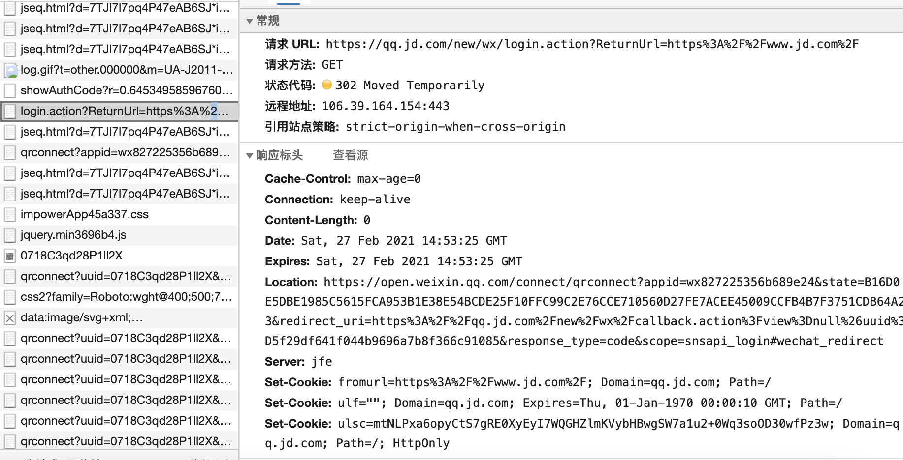
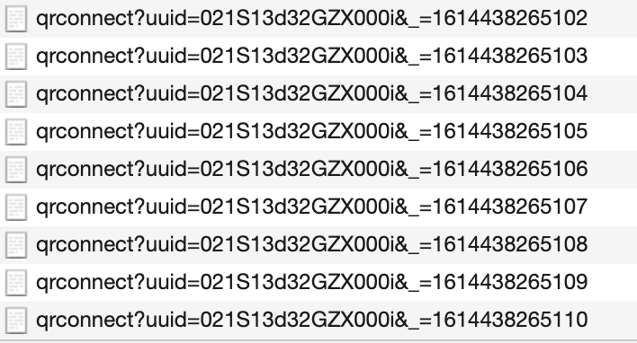
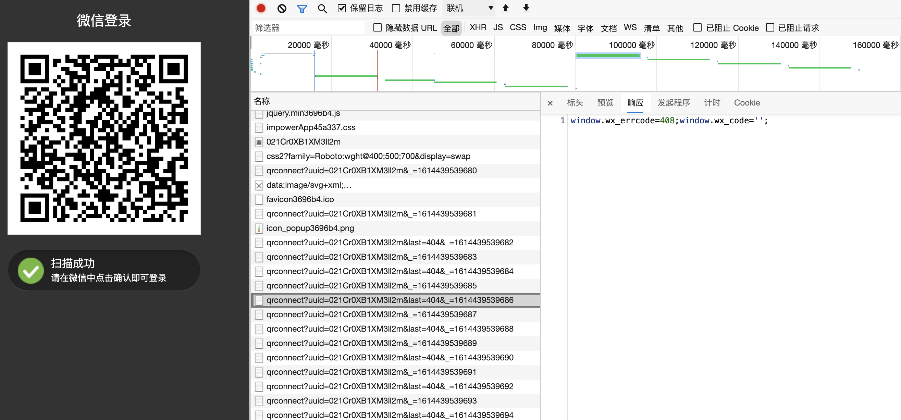
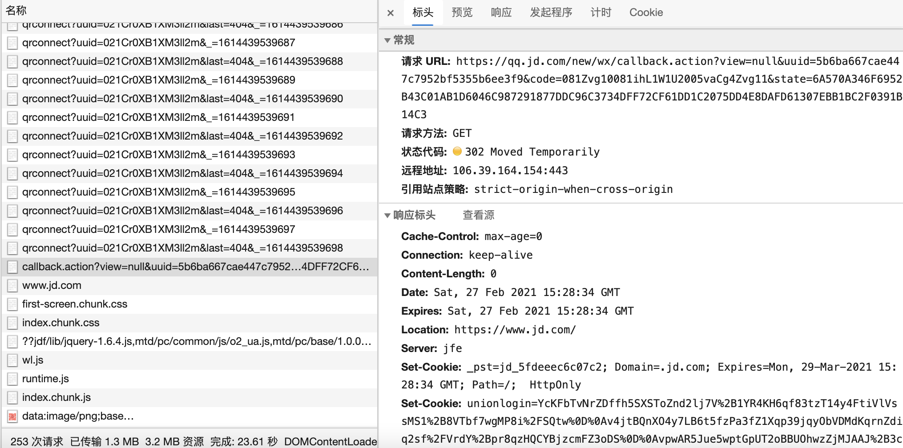

# 软件架构 MVC MVP MVVM

## MVC

软件可以分成三个部分。

- 视图（View）：用户界面。
- 控制器（Controller）：业务逻辑
- 模型（Model）：数据保存

通信方式:

1. View 传送指令到 Controller
2. Controller 完成业务逻辑后，要求 Model 改变状态
3. Model 将新的数据发送到 View，用户得到反馈


## MVP

MVP 模式将 Controller 改名为 Presenter，同时改变了通信方向。

1. 各部分之间的通信，都是双向的。

2. View 与 Model 不发生联系，都通过 Presenter 传递。

3. View 非常薄，不部署任何业务逻辑，称为"被动视图"（Passive View），即没有任何主动性，而 **Presenter**非常厚，所有逻辑都部署在那里。


## MVVM

MVVM 模式将 Presenter 改名为 ViewModel，基本上与 MVP 模式完全一致。唯一的区别是，它采用双向绑定（data-binding）：View的变动，自动反映在 ViewModel，反之亦然。[Angular](https://angularjs.org/) 和 [Ember](http://emberjs.com/) 都采用这种模式。


# 加密算法

## 哈希函数

标识原信息, 把任意长度的数据计算成固定长度的数据, 达到加密效果

- 不可逆(不能根据哈希值逆推出原内容)
- 不同内容的哈希值相同的概率相当小
- 原始内容的任意一点改变, 哈希值都会有巨大的不同

输入: 任意长

输出: 定长的信息摘要(Message Digest)

使用场景:

- 密码校验
- 文件校验

## MD5

Message Digest Algorithm MD5，消息摘要算法第五版

**返回值**

二进制 128bit <=> 32位十六进制数

**不足**

- 寻找一对碰撞(一对不同数据MD5值相同)的速度加快, 即安全性会有所降低
- 彩虹表
  - 是一个庞大的数据库，这个数据库里收集了着咱们所有人**常用的密码**，以及**这些密码对应的MD5值、SHA-X值等哈希值**（当然还有别的各种哈希算法的哈希值，不止MD5和SHA-X）
  - 主流彩虹表的大小一般都是100G以上

**应对**

- 复杂密码
- 简单密码复杂化(加盐)
  - 加盐: 在密码的任意位置插入一些指定的字符串（即盐值salt）的过程
    - 每个用户盐值唯一, 防止大面积被破解
    - 服务端为每个用户随机生成, 保存在数据库中
    - 分散插入密码中, 不要简单拼接

**开发中实际采用方案**

盐值由服务端生成并存储, 加盐可以由服务端或者客户端进行.

1. 客户端加盐
   1. 客户端调用接口请求盐值
   2. 客户端 MD5(pwd + salt)
   3. 客户端调用登录接口, 服务端保存密码
2. 服务端加盐
   1. 客户端MD5(pwd)
   2. 客户端调用登录接口
   3. 服务端 MD5(MD5(pwd) + salt), 服务端保存密码

**具体应用场景**

- 密码加密
- 数字签名

## SHA 家族算法

Secure Hash Algorithm，安全散列算法, 包括SHA-1、SHA-256等多种算法

### SHA-1

SHA-1算法和MD5算法都由 MD4算法导出，因此他们俩的特点、缺陷、应用场景基本是相同的。

返回值:

二进制 160bit <=> 40位十六进制数, 因此更加安全.

### SHA-2

可再分为六个不同的算法标准, 包括：SHA-224、SHA-256、SHA-384、SHA-512、SHA-512/224、SHA-512/256。

SHA-256

返回值 256bit <=> 64 位十六进制数


# 设计模式

## 发布订阅模式

## 单例模式

一个类只有一个实例, 并且可以全局访问。

如下实现有以下缺点：

1. 容易重名
2. 容易覆盖

```javascript
// obj 唯一 & 可全局访问
// 唯一是通过 let 变量不允许重复声明实现
let obj = {
  name : 'Bob', 
  getName(){}
}
```

先判断某类的实例是否存在, 存在则返回实例, 不存在则新建实例。

## 观察者模式

## 迭代器模式

## 构造器模式

## 外观模式


# 0227 面试课

## JS 三类循环对比以及性能分析

### for 循环及 ForEach 底层原理

稀疏数组

有很多方法比如 ForEach 等使用起来有问题

```javascript
new Array(10)
[10,,,40]
```

密集数组

```javascript
[10, 20, 30]
```

使用 var 声明, for 和 while 差不多, 类似于 let 的 while.

使用 let 声明, for 比 while 快, 因为 let 声明不是全局, 是块级, 每一次循环都会释放 i. 而 var/let 声明是全局的, 消耗更大, 但是本质没有区别.

for 循环

明确知道循环多少次.

while 循环

不知道循环多少次, 条件达到即可.

ForEach(fn, thisVal) 

比 for 性能差一些, 推荐的原因是看中其函数式编程(更多看中结果, 对过程进行封装, 使用方便, 但是无法管控过程, 性能有所消耗, 多做很多操作). 与之对应的是命令式编程, 看中过程, 对过程掌控更好.

实现 ForEach

```

```

for in 性能最差

迭代当前对象的所有可迭代对象, 私有属性基本上是可迭代, 某些公有属性{出现在原型链上的属性}也可迭代. 因此查找时一定会遍历原型链的所有属性(可或者不可迭代属性).

问题: 

- 遍历顺序以数字优先
- 无法遍历 Symbol 属性
  - 查看浏览器是否兼容 Symbol. If(typeof Symbol !== 'undefined') 浏览器支持 Symbol
- 可以遍历到公有中可枚举的
  - 过程是先找私有属性, 再找公有属性. 因此可以当 hasOwnProperty 不满足时, break 循环

Object.keys() 拿到当前对象的非Synbol 私有属性

Object.getOwnPropertySynbols() 拿到当前对象的 Synbol 私有属性

console.dir()/ dir 详细输出一个对象

for of 循环

比 for in 好一点. 按照迭代器规范进行规范.

 迭代器: 一种规范, 想迭代当前结构该怎么迭代. 部分数据结构实现了迭代器规范, 所有有 [Symbol.iterator] 属性的数据结构都实现了迭代器规范.

实现的数据结构: 数组/部分类数组(arguments)/Set/Map...[对象没有实现]

#### this

函数执行的主体, 即是谁执行函数的, 谁与函数不一定有关系.

与函数在哪创建的和在哪执行的无关. 不一定方法要在 this 指向的对象上.

```

```

构造函数中的 this 是创建的实例

给当前元素的添加事件, 触发事件后, 调用函数.

```javascript
document.body.addEventListener('click', function(){
  console.log(this);
  // document.body
})
```

箭头函数中 this 是所处上下文的 this

call/apply/bind 显示指定 this

鸭子类型

Array.prototype.slice() 浅拷贝

扫码登录/单点登录

### for in 循环的 BUG 及解决方案

## this 以及应用场景

## 输入 url 到页面呈现发生了什么

## 项目难点以及两点


# 业务/设计

## 扫码登录原理

> 网站内嵌二维码微信登录

点击京东登录页面的微信登录按钮, 跳转到一张展示微信二维码的页面

原理: 点击微信登录按钮后, 发送一条请求到京东服务器, 返回 302 暂时重定向到一个新的 url.



再访问这个 Location 对应的 url, 京东服务器返回一张微信二维码图片的 url.


显示二维码之后, 浏览器发请求轮询微信服务器, 用户是否同意登录.

当返回中的 wx_code (授权临时票据)是空时, 说明未登录.


uuid 不断自增, 浏览器在轮询服务器.



用户扫码后, 浏览器从缓存中获取图片, 更新二维码样式为扫描成功, 并且继续轮询微信server 用户的登录状态.



手机点击授权同意, 改变了用户登录状态, 则浏览器轮询后微信服务器返回 code. 浏览器带着 code 请求自己(京东)服务器. 得到 302 后(也设置了 Cookie)重定向到京东首页, 登录成功.



**授权流程**

当得到用户 `code` 之后，来向微信开放平台通过`code` 加上 `appid` 和 `appsecret`来换取 `access_token`。

下述代码就是我们开头提到的，`appid` 后续会使用到

```javascript
https://open.weixin.qq.com/connect/qrconnect?
appid=wx827225356b689e24
&state=16C44408BCCE66A99882ECB2D85A86567BAA2F274D7E27D688CE2D484A4381D35AFFAD49FD54FB2CA9C787D88B61DE8B
&redirect_uri=https%3A%2F%2Fqq.jd.com%2Fnew%2Fwx%2Fcallback.action%3Fview%3Dnull%26uuid%3Dd7f9f509608744c4aa64c4116896ba5f
&response_type=code
&scope=snsapi_login
复制代码
```

在获得了 `access_token` 后就可以解析用户的一些基本信息，包括头像、用户名、性别、城市等。这样一来，整个微信扫描登录的过程就完成了。

原理图:


补充链接: [微信官方登录原理](https://developers.weixin.qq.com/doc/oplatform/Website_App/WeChat_Login/Wechat_Login.html) [掘金文章](https://juejin.cn/post/6924218259302694919?utm_source=gold_browser_extension)


