# React 面试题 0313 珠峰直播课

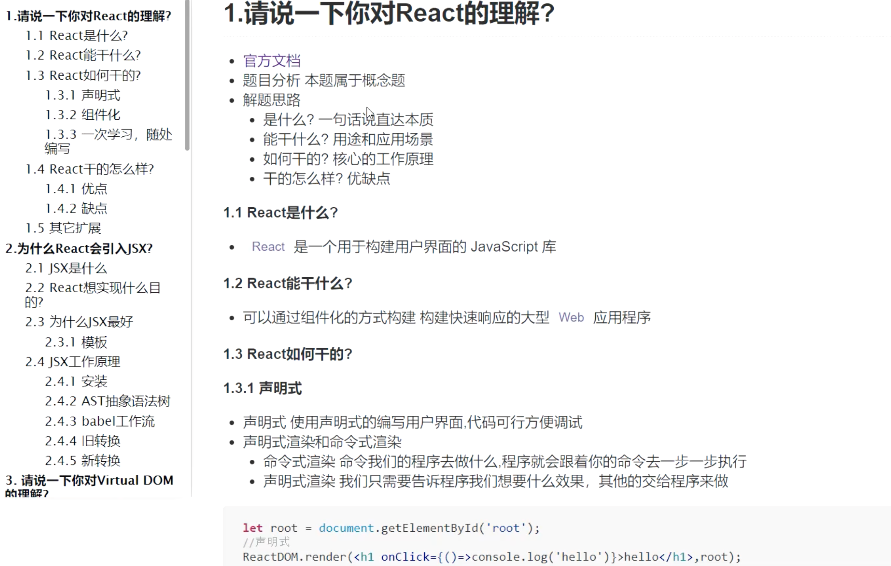

对 React 理解


# React 认识(视频0307)

UI = React(state)

React 这个函数接受 state 这个参数, 当函数调用(this.setState)的时候, 就会产生当前看见的 UI.

state 计算状态变化, fn(React) 将状态变化渲染在视图中.

state 被称为 `reconciler`, fn 被称为 `render`(渲染器). 

- reconciler 中执行 reconcile 算法(diff). 
- render 有 React Native 渲染器(状态变化渲染进原生APP), ReactDOM 渲染器(状态变化渲染进浏览器视图)

## 一次状态更新

用户交互触发了 `this.setState`

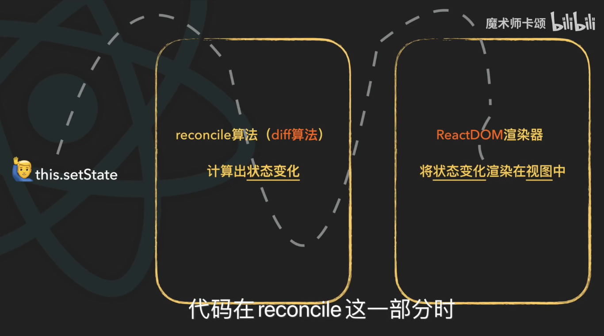

代码在 reconcile 这部分时, 被称作 `render` 阶段, 因为组件的 `render` 函数在该阶段被调用

 代码在渲染器这部分执行时,  被称为 `commit` 阶段, 因为状态变化的提交就在这个阶段.

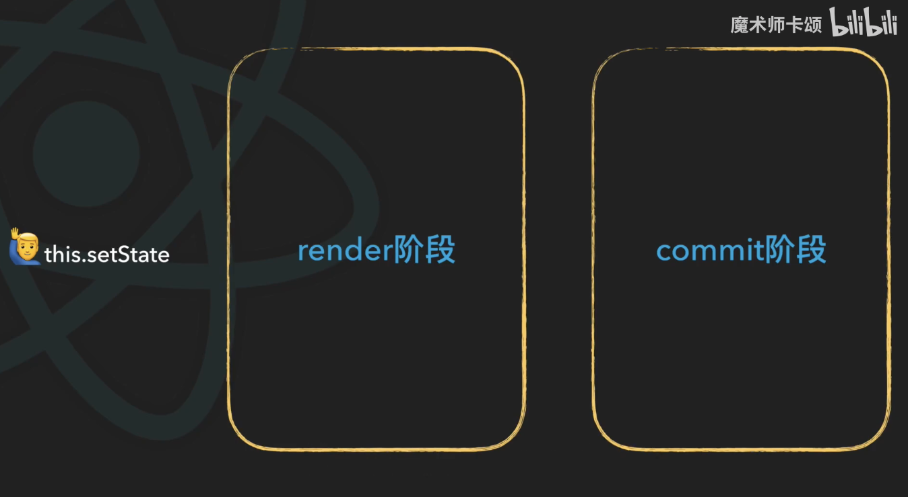

## 生命周期与两种阶段的对应关系

### 大致划分

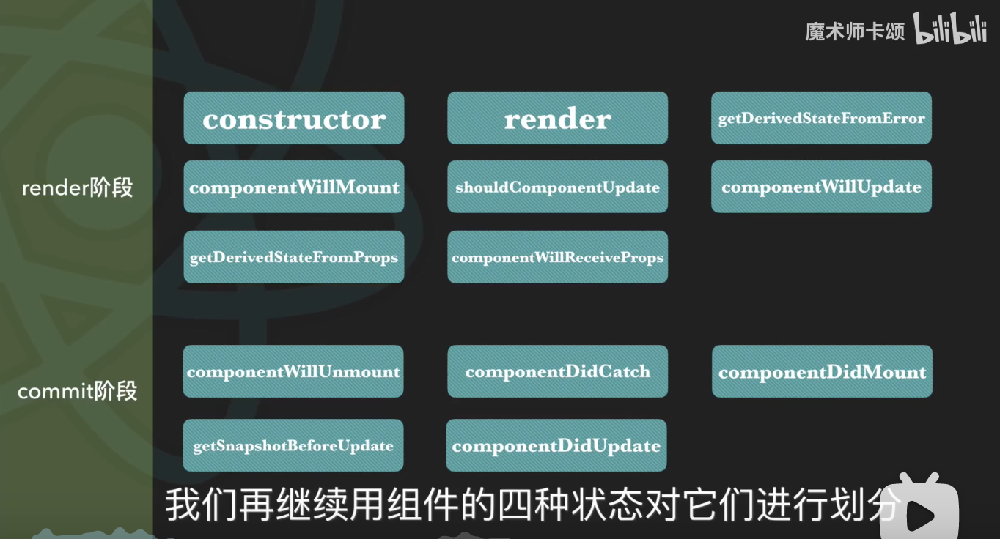

### 根据组件的四种状态进行划分, 首次挂载/更新/卸载/报错

红色的是 React 17 中被废弃的, 绿色的是 React 17 新增的, 一个组件中同时使用红色与绿色钩子会报错.

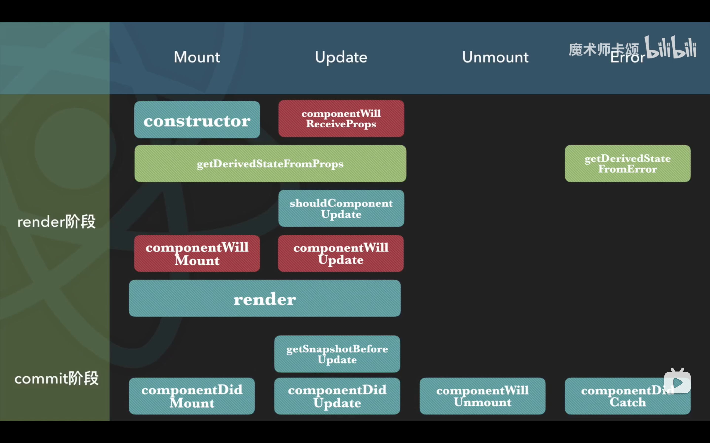

首次渲染时

- 会首先调用 constructor, 再调用 getDerivedStateFromProps , 再调用 render 函数结束后, render 阶段结束.

- 进入 commit 阶段,  完成了对应的 DOM 渲染后, 调用 componentdDidMount.

## 组件

react 中组件以树的形式存在的, 组件会形成一棵组件树. 

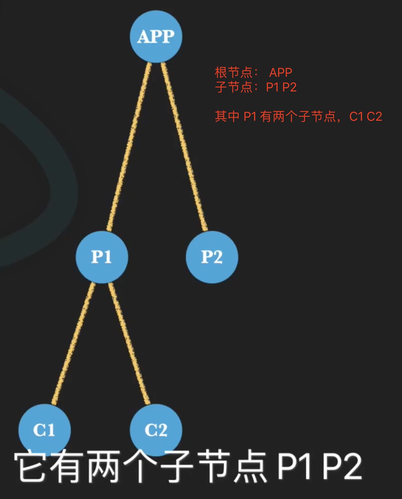


### 组件的首次渲染

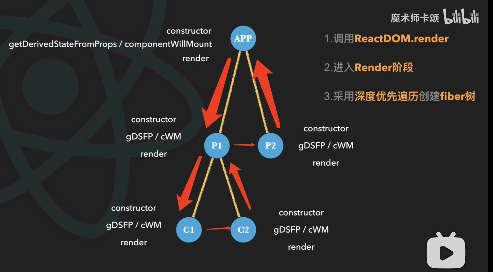

Fiber 树就是平时说的虚拟 Dom 树.

Fiber 树的具体创建过程:

1. 创建第一个节点 APP, 调用它的三个生命周期函数
2. 查找 APP 有没有子节点,  发现了 P1 子节点, 创建并调用三个生命周期函数
3. 查找 P1 有没有子节点,  发现了 C1 子节点, 创建并调用三个生命周期函数
4. C1 没有自己的子节点, 于是寻找 C1 的兄弟节点, 找到 C2, 创建并调用三个生命周期函数
5. C2 没有子节点也没有兄弟节点, 就回到自己的父级节点 P1
6. P1 的所有子节点已经完成了 render 阶段, 于是寻找 P1 的兄弟节点, 找到了 P2 , 创建并调用三个生命周期函数
7. P 2 没有子节点也没有兄弟节点, 于是回到 P2 的父级节点 APP

`render` 阶段完成.

进入 `commit` 阶段.

首先会将整棵 fiber 树对应的 DOM 渲染到视图中, 渲染完成后, 会从**子节点**开始执行对应的生命周期函数. 

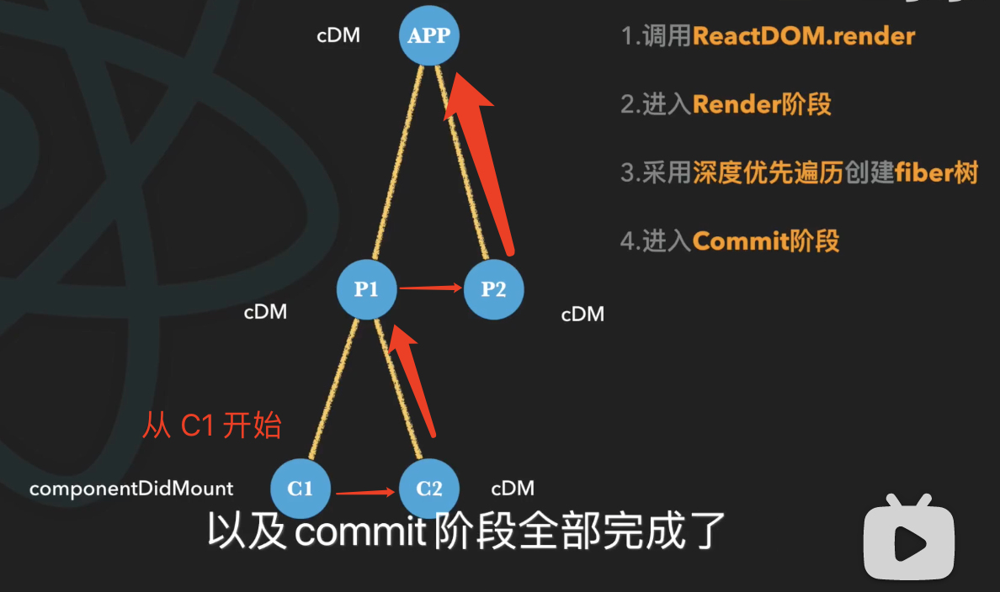

1. 第一个子节点是 C1, 执行 componentDidMount
2. C2
3. P1
4. P2
5. APP  

至此, 首屏渲染的 render 阶段和 commit 阶段全部完成.

### 组件交互触发 this.setState

用户在 C2 节点进行了一次交互, 调用 `this.setState`, 交互结果是将  C2 节点从蓝色变成绿色.

于是重新进入 `render` 阶段, 同样, 采用深度优先遍历的方式创建一棵 `fiber` 树.

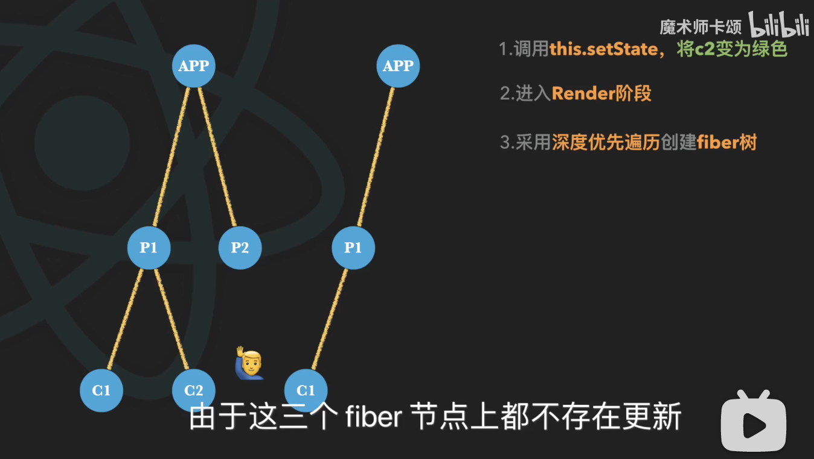

先创建 APP, 再创建 P1, 再创建 C1, 由于这三个节点都没有更新, 所以不会调用对应的生命周期函数.

每次调用 this.setState 时, 都会创建一棵完整的 fiber 树.

当创建 C2 时, 经过 reconcile 算法发现 C2 从蓝色变成了绿色(和之前的树进行比较), 所以需要标记这次变化.

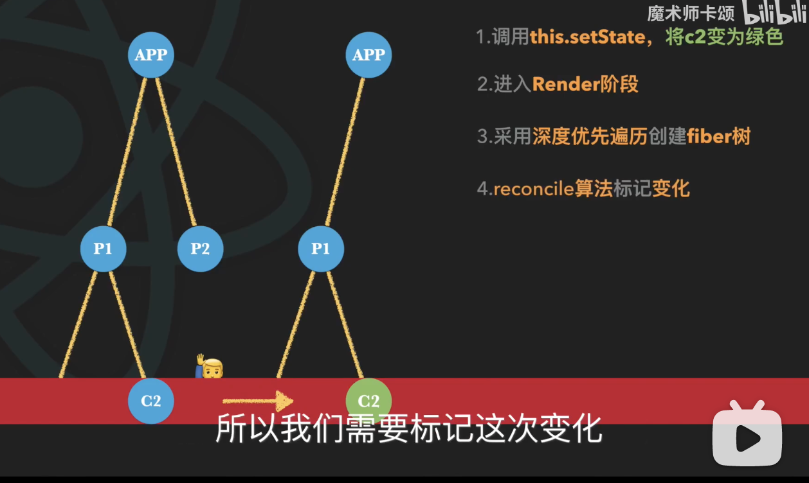

接着调用 C2 对应的生命周期函数(getDerivedStateFromProps render). 然后继续 render 阶段, 创建 P2. 当 render 阶段结束之后, 进入 commit 阶段.

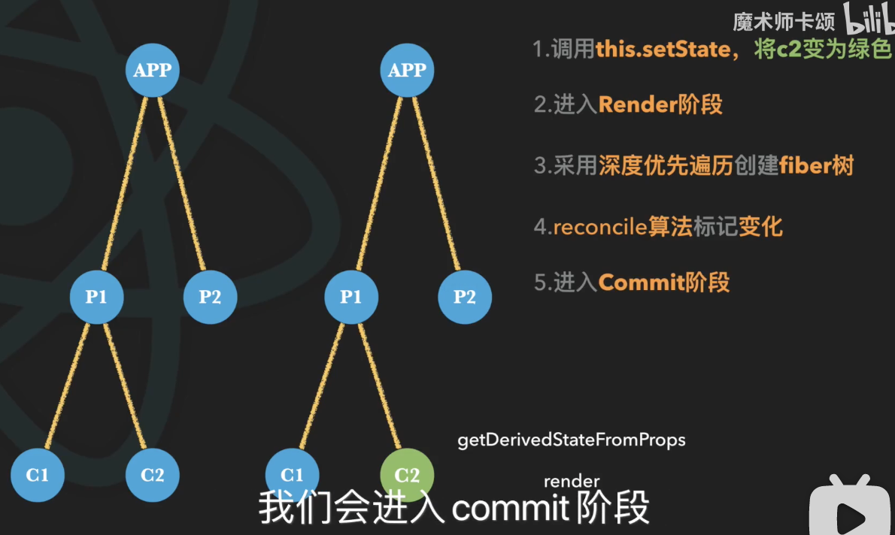

执行步骤 4 中的变化对应的视图操作. 这里会将 C2 对应的 DOM 组件颜色从蓝色变成绿色, 再执行 C2 对应的生命周期函数.

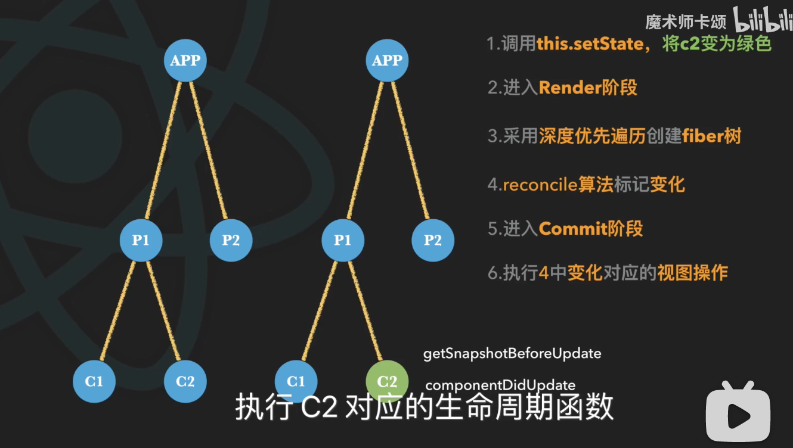

执行完之后, 新创建的 fiber 树就会替换之前的那棵 fiber 树, 等待下一次调用 this.setState 再生成一棵新的 fiber 树.

这就是源码中 render 阶段和 commit 阶段的完整流程, 以及在这个过程中调用的生命周期函数

# this.setState 同步异步?

获取渲染之后的值, 类组件可以在 `componentDidMount` 和 `componentDidUpdate` 获取, 函数组件可以在 `useEffect` 的回调函数中获取.

## React 的不同模式表现不同

- legacy 模式(ReactDOM.render)
  - 异步, React 有批处理(batchedUpdates)的性能优化机制
  - 使用 setTimeout 跳出 batchedUpdates, 则是同步
- concurrent 模式: 都是异步

## 异步更新

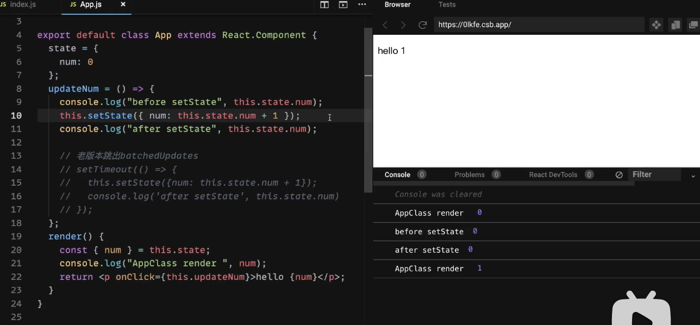

更新合并

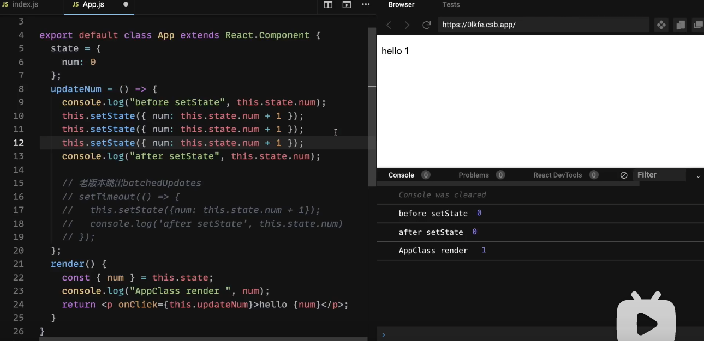

## 同步更新

使用 `setTimeout`

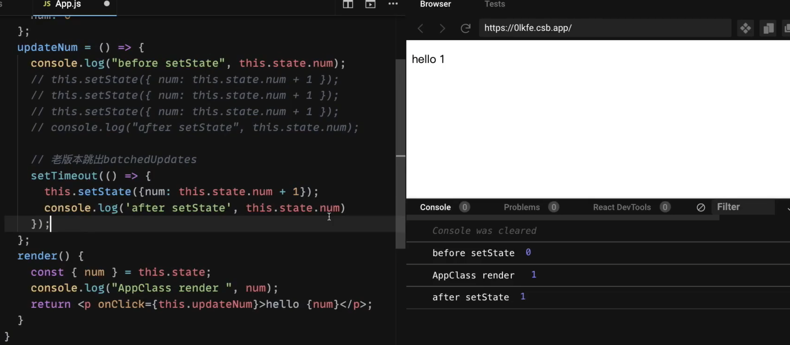

# useEffect(fn, []) 和 componentDidMount 有什么区别?

其实是问 fn 与 componentDidMount 的执行时机有什么不同, 且 useEffect(fn, []) 中 fn 的执行依赖于第二个参数.

1. useEffect 第二个参数 [] 如何影响 fn 的执行
2.  fn 与 componentDidMount 的执行时机

React中, `render` 阶段通过 `effect` 数据结构(新版中叫 `flags`)将状态变化传递给 `commit` 阶段.

- 对于要**插入 DOM** 的元素, 会在对应的 fiber 节点上添加 `Placement` 的 effect
- 对于需要**更新 DOM** 的元素, 会在对应的 fiber 节点上添加 `Update` 的 effect
- 对于需要**删除 DOM** 的元素, 会在对应的 fiber 节点上添加 `Deletion` 的 effect
- 对于需要**更新 ref 属性**的 DOM, 会在对应的 fiber 节点上添加 `Ref` 的 effect
- 对于**包含 useEffect 回调执行**的 fiber 来说, 会在对应的 fiber 节点上添加 `Passive` 的 effect

即: 所有与视图有关的操作, 都有相关的 effect.

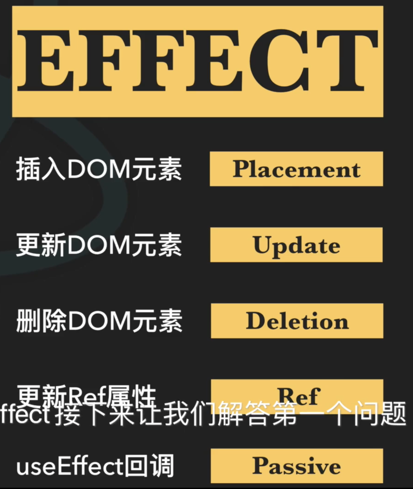


> useEffect 第二个参数 [] 如何影响 fn 的执行
>
> 即: 如何影响对应的 fiber 创建 Passive effect ?

`useEffect(fn)`

函数组件使用该种 useEffect, 那么每次 `render` 时都会创建一个 Passive effect.

`useEffect(fn, [])`

会在 `mount` 时创建 Passive effect

`useEffect(fn, [dep])`

会在 `mount` 时以及`依赖项变化时`创建 Passive effect

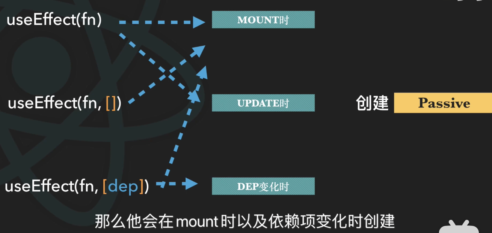

类组件

在 mount 时创建 placement 的 effect

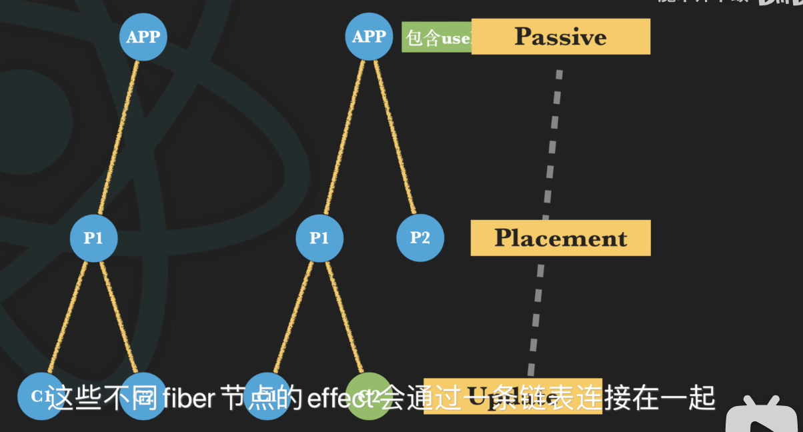

`render` 阶段与 `commit` 阶段传递的是一条包含了不同 fiber 节点的 effect 的链表.

> commit 阶段处理链表上的 effect

将状态变化渲染在视图中->将 effect 渲染在视图中 , 大概分为三个阶段:

- 渲染视图前(beforeMutation 阶段)
- 渲染视图(mutation 阶段)
- 渲染视图后(layout 阶段)

Placement: 

- 在 mutation 阶段执行对应 DOM 节点的 appendChild 操作, 这样 DOM 节点就会被插入到视图中.
- 在 layout 阶段调用 componentDidMount 

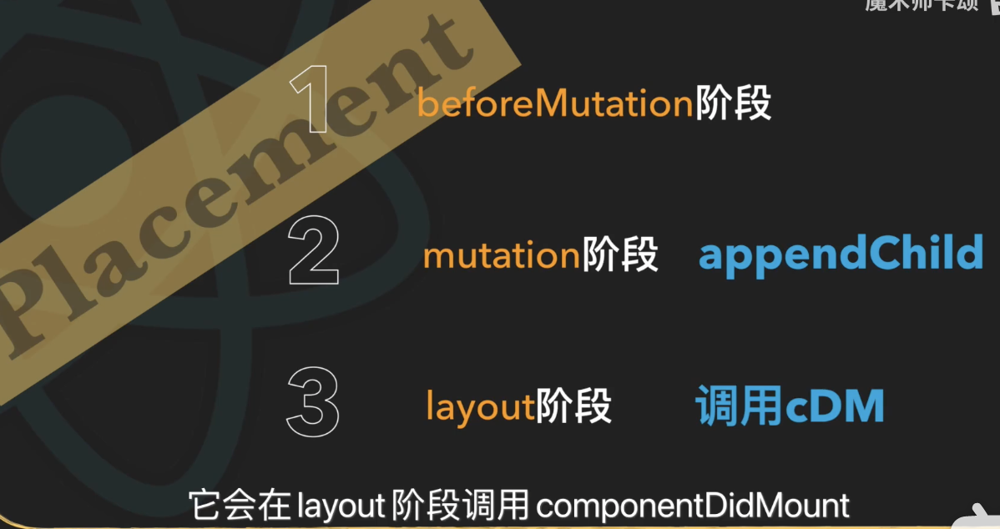

Passive:

三个子阶段执行完成以后, 异步调用 useEffect 的回调函数.

因此总结:

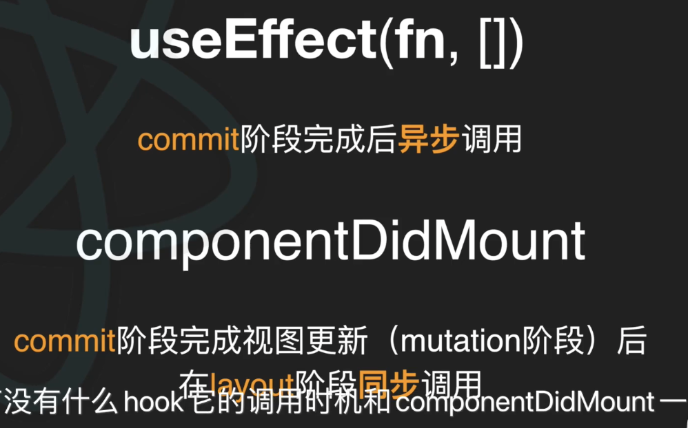

调用时机与 cDM 一致的 hook

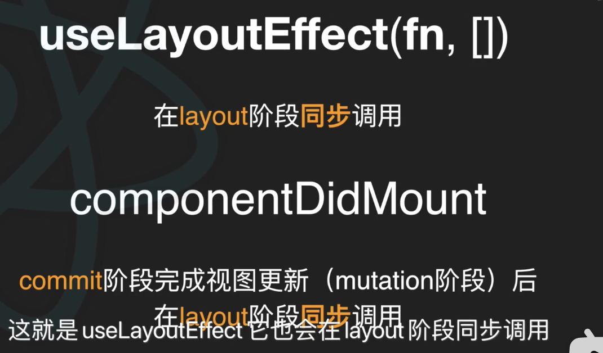


# 合成事件


# 前端路由

## 解决问题

- 页面跳转白屏，刷新缓慢
- 在某些场合中，用ajax请求，可以让页面无刷新，页面变了但Url没有变化，用户就不能复制到想要的地址
- 加大服务器的压力，代码冗合。

前端路由缺陷：使用浏览器的前进，后退键时会重新发送请求，来获取数据，没有合理地利用缓存。但总的来说，现在前端路由已经是实现路由的主要方式了。

因此:

全栈项目成为了这样的实现：

1. 后端服务器定义数据返回API；
2. 前端构建SPA应用，调用接口并基于MVVM进行双向数据绑定渲染
3. 前端路由实现无刷新内容更新

需求:页面无刷新更新挂载节点的内容

变化点: location

即点击一个跳转链接后, url 发生变化, 该变化对应着一个挂载点的内容(对应更新).

- （很自然的，我们需要一个路由表，即路径与挂载点内容的k-v，可用通过json实现）

找到合理的钩子函数： （现而今主要是hashchange/popstate）

## 技术实现

传统后端路由每次跳转都刷新页面，另发起一个新的请求，会给用户带来的白屏、耗时等较差体验。

因此前端路由采用的是立即加载的方式，不再向服务器请求，而是加载路由对应的组件. 而这种思路的实现主要采用两种方案：hashchange 以及 history

- hash
  1. 基於hashchange事件，通過window.location.hash 获取地址上的hash值
  2. 通过构造Router类，构造传参配置routes对象设置hash与组件内容的对应
- history
  1. 借助vue的mvvm，通过vue中的data的current来设置要渲染的router-view，从而达到动态的spa

#### 

浏览器提供 history hash API, 通过地址栏的地址变更, 更换单页应用里的渲染内容.

一般情况下, 地址栏输入地址浏览器会发送http请求.

有了 hash 和 history 之后, 变更地址栏内容的同时, 避免它发送http请求, 页面并没有重新被加载, 只是改变了url的外貌/字符串的内容, 通过监听字符串内容的改变事件, 告诉单页应用改变或者渲染对应内容.

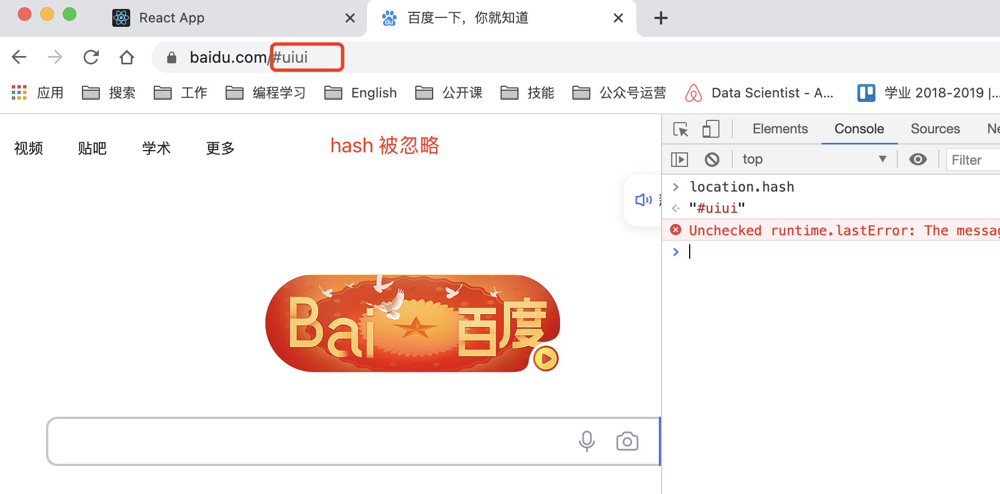

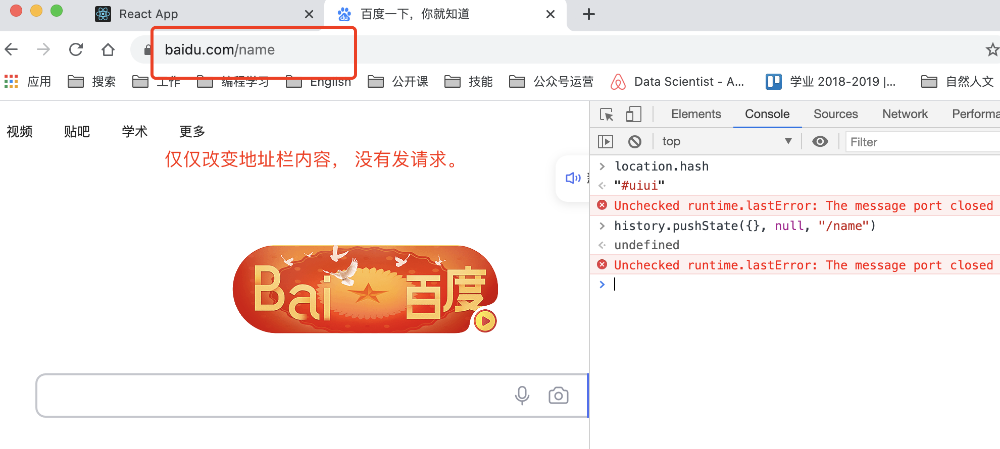

history.go() 以当前地址栏的 URL 为准, 刷新页面

history.back() 模拟浏览器左箭头, 回退到上一个url 进行请求并刷新.


# React 路由

browser 路由(基于 history)

通过 hash 方式更改当前 url

重置 url 实现更改

通过 `window.location = "foo"` 更改路由方式实现当前域名下路径的跳转, 即页面跳转, 同时页面刷新(刷新按钮会转圈).

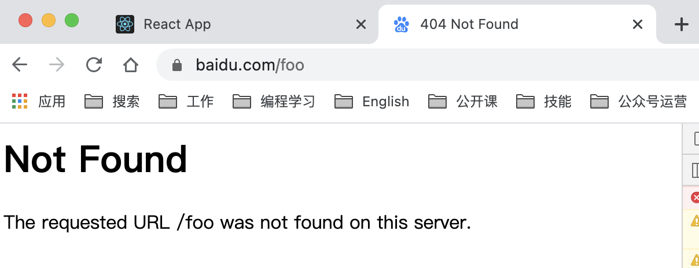

取代 location 跳转的方式

H5 新增的 API 接口

`history.pushState({name:'Bob'}, null, '/hello')`


前端 broswer 路由就是由 pushState 实现的

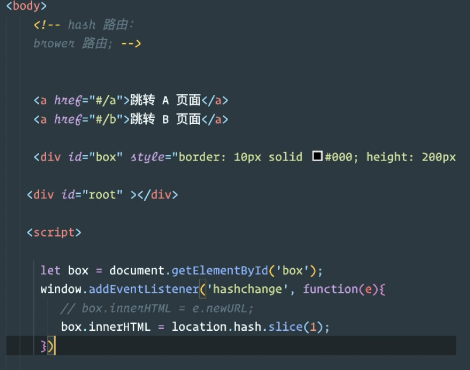

# React 项目创建

使用官方脚手架

1. npx create-react-app 命令

   `npx create-react-app <项目名>`

   例如 npx create-react-app my-app，当前目录会出现一个 my-app 的项目。

   ```shell
   Need to install the following packages:
     create-react-app
   Ok to proceed? (y) y
   
   Creating a new React app in /Users/jinlingzhang/Documents/personal/myapp.
   
   Installing packages. This might take a couple of minutes.
   Installing react, react-dom, and react-scripts with cra-template...
   ```

   进入并启动项目

   cd my-app && npm run start

2. npm 命令

   (sudo) npm install -g create-react-app

   create-react-app <项目名>

# 基础知识

##  React 认识

### 定义

- React 是 Facebook 在 2011 年开发的前端 JavaScript 库。
- 它遵循基于组件的方法，有助于构建可重用的UI组件。
- 它用于开发复杂和交互式的 Web 和移动 UI。
- 尽管它仅在 2015 年开源，但有一个很大的支持社区。

### 特点

1. 它使用***虚拟 DOM*** 而不是真正的 DOM。
2. 它可以进行**服务器端渲染**。
3. 它遵循**单向数据流**或数据绑定。

### 优点

1. 性能。提高应用性能
2. 两端。可以方便地在客户端和服务器端使用
3. 可读性。由于 JSX，代码的可读性很好
4. 集成容易。React 很容易与 Meteor/Angular 等其他框架集成
5. 测试便利。使用 React，编写 UI 测试用例变得非常容易

### 限制

1. React 只是一个库，而不是一个完整的框架，是 MVC 模型中的 V 层（视图层）。
2. 它的库非常庞大，需要时间来理解
3. 新手程序员可能很难理解
4. 编码变得复杂，因为它使用内联模板和 JSX

## React 与 Angular 区别

| **主题**      | **React**            | **Angular**   |
| ------------- | -------------------- | ------------- |
| *1. 体系结构* | 只有 MVC 中的 View   | 完整的 MVC    |
| *2. 渲染*     | 可以进行服务器端渲染 | 客户端渲染    |
| *3. DOM*      | 使用 virtual DOM     | 使用 real DOM |
| *4. 数据绑定* | 单向数据绑定         | 双向数据绑定  |
| *5. 调试*     | 编译时调试           | 运行时调试    |
| *6. 作者*     | Facebook             | Google        |

## JSX(JavaScript XML)

- 是 React 使用的一种文件，它利用 JavaScript 的表现力和类似 HTML 的模板语法,这使得 HTML 文件非常容易理解。
- 此文件能使应用非常可靠，并能够提高其性能。
- 是 JS 的语法扩展，在 react 中可替换常规的 js, 使用 js 方式描述视图 编译后转化成普通的 JS 对象。

**JSX 是什么?**

是 JS 的语法扩展，在 react 中可替换常规的 js, 使用 js 方式描述视图

为什么使用?

- 更快的执行速度

  使用该种方式容易出错, 需要详细了解 React.createElement

  ```react
  class HelloMessage extends React.Component {
    render() {
      return React.createElement(
        "div",
        null,
        "Hello this.props.name}"
      );
    }
  }
  
  ReactDOM.render(React.createElement(HelloMessage, { name: "Taylor" }), document.getElementById('hello-example'));
  ```

- 代码写的更快/开发效率

- 编译器做严禁转换和类型检测

- 类型安全

vdom 描述 DOM 结构的 js 对象

注意：

浏览器无法读取 JSX，因为浏览器只能读取普通的 JS 对象，JSX 需要使用 Babel 这样的 JSX 转换器才能转换为 JavaScript 对象。

示例：

```jsx
render(){
    return(        
        <div>
            <h1> Hello World from Edureka!!</h1>
        </div>
    );
}
```

## Virtual DOM

### Real DOM && Virtual DOM

| **Real DOM**                   | **Virtual DOM**                |
| ------------------------------ | ------------------------------ |
| 1. 更新缓慢。                  | 1. 更新更快。                  |
| 2. 可以直接更新 HTML。         | 2. 无法直接更新 HTML。         |
| 3. 如果元素更新，则创建新DOM。 | 3. 如果元素更新，则更新 JSX 。 |
| 4. DOM 操作代价很高。          | 4. DOM 操作非常简单。          |
| 5. 消耗的内存较多。            | 5. 很少的内存消耗。            |

### Virtual DOM 工作原理

基本信息：

1. 一个轻量级的 JavaScript 对象，它最初只是 Real DOM 的副本。
2. 是一个节点树，它将元素、它们的属性和内容作为对象及其属性。
3. React 的渲染函数从 React 组件中创建一个节点树。然后它响应数据模型中的变化来更新该树，该变化是由用户或系统完成的各种动作引起的。 

工作过程（三个步骤）：

1. 当底层数据发生变化时，整个 UI 都在 Virtual DOM 描述中重新渲染。
2. 计算之前的 Real DOM 与新的 Virtual DOM 之间的差异。
3. 计算完成后，将实际需要修改的内容更新到 Real DOM 中。


# React 组件

## 定义

组件是 React 应用 UI 的构建块。

- 复用性。这些组件将整个 UI 分成小的独立并可重用的部分。
- 独立。每个组件彼此独立，而不会影响 UI 的其余部分。

## 组件中 Render() 作用

- 每个 React 组件强制要求必须有一个 **render()**。
- 返回一个 React 元素，是原生 DOM 组件的表示。
- 如果需要渲染多个 HTML 元素，则必须将它们组合在一个封闭标记内，例如 `<form>`、`<group>`、`<div>` 等。
- 此函数必须保持纯净，即必须每次调用时都返回相同的结果。

## 多个组件嵌入一个组件

```react
class MyComponent extends React.Component{
    render(){
        return(          
            <div>
                <h1>Hello</h1>
                <Header/>
            </div>
        );
    }
}

class Header extends React.Component{
    render(){
        return <h1>Header Component</h1>   
   };
}

ReactDOM.render(
    <MyComponent/>, document.getElementById('content')
);
```

## 属性 Props

- 只读组件，不可变。
- 在整个应用中从父组件传递到子组件。子组件永远不能将 `prop` 送回父组件。这有助于维护单向数据流，通常用于呈现动态生成的数据。

### prop drilling

在构建 React 应用时，在多层嵌套组件中使用另一个嵌套组件提供的数据，最简单的方法就是将 `props` 从每个组件一层一层地传下去，从源组件传到深层嵌套组件。

解决方法：

使用 `React Context`。通过定义提供数据的 `provider` 组件，并允许嵌套的组件通过 `Consumer` 组件或者 `useContext Hook` 使用上下文数据。

**React Context**

通过组件树提供了一个传递数据的方法，从而避免了在每一层手动传递 `props` 属性。

## 状态 State

- React 组件的核心，是数据的来源，必须尽可能简单。
- 基本上状态是确定组件呈现和行为的对象。
- 与 props 不同，它们是可变的，并创建动态和交互式组件。可以通过 `this.state()` 访问它们。
- 只能在组件的构造函数处分配，视作组件的私有属性，由组件完全控制。

### 事务（Transaction）

React 中的一个调用结构，用于包装一个方法，结构为: **initialize - perform(method) - close**。通过事务，可以统一管理一个方法的开始与结束；处于事务流中，表示进程正在执行一些操作；

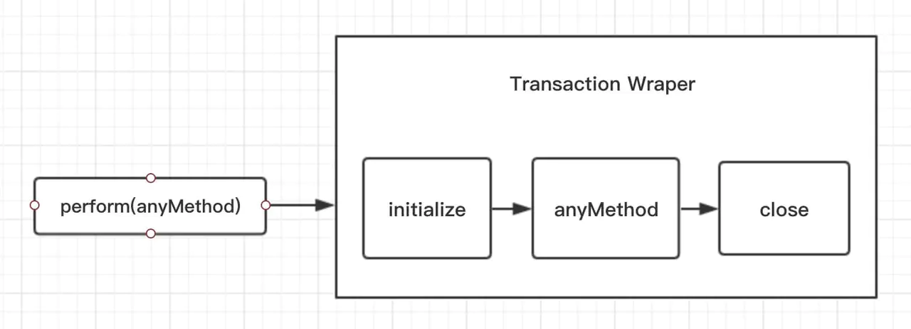

### setState()

**示例：**使用 `this.setState()` 而不是直接修改，直接修改是不会重新渲染组件的（比如：this.state.value = 4）。

```react
class MyComponent extends React.Component {
  constructor() {
    super();
    this.state = {
      name: 'Maxx',
      id: '101'
    }
  }
  render () {
    // 2s 后 name 和 id 变化
    setTimeout(() => { this.setState({ name: 'Jaeha', id: '222' }) }, 2000)
    return (
      <div>
        <h1>Hello {this.state.name}</h1>
        <h2>Your Id is {this.state.id}</h2>
      </div>
    );
  }
}
ReactDOM.render(
  <MyComponent />, document.getElementById('content')
);
```

**作用**：接受组件状态更新，告诉 React 该组件及其子组件需要被重新渲染。

将 setState() 视作请求而不是更新组件而立即执行的命令，React 为了性能，在一次遍历中只会更新部分组件，并不会立刻将所有状态改变立即渲染。

**特点**：

- `setState()` 不会总是立刻更新组件（异步）。因此如果要读取更新后的状态，可以使用 `setState()` 的回调函数或者 `componentDidUpdate()` 。 
- `setState()` 总是会导致重新渲染，除非 `shouldComponentUpdate()` 返回 false。

**语法**：

```javascript
setState(updater, [callback])
```

- 第一个参数 updater 是 function

  ```javascript
  (state, props) => stateChange
  ```

  state 是一个应用改变之后的状态，应该是一个基于传入的 state 和 props 的 **新对象**。

  ```javascript
  this.setState((state, props) => {
    return { counter: state.counter + props.step };
  });
  // 函数返回值是后面会浅合并进 state 的对象
  ```

  也可以直接传对象而不是一个函数，这个对象后面会**浅合并**至当前 state 形成新的 state，当 state 是一个多键值的结构时，可以单独更新某些键值，此时 React 会进行“差分”更新，不会影响其他的属性值。

  ```javascript
  setState(stateChange[, callback])
  
  // 示例
  this.setState({quantity: 2})
  ```

- 第二个参数 回调函数

  `setState` 完成并且组件重新渲染之后才会调用的，建议使用 `componentDidUpdate()` 处理类似逻辑。

> 注意
>

1. **事件合并**

   为了性能，React 可能会将多次 setState 调用合并为一次更新。

   > multiple calls during the same cycle may be batched together。

   类似于下面：

   ```javascript
   Object.assign(
     previousState,
     {quantity: state.quantity + 1},
     {quantity: state.quantity + 1},
     ...
   )
   ```

   后面的调用覆盖前面的调用，因此如果**更新的 state 与当前的 state 有关**，建议传参采用 `updater` function 形式。

   > Subsequent calls will override values from previous calls in the same cycle, so the quantity will only be incremented once. If the next state depends on the current state, we recommend using the updater function form.

   ```javascript
   this.setState((state) => {
     return {quantity: state.quantity + 1};
   });
   ```

2. **异步**

   由 React 控制的事件处理过程 setState 不会同步更新 this.state，也就是说，在 React 控制之外的情况， setState 会同步更新 this.state。

**补充：**

- **异步与同步**: `setState`并不是单纯的异步或同步，这其实与调用时的环境相关:
  - 在 **合成事件** 和 **生命周期钩子(除 componentDidUpdate)** 中，`setState` 是"异步"的；
    - **原因**: 因为在 setState 的实现中，有一个判断: 当更新策略正在事务流的执行中时，该组件更新会被推入 `dirtyComponents` 队列中等待执行；否则，开始执行 `batchedUpdates` 队列更新；
      - 在生命周期钩子调用中，更新策略都处于更新之前，组件仍处于事务流中，而`componentDidUpdate`是在更新之后，此时组件已经不在事务流中了，因此则会同步执行；
      - 在合成事件中，React 是基于 **事务流完成的事件委托机制** 实现，也是处于事务流中；
    - **问题**: 无法在`setState`后马上从`this.state`上获取更新后的值。
    - **解决**: 如果需要马上同步去获取新值，`setState`其实是可以传入第二个参数的。`setState(updater, callback)`，在回调中即可获取最新值；
  - 在 **原生事件** 和 **setTimeout** 中，setState 是同步的，可以马上获取更新后的值；
    - **原因**: 原生事件是浏览器本身的实现，与事务流无关，自然是同步；而`setTimeout`是放置于定时器线程中延后执行，此时事务流已结束，因此也是同步；
- **批量更新**: 在 **合成事件** 和 **生命周期钩子** 中，`setState`更新队列时，存储的是 **合并状态**(`Object.assign`)。因此前面设置的 key 值会被后面所覆盖，最终只会执行一次更新；
- **函数式**: 由于 Fiber 及 合并 的问题，官方推荐可以传入 **函数** 的形式。`setState(fn)`，在`fn`中返回新的`state`对象即可，例如`this.setState((state, props) => newState)；`
  - 使用函数式，可以用于避免`setState`的批量更新的逻辑，传入的函数将会被 **顺序调用**；
- **注意事项**:
  - setState 合并，在 合成事件 和 生命周期钩子 中多次连续调用会被优化为一次；
  - 当组件已被销毁，如果再次调用 setState，React 会报错警告，通常有两种解决办法:
    - 将数据挂载到外部，通过 props 传入，如放到 Redux 或 父级中；
    - 在组件内部维护一个状态量 (isUnmounted)，`componentWillUnmount`中标记为 true，在`setState`前进行判断；


## **Props 与 状态的区别**

| **条件**                | **State**     | **Props**     |
| ----------------------- | ------------- | ------------- |
| 1. 从父组件中接收初始值 | Yes           | Yes           |
| 2. 父组件可以改变值     | **<u>No</u>** | Yes           |
| 3. 在组件中设置默认值   | Yes           | Yes           |
| 4. 在组件的内部变化     | Yes           | <u>**No**</u> |
| 5. 设置子组件的初始值   | Yes           | Yes           |
| 6. 在子组件的内部更改   | **<u>No</u>** | Yes           |

## 有状态组件（有 State）与无状态组件（无 State）

| **有状态组件**                                               | **无状态组件**                                  |
| ------------------------------------------------------------ | ----------------------------------------------- |
| 1. 在内存中存储有关组件状态变化的信息                        | 1. 计算组件的内部的状态                         |
| 2. 有权改变状态                                              | 2. 无权改变状态                                 |
| 3. 包含过去、现在和未来可能的状态变化情况                    | 3. 不包含过去，现在和未来可能发生的状态变化情况 |
| 4. 接受无状态组件状态变化要求的通知，然后将 props 发送给他们。 | 4.从有状态组件接收 props 并将其视为回调函数。   |

## 类组件

可以使用其他特性，如状态 state 和生命周期钩子。

## 函数组件

当组件只是接收 props 渲染到页面时，就是无状态组件，就属于函数组件，也被称为哑组件或展示组件。

函数组件的性能比类组件的性能要高，因为类组件使用的时候要实例化，而函数组件直接执行函数取返回结果即可。为了提高性能，尽量使用函数组件。

| 区别       | 函数组件 | 类组件 |
| ---------- | -------- | ------ |
| this       | 没有     | 有     |
| 生命周期   | 没有     | 有     |
| 状态 State | 没有     | 有     |

## 箭头函数

用于编写函数的简短语法。

- 函数允许正确绑定组件上下文，因为在 ES6 中默认下不能使用自动绑定。
- 使用高阶函数时，箭头函数非常有用。

```react
//General way
render() {
  return (
    <MyInput onChange={this.handleChange.bind(this)} />
  );
}
//With Arrow Function
render() {
  return (
    <MyInput onChange={(e) => this.handleOnChange(e)} />
  );
}
```

## 生命周期

### 三个阶段

1. 初始渲染阶段 Mounting(第一次加载)

   这是组件即将开始其生命之旅并进入 DOM 的阶段。

2. 更新阶段 Updating(更新渲染)

   一旦组件被添加到 DOM，它只有在 ==prop 或状态发生变化==时才可能更新和重新渲染。这些只发生在这个阶段。

3. 卸载阶段 Unmounting

   最后阶段，组件被销毁并从 DOM 中删除。


### 七个生命周期方法

原来 React 两个阶段对应的声明周期方法。

根据组件加载过程:

**第一次渲染**

componentWillMount() [ React 16 建议使用 `getDerivedStateFromProps`]

`<render>`

componentDidMount()

**更新组件**

componentWillReceiveProps()  [ React 16 建议使用 `getDerivedStateFromProps`]

shouldComponentUpdate()

[React 16 `<render>` ]

componentWillUpdate() [ React 16 建议使用 `getSnapshotBeforeUpdate`  调用在 render 之后]

`<render>`

componentDidUpdate()

**卸载组件**

componentWillUnmount()

一种分类

| 方法名称                     | 说明                                                         |
| ---------------------------- | ------------------------------------------------------------ |
| <u>*reconciliation 阶段*</u> |                                                              |
| componentWillMount()         | 在渲染之前执行，在**客户端和服务器端**都会执行。             |
| componentWillReceiveProps()  | 当从父类接收到 props 并且在调用另一个渲染器之前调用。        |
| shouldComponentUpdate()      | 根据特定条件返回 true 或者 false。如果更新组件则返回 true，否则返回 false（默认情况）。 |
| componentWillUpdate()        | DOM 渲染之前调用                                             |
| *<u>commit 阶段</u>*         |                                                              |
| componentDidMount()          | 仅在第一次渲染后在**客户端**执行。                           |
| componentDidUpdate()         | DOM 渲染之后立即调用                                         |
| componentWillUnmount()       | 从 DOM 卸载组件后调用，用于清理内存空间                      |


### 新版生命周期建议

在新版本中，React 官方对生命周期有了新的 **变动建议**:

- 使用`getDerivedStateFromProps` 替换 `componentWillMount` 与 `componentWillReceiveProps`；
- 使用`getSnapshotBeforeUpdate`替换`componentWillUpdate`；
- 避免使用`componentWillReceiveProps`；

变动的原因是 React Fiber，Fiber 在 reconciliation 阶段进行了任务分割，涉及暂停和重启，可能导致 reconciliation 中的生命周期函数在一次更新渲染循环中被 **多次调用**，产生意外错误。

*新生命周期建议：*

```javascript
class Component extends React.Component {
  // 替换 `componentWillReceiveProps` ，
  // 初始化和 update 时被调用
  // 静态函数，无法使用 this
  static getDerivedStateFromProps(nextProps, prevState) {}
  
  // 判断是否需要更新组件
  // 可以用于组件性能优化
  shouldComponentUpdate(nextProps, nextState) {}
  
  // 组件被挂载后触发
  componentDidMount() {}
  
  // 替换 componentWillUpdate
  // 可以在更新之前获取最新 dom 数据
  getSnapshotBeforeUpdate() {}
  
  // 组件更新后调用
  componentDidUpdate() {}
  
  // 组件即将销毁
  componentWillUnmount() {}
  
  // 组件已销毁
  componentDidUnmount() {}
}
```

*使用建议*

1. 在`constructor`初始化 state；

2. 在`componentDidMount`中进行**事件监听**，并在`componentWillUnmount`中解绑事件；

3. 在`componentDidMount`中进行**数据的请求**，而不是在`componentWillMount`；

4. 需要根据 props 更新 state 时，使用`getDerivedStateFromProps(nextProps, prevState)`；

   - 旧 props 需要自己存储，便于比较

     ```react
     public static getDerivedStateFromProps(nextProps, prevState) {
     	// 当新 props 中的 data 发生变化时，同步更新到 state 上
     	if (nextProps.data !== prevState.data) {
     		return {
     			data: nextProps.data
     		}
     	} else {
     		return null
     	}
     }
     ```

5. 可以在`componentDidUpdate`监听 props 或者 state 的变化，例如:

   ```react
   componentDidUpdate(prevProps) {
   	// 当 id 发生变化时，重新获取数据
   	if (this.props.id !== prevProps.id) {
   		this.fetchData(this.props.id);
   	}
   }
   ```

6. 在`componentDidUpdate`使用`setState`时，必须加条件，否则将进入死循环；

7. `getSnapshotBeforeUpdate(prevProps, prevState)`可以在更新之前获取最新的渲染数据，它的调用是在 render 之后， update 之前；

8. `shouldComponentUpdate`: 默认每次调用`setState`，一定会最终走到 diff 阶段，但可以通过`shouldComponentUpdate`的生命钩子返回`false`来直接阻止后面的逻辑执行，通常是用于做条件渲染，优化渲染的性能。


## 事件

React 中，事件是对鼠标悬停、鼠标单击、按键等特定操作的触发反应。处理这些事件类似于处理 DOM 元素中的事件。

语法差异：

1. 使用驼峰命名法，而不是仅仅是小写字母
2. 事件作为函数而不是字符串传递

事件参数包含一组特定事件的属性，每个事件类型都包含自己的属性与行为，只能通过其事件处理程序访问。

###  创建事件

```react
class Display extends React.Component({
  show (evt) {
    // code   
  },
  render () {
    // Render the div with an onClick prop (value is a function)        
    return (
      <div onClick={this.show}>Click Me!</div>
    );
  }
});
```

### 合成事件

- 围绕浏览器原生事件，充当跨浏览器包装器的对象。
- 将不同浏览器的行为合并为一个 API。为了确保事件在不同浏览器中显示一致的属性。

## 引用 Refs

- 有助于存储对特定的 React 元素或组件的引用的属性，它将由组件渲染配置函数返回。
- 用于对 render() 返回的特定元素或组件的引用。
- 进行 DOM 测量或向组件添加方法时有用。

```react
class ReferenceDemo extends React.Component {
  display () {
    const name = this.inputDemo.value;
    document.getElementById('disp').innerHTML = name;
  }
  render () {
    return (
      <div>
        Name: <input type="text" ref={input => this.inputDemo = input} />
        <button name="Click" onClick={this.display}>Click</button>
        <h2>Hello <span id="disp"></span> !!!</h2>
      </div>
    );
  }
}
```

使用 Refs 情况：

- 需要管理焦点、选择文本或媒体播放时
- 触发式动画
- 与第三方 DOM 库集成

## 模块化代码

可以使用 export 和 import 属性来模块化代码，有助于在不同的文件中单独编写组件。

```react
// ChildComponent.jsx
export default class ChildComponent extends React.Component {
  render () {
    return (
      <div>
        <h1>This is a child component</h1>
      </div>
    );
  }
}

// ParentComponent.jsx
import ChildComponent from './childcomponent.js';
class ParentComponent extends React.Component {
  render () {
    return (
      <div>
        <App />
      </div>
    );
  }
}
```

## 创建表单

- React 表单类似于 HTML 表单，其状态包含在组件的 state 属性中，并且只能通过 `setState()` 更新。
- 因此元素不能直接更新它们的状态，它们的提交是由 JavaScript 函数处理的。
- 此函数可以完全访问用户输入到表单的数据。

```react
handleSubmit(event) {
    alert('A name was submitted: ' + this.state.value);
    event.preventDefault(); // 阻止事件默认行为
}
 
// 提交由 this.handleSubmit 函数处理
render() {
    return (        
        <form onSubmit={this.handleSubmit}>
            <label>
                Name:
                <input type="text" value={this.state.value} onChange={this.handleSubmit} />
            </label>
            <input type="submit" value="Submit" />
        </form>
    );
}
```

## HOC(高阶组件)

HOC(Higher Order Componennt) 是在 React 机制下社区形成的一种组件模式，在很多第三方开源库中表现强大。

**简述**:

- 高阶组件不是组件，是 **增强函数**，可以输入一个元组件，返回出一个新的增强组件；
- 高阶组件的主要作用是 **代码复用**，**操作** 状态和参数；

**用法**:

- **属性代理 (Props Proxy)**: 返回出一个组件，它基于被包裹组件进行 **功能增强**；

  - **默认参数**: 可以为组件包裹一层默认参数；

    ```javascript
    function proxyHoc(Comp) {
    	return class extends React.Component {
    		render() {
    			const newProps = {
    				name: 'tayde',
    				age: 1,
    			}
    			return <Comp {...this.props} {...newProps} />
    		}
    	}
    }
    ```

  - **提取状态**: 可以通过 props 将被包裹组件中的 state 依赖外层，例如用于转换受控组件:

    ```javascript
    function withOnChange(Comp) {
    	return class extends React.Component {
    		constructor(props) {
    			super(props)
    			this.state = {
    				name: '',
    			}
    		}
    		onChangeName = () => {
    			this.setState({
    				name: 'dongdong',
    			})
    		}
    		render() {
    			const newProps = {
    				value: this.state.name,
    				onChange: this.onChangeName,
    			}
    			return <Comp {...this.props} {...newProps} />
    		}
    	}
    }
    ```

    使用姿势如下，这样就能非常快速的将一个 `Input` 组件转化成受控组件。

    ```react
    const NameInput = props => (<input name="name" {...props} />)
    export default withOnChange(NameInput)
    ```

  - **包裹组件**: 可以为被包裹元素进行一层包装

    ```javascript
    function withMask(Comp) {
      return class extends React.Component {
          render() {
    		  return (
    		      <div>
    				  <Comp {...this.props} />
    					<div style={{
    					  width: '100%',
    					  height: '100%',
    					  backgroundColor: 'rgba(0, 0, 0, .6)',
    				  }} 
    			  </div>
    		  )
    	  }
      }
    }
    ```

- **反向继承** (Inheritance Inversion): 返回出一个组件，**继承于被包裹组件**，常用于以下操作:

  ```javascript
  function IIHoc(Comp) {
      return class extends Comp {
          render() {
              return super.render();
          }
      };
  }
  ```

  - **渲染劫持** (Render Highjacking)

    - **条件渲染**: 根据条件，渲染不同的组件

      ```javascript
      function withLoading(Comp) {
          return class extends Comp {
              render() {
                  if(this.props.isLoading) {
                      return <Loading />
                  } else {
                      return super.render()
                  }
              }
          };
      }
      ```

    - 可以直接修改被包裹组件渲染出的 React 元素树

  - **操作状态** (Operate State): 可以直接通过 `this.state` 获取到被包裹组件的状态，并进行操作。但这样的操作容易使 state 变得难以追踪，不易维护，谨慎使用。

应用场景：

- **权限控制**，通过抽象逻辑，统一对页面进行权限判断，按不同的条件进行页面渲染:

  ```javascript
  function withAdminAuth(WrappedComponent) {
      return class extends React.Component {
  		constructor(props){
  			super(props)
  			this.state = {
  		    	isAdmin: false,
  			}
  		} 
  		async componentWillMount() {
  		    const currentRole = await getCurrentUserRole();
  		    this.setState({
  		        isAdmin: currentRole === 'Admin',
  		    });
  		}
  		render() {
  		    if (this.state.isAdmin) {
  		        return <Comp {...this.props} />;
  		    } else {
  		        return (<div>您没有权限查看该页面，请联系管理员！</div>);
  		    }
  		}
      };
  }
  ```

- **性能监控**，包裹组件的生命周期，进行统一埋点:

  ```javascript
  function withTiming(Comp) {
      return class extends Comp {
          constructor(props) {
              super(props);
              this.start = Date.now();
              this.end = 0;
          }
          componentDidMount() {
              super.componentDidMount && super.componentDidMount();
              this.end = Date.now();
              console.log(`${WrappedComponent.name} 组件渲染时间为 ${this.end - this.start} ms`);
          }
          render() {
              return super.render();
          }
      };
  }
  ```

- **代码复用**，可以将重复的逻辑进行抽象。

使用注意:

1. **纯函数**: 增强函数应为纯函数，避免侵入修改元组件；

2. **避免用法污染**: 理想状态下，应透传元组件的无关参数与事件，尽量保证用法不变；

3. **命名空间**: 为 HOC 增加特异性的组件名称，这样能便于开发调试和查找问题；

4. **引用传递**: 如果需要传递元组件的 refs 引用，可以使用`React.forwardRef`；

5. **静态方法**: 元组件上的静态方法并无法被自动传出，会导致业务层无法调用；解决:

   - 函数导出

   - 静态方法赋值

6. **重新渲染**: 由于增强函数每次调用是返回一个新组件，因此如果在 Render 中使用增强函数，就会导致每次都重新渲染整个HOC，而且之前的状态会丢失；


### 纯组件

- 可以编写的最简单、最快的组件。
- 可以替换任何只有 **render()** 的组件。
- 增强了代码的简单性和应用的性能。

## 受控组件与非受控组件

| **受控组件**                                   | **非受控组件**           |
| ---------------------------------------------- | ------------------------ |
| 1. 没有维持自己的状态                          | 1. 保持着自己的状态      |
| 2. 数据由父组件控制                            | 2. 数据由 DOM 控制       |
| 3. 通过 props 获取当前值，然后通过回调通知更改 | 3. Refs 用于获取其当前值 |

## StrictMode(严格模式)

React 的 `StrictMode` 是一种辅助组件，帮助编写更好的 react 组件，可以使用包装一组组件，可进行下述检查：

- 验证内部组件是否遵循某些推荐做法，如果没有，会在控制台给出警告。
- 验证是否使用的已经废弃的方法，如果有，会在控制台给出警告。
- 通过识别潜在的风险预防一些副作用。

## Key

- 用于识别唯一的 Virtual DOM 元素及其驱动 UI 的相应数据。
- 通过回收 DOM 中当前所有的元素来帮助 React 优化渲染。
- 这些 key 必须是唯一的数字或字符串。
- React 只是重新排序元素而不是重新渲染它们。
- 可以提高应用程序的性能。

## 避免组件重新渲染

`React.memo()`: 防止不必要重新渲染**函数组件**

`PureComponent()`: 防止不必要重新渲染**类组件**

两种方法都非常依赖于传递给组件的 `props` 的浅比较，如果 `props` 没有改变，那么组件将不会重新渲染。

但是浅比较会带来额外的性能损失，使用不当两种方法都非常损耗性能。通过使用 `React Profiler` 可以在使用这些方法前后对性能进行测量，确保实际提升了性能。

## 构造函数 getInitialState

这两者的区别就是 ES6 与 ES5 之间的区别。

ES6 中，应该在类定义的构造函数中，初始化 `State`。

```react
class MyComponent extends React.Component {
  constructor(props){
    super(props);
    this.state = { /* initial state */ };
  }
}
```

ES5 中，在使用 `React.createClass` 时，定义 `getInitialState` 方法初始化 `State`。

```react
var MyComponent = React.createClass({
  getInitialState(){
    return { /* initial state */ };
  }
})
```

上述两种方法写法等价。

# React Redux

## MVC 框架主要问题

- 对 DOM 操作的代价非常高
- 程序运行缓慢且效率低下
- 内存浪费严重
- 由于循环依赖性，组件模型需要围绕 models 和 views 进行创建

## Flux 架构模式


- 强制单向数据流的架构模式
- 控制派生数据，并使具有所有数据权限的中心 store 实现多个组件之间的通信
- 整个应用中的数据更新必须在此处进行
- Flux 为应用提供稳定性并减少运行时的错误

## Redux

### 定义

Redux 是一个 **数据管理中心**，可以把它理解为一个全局的 data store 实例。它通过一定的使用规则和限制，保证着数据的健壮性、可追溯和可预测性。它与 React 无关，可以独立运行于任何 JavaScript 环境中，从而也为同构应用提供了更好的数据同步通道。

**概括：**

- Redux 是当今最热门的前端开发库之一。
- 它是 JavaScript 程序的可预测状态容器，用于整个应用的状态管理。
- 使用 Redux 开发的应用易于测试，可以在不同环境中运行，并显示一致的行为。

### 三个原则

1. **单一事实来源**

   整个应用的状态（所有组件的状态）存储在单个 store 中的对象/状态树里，从 Store 自身接收更新。

   单一状态树可以更容易地跟踪随时间的变化，并调试或检查应用程序。

2. **状态是只读的**

   > 动作是描述变化的普通 JS 对象。就像 state 是数据的最小表示一样，该操作是对数据更改的最小表示。

   - Redux Store 中的数据无法被直接修改；
   - 严格控制修改的执行，改变状态的唯一方法是去触发一个动作；

3. **使用纯函数进行更改**

   状态树转换，规定只能通过一个纯函数 (Reducer) 来描述修改。纯函数是那些返回值仅取决于其参数值的函数。


### 四个组件

1. **Action**

   描述发生了什么事情的对象

2. **Reducer**

   确定状态如何变化

3. **Store**

   整个程序的状态/对象树保存在 Store 中

4. **View**

   只显示 Store 提供的数据

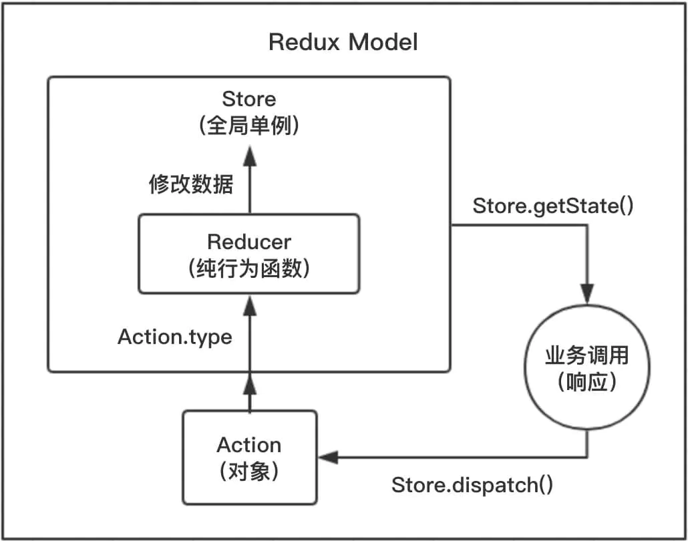

#### 定义 Action

作为一个行为载体，用于映射相应的 Reducer，并且它可以成为数据的载体，将数据从应用传递至 store 中，是 store **唯一的数据源**。

- 必须具有 Type 属性，表示正在执行的 ACTION 类型，且必须定义为字符串常量，并且还可以向其添加更多的属性
- Redux 中，Action 被名为 Action Creators 的函数所创建

```react
// 一个普通的 Action
const action = {
	type: 'ADD_LIST',
	item: 'list-item-1',
}

// 使用：
store.dispatch(action)

// 通常为了便于调用，会有一个 Action 创建函数 (action creater)
funtion addList(item) {
	return const action = {
		type: 'ADD_LIST',
		item,
	}
}

// 调用就会变成:
dispatch(addList('list-item-1'))
```

#### Reducer 作用

用于描述如何修改数据的纯函数，Action 属于行为名称，而 Reducer 便是修改行为的实质。

- 纯函数，规定应用程序状态在响应 ACTION 后如何改变
- 接受先前的状态和 ACTION 来工作，然后返回一个新的状态
- 它根据操作的类型确定需要执行哪种更新，然后返回新的值。如果不需要完成任务，它会返回原来的状态。

```javascript
// 一个常规的 Reducer
// @param {state}: 旧数据
// @param {action}: Action 对象
// @returns {any}: 新数据
const initList = []
function ListReducer(state = initList, action) {
	switch (action.type) {
		case 'ADD_LIST':
			return state.concat([action.item])
			break
		defalut:
			return state
	}
}
```

> **注意**:
>
> 1. 遵守数据不可变，不要去直接修改 state，而是返回出一个 **新对象**，可以使用 `assign / copy / extend / 解构` 等方式创建新对象；
> 2. 默认情况下需要 **返回原数据**，避免数据被清空；
> 3. 最好设置 **初始值**，便于应用的初始化及数据稳定；

**进阶**

- **React-Redux**: 结合 React 使用；
  - `<Provider>`: 将 store 通过 context 传入组件中；
  - `connect` : 一个高阶组件，可以方便在 React 组件中使用 Redux；
    - 将`store`通过`mapStateToProps`进行筛选后使用`props`注入组件
    - 根据`mapDispatchToProps`创建方法，当组件调用时使用`dispatch`触发对应的`action`
- **Reducer 的拆分与重构**:
  - 随着项目越大，如果将所有状态的 reducer 全部写在一个函数中，将会 **难以维护**；
  - 可以将 reducer 进行拆分，也就是 **函数分解**，最终再使用`combineReducers()`进行重构合并；
- **异步 Action**: 由于 Reducer 是一个严格的纯函数，因此无法在 Reducer 中进行数据的请求，需要先获取数据，再`dispatch(Action)`即可，下面是三种不同的异步实现:
  - [redex-thunk](https://github.com/reduxjs/redux-thunk)
  - [redux-saga](https://github.com/redux-saga/redux-saga)
  - [redux-observable](https://github.com/redux-observable/redux-observable)


#### Store

全局 Store 单例， 每个 Redux 应用下只有一个 store， 它具有以下方法供使用:

- `getState`: 获取 state；
- `dispatch`: 触发 action, 更新 state；
- `subscribe`: 订阅数据变更，注册监听器；

```javascript
// 创建
const store = createStore(Reducer, initStore)
```

> Store 是一个 JavaScript 对象，它可以保存程序的状态，并提供一些方法来访问状态、调度操作和注册侦听器。
>
> 应用程序的整个状态/对象树保存在单一存储中。因此，Redux 非常简单且是可预测的。
>
> 可以将中间件传递到 store 来处理数据，并记录改变存储状态的各种操作。所有操作都通过 reducer 返回一个新状态。

### 七个优点

1. **结果的可预测性** 

   由于总是存在一个真实来源，即 store ，因此不存在如何将当前状态与动作和应用的其他部分同步的问题。

2. **可维护性** 

   代码变得更容易维护，具有可预测的结果和严格的结构。

3. **服务器端渲染** 

   你只需将服务器上创建的 store 传到客户端即可。这对初始渲染非常有用，并且可以优化应用性能，从而提供更好的用户体验。

4. **开发人员工具** 

   从操作到状态更改，开发人员可以实时跟踪应用中发生的所有事情。

5. **社区和生态系统** 

   Redux 背后有一个巨大的社区，这使得它更加迷人。一个由才华横溢的人组成的大型社区为库的改进做出了贡献，并开发了各种应用。

6. **易于测试** 

   Redux 的代码主要是小巧、纯粹和独立的功能。这使代码可测试且独立。

7. **组织** 

   Redux 准确地说明了代码的组织方式，这使得代码在团队使用时更加一致和简单。

### 数据流动


## Redux 与 Flux 不同之处

| **Flux**                           | **Redux**                        |
| ---------------------------------- | -------------------------------- |
| 1. Store 包含状态和更改逻辑        | 1. Store 和更改逻辑是分开的      |
| 2. 有多个 Store                    | 2. 只有一个 Store                |
| 3. 所有 Store 都互不影响且是平级的 | 3. 带有分层 reducer 的单一 Store |
| 4. 有单一调度器                    | 4. 没有调度器的概念              |
| 5. React 组件订阅 store            | 5. 容器组件是有联系的            |
| 6. 状态是可变的                    | 6. 状态是不可改变的              |

## Redux 和 Vuex机制

# React 路由

## 定义

- 一个构建在 React 之上的强大的路由库，有助于向应用程序添加新的屏幕和流，使 URL 与网页上显示的数据保持同步。
- 负责维护标准化的结构和行为，并用于开发单页 Web 应用。
-  有一个简单的API。

## 存在必要性

- Router 用于**定义多个路由**。

  当用户定义特定的 URL 时，如果此 URL 与 Router 内定义的任何 “路由” 的路径匹配，则用户将重定向到该特定路由。

- 需要在应用中添加一个 Router 库，允许创建多个路由，每个路由都会向我们提供一个独特的视图。

```react
<switch>
    <route exact path=’/’ component={Home}/>
    <route path=’/posts/:id’ component={Newpost}/>
    <route path=’/posts’   component={Post}/>
</switch>
```

## React Router v4 中使用 switch 关键字

虽然 **`<div>`** 用于封装 Router 中的多个路由，当你想要仅显示要在多个定义的路线中呈现的单个路线时，可以使用 “switch” 关键字。

使用时，**`<switch>`** 标记会按顺序将已定义的 URL 与已定义的路由进行匹配。找到第一个匹配项后，它将渲染指定的路径，从而绕过其它路线。

## 三个优点

1. 就像 React 基于组件一样，在 React Router v4 中，API 是 *'All About Components'*。可以将 Router 可视化为单个根组件（**`<BrowserRouter>`**），其中我们将特定的子路由（**`<route>`**）包起来。

2. 无需手动设置历史值：在 React Router v4 中，我们要做的就是将路由包装在 **`<BrowserRouter>`** 组件中。

3. 包是分开的：共有三个包，分别用于 Web、Native 和 Core。这使我们应用更加紧凑。基于类似的编码风格很容易进行切换。

## React Router 与常规路由的不同之处

| **主题**       | **常规路由**                                    | **React 路由**                   |
| -------------- | ----------------------------------------------- | -------------------------------- |
| **参与的页面** | 每个视图对应一个新文件                          | 只涉及单个HTML页面               |
| **URL 更改**   | HTTP 请求被发送到服务器并且接收相应的 HTML 页面 | 仅更改历史记录属性               |
| **体验**       | 用户实际在每个视图的不同页面切换                | 用户认为自己正在不同的页面间切换 |


# React Fiber

## 背景

### React Reconciliation 介绍

是一个算法，计算两棵 DOM 树之间的差异，以得出下一次更新时，哪些部分需要更新。

> E.g. whenever the component's props or state gets updated, whether to make an actual DOM update or not, React will decide by comparing the newly returned element with previously rendered one.

如果两个组件确实不同，则 React 会更新 DOM ，这个过程叫做 **Reconciliation**，调度算法。

### DOM 中渲染组件方法

主要是两个组件，Reconciler 和 Renderer。

Reconciler 负责计算差异，告诉 React DOM 树的哪些部分需要更新。

Renderer 根据计算的差异，更新 DOM 树。

之所以设计两个阶段，是因为 ReactDOM 和 React Native 有各自的 renderer，但是算法 **Reconciliation** 需要保持一致。

### 旧算法问题

JS 是单线程，因此只有一个线程去处理 UI 更新、响应用户操作和网络请求等。

第一个阶段 Reconciler 中，有两棵树，一棵是当前已经渲染完成的树一棵是需要更新的树，该阶段同步计算两棵树之间的不同之处，此时就会占用主线程，不会响应外部操作，使用的是 JS 引擎的自身调用栈。

因此，React 进行组件渲染时，从 `setState` 开始到渲染完成，整个过程是同步的，不渲染完所有组件不会停止。如果组件比较庞大，则 js 执行会占据主线程较长时间，不会及时响应用户操作，形成页面卡顿，使得 React 在手势、动画等应用中效果较差。


React Fiber 出现就是解决这个问题：React 组件同步渲染造成的页面卡顿问题，但是不是新的算法，而是之前算法 (React Reconciliation) 的再实现。

## Fiber

旧算法中，React 创建一个包含所有元素的树，需要递归遍历这棵树，为了遍历需要维持一个执行栈。执行栈的问题是，整个子树会重新渲染，反过来降低用户体验。

为了解决执行栈的问题，可以使用**异步**与**任务分割**，Facebook 重实现了 Reconciliation 算法，其中 React Fiber 实现了任务分割。

### 简述

- 在 React V16 将调度算法进行了重构， 将之前的 stack reconciler 重构成新版的 fiber reconciler，变成了具有链表和指针的 **单链表树遍历算法**。通过指针映射，每个单元都记录着遍历当下的上一步与下一步，从而使遍历变得可以被暂停和重启。
- 理解为是一种 **任务分割调度算法**，主要是 将原先同步更新渲染的任务分割成一个个独立的 **小任务单位**，根据不同的优先级，将小任务分散到浏览器的空闲时间执行，充分利用主进程的事件循环机制。

### 核心

**Fiber 是一个新的数据结构， 用来表示需要完成的工作。**

React 中，每个元素都有对应的 fiber node，Fiber 的主要优势是在每一次渲染中，fiber node 不用重新生成。

Fiber 的架构提供了**调度**、**暂停**和**中断**工作的方法。

Fiber 是一个包含组件信息的 JS 对象。

```javascript
class Fiber {
	constructor(instance) {
		this.instance = instance
		// 指向第一个 child 节点
		this.child = child
		// 指向父节点
		this.return = parent
		// 指向第一个兄弟节点
		this.sibling = previous
	}	
}
```

## 算法


由上图可知，React 工作分两个阶段：Render 和 Commit。

### 第一阶段—Render

第一次更新，React 计算出哪些需要更新并应用更新（VDOM 的比较），**适合拆分**，比如对比一部分树后，先暂停执行个动画调用，待完成后再回来继续比对。

如果是第一次 render，React 会为每个元素创建 Fiber Node。在随后的更新中，React 会使用这些 Fiber Nodes。总结就是，第一个阶段之后，生成需要进行更新操作的 Fiber Tree（更新操作在第二个阶段进行）。

#### 具体过程

- 更新 state 与 props；
- 调用生命周期钩子；
- 生成 virtual dom；
  - 这里应该称为 Fiber Tree 更为符合；
- 通过新旧 vdom 进行 diff 算法，获取 vdom change；
- 确定是否需要重新渲染

#### 链表树遍历算法

深度优先遍历，通过 **节点保存与映射**，便能够随时地进行 **停止和重启**，这样便能达到实现任务分割的基本前提；

1. 首先通过不断遍历子节点，到树末尾；
2. 开始通过 sibling 遍历兄弟节点；
3. return 返回父节点，继续执行2；
4. 直到 root 节点后，跳出遍历；


### 第二阶段—Commit

第二个阶段会获取前一个阶段的更新 change list，将更新应用在 DOM 中，**不适合拆分**，才能保持数据与 UI 一致，阻塞更新可能会出现数据与 UI 不一致的情况。

当更新对用户可见时，这个阶段才能结束，因此这个阶段结束时需要写在一个用户可见触发的回调中。

整个实现中，React 创建一个由 Fiber Nodes 组成的可以转变的 Tree，就不用在每次更新的时候再创建 Fiber Nodes，只需要让对应的节点更新即可。


### 分散执行

#### 思路

Render 阶段，React 会处理 Fiber Nodes 但也同时会应对突发的事件，当事件发生时，会保留这些更新，以至于处理完突发事件后可以恢复工作。

#### 具体实现

任务分割后，就可以把小任务单元分散到浏览器的空闲期间去排队执行，而实现的关键是两个新API: `requestIdleCallback` 与 `requestAnimationFrame`。

- 低优先级的任务交给`requestIdleCallback`处理，这是个浏览器提供的事件循环空闲期的回调函数，需要 pollyfill，而且拥有 deadline 参数，限制执行事件，以继续切分任务；
- 高优先级的任务交给`requestAnimationFrame`处理；

```javascript
// 类似于这样的方式
requestIdleCallback((deadline) => {
    // 当有空闲时间时，我们执行一个组件渲染；
    // 把任务塞到一个个碎片时间中去；
    while ((deadline.timeRemaining() > 0 || deadline.didTimeout) && nextComponent) {
        nextComponent = performWork(nextComponent);
    }
});
```

#### 调用生命周期方法

Lifecycle methods called during **render** phase:

- [getDerivedStateFromProps](https://reactjs.org/docs/react-component.html#static-getderivedstatefromprops)
- [shouldComponentUpdate](https://reactjs.org/docs/react-component.html#shouldcomponentupdate)
- [render](https://reactjs.org/docs/react-component.html#render)

Lifecycle methods called during the **commit** phase :

- [getSnapshotBeforeUpdate](https://reactjs.org/docs/react-component.html#getsnapshotbeforeupdate)
- [componentDidMount](https://reactjs.org/docs/react-component.html#componentdidmount)
- [componentDidUpdate](https://reactjs.org/docs/react-component.html#componentdidupdate)
- [componentWillUnmount](https://reactjs.org/docs/react-component.html#componentwillunmount)

> 第一个阶段是可以被打断以及恢复的，即异步的，第二个阶段必须在一个流中完成，是同步的。

### 任务优先级

React 如何决定暂停恢复哪些任务，由任务优先级决定，是 React Fiber 的重要特性。

Fiber Reconciler 赋予任务优先级，基于优先级去更新。

Fiber 任务优先级

```javascript
module.exports = {  
  NoWork: 0, // No work is pending.
  SynchronousPriority: 1, // For controlled text inputs. 
  TaskPriority: 2, // Completes at the end of the current tick.
  AnimationPriority: 3, // Needs to complete before the next frame.
  HighPriority: 4, // Interaction that needs to complete pretty soon to feel responsive.
  LowPriority: 5, // Data fetching, or result from updating stores.
  OffscreenPriority: 6, // Won't be visible but do the work in case it becomes visible.
};
```

由此我们可以看出 `Fiber `任务的优先级顺序为：

文本框输入 > 本次调度结束需完成的任务 > 动画过渡 > 交互反馈 > 数据更新 > 不会显示但以防将来会显示的任务

> **Tips：**
>
> Fiber 其实可以算是一种编程思想，在其它语言中也有许多应用(Ruby Fiber)。核心思想是 任务拆分和协同，主动把执行权交给主线程，使主线程有时间空挡处理其他高优先级任务。
>
> 当遇到进程阻塞的问题时，**任务分割**、**异步调用** 和 **缓存策略** 是三个显著的解决思路。

# React.lazy

## 代码分割

原因：前端项目代码打包后，bundle.js 过大，使用技术手段对代码包进行分割，能够创建多个包并在运行时动态地加载。现在像 Webpack、 Browserify等打包器都支持代码分割技术。

使用场景：不是首页的页面使用较大的资源，可以考虑代码分割。

懒加载示例代码：

通过 `import()`、`React.lazy` 和 `Suspense` 共同一起实现了 React 的懒加载，即运行时动态加载。

OtherComponent 组件文件被拆分打包为一个新的包（bundle）文件，并且只会在 OtherComponent 组件渲染时，才会被下载到本地。

```react
import React, { Suspense } from 'react';

const OtherComponent = React.lazy(() => import('./OtherComponent'));

function MyComponent() {
  return (
    <div>
      <Suspense fallback={<div>Loading...</div>}>
        <OtherComponent />
      </Suspense>
    </div>
  );
}
```

[import()](https://github.com/tc39/proposal-dynamic-import) 函数是由TS39提出的一种动态加载模块的规范实现，其返回是一个 promise。当 Webpack 解析到该 `import()` 语法时，会自动进行代码分割。

在浏览器宿主环境中一个`import()`的参考实现如下：

```javascript
function import(url) {
  return new Promise((resolve, reject) => {
    const script = document.createElement("script");
    const tempGlobal = "__tempModuleLoadingVariable" + Math.random().toString(32).substring(2);
    script.type = "module";
    script.textContent = `import * as m from "${url}"; window.${tempGlobal} = m;`;

    script.onload = () => {
      resolve(window[tempGlobal]);
      delete window[tempGlobal];
      script.remove();
    };

    script.onerror = () => {
      reject(new Error("Failed to load module script with URL " + url));
      delete window[tempGlobal];
      script.remove();
    };

    document.documentElement.appendChild(script);
  });
}
```

## React.lazy 原理

React.lazy 的源码(16.8.0)实现如下，返回了一个 `LazyComponent` 对象。

```javascript
export function lazy<T, R> (ctor: () => Thenable<T, R>): LazyComponent<T> {
  let lazyType = {
    $$typeof: REACT_LAZY_TYPE,
    _ctor: ctor,
    // React uses these fields to store the result.
    _status: -1,
    _result: null,
  };

  return lazyType;
}
```

# 性能优化

## React.memo()

与纯组件相似，帮助控制<u>**函数组件**</u>的再渲染。注意，不要使用其避免渲染，可能会有 bug。

> 组件只有其 props 改变时才会重新渲染。通常情况下，一旦有改变，所有的组件都会重新渲染一遍。但是有 PureComponent 和 React.memo() 之后，就可以只渲染一部分组件。
>
> 在计算机科学中，memoization 是一个主要使用的优化技术，通过存储函数运行的结果和返回相同输入对应的缓存结果，来加速计算机程序。这也是 React.memo() 命名由来，将即将到来的渲染与现有渲染进行比较，不同才渲染，相同则不渲染。

### 用法

`React.memo()` 是级别更高的组件，可以将函数组件包含在其中，这样该函数组件仅有 `props` 改变时才会重新渲染。

```react
import React from 'react';

const MyScotchyComponent = React.memo(function MyComponent(props) {
  // only renders if props have changed!
});

// can also be an es6 arrow function
const OtherScotchy = React.memo(props => {
  return <div>my memoized component</div>;
});

// and even shorter with implicit return
const ImplicitScotchy = React.memo(props => (
  <div>implicit memoized component</div>
));

const RocketComponent = props => <div>my rocket component. {props.fuel}!</div>;

// create a version that only renders on prop changes
const MemoizedRocketComponent = React.memo(RocketComponent);
```

### 特点

1. React.memo() 仅仅会比较 props 的改变，如果组件中还有 useState 和 useContext，那么当 state 和 context 改变时，组件还是会重新渲染的。因此 React.memo() 适用于相同 props 渲染相同结果的组件。

2. React.memo() 仅仅会对组件的前后 props 进行浅比较，可以通过向第二个参数传递自定义比较函数来控制 props 的比较。

   ```react
   function MyComponent(props) {
     /* render using props */
   }
   function areEqual(prevProps, nextProps) {
     /*
     return true if passing nextProps to render would return
     the same result as passing prevProps to render,
     otherwise return false
     */
   }
   export default React.memo(MyComponent, areEqual);
   ```

## pureComponent

[React.Component](https://reactjs.org/docs/react-component.html) 是创建 React 组件的基础类，使用 ES6 语法。

```react
class Greeting extends React.Component {
  render() {
    return <h1>Hello, {this.props.name}</h1>;
  }
}
```

React.PureComponent 与 React.Component 类似，不同的是 React.Component 没有实现  [`shouldComponentUpdate()`](https://reactjs.org/docs/react-component.html#shouldcomponentupdate)，但是 React.PureComponent 实现了这个函数。

如果组件对于同样的 props 和 state 总是有同样的渲染结果，就可以使用 React.PureComponent 进行优化，它会跳过不必要的渲染。

> 上述函数实现跳过了整个组件树的 props 的更新，使用时需要确保子组件也是纯组件。

### shouldComponentUpdate()

实现了 `props` 和 `state` 的**浅比较**，即将 `this.props` 和 `nextProps` 比较、`this.state` 和 `nextState` 比较，当不需要渲染时返回 `false`（并不会阻止子组件渲染，如果子组件的 `state` 改变，也会渲染不会跳过）。当返回值为 `false` 时，`UNSAFE_componentWillUpdate()`、`render()`、`componentDidUpdate()` 均不会被唤起。

> 如果对象的数据结构比较复杂，`React.PureComponent` 的 `shouldComponentUpdate()` 可能有问题，复杂结构数据修改时可以使用  `forceUpdate()` ，或者使用不可变的对象加速复杂结构的比较。
>
> 这里并不建议进行深比较或者在 `shouldComponentUpdate()` 函数中使用 `JSON.stringify()`，效率低效。
>
> 尽管函数返回 false，仍然有可能导致组件的重渲染。

## Hooks

React 中通常使用 **类定义** 或者 **函数定义** 创建组件:

在类定义中，我们可以使用到许多 React 特性，例如 state、 各种组件生命周期钩子等，但是在函数定义中，我们却无能为力，因此 React 16.8 版本推出了一个新功能 (React Hooks)，通过它，可以更好的在函数定义组件中使用 React 特性。

**好处**:

1. **跨组件复用**: 其实 render props / HOC 也是为了复用，相比于它们，Hooks 作为官方的底层 API，最为轻量，而且改造成本小，不会影响原来的组件层次结构和传说中的嵌套地狱；
2. 类定义更为复杂:
   - 不同的生命周期会使逻辑变得分散且混乱，不易维护和管理；
   - 时刻需要关注`this`的指向问题；
   - 代码复用代价高，高阶组件的使用经常会使整个组件树变得臃肿；
3. **状态与UI隔离**: 正是由于 Hooks 的特性，状态逻辑会变成更小的粒度，并且极容易被抽象成一个自定义 Hooks，组件中的状态和 UI 变得更为清晰和隔离。

**注意**:

1. 避免在 循环/条件判断/嵌套函数 中调用 hooks，保证调用顺序的稳定；
2. 只有 函数定义组件 和 hooks 可以调用 hooks，避免在 类组件 或者 普通函数 中调用；
3. 不能在`useEffect`中使用`useState`，React 会报错提示；
4. 类组件不会被替换或废弃，不需要强制改造类组件，两种方式能并存；


### 基础钩子

- 状态钩子[`useState`](https://reactjs.org/docs/hooks-reference.html#usestate)

  用于定义组件的 State，其到类定义中`this.state`的功能；

  ```javascript
  // useState 只接受一个参数: 初始状态
  // 返回的是组件名和更改该组件对应的函数
  const [flag, setFlag] = useState(true);
  // 修改状态
  setFlag(false)
  	
  // 上面的代码映射到类定义中:
  this.state = {
  	flag: true	
  }
  const flag = this.state.flag
  const setFlag = (bool) => {
      this.setState({
          flag: bool,
      })
  }
  ```

- 生命周期钩子[`useEffect`](https://reactjs.org/docs/hooks-reference.html#useeffect)

  类定义中有许多生命周期函数，而在 React Hooks 中也提供了一个相应的函数 (`useEffect`)，这里可以看做`componentDidMount`、`componentDidUpdate`和`componentWillUnmount`的结合。

  useEffect(callback, [source]) 接受两个参数：

  - `callback`: 钩子回调函数；
  - `source`: 设置触发条件，仅当 source 发生改变时才会触发；
  - `useEffect`钩子在没有传入`[source]`参数时，默认在每次 render 时都会优先调用上次保存的回调中返回的函数，后再重新调用回调；

  ```javascript
  useEffect(() => {
  	// 组件挂载后执行事件绑定
  	console.log('on')
  	addEventListener()
  	
  	// 组件 update 时会执行事件解绑
  	return () => {
  		console.log('off')
  		removeEventListener()
  	}
  }, [source]);
  
  
  // 每次 source 发生改变时，执行结果(以类定义的生命周期，便于大家理解):
  // --- DidMount ---
  // 'on'
  // --- DidUpdate ---
  // 'off'
  // 'on'
  // --- DidUpdate ---
  // 'off'
  // 'on'
  // --- WillUnmount --- 
  // 'off'
  ```

  通过第二个参数，我们便可模拟出几个常用的生命周期:

  - `componentDidMount`: 传入`[]`时，就只会在初始化时调用一次；

    ```javascript
    const useMount = (fn) => useEffect(fn, [])
    ```

  - `componentWillUnmount`: 传入`[]`，回调中的返回的函数也只会被最终执行一次；

    ```javascript
    const useUnmount = (fn) => useEffect(() => fn, [])
    ```

  - `mounted`: 可以使用 useState 封装成一个高度可复用的 mounted 状态;

    ```javascript
    const useMounted = () => {
        const [mounted, setMounted] = useState(false);
        useEffect(() => {
            !mounted && setMounted(true);
            return () => setMounted(false);
        }, []);
        return mounted;
    }
    ```

  - `componentDidUpdate`: `useEffect`每次均会执行，其实就是排除了 DidMount 后即可；

    ```javascript
    const mounted = useMounted() 
    useEffect(() => {
        mounted && fn()
    })
    ```

  

[`useContext`](https://reactjs.org/docs/hooks-reference.html#usecontext)

获取 context 对象

### 新增钩子（React 16.8）

[`useReducer`](https://reactjs.org/docs/hooks-reference.html#usereducer)

类似于 Redux 思想的实现，但其并不足以替代 Redux，可以理解成一个组件内部的 redux:

- 并不是持久化存储，会随着组件被销毁而销毁；
- 属于组件内部，各个组件是相互隔离的，单纯用它并无法共享数据；
- 配合`useContext`的全局性，可以完成一个轻量级的 Redux；([easy-peasy](https://github.com/ctrlplusb/easy-peasy))

[`useCallback`](https://reactjs.org/docs/hooks-reference.html#usecallback)

缓存回调函数，避免传入的回调每次都是新的函数实例而导致依赖组件重新渲染，具有性能优化的效果；

[`useMemo`](https://reactjs.org/docs/hooks-reference.html#usememo)

用于缓存传入的 props，避免依赖的组件每次都重新渲染；

[`useRef`](https://reactjs.org/docs/hooks-reference.html#useref)

获取组件的真实节点；

[`useImperativeHandle`](https://reactjs.org/docs/hooks-reference.html#useimperativehandle)

[`useLayoutEffect`](https://reactjs.org/docs/hooks-reference.html#uselayouteffect)

- DOM更新同步钩子。用法与`useEffect`类似，只是区别于执行时间点的不同。
- `useEffect`属于异步执行，并不会等待 DOM 真正渲染后执行，而`useLayoutEffect`则会真正渲染后才触发；
- 可以获取更新后的 state；

[`useDebugValue`](https://reactjs.org/docs/hooks-reference.html#usedebugvalue)

**自定义钩子**

基于 Hooks 可以引用其它 Hooks 这个特性，我们可以编写自定义钩子，如上面的`useMounted`。又例如，我们需要每个页面自定义标题:

```react
function useTitle(title) {
  useEffect(
    () => {
      document.title = title;
    });
}

// 使用:
function Home() {
	const title = '我是首页'
	useTitle(title)
	return (
		<div>{title}</div>
	)
}
```

# SSR

俗称 **服务端渲染** (Server Side Render)，讲人话就是: 直接在服务端层获取数据，渲染出完成的 HTML 文件，直接返回给用户浏览器访问。

**前后端分离**: 前端与服务端隔离，前端动态获取数据，渲染页面。

**痛点**:

- **首屏渲染性能瓶颈**:
  - 空白延迟: HTML下载时间 + JS下载/执行时间 + 请求时间 + 渲染时间。在这段时间内，页面处于空白的状态。
- **SEO 问题**: 由于页面初始状态为空，因此爬虫无法获取页面中任何有效数据，因此对搜索引擎不友好。
  - 虽然一直有在提动态渲染爬虫的技术，不过据我了解，大部分国内搜索引擎仍然是没有实现。

最初的服务端渲染，便没有这些问题。但我们不能返璞归真，既要保证现有的前端独立的开发模式，又要由服务端渲染，因此我们使用 React SSR。

**原理**:

- Node 服务: 让前后端运行同一套代码成为可能。
- Virtual Dom: 让前端代码脱离浏览器运行。

**条件**: Node 中间层、 React / Vue 等框架。 结构大概如下:

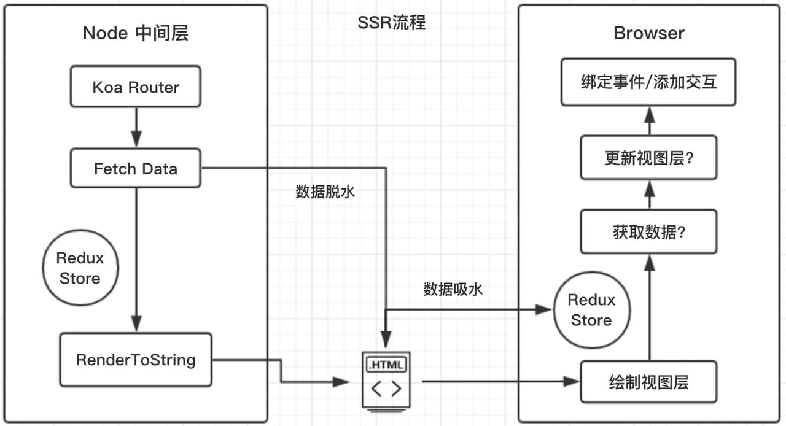

**开发流程**: (此处以 React + Router + Redux + Koa 为例)

1. 在同个项目中，**搭建** 前后端部分，常规结构:

   - build
   - public
   - src
     - client
     - server

2. server 中使用 Koa **路由监听** 页面访问:

   ```react
   import * as Router from 'koa-router'
   
   const router = new Router()
   // 如果中间也提供 Api 层
   router.use('/api/home', async () => {
   	// 返回数据
   })
   
   router.get('*', async (ctx) => {
   	// 返回 HTML
   })
   ```

3. 通过访问 url **匹配** 前端页面路由:

   ```react
   // 前端页面路由
   import { pages } from '../../client/app'
   import { matchPath } from 'react-router-dom'
   
   // 使用 react-router 库提供的一个匹配方法
   const matchPage = matchPath(ctx.req.url, page)
   ```

4. 通过页面路由的配置进行 **数据获取**。通常可以在页面路由中增加 SSR 相关的静态配置，用于抽象逻辑，可以保证服务端逻辑的通用性，如:

   ```javascript
   class HomePage extends React.Component{
   	public static ssrConfig = {
   		  cache: true,
            fetch() {
           	  // 请求获取数据
            }
       }
   }
   ```

   获取数据通常有两种情况:

   - 中间层也使用 **http** 获取数据，则此时 fetch 方法可前后端共享；

     ```javascript
     const data = await matchPage.ssrConfig.fetch()
     ```

   - 中间层并不使用 http，是通过一些 **内部调用**，例如 Rpc 或 直接读数据库 等，此时也可以直接由服务端调用对应的方法获取数据。通常，这里需要在 ssrConfig 中配置特异性的信息，用于匹配对应的数据获取方法。

     ```react
     // 页面路由
     class HomePage extends React.Component{
     	public static ssrConfig = {
             fetch: {
             	 url: '/api/home',
             }
         }
     }
     
     // 根据规则匹配出对应的数据获取方法
     // 这里的规则可以自由，只要能匹配出正确的方法即可
     const controller = matchController(ssrConfig.fetch.url)
     
     // 获取数据
     const data = await controller(ctx)
     ```

   1. 创建 Redux store，并将数据`dispatch`到里面:

      ```javascript
      import { createStore } from 'redux'
      // 获取 Clinet层 reducer
      // 必须复用前端层的逻辑，才能保证一致性；
      import { reducers } from '../../client/store'
      
      // 创建 store
      const store = createStore(reducers)
       
      // 获取配置好的 Action
      const action = ssrConfig.action
      
      // 存储数据	
      store.dispatch(createAction(action)(data))
      ```

   2. 注入 Store， 调用`renderToString`将 React Virtual Dom 渲染成 **字符串**:

      ```react
      import * as ReactDOMServer from 'react-dom/server'
      import { Provider } from 'react-redux'
      
      // 获取 Clinet 层根组件
      import { App } from '../../client/app'
      
      const AppString = ReactDOMServer.renderToString(
      	<Provider store={store}>
      		<StaticRouter
      			location={ctx.req.url}
      			context={{}}>
      			<App />
      		</StaticRouter>
      	</Provider>
      )
      ```

   3. 将 AppString 包装成完整的 html 文件格式；

   4. 此时，已经能生成完整的 HTML 文件。但只是个纯静态的页面，没有样式没有交互。接下来我们就是要插入 JS 与 CSS。我们可以通过访问前端打包后生成的`asset-manifest.json`文件来获取相应的文件路径，并同样注入到 Html 中引用。

      ```react
      const html = `
      	<!DOCTYPE html>
      	<html lang="zh">
      		<head></head>
      		<link href="${cssPath}" rel="stylesheet" />
      		<body>
      			<div id="App">${AppString}</div>
      			<script src="${scriptPath}"></script>
      		</body>
      	</html>
      `
      ```

   5. 进行 **数据脱水**: 为了把服务端获取的数据同步到前端。主要是将数据序列化后，插入到 html 中，返回给前端。

      ```react
      import serialize from 'serialize-javascript'
      // 获取数据
      const initState = store.getState()
      const html = `
      	<!DOCTYPE html>
      	<html lang="zh">
      		<head></head>
      		<body>
      			<div id="App"></div>
      			<script type="application/json" id="SSR_HYDRATED_DATA">${serialize(initState)}</script>
      		</body>
      	</html>
      `
      
      ctx.status = 200
      ctx.body = html
      ```

      > **Tips**:
      >
      > 这里比较特别的有两点:
      >
      > 1. 使用了`serialize-javascript`序列化 store， 替代了`JSON.stringify`，保证数据的安全性，避免代码注入和 XSS 攻击；
      > 2. 使用 json 进行传输，可以获得更快的加载速度；

   6.  Client 层 **数据吸水**: 初始化 store 时，以脱水后的数据为初始化数据，同步创建 store。

       ```javascript
       const hydratedEl = document.getElementById('SSR_HYDRATED_DATA')
       const hydrateData = JSON.parse(hydratedEl.textContent)
       
       // 使用初始 state 创建 Redux store
       const store = createStore(reducer, hydrateData)
       ```

       

# diff 算法

react 将 virtual dom 树转换为 actual dom 树的最少操作的过程称之为调和(reconciliation), diff 算法是调和的具体体现.

通过 diff 算法计算 vdom 新旧的差异, 从而更新变化的部分到 dom 上.

## 传统的diff算法

计算一棵树转换为另一棵树的最少操作

通过循环递归对节点进行依次对比, 效率低下, 算法时间复杂度为 O(3)

时间复杂度太高, 不满足前端渲染的场景

## React diff 算法

指定大胆的策略, 将时间复杂度降低至 O(N)

### diff 策略前提

1. Web UI 中的节点**跨层级的移动操作**特别少, 可以忽略不计
2. 拥有 相同类的两个组件 将会生成相似的树形结构, 拥有 不同类的两个组件 将会生成不同的树形结构
3. 对于同一层级的一组子节点, 它们可以通过唯一 ID 进行区分

基于上述三个策略前提, react进行了对应的算法优化

### 算法优化

#### tree diff

基于策略一, 对树进行分层比较, 两棵树只会对同一层的节点进行比较

通过 updateDepth 对 Virtual DOM 进行层级控制, 只会对相同颜色方框中的DOM节点进行比较, 即对同一父节点的子节点进行比较


```javascript
updateChildren: function(nextNestedChildrenElements, transaction, context) {
  updateDepth++;
  var errorThrown = true;
  try {
    this._updateChildren(nextNestedChildrenElements, transaction, context);
    errorThrown = false;
  } finally {
    updateDepth--;
    if (!updateDepth) {
      if (errorThrown) {
        clearQueue();
      } else {
        processQueue();
      }
    }
  }
}
```

**如果出现了 DOM 节点跨层级的移动操作，React diff 比较时只会增加或者删除节点, 并不会移动节点.**

如下图，A 节点（包括其子节点）整个被移动到 D 节点下，由于 React 只会简单的考虑同层级节点的位置变换，而**对于不同层级的节点，只有创建和删除操作**。当根节点发现子节点中 A 消失了，就会直接销毁 A；当 D 发现多了一个子节点 A，则会创建新的 A（包括子节点）作为其子节点。此时，React diff 的执行情况：**create A -> create B -> create C -> delete A**。

由此可发现，当出现节点跨层级移动时，并不会出现想象中的移动操作，而是以 A 为根节点的树被整个重新创建，这是一种影响 React 性能的操作，因此 **React 官方建议不要进行 DOM 节点跨层级的操作**。

> 注意：在开发组件时，保持稳定的 DOM 结构会有助于性能的提升。例如，可以通过 CSS 隐藏或显示节点，而不是真的移除或添加 DOM 节点。

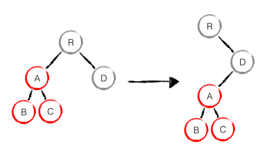

#### component diff

React 是基于组件构建应用的, 组件的比较也是简洁高效.

1. 同类型组件

   按照原策略继续比较 virtual DOM tree

   对于同一类型的组件，有可能其 Virtual DOM 没有任何变化，如果能够确切的知道这点那可以节省大量的 diff 运算时间，因此 React 允许用户通过 shouldComponentUpdate() 来判断该组件是否需要进行 diff。

2. 不同类型组件

   将该组件判断为 dirty component, 替换整个组件下的所有子节点

如下图，当 component D 改变为 component G 时，即使这两个 component 结构相似，一旦 **React 判断 D 和 G 是不同类型的组件，就不会比较二者的结构**，而是直接删除 component D，重新创建 component G 以及其子节点。

虽然当两个 component 是不同类型但结构相似时，React diff 会影响性能，但正如 React 官方博客所言：不同类型的 component 是很少存在相似 DOM tree 的机会，因此这种极端因素很难在实现开发过程中造成重大影响。

总结:

组件类型不同, 不会比较结构, 直接删除, 创建新的组件及其子节点.

不同类型组件很少出现结构相似情况, 所以 react diff 操作有必要.


#### element diff

当节点处于同一层级时, react diff 提供了三种节点操作. 插入/移动/删除

1. 插入/**INSERT_MARKUP**

   新的 component 类型不在老集合里, 即是全新的节点, 需要对新节点执行插入操作

2. 移动/**MOVE_EXISTING**

   在老集合里有新 component 类型, 且 element 是可更新的类型，generateComponentChildren 已调用 receiveComponent，这种情况下 prevChild=nextChild，就需要做移动操作，可以复用以前的 DOM 节点。

3. 删除/**REMOVE_NODE**

   - 老 component 类型, 在新集合里也有, 但对应的 element 不同则不能直接复用和更新, 需要执行删除操作
   - 老 component 不在新集合里, 也需要删除

```javascript
function enqueueInsertMarkup(parentInst, markup, toIndex) {
  updateQueue.push({
    parentInst: parentInst,
    parentNode: null,
    type: ReactMultiChildUpdateTypes.INSERT_MARKUP,
    markupIndex: markupQueue.push(markup) - 1,
    content: null,
    fromIndex: null,
    toIndex: toIndex,
  });
}

function enqueueMove(parentInst, fromIndex, toIndex) {
  updateQueue.push({
    parentInst: parentInst,
    parentNode: null,
    type: ReactMultiChildUpdateTypes.MOVE_EXISTING,
    markupIndex: null,
    content: null,
    fromIndex: fromIndex,
    toIndex: toIndex,
  });
}

function enqueueRemove(parentInst, fromIndex) {
  updateQueue.push({
    parentInst: parentInst,
    parentNode: null,
    type: ReactMultiChildUpdateTypes.REMOVE_NODE,
    markupIndex: null,
    content: null,
    fromIndex: fromIndex,
    toIndex: null,
  });
}
```

如下图，老集合中包含节点：A、B、C、D，更新后的新集合中包含节点：B、A、D、C，此时新老集合进行 diff 差异化对比，发现 B != A，则创建并插入 B 至新集合，删除老集合 A；以此类推，创建并插入 A、D 和 C，删除 B、C 和 D。


React 发现这类操作繁琐冗余，因为这些都是相同的节点，但由于位置发生变化，导致需要进行繁杂低效的删除、创建操作，其实只要对这些节点进行位置移动即可。

针对这一现象，React 提出优化策略：允许开发者对同一层级的同组子节点，添加唯一 key 进行区分，虽然只是小小的改动，性能上却发生了翻天覆地的变化！

新老集合所包含的节点，如下图所示，新老集合进行 diff 差异化对比，通过 key 发现新老集合中的节点都是相同的节点，因此无需进行节点删除和创建，只需要将老集合中节点的位置进行移动，更新为新集合中节点的位置，此时 React 给出的 diff 结果为：B、D 不做任何操作，A、C 进行移动操作，即可。

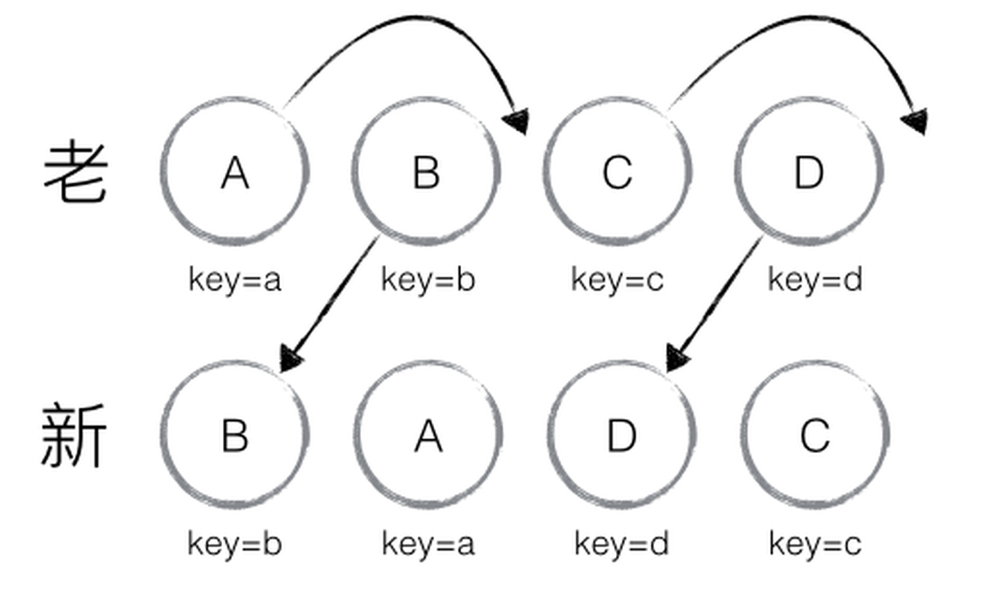

##### 高效 diff 运作机制

1. 节点相同但是位置不同

   child._mountIndex < lastIndex 满足该条件则移动节点

2. 节点不同 涉及增删改查

   

   ```javascript
   _updateChildren: function(nextNestedChildrenElements, transaction, context) {
     var prevChildren = this._renderedChildren;
     var nextChildren = this._reconcilerUpdateChildren(
       prevChildren, nextNestedChildrenElements, transaction, context
     );
     if (!nextChildren && !prevChildren) {
       return;
     }
     var name;
     var lastIndex = 0;
     var nextIndex = 0;
     for (name in nextChildren) {
       if (!nextChildren.hasOwnProperty(name)) {
         continue;
       }
       var prevChild = prevChildren && prevChildren[name];
       var nextChild = nextChildren[name];
       if (prevChild === nextChild) {
         // 移动节点
         this.moveChild(prevChild, nextIndex, lastIndex);
         lastIndex = Math.max(prevChild._mountIndex, lastIndex);
         prevChild._mountIndex = nextIndex;
       } else {
         if (prevChild) {
           lastIndex = Math.max(prevChild._mountIndex, lastIndex);
           // 删除节点
           this._unmountChild(prevChild);
         }
         // 初始化并创建节点
         this._mountChildAtIndex(
           nextChild, nextIndex, transaction, context
         );
       }
       nextIndex++;
     }
     for (name in prevChildren) {
       if (prevChildren.hasOwnProperty(name) &&
           !(nextChildren && nextChildren.hasOwnProperty(name))) {
         this._unmountChild(prevChildren[name]);
       }
     }
     this._renderedChildren = nextChildren;
   },
   // 移动节点
   moveChild: function(child, toIndex, lastIndex) {
     if (child._mountIndex < lastIndex) {
       this.prepareToManageChildren();
       enqueueMove(this, child._mountIndex, toIndex);
     }
   },
   // 创建节点
   createChild: function(child, mountImage) {
     this.prepareToManageChildren();
     enqueueInsertMarkup(this, mountImage, child._mountIndex);
   },
   // 删除节点
   removeChild: function(child) {
     this.prepareToManageChildren();
     enqueueRemove(this, child._mountIndex);
   },
   
   _unmountChild: function(child) {
     this.removeChild(child);
     child._mountIndex = null;
   },
   
   _mountChildAtIndex: function(
     child,
     index,
     transaction,
     context) {
     var mountImage = ReactReconciler.mountComponent(
       child,
       transaction,
       this,
       this._nativeContainerInfo,
       context
     );
     child._mountIndex = index;
     this.createChild(child, mountImage);
   },
   ```


当然，React diff 还是存在些许不足与待优化的地方，如下图所示，若新集合的节点更新为：D、A、B、C，与老集合对比只有 D 节点移动，而 A、B、C 仍然保持原有的顺序，理论上 diff 应该只需对 D 执行移动操作，然而由于 D 在老集合的位置是最大的，导致其他节点的 _mountIndex < lastIndex，造成 D 没有执行移动操作，而是 A、B、C 全部移动到 D 节点后面的现象。

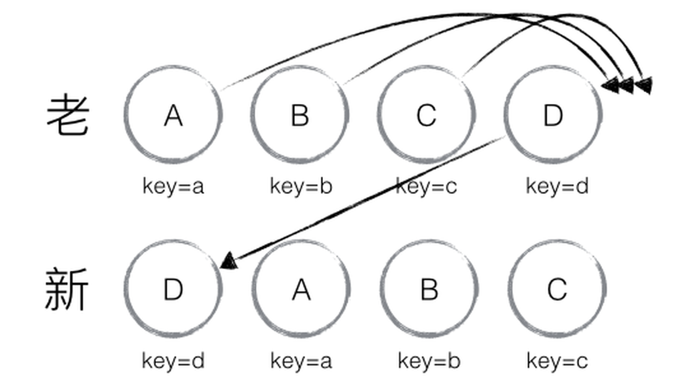

**在此，读者们可以讨论思考：如何优化上述问题？**

> 建议：在开发过程中，尽量减少类似将最后一个节点移动到列表首部的操作，当节点数量过大或更新操作过于频繁时，在一定程度上会影响 React 的渲染性能。

## 总结

- React 通过制定大胆的 diff 策略，将 O(n3) 复杂度的问题转换成 O(n) 复杂度的问题；
- React 通过**分层求异**的策略，对 tree diff 进行算法优化；
- React 通过**相同类生成相似树形结构，不同类生成不同树形结构**的策略，对 component diff 进行算法优化；
- React 通过**设置唯一 key**的策略，对 element diff 进行算法优化；

> 建议
>
> 在开发组件时，保持稳定的 DOM 结构会有助于性能的提升；
>
> 在开发过程中，尽量减少类似将最后一个节点移动到列表首部的操作，当节点数量过大或更新操作过于频繁时，在一定程度上会影响 React 的渲染性能。


参考 [知乎](https://zhuanlan.zhihu.com/p/20346379)

# 手写 React 核心 API


