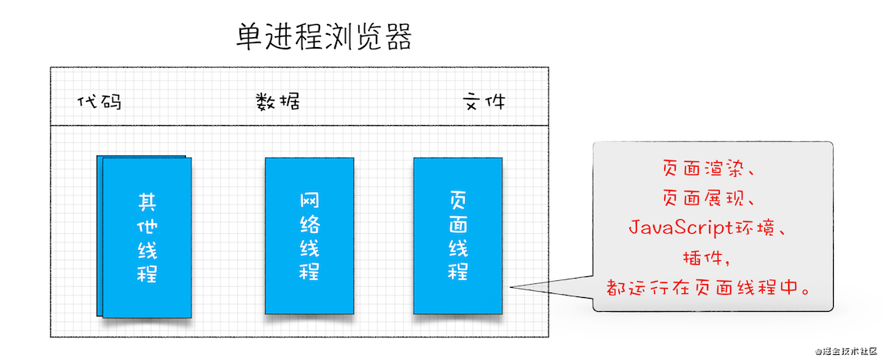

# 浏览器

## 网络与互联网

互联网，连接所有实体计算机，使得彼此之间可以互相发送数据.

通过互联网，计算机之间可以发送二进制位. 为了传输能产生有效通信，计算机之间必须知道这些位应该代表什么. 赋予比特序列的含义取决于想表达的事物的类型以及使用的编码机制.

*网络协议* 描述了网络上的通信方式，有各种各样的协议，用来做不同的事情.

*超文本传输协议* (HTTP)是用于检索命名资源(例如网页或者图片之类的信息块)的协议.

发出请求的一方应该采用这样的格式描述请求方式，想获取的资源以及使用的协议版本.

```http
GET /index.html HTTP/1.1
```

大多数协议都是基于其他协议构建的. HTTP 将网络视为一种类似于流的设备，可以在其中放置二进制位并以正确的顺序到达目的地.

*传输控制协议* (TCP) ，互联网中的所有设备均使用这个协议，大多数通信都基于它.
TCP 的工作方式: 一台计算机等待并监听，以便其他计算机与它建立连接. 一台机器为了同时监听不同类型的通信，每个监听器占用的端口都不同. 大多数协议都指定了它默认使用的端口. TCP 连接在服务器与客户端之间建立的双向管道，两端的机器都可以将数据放入其中，TCP 提供了网络的抽象.

## Web

万维网 (World Wide Web) 是一组协议与格式(与互联网概念不同)，允许我们在浏览器中访问网页. `Web` 指的是这样的页面可以相互链接，形成巨大网格. 换句话说，Web 就是浏览器上能访问的网页的集合.

成为 `Web` 的一部分，需要其他机器能够到你这里请求文档，则需要将计算机连接互联网并且使用`HTTP`协议监听80端口.

Web 上的每个文档都由统一资源定位符(URL)命名:

```html
http://qicai.fengniao.com/list_1437.html
|协议 |       服务器       |    路径      |
```

连接到互联网的机器会获得一个 `IP` 地址，但是IP地址比较难记，因此可以为 `IP` 地址注册域名，域名就指向该 `IP` 地址，对外则可以使用域名来提供服务.

在浏览器中键入该URL，首先找到域名对应的IP，然后使用 HTTP 协议与该 IP 对应的服务器建立连接，然后请求相应的资源，请求成功，服务器会发回文档，浏览器显示即可.

## HTML

HTML : 超文本标记语言(Hypertext Markup Language)，是用于网页的文档格式. 包含文本以及为文本提供结构的标签.

文档以 <!doctype html> 开头，告诉浏览器将页面解释为现代 html ，而不是过去使用的各种方言.

HTML 中的 \<script\> 标签包含 js 代码，或者使用`src`属性从`url`获取脚本文件(包含 JavaScript 程序的文本文件)。 `button`标签的 `onclick` 属性也可以包含 JS 程序. 只要单击按钮，就会运行属性的值.

```html
<button onclick="alert('Boom!');">DO NOT PRESS</button>
```

将 JS代码严格限制在浏览器中运行，不能查看或者修改计算机的文件，是为了防止浏览某些网站时可能出现的恶意脚本攻击. 以这种方式隔离编程环境称为**沙盒化**(sandboxing)，思想是让程序在沙盒中无害运行. 沙盒的难点在于，既要允许程序有足够的空间运行，也要限制它做有害的事情.


## 文档对象模型

浏览器从服务器获得 HTML 页面并对其进行解析，首先构建文档结构的模型，并使用此模型在屏幕上绘制页面. 这种数据结构可以被读取或者修改，实时性体现在对其的修改可以立即显示在屏幕上.

将 HTML 想象成嵌套的框，浏览器表示文档的数据结构就是对这种嵌套的框的模拟，在这种数据结构中，每个框都被表示成一个对象，浏览器可以对其中任何一个对象进行交互，查看该对象代表什么HTML标签以及包含哪些其他对象以及文本.  这种数据结构被称之为文档对象模型(DOM)，documnet.documentElement 是根.

```javascript
// 寻找元素
document.body.getElementsByTagName(arg) // 获取对应标签的所有元素节点列表
document.body.getElementsByClassName(arg) // 获取所有元素节点列表, 其类属性中具有给定字符串
document.getElementsById(arg) // 获取单个元素节点, 该节点的id属性是给定字符串

// 更改文档
appendChild(新节点)
document.body.insertBefore(新节点, 节点) // 将新节点从当前位置移除
replaceChild(新子节点, 旧子节点)

// 创建节点
document.createTextNode(文本内容) // 创建文本节点
document.createElement(标签名称) // 创建元素节点
```

### 属性

getAttribute setAttribute

### 布局

块元素: 占据文档的整个宽度

行内元素: 与周围文本在一行上呈现

offsetWidth offsetHeight 属性表示元素占用的空间(以像素为单位)

### 层叠样式表

使用选择器语法

### 查询选择器

querySelectorAll querySelector


## HTTP 和表单

在浏览器输入 http://qicai.fengniao.com/list_1437.html 之后，浏览器首先会查询域名对应的IP地址，然后与其建立TCP连接，然后在80端口向服务器发送如下信息(请求).

```http
GET /list_1437.html HTTP/1.1
Host: qicai.fengniao.com
User-Agent: 浏览器名称
```

### 请求

请求方法 资源路径 浏览器使用的协议版本

```http
 GET /list_1437.html HTTP/1.1
```

请求方法有: 

```javascript
GET: 获取指定资源
DELETE: 删除资源
PUT: 创建或替换资源
POST: 发送信息
...
```

浏览器在与给定服务器通信时，会自动切换到适当的协议版本.

指定主机名

服务器可能有多个主机名，指定是必须的.

```
Host: qicai.fengniao.com
```

### 响应

服务器回复如下信息(响应):

```http
HTTP/1.1 200 OK
Content-Length: 65585
Content-Type: text/html
Last-Modified: Mon, 07 Jan 2020 22:29:54 GMT

<!doctype html>  // 正文
...
```

浏览器收到后，将正文取出并显示为 `HTML` 文档.


协议版本号 状态码 可读字符串

状态码以2开头，表示请求成功，以4开头说明请求有问题，以5开头表示服务器有错误.

用来指定请求或者响应的额外信息，下述表示响应文档的大小和类型以及该文档最后一次被修改的时间.

```
Content-Length: 65585
Content-Type: text/html
Last-Modified: Mon, 07 Jan 2020 22:29:54 GMT
```

请求与响应报文，都可能包含空行，后面是正文.

### 表单

`HTML` 可能包含表单(允许用户填写信息)并将相关信息打包进 `HTTP` 请求中，浏览器随后会显示请求结果.

当 form 元素的 `method` 属性为 `GET` 或者省略时，表单中的信息将作为查询字符串添加到 `URL` 的结尾:

```http
GET /list_1437.html?name=Mary&message=Yes%3F HTTP/1.1
```

? 表示资源路径的结束以及查询的开始，%3F 是对查询字符串中的?进行转义的结果.

JS 中 `encodeURIComponent`/`decodeURIComponent` 进行编码和解码.

`method` 属性为 `POST` 时，提交表单的 `HTTP` 请求会使用 `POST` 方法并将查询字符串放在请求正文.

```http
GET /list_1437.html HTTP/1.1
Content-Length: 24
Content-Type: application/x-www-form-urlencoded

name=Mary&message=Yes%3F
```

`GET` 请求应该用于没有副作用仅仅是要求信息的请求，更改服务器内容的请求应使用例如 `POST` 请求或者其他.


## 多进程架构

### 单进程浏览器

浏览器所有功能模块（JS运行环境+页面渲染+页面展示+插件+网络）都在通过一个进程中。



### 多进程优点

- 进程之间隔离，一个页面崩溃不会影响其他页面
- JS 运行在渲染进程中，阻塞也仅会阻塞渲染进程，只会影响本页面
- Chrome 渲染进程和插件进程运行在安全沙箱里，保证安全性。

### 当前 Chrome 多进程架构浏览器

1. 浏览器进程

   主要负责界面显示、用户交互、子进程管理，同时提供存储等功能。

2. GPU加速进程

   加速 UI 渲染	

3. 渲染进程

   主要是将 html/css/js 转换成用户可以交互的网页，默认情况下 chrome 会为每个 Tab 页创建一个渲染进程，渲染进程都运行在沙箱模式下。

4. 网络进程

   加载网络资源。

5. 插件进程

   负责插件的运行/隔离。因为插件容易崩溃，利用插件进程来保证插件进程崩溃不影响到浏览器的其他进程。


## 浏览器存储

## 渲染过程

构建 DOM 树→样式计算→生成布局树→分层→分块→光栅化→合成


### 构建 DOM 树

1. html 词法分析为 token
2. token 解析为 dom 节点，并添加至 dom 树

### 样式计算

和 html 类似，CSS Parser 会手机所有的 CSS 规则，解析为 CSSOM。

1. 找到所有的 CSS 样式
2. 将其标准化
3. 给 DOM 树节点添加 CSS 样式，生成带样式的 DOM 树

### 生成布局树

给 DOM 树节点添加标识其几何位置的信息。

以 flex 布局为例，模拟在 flex 布局中如何计算元素的具体位置。


### 分层 layer

渲染进程将一些复杂的动画等生成专门的图层，并生成图层树，给 GPU 加速渲染。节点需要满足一些条件，渲染进程才会为其创建新的图层。

### 分块渲染

网页缓存是一小块一小块的，通常为 256\*256 或者 512\*512，称之为分块渲染。

原因：

- GPU 加速对缓存大小有要求，不能太大
- 方便浏览器使用统一的缓存池来管理分配的缓存，缓存池一般分配成成百上千个缓存块供所有 WebView 共用。不可见或者关闭的网页的缓存块被回收，需要时再以缓存块为单位向缓存池申请。


### 光栅化/栅格化

将图块转换为位图的过程，图块是栅格化的最小单位。

### 合成

图块被栅格化完成，合成线程生成绘制图块的指令，合成器渲染，输出像素点到屏幕。

### 相关概念

#### 渲染对象

渲染树中的每个节点被称为渲染对象（render object）或者渲染器（renderer）。

每个渲染对象都代表一个矩形区域，通常对应相关节点的 CSS 框（宽度、高度、几何位置等）。`display` 样式属性影响渲染对象的类型（`RenderInline`、`RenderBlock`、`RenderListItem` 等对象）。

WebKits RenderObject 是所有渲染对象的基类，定义如下：

```c
class RenderObject{
  virtual void layout(); // 重排涉及方法
  virtual void paint(PaintInfo); // 重绘涉及方法
  virtual void rect repaintRect();
  Node* node;  //the DOM node
  RenderStyle* style;  // the computed style
  RenderLayer* containgLayer; //the containing z-index layer}
}
```

#### 布局

全局布局：触发整个渲染树的布局

增量布局：对标记为“dirty”的渲染对象进行布局

#### 重排/回流

定义

在 Gecko 浏览器引擎中，视觉格式化组成的树称之为 “框架树”（`Frame Tree`），每个元素都是一个框架，更新元素的放置称之为“回流”（`reflow`）；

在 WebKit 浏览器引擎中，视觉格式化组成的树称之为 “渲染树”（`render Tree`），每个元素都是一个 `Render Object`，更新元素的放置称之为“重排”（`relayout`）；

特点：更新元素几何属性，更新整个渲染流程，开销最大。

触发回流：改变渲染对象的位置信息。


#### 绘制

全局绘制

增量绘制

#### 重绘

重绘：填充像素的过程，涉及绘出文本、颜色、图像等元素的每个可视部分。重绘时系统会遍历渲染对象的 paint 方法，将渲染对象的内容显示在屏幕上。

特点：更新元素的绘制属性，省去了布局与分层阶段，处理过程更少。

触发重绘：改变渲染对象的外观样式。


#### 合成

相较于重排与重绘，合成大大提升绘制效率。

触发 GPU 加速的属性（属性计算繁重）：

- transform:translate3d() 或 translateZ()
- opacity
- filter
- will-change


### 性能指标

[LCP](https://web.dev/optimize-lcp/)：衡量视口内渲染的最大内容元素渲染时间的指标。
[FID](https://web.dev/fid/)：从用户第一次与页面进行交互,到浏览器实际上能够开始处理程序的时间。
[CLS](https://web.dev/cls/)：测量页面发生布局偏移的总和