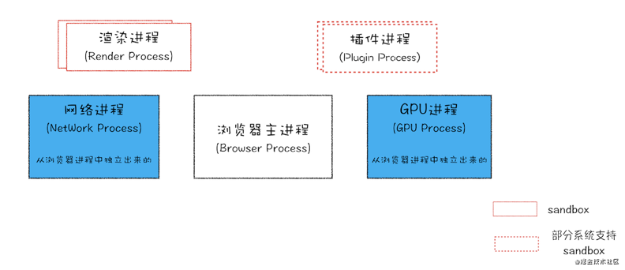
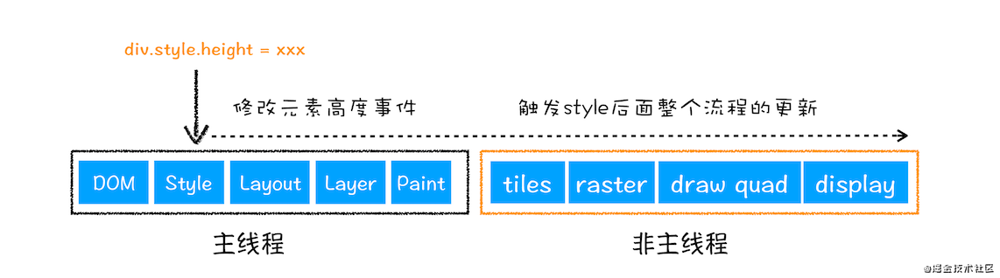
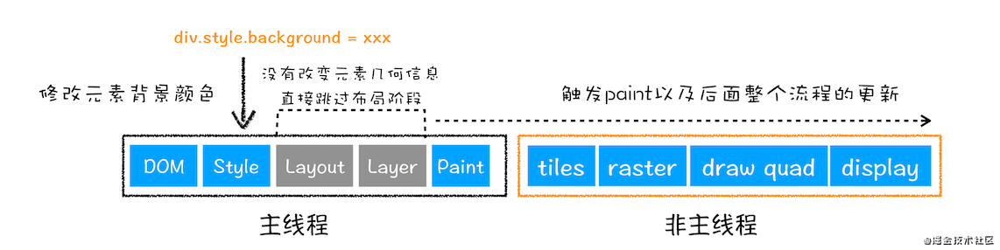
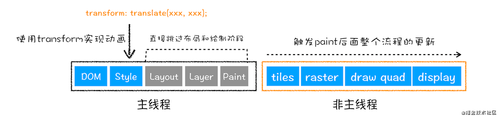
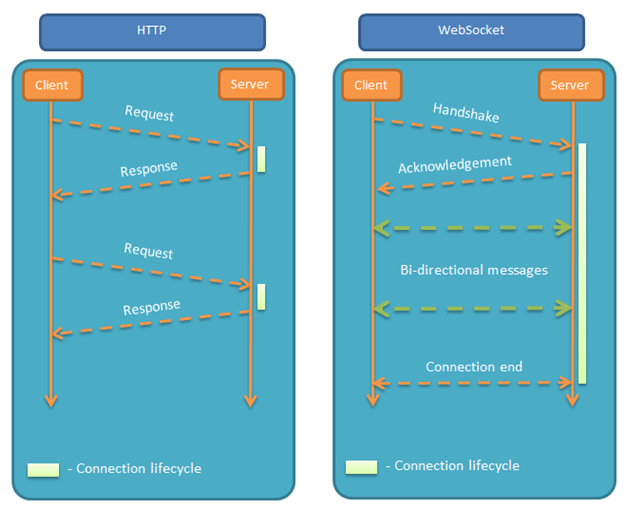

# 浏览器

## 多进程架构

### 单进程浏览器

浏览器所有功能模块（JS运行环境+页面渲染+页面展示+插件+网络）都在通过一个进程中。


### 多进程优点

- 进程之间隔离，一个页面崩溃不会影响其他页面
- JS 运行在渲染进程中，阻塞也仅会阻塞渲染进程，只会影响本页面
- Chrome 渲染进程和插件进程运行在安全沙箱里，保证安全性。

### 当前 Chrome 多进程架构浏览器

1. 浏览器进程

   主要负责界面显示、用户交互、子进程管理，同时提供存储等功能。

2. GPU加速进程

   加速 UI 渲染	

3. 渲染进程

   主要是将 html/css/js 转换成用户可以交互的网页，默认情况下 chrome 会为每个 Tab 页创建一个渲染进程，渲染进程都运行在沙箱模式下。

4. 网络进程

   加载网络资源。

5. 插件进程

   负责插件的运行/隔离。因为插件容易崩溃，利用插件进程来保证插件进程崩溃不影响到浏览器的其他进程。



## 渲染过程

构建 DOM 树→样式计算→生成布局树→分层→分块→光栅化→合成

### 构建 DOM 树

1. html 词法分析为 token
2. token 解析为 dom 节点，并添加至 dom 树

### 样式计算

和 html 类似，CSS Parser 会手机所有的 CSS 规则，解析为 CSSOM。

1. 找到所有的 CSS 样式
2. 将其标准化
3. 给 DOM 树节点添加 CSS 样式，生成带样式的 DOM 树

### 生成布局树

给 DOM 树节点添加标识其几何位置的信息。

以 flex 布局为例，模拟在 flex 布局中如何计算元素的具体位置。

### 分层 layer

渲染进程将一些复杂的动画等生成专门的图层，并生成图层树，给 GPU 加速渲染。节点需要满足一些条件，渲染进程才会为其创建新的图层。

### 分块渲染

网页缓存是一小块一小块的，通常为 256\*256 或者 512\*512，称之为分块渲染。

原因：

- GPU 加速对缓存大小有要求，不能太大
- 方便浏览器使用统一的缓存池来管理分配的缓存，缓存池一般分配成成百上千个缓存块供所有 WebView 共用。不可见或者关闭的网页的缓存块被回收，需要时再以缓存块为单位向缓存池申请。


### 光栅化/栅格化

将图块转换为位图的过程，图块是栅格化的最小单位。

### 合成

图块被栅格化完成，合成线程生成绘制图块的指令，合成器渲染，输出像素点到屏幕。

#### 重排

更新元素几何属性，更新整个渲染流程，开销最大。



#### 重绘

更新元素的绘制属性，省去了布局与分层阶段，处理过程更少。



#### 合成

相较于重排与重绘，合成大大提升绘制效率。

触发 GPU 加速的属性（属性计算繁重）：

- transform:translate3d（）或 translateZ()
- opacity
- filter
- will-change



### 性能指标

[LCP](https://web.dev/optimize-lcp/)：衡量视口内渲染的最大内容元素渲染时间的指标。
[FID](https://web.dev/fid/)：从用户第一次与页面进行交互,到浏览器实际上能够开始处理程序的时间。
[CLS](https://web.dev/cls/)：测量页面发生布局偏移的总和

# HTTP

## 输入 url 到展示

## http/https 区别

## HTTP1 HTTP2 HTTP3

## get post

## options 何时发出

## 常见状态码


# TCP UDP

## TCP 三次握手 四次挥手

## TCP UDP 区别

# 跨域

## 同源概念

互联网安全的基础是同源政策，否则网页之间可以共享cookie等信息，造成不安全。

两个网页满足下属三个条件称之为同源：

1. 协议相同
2. 域名相同
3. 端口相同

同源网页之间可以共享 cookie 等信息。

非同源有下述行为受到限制：

1. Cookie、LocalStorage、IndexDB无法获取
2. DOM 无法获得
3. AJAX 请求不能发送

但是现实中部分场景需要规避同源政策带来的限制，实现某些数据的读取以及进行一些操作。

### 一级域名相同的网页共享 Cookie

两个网页一级域名相同，二级域名不同，设置相同的 document.domain，可实现 `Cookie`共享。

A 网页（http://test1.example.com/a.html）设置 `document.domain="example.com"`

B 网页（http://test2.example.com/b.html）设置 `document.domain="example.com"`

A 网页设置 `document.cookie = "hello"`，B 网页可进行读取 `let cookie = document.cookie`。

## CORS（Cross-Origin resource sharing W3C标准）

跨域资源共享。

允许浏览器向跨源服务器发出 XMLHttpRequest 请求，克服AJAX只能同源使用的限制。

## JSONP(JSON with Padding)

JSON 的一种“使用模式”，可以让网页从别的域名/网站那里获取数据，即跨域读取数据。

## JWT (JSON Web Tokens)

跨域认证解决方案。

### 用户认证

用户认证的一般流程：

1. 用户发送用户名和密码给服务器
2. 服务器验证通过后，在当前会话（session）中保存相关信息，比如用户角色、登录时间等
3. 服务器向用户返回一个 session_id，写入用户 Cookie
4. 用户随后每次请求都带着 Cookie，服务器通过cookie知道用户的session_id，找到之前保存的用户数据，得知用户身份

考虑到服务器分布式的特性，需要 session 共享

1. session持久化，但是持久化挂了风险太大，且操作不便
2. 直接将用户信息存在客户端，客户端每次发请求时都带着，JWT是这类方案代表

### 原理

服务器认证之后，返回一个 JSON 对象返回给客户端，以后客户端请求都带着这个对象。服务器只靠这个对象识别用户身份，为了防止对象被篡改，服务器会给对象加签名。

```json
{
  "name":"MM",
  "role":"manager",
  "ddl":"2020/12/30/16:00:00"
}
```

### JWT数据结构

分为三个部分：头部.负载.签名


**头部**

用来描述JWT的元信息的JSON对象，服务器使用Base64URL算法转成字符串。

```json
{
  "alg":"HS256", // 签名算法
  "typ":"JWT" // 表示令牌（token）类型
}
```

**负载**

用来存放实际需要传递的数据的JSON对象，服务器使用Base64URL算法转成字符串。JWT 规定7个官方字段：

```
iss（issuer）：签发人
exp（expiration time）：过期时间
sub（subject）：主题
aud（audience）：受众
nbf（Not Before）：生效时间
iat（Issued At）：签发时间
jti（JWT ID):编号
```

除了这几个字段，也可以定义私有字段。

**签名**

对前面两个部分的签名，防止数据篡改。

1. 服务器指定一个密钥（secret 只有服务器知道）
2. 使用header中指定的签名算法，按照公式产生签名
3. 将 Header Payload Signature 三个部分合成一个字符串，用`.`分隔

上述三步结束后，将  JWT Token 返回给用户。

公式：

```
HMACSHA256(
  base64UrlEncode(header)+"."+base64UrlEncode(payload),
  secret
)
```

### 客户端处理

客户端收到 JWT Token 后，可存储在 Cookie 或者 LocalStorage 中。后面客户端每次发请求，均需要带上这个 JWT Token 。客户端请求共有如下位置可以放置：

1. Cookie （不能跨域）
2. HTTP 请求头 Authorization 字段
3. POST 请求的数据体中 （跨域时）

### 注意

1. JWT Token 默认不加密，生成后可使用密钥加密
2. 不加密时，敏感信息不要置于payload中
3. JWT Token 可用于认证和交换信息，有效使用可降低服务器查询数据库次数
4. 缺点是  JWT Token 一旦生成不能废止，在过期时间之前都有效
5. JWT Token 包含认证信息，为防止泄露，过期时间应设置较短
6. JWT Token 不加密，不应该使用 HTTP 明文 传输，应使用 HTTPS

## WebSocket(通信协议)

### 诞生原因

HTTP连接是单向的，只能由客户端发起，如果需要感知服务器的变化就需要轮询，效率低且浪费资源。

因此被发明之后，其特点是：服务器与客户端均可以互相向对方发送消息，是完全的平等对话。



基于 TCP 协议

### 客户端 API

#### WebSocket 构造函数

```javascript
var ws =  new WebSocket("ws://leetcode.com");
```

用于新建 WebSocket 实例。执行上面的语句，客户端就会与服务器建立连接。

#### 属性

**webSocket.readyState 属性**

```javascript
console.log("正在连接时的状态：" + ws.readyState)；
// "正在连接时的状态：0"
```

返回实例对象的当前状态，共有四个值。

| 状态       | 值   | 含义                 |
| ---------- | ---- | -------------------- |
| CONNECTING | 0    | 正在连接中           |
| OPEN       | 1    | 已建立连接，可以通信 |
| CLOSING    | 2    | 连接正在关闭         |
| CLOSED     | 3    | 连接已关闭           |

**webSocket.onopen 属性**

实例对象的 `onopen` 属性，用于指定连接成功后的回调函数。

**webSocket.onclose 属性**

实例对象的 `onclose` 属性，用于指定连接关闭后的回调函数。

**webSocket.onmessage 属性**

实例对象的 `onmessage` 属性，用于指定收到服务器数据后的回调函数。

**webSocket.bufferedAmount 属性**

实例对象的 `bufferedAmount` 属性，用于判断客户端还有多少字节的二进制数据没有发出去，用于判断发送是否结束。

**webSocket.onerror 属性**

实例对象的 `onerror` 属性，用于指定报错时的回调函数。

**webSocket.send() 方法**

用于向服务器发送数据。

使用示例：

```javascript
var ws = new WebSocket("ws://echo.websocket.org");

console.log("正在连接时的状态：" + ws.readyState);

// 单个写回调函数

ws.onopen = function (evt) {
  console.log("成功连接时的状态1：" + ws.readyState);
  ws.send("hello server，this is client");
}

ws.onmessage = function (evt) {
  console.log("收到服务器返回的数据1：" + evt.data);
  ws.close(); // 关闭连接
  console.log("正在关闭时的状态1：" + ws.readyState);
}

ws.onclose = function (evt) {
  console.log("连接关闭后的状态1：" + ws.readyState);
}

/*
"正在连接时的状态：0"
"成功连接时的状态1：1"
"收到服务器返回的数据1：hello server，this is client"
"正在关闭时的状态1：2"
"连接关闭后的状态1：3"
*/
```

使用 WebSocket.addEventListener

```javascript
var ws = new WebSocket("ws://echo.websocket.org");

console.log("正在连接时的状态：" + ws.readyState);


// 监听事件

ws.addEventListener("open", function (evt) {
  console.log("成功连接时的状态2：" + ws.readyState);
  ws.send("hello server，this is client");
})

ws.addEventListener("close", function (evt) {
  console.log("连接关闭后的状态2：" + ws.readyState);
})

ws.addEventListener("message", function (evt) {
  console.log("收到服务器返回的数据2：" + evt.data);
  ws.close();
  console.log("正在关闭的状态2：" + ws.readyState);
})

/*
"正在连接时的状态：0"
"成功连接时的状态2：1"
"收到服务器返回的数据2：hello server，this is client"
"正在关闭的状态2：2"
"连接关闭后的状态2：3"
*/
```

### WebSocket 服务器

常用 node 实现有以下三种：

1. [µWebSockets](https://github.com/uWebSockets/uWebSockets)
2. [Socket.IO](http://socket.io/)
3. [WebSocket-Node](https://github.com/theturtle32/WebSocket-Node)

WebSocket 服务器：[Websocketd](http://websocketd.com/)


# cookie的缺点


# CDN理解

# 缓存

# 安全

## 中间人攻击

**中间人攻击的过程**大致如下：

1. 服务器向客户端发送公钥A，被攻击者截获，攻击者向客户端发送假公钥B。
2. 客户端收到假公钥B后，使用公钥B对内容（后面对称加密的密钥X）加密并发送
3. 攻击者截取加密报文后，使用自己的私钥B1解开，获取对称加密的密钥X。再使用原来的公钥A加密一个假的密钥Y并发送给服务器。
4. 服务器收到报文后解密，获取假的密钥Y，后面服务器会用假密钥Y加密传输信息。

防范方法：

服务端发送给浏览器公钥时，加入CA证书，浏览器验证CA证书的有效性。

浏览器校验CA证书的有效性：

1. 校验证书的颁发机构是否信任
2. 证书是否被吊销（通过CRL/OCSP）
3. 判断证书是否过期（对比系统时间）
4. 校验对方是否存在证书的私钥
5. 判断证书的网站域名是否与证书颁发的域名一致

## DNS 劫持

又名：DNS 重定向、域名劫持，是 DNS 查询没有得到正确的解析，以致引导用户访问到恶意网站。

DNS劫持现象：输入google网址，出现baidu页面。

HTTP劫持现象：访问着github页面，右下角出现弹窗小广告。

### DNS 解析原理

分级查询，查询顺序为：根域名——顶级域名——次级域名(用户注册)——主机名/三级域名

域名 = 主机名.次级域名.顶级域名.根域名

本机执行命令： `dig +trace math.stackexchange.com`，查看域名解析过程。

1. 向本地域名解析服务器发送请求，查询解析 `.root` 的根域名服务器（已经内置在本地）
2. 向所有的根域名服务器发送请求，查询 `com.` 域名，根域名服务器返回所有解析 `com.` 的域名解析服务器。下述示例中  `Received 1182 bytes from 192.203.230.10#53(e.root-servers.net) in 161 ms` 返回最快。
3. 向所有 `com.` 的域名解析服务器发送请求，查询 `stackexchange.com.`的 IP 地址
4. 向所有 `stackexchange.com.` 的域名解析服务器发送请求，查询 `math.stackexchange.com.` 的 IP 地址。
5. 查到指定域名的 IP 地址，查询结束。


有图可知，114.114.114.114:53 是本机的域名解析服务器，53 是默认端口。NS = Name Server，A = Address。

Mac 的DNS 服务器 IP 地址保存在 `/etc/resolv.conf` 中。

### DNS 劫持方法

DNS 解析每一步出问题，都可能导致解析失败。

